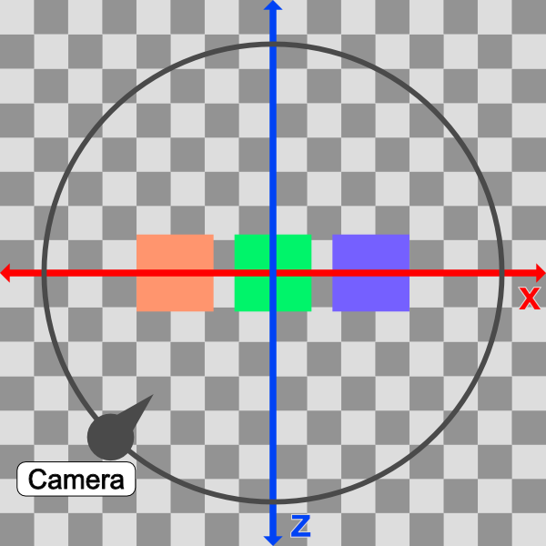
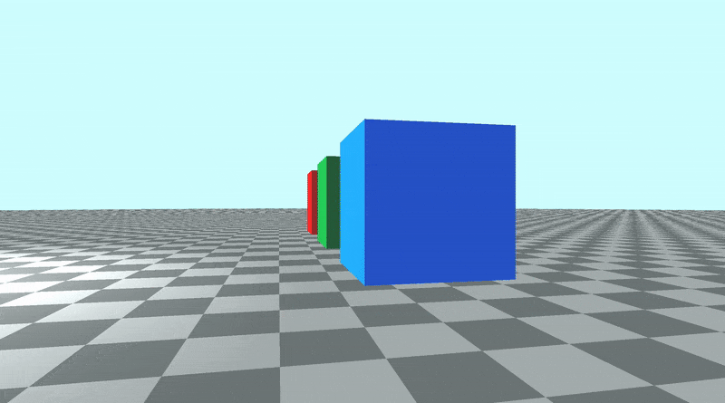
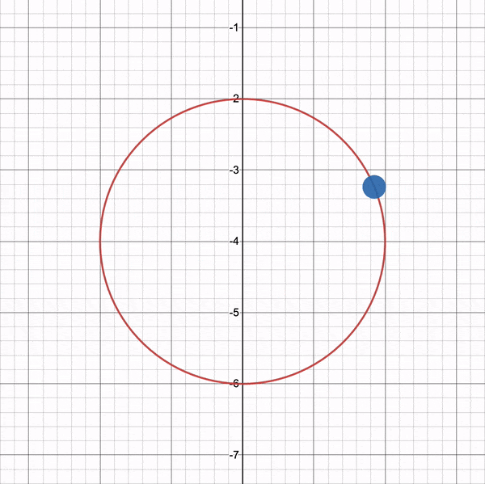

# 10.2 围绕目标旋转摄像机

## 围绕目标旋转

假设我们想在场景周围以圆形路径旋转摄像机，同时保持摄像机对准绿色立方体。我们将摄像机保持在离地面的恒定高度`y 分量`。由于所有三个立方体的位置 `y 分量`均为 `0.5`，因此我们将确保 `ro` 的 `y` 分量，即光线原点（相机位置）也等于 `0.5`。

如果我们想让相机沿着围绕立方体大小的圆形路径移动，那么我们应该专注于改变光线原点 `ro` 的 `x` 分量和 `z` 分量。

如果我们从自上而下的视角查看`cube`，则会看到类似于下图的视图。

<p align="center"></p>

在上图中，摄像机将遵循圆形路径（黑色）。从自上而下的视角来看，场景显示为 `2D`，只有一个 `x` 轴（红色）和 `z` 轴（蓝色）。

这个想法是改变 `ro` 的 `x` 分量和 `z` 分量值，使其遵循循环路径。我们可以通过将 `ro.x` 和 `ro.z` 转换为[**极坐标**](https://mathworld.wolfram.com/PolarCoordinates.html)来实现这一点。

```cpp
vec3 ro = vec3(0, 0.5, 0);
ro.x = cameraRadius * cos(theta);
ro.z = cameraRadius * sin(theta);
```

`Camera radius` （摄像机半径） 的值将增加，直到我们可以看到场景中的所有立方体。我们目前在 `3D` 空间中的以下位置有三个立方体（在 `sdScene` 函数中定义）：

```cpp
vec3(-4, 0.5, -4) // left cube
vec3(0, 0.5, -4) // center cube
vec3(4, 0.5, -4) // right cube
```

因此，将半径设置为类似于 `10` 可能是安全的，因为左立方体和右立方体之间的距离为 `4 - （-4） = 8` 个单位。

在我们的代码中，我们将射线原点的 `x` 分量和 `z` 分量转换为半径为 `10` 的极坐标。然后，我们还将圆形路径偏移一个偏移量，使观察点成为圆形路径形成的圆心。

```cpp
vec3 lp = vec3(0, 0.5, -4); // lookat point (aka camera target)
vec3 ro = vec3(0, 0.5, 0); // ray origin that represents camera position

float cameraRadius = 10.;
ro.x = cameraRadius * cos(iTime) + lp.x; // convert x-component to polar and add offset
ro.z = cameraRadius * sin(iTime) + lp.z; // convert z-component to polar and add offset

vec3 rd = camera(ro, lp) * normalize(vec3(uv, -1)); // ray direction
```

当您运行代码时，您应该会看到摄像机在场景中旋转，因为它遵循圆形路径，但它仍然使用我们的观察点看着绿色立方体。

<p align="center"></p>

从自上而下的视角来看，我们的相机在一个圆圈中移动，该圆圈被观察点的 `x` 分量和 `z` 分量偏移，因此我们可以确保观察点保持在圆的中心。这可确保在整个旋转过程中，与绿色立方体的距离（圆的半径）与绿色立方体保持相等的距离。

<p align="center"></p>

您可以使用我在 [**Desmos**](https://www.desmos.com/calculator/5emxoibru1) 上创建的图表来试验循环路径。想象一下绿色的立方体位于圆圈的中心。

使用观察点使我们的相机更加灵活。我们可以沿 `y` 轴将相机升高得更高，然后再次绕圈旋转，但可以鸟瞰立方体。

让我们尝试调整摄像机的高度 （光线原点），看看会发生什么。

```cpp
vec3 ro = vec3(0, 5, 0);
```

当我们运行代码时，我们应该看到相机现在围绕三个立方体旋转，但它的位置更高。这就像我们是一名乘坐直升机四处飞行的新闻记者。
<p align="center"></p>

如果您更改了观察点，则应开始围绕该新点旋转！

您可以在下面找到完成的代码：

```cpp
// Constants
const int MAX_MARCHING_STEPS = 255;
const float MIN_DIST = 0.0;
const float MAX_DIST = 100.0;
const float PRECISION = 0.001;
const float EPSILON = 0.0005;
const float PI = 3.14159265359;

// Rotation matrix around the X axis.
mat3 rotateX(float theta) {
    float c = cos(theta);
    float s = sin(theta);
    return mat3(
        vec3(1, 0, 0),
        vec3(0, c, -s),
        vec3(0, s, c)
    );
}

// Rotation matrix around the Y axis.
mat3 rotateY(float theta) {
    float c = cos(theta);
    float s = sin(theta);
    return mat3(
        vec3(c, 0, s),
        vec3(0, 1, 0),
        vec3(-s, 0, c)
    );
}

// Rotation matrix around the Z axis.
mat3 rotateZ(float theta) {
    float c = cos(theta);
    float s = sin(theta);
    return mat3(
        vec3(c, -s, 0),
        vec3(s, c, 0),
        vec3(0, 0, 1)
    );
}

// Identity matrix.
mat3 identity() {
    return mat3(
        vec3(1, 0, 0),
        vec3(0, 1, 0),
        vec3(0, 0, 1)
    );
}

struct Surface {
    float sd; // signed distance value
    vec3 col; // color
};

Surface sdBox( vec3 p, vec3 b, vec3 offset, vec3 col, mat3 transform)
{
  p = (p - offset) * transform; // apply transformation matrix
  vec3 q = abs(p) - b;
  float d = length(max(q,0.0)) + min(max(q.x,max(q.y,q.z)),0.0);
  return Surface(d, col);
}

Surface sdFloor(vec3 p, vec3 col) {
  float d = p.y + 1.;
  return Surface(d, col);
}

Surface minWithColor(Surface obj1, Surface obj2) {
  if (obj2.sd < obj1.sd) return obj2;
  return obj1;
}

Surface sdScene(vec3 p) {
  vec3 floorColor = vec3(1. + 0.7*mod(floor(p.x) + floor(p.z), 2.0));
  Surface co = sdFloor(p, floorColor);
  co = minWithColor(co, sdBox(p, vec3(1), vec3(-4, 0.5, -4), vec3(1, 0, 0), identity())); // left cube
  co = minWithColor(co, sdBox(p, vec3(1), vec3(0, 0.5, -4), vec3(0, 0.65, 0.2), identity())); // center cube
  co = minWithColor(co, sdBox(p, vec3(1), vec3(4, 0.5, -4), vec3(0, 0.55, 2), identity())); // right cube
  return co;
}

Surface rayMarch(vec3 ro, vec3 rd, float start, float end) {
  float depth = start;
  Surface co; // closest object

  for (int i = 0; i < MAX_MARCHING_STEPS; i++) {
    vec3 p = ro + depth * rd;
    co = sdScene(p);
    depth += co.sd;
    if (co.sd < PRECISION || depth > end) break;
  }

  co.sd = depth;

  return co;
}

vec3 calcNormal(in vec3 p) {
    vec2 e = vec2(1, -1) * EPSILON;
    return normalize(
      e.xyy * sdScene(p + e.xyy).sd +
      e.yyx * sdScene(p + e.yyx).sd +
      e.yxy * sdScene(p + e.yxy).sd +
      e.xxx * sdScene(p + e.xxx).sd);
}

mat3 camera(vec3 cameraPos, vec3 lookAtPoint) {
    vec3 cd = normalize(lookAtPoint - cameraPos); // camera direction
    vec3 cr = normalize(cross(vec3(0, 1, 0), cd)); // camera right
    vec3 cu = normalize(cross(cd, cr)); // camera up

    return mat3(-cr, cu, -cd);
}

void mainImage( out vec4 fragColor, in vec2 fragCoord )
{
  vec2 uv = (fragCoord-.5*iResolution.xy)/iResolution.y;
  vec3 backgroundColor = vec3(0.835, 1, 1);

  vec3 col = vec3(0);
  vec3 lp = vec3(0, 0.5, -4); // lookat point (aka camera target)
  vec3 ro = vec3(0, 5, 0); // ray origin that represents camera position

  float cameraRadius = 10.;
  ro.x = cameraRadius * cos(iTime) + lp.x; // convert to polar
  ro.z = cameraRadius * sin(iTime) + lp.z;

  vec3 rd = camera(ro, lp) * normalize(vec3(uv, -1)); // ray direction

  Surface co = rayMarch(ro, rd, MIN_DIST, MAX_DIST); // closest object

  if (co.sd > MAX_DIST) {
    col = backgroundColor; // ray didn't hit anything
  } else {
    vec3 p = ro + rd * co.sd; // point on cube or floor we discovered from ray marching
    vec3 normal = calcNormal(p);
    vec3 lightPosition = vec3(2, 2, 7);
    vec3 lightDirection = normalize(lightPosition - p);

    float dif = clamp(dot(normal, lightDirection), 0.3, 1.); // diffuse reflection

    col = dif * co.col + backgroundColor * .2; // Add a bit of background color to the diffuse color
  }

  // Output to screen
  fragColor = vec4(col, 1.0);
}
```

## 使用鼠标旋转摄像机
您也可以使用鼠标在场景中移动摄像机，但这需要一些额外的设置。正如我们在本系列教程的[**第 9 部分**](/category/9-摄像机移动)中学到的那样，iMouse 全局变量提供鼠标位置数据。

我们可以使用以下行创建 `mouse UV` 坐标：

```cpp
vec2 mouseUV = iMouse.xy/iResolution.xy; // Range: <0, 1>
```

我们将替换以下三行，因为我们使用的是鼠标在场景中旋转，而不是使用时间。

```cpp
float cameraRadius = 10.;
ro.x = cameraRadius * cos(iTime) + lp.x; // convert to polar
ro.z = cameraRadius * sin(iTime) + lp.z;
```

以下代码将替换上述代码：

```cpp
float cameraRadius = 2.;
ro.yz = ro.yz * cameraRadius * rotate2d(mix(PI/2., 0., mouseUV.y));
ro.xz = ro.xz * rotate2d(mix(-PI, PI, mouseUV.x)) + vec2(lp.x, lp.z); // remap mouseUV.x to <-pi, pi> range
```

同样，我们使用 `mix 函数`重新映射鼠标位置的 `x` 分量。这一次，我们将值从 `<0,1>` 范围重新映射到 `<-π， π>` 范围。我们还需要添加 `lookat point` 的 `x-component` 和 `z-component`。

请注意，我们有一个未指定轴的 `rotate2d 函数`。此函数将使用 `2D` 矩阵提供 `2D` 旋转。在代码顶部添加以下函数。

```cpp
mat2 rotate2d(float theta) {
  float s = sin(theta), c = cos(theta);
  return mat2(c, -s, s, c);
}
```

和以前一样，你可能需要使用 `cameraRadius`，直到它看起来不错。您完成的代码应如下所示：

```cpp
// Constants
const int MAX_MARCHING_STEPS = 255;
const float MIN_DIST = 0.0;
const float MAX_DIST = 100.0;
const float PRECISION = 0.001;
const float EPSILON = 0.0005;
const float PI = 3.14159265359;

// Rotate around a circular path
mat2 rotate2d(float theta) {
  float s = sin(theta), c = cos(theta);
  return mat2(c, -s, s, c);
}

// Rotation matrix around the X axis.
mat3 rotateX(float theta) {
    float c = cos(theta);
    float s = sin(theta);
    return mat3(
        vec3(1, 0, 0),
        vec3(0, c, -s),
        vec3(0, s, c)
    );
}

// Rotation matrix around the Y axis.
mat3 rotateY(float theta) {
    float c = cos(theta);
    float s = sin(theta);
    return mat3(
        vec3(c, 0, s),
        vec3(0, 1, 0),
        vec3(-s, 0, c)
    );
}

// Rotation matrix around the Z axis.
mat3 rotateZ(float theta) {
    float c = cos(theta);
    float s = sin(theta);
    return mat3(
        vec3(c, -s, 0),
        vec3(s, c, 0),
        vec3(0, 0, 1)
    );
}

// Identity matrix.
mat3 identity() {
    return mat3(
        vec3(1, 0, 0),
        vec3(0, 1, 0),
        vec3(0, 0, 1)
    );
}

struct Surface {
    float sd; // signed distance value
    vec3 col; // color
};

Surface sdBox( vec3 p, vec3 b, vec3 offset, vec3 col, mat3 transform)
{
  p = (p - offset) * transform; // apply transformation matrix
  vec3 q = abs(p) - b;
  float d = length(max(q,0.0)) + min(max(q.x,max(q.y,q.z)),0.0);
  return Surface(d, col);
}

Surface sdFloor(vec3 p, vec3 col) {
  float d = p.y + 1.;
  return Surface(d, col);
}

Surface minWithColor(Surface obj1, Surface obj2) {
  if (obj2.sd < obj1.sd) return obj2;
  return obj1;
}

Surface sdScene(vec3 p) {
  vec3 floorColor = vec3(1. + 0.7*mod(floor(p.x) + floor(p.z), 2.0));
  Surface co = sdFloor(p, floorColor);
  co = minWithColor(co, sdBox(p, vec3(1), vec3(-4, 0.5, -4), vec3(1, 0, 0), identity())); // left cube
  co = minWithColor(co, sdBox(p, vec3(1), vec3(0, 0.5, -4), vec3(0, 0.65, 0.2), identity())); // center cube
  co = minWithColor(co, sdBox(p, vec3(1), vec3(4, 0.5, -4), vec3(0, 0.55, 2), identity())); // right cube
  return co;
}

Surface rayMarch(vec3 ro, vec3 rd, float start, float end) {
  float depth = start;
  Surface co; // closest object

  for (int i = 0; i < MAX_MARCHING_STEPS; i++) {
    vec3 p = ro + depth * rd;
    co = sdScene(p);
    depth += co.sd;
    if (co.sd < PRECISION || depth > end) break;
  }

  co.sd = depth;

  return co;
}

vec3 calcNormal(in vec3 p) {
    vec2 e = vec2(1, -1) * EPSILON;
    return normalize(
      e.xyy * sdScene(p + e.xyy).sd +
      e.yyx * sdScene(p + e.yyx).sd +
      e.yxy * sdScene(p + e.yxy).sd +
      e.xxx * sdScene(p + e.xxx).sd);
}

mat3 camera(vec3 cameraPos, vec3 lookAtPoint) {
    vec3 cd = normalize(lookAtPoint - cameraPos); // camera direction
    vec3 cr = normalize(cross(vec3(0, 1, 0), cd)); // camera right
    vec3 cu = normalize(cross(cd, cr)); // camera up

    return mat3(-cr, cu, -cd);
}

void mainImage( out vec4 fragColor, in vec2 fragCoord )
{
  vec2 uv = (fragCoord-.5*iResolution.xy)/iResolution.y;
  vec2 mouseUV = iMouse.xy/iResolution.xy; // Range: <0, 1>
  vec3 backgroundColor = vec3(0.835, 1, 1);

  vec3 col = vec3(0);
  vec3 lp = vec3(0, 0.5, -4); // lookat point (aka camera target)
  vec3 ro = vec3(0, 5, 0); // ray origin that represents camera position

  float cameraRadius = 2.;
  ro.yz = ro.yz * cameraRadius * rotate2d(mix(PI/2., 0., mouseUV.y));
  ro.xz = ro.xz * rotate2d(mix(-PI, PI, mouseUV.x)) + vec2(lp.x, lp.z);

  vec3 rd = camera(ro, lp) * normalize(vec3(uv, -1)); // ray direction

  Surface co = rayMarch(ro, rd, MIN_DIST, MAX_DIST); // closest object

  if (co.sd > MAX_DIST) {
    col = backgroundColor; // ray didn't hit anything
  } else {
    vec3 p = ro + rd * co.sd; // point on cube or floor we discovered from ray marching
    vec3 normal = calcNormal(p);
    vec3 lightPosition = vec3(2, 2, 7);
    vec3 lightDirection = normalize(lightPosition - p);

    float dif = clamp(dot(normal, lightDirection), 0.3, 1.); // diffuse reflection

    col = dif * co.col + backgroundColor * .2; // Add a bit of background color to the diffuse color
  }

  // Output to screen
  fragColor = vec4(col, 1.0);
}
```

现在，您可以使用鼠标在场景中旋转！🎉 更具体地说，您可以使用鼠标围绕观察点旋转。

## 结论
我希望您现在看到这种替代相机型号的强大功能！注视点可以更轻松地在场景中移动摄像机，同时聚焦在单个目标上。