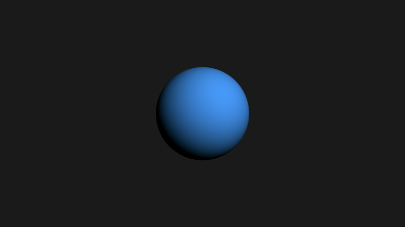
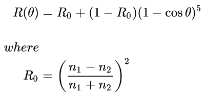
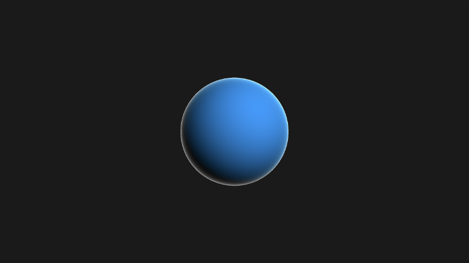

# 12.1菲涅耳和边缘照明

## 初始设置

我们将从一个基本的光线行进模板开始。
```cpp
const int MAX_MARCHING_STEPS = 255;
const float MIN_DIST = 0.0;
const float MAX_DIST = 100.0;
const float PRECISION = 0.001;

float sdSphere(vec3 p, float r )
{
  vec3 offset = vec3(0, 0, -2);
  return length(p - offset) - r;
}

float sdScene(vec3 p) {
  return sdSphere(p, 1.);
}

float rayMarch(vec3 ro, vec3 rd) {
  float depth = MIN_DIST;

  for (int i = 0; i < MAX_MARCHING_STEPS; i++) {
    vec3 p = ro + depth * rd;
    float d = sdScene(p);
    depth += d;
    if (d < PRECISION || depth > MAX_DIST) break;
  }

  return depth;
}

vec3 calcNormal(vec3 p) {
    vec2 e = vec2(1.0, -1.0) * 0.0005;
    return normalize(
      e.xyy * sdScene(p + e.xyy) +
      e.yyx * sdScene(p + e.yyx) +
      e.yxy * sdScene(p + e.yxy) +
      e.xxx * sdScene(p + e.xxx));
}

void mainImage( out vec4 fragColor, in vec2 fragCoord )
{
  vec2 uv = (fragCoord-.5*iResolution.xy)/iResolution.y;
  vec3 backgroundColor = vec3(0.1);
  vec3 col = vec3(0);

  vec3 ro = vec3(0, 0, 3);
  vec3 rd = normalize(vec3(uv, -1));

  float d = rayMarch(ro, rd);

  if (d > MAX_DIST) {
    col = backgroundColor;
  } else {
    vec3 p = ro + rd * d;
    vec3 normal = calcNormal(p);
    vec3 lightPosition = vec3(4, 4, 7);
    vec3 lightDirection = normalize(lightPosition - p);

    float diffuse = clamp(dot(normal, lightDirection), 0., 1.);
    vec3 diffuseColor = vec3(0, 0.6, 1);

    col = diffuse * diffuseColor;
  }

  fragColor = vec4(col, 1.0);
}
```

运行此代码时，您应该会看到一个只有漫反射 （Lambertian） 反射的蓝色球体。

<p align="center"></p>

[**菲涅耳方程（Fresnel equations）**](https://en.wikipedia.org/wiki/Fresnel_equations)描述了光入射到两种不同光学介质之间的界面上的反射和透射。简单来说，这意味着当您从*掠射角度 grazing angles* 观察物体时，它们的照明可能会有所不同。

术语[**光学介质**](https://en.wikipedia.org/wiki/Medium_(optics))是指光穿过的材料类型。不同的材质往往具有不同的[**折射率**](https://en.wikipedia.org/wiki/Refractive_index)，这使得光线看起来是弯曲的。

<p align="center"></p>
<p align="center">折射 by [**维基百科**](https://en.wikipedia.org/wiki/Refractive_index)上的数据</p>

空气是一种介质。它的折射率通常约为 `1.000293`。金刚石等材料具有高折射率。钻石的折射率为 `2.417`。高折射率意味着光线看起来会弯曲得更厉害。

**菲涅耳方程**可能变得非常复杂。对于计算机图形学，您通常会看到人们使用 **Schlick** 近似来近似反射的菲涅耳贡献。
<p align="center"></p>
<p align="center">[**维基百科**](https://en.wikipedia.org/wiki/Schlick%27s_approximation)上的 Schlick 近似值</p>

上述方程计算了菲涅耳对反射的贡献 `R`，其中 `R0` 是平行于法线入射的光的反射系数（通常当 `θ` 等于零时）。

`cos θ` 的值等于表面法线和入射光来自方向之间的点积。但是，在我们的代码中，我们将使用光线方向 `rd`。

为了我们的示例，我们将假设空气和球体的折射率都等于 `1`。这将有助于简化我们的计算。这意味着 `R0` 等于零。

```
n1 = 1
n2 = 1

R0 = ((n1 - n2)/(n1 + n2)) ^ 2
R0 = ((1 - 1)/(1 + 1)) ^ 2
R0 = 0
```

当 `R0` 等于零时，我们可以进一步简化菲涅耳反射方程。

```
R = R0 + (1 - R0)(1 - cosθ)^5

Since R0 = 0,
R = (1 - cosθ)^5
```

在 GLSL 代码中，可以写成：

```cpp
float fresnel = pow(1. - dot(normal, -rd), 5.);
```

但是，我们会固定这些值以确保保持 `0` 到 `1` 之间的范围。我们还使用 `-rd`。如果使用正 `rd`，则可能不会看到仅应用于球体边缘的颜色。

```cpp
float fresnel = pow(clamp(1. - dot(normal, -rd), 0., 1.), 5.);
```

我们可以将此菲涅耳值乘以颜色值，这样我们就可以在蓝色球体周围应用彩色边缘。以下是完成的代码：

```cpp
const int MAX_MARCHING_STEPS = 255;
const float MIN_DIST = 0.0;
const float MAX_DIST = 100.0;
const float PRECISION = 0.001;

float sdSphere(vec3 p, float r )
{
  vec3 offset = vec3(0, 0, -2);
  return length(p - offset) - r;
}

float sdScene(vec3 p) {
  return sdSphere(p, 1.);
}

float rayMarch(vec3 ro, vec3 rd) {
  float depth = MIN_DIST;

  for (int i = 0; i < MAX_MARCHING_STEPS; i++) {
    vec3 p = ro + depth * rd;
    float d = sdScene(p);
    depth += d;
    if (d < PRECISION || depth > MAX_DIST) break;
  }

  return depth;
}

vec3 calcNormal(vec3 p) {
    vec2 e = vec2(1.0, -1.0) * 0.0005;
    return normalize(
      e.xyy * sdScene(p + e.xyy) +
      e.yyx * sdScene(p + e.yyx) +
      e.yxy * sdScene(p + e.yxy) +
      e.xxx * sdScene(p + e.xxx));
}

void mainImage( out vec4 fragColor, in vec2 fragCoord )
{
  vec2 uv = (fragCoord-.5*iResolution.xy)/iResolution.y;
  vec3 backgroundColor = vec3(0.1);
  vec3 col = vec3(0);

  vec3 ro = vec3(0, 0, 3);
  vec3 rd = normalize(vec3(uv, -1));

  float d = rayMarch(ro, rd);

  if (d > MAX_DIST) {
    col = backgroundColor;
  } else {
    vec3 p = ro + rd * d;
    vec3 normal = calcNormal(p);
    vec3 lightPosition = vec3(4, 4, 7);
    vec3 lightDirection = normalize(lightPosition - p);

    float diffuse = clamp(dot(normal, lightDirection), 0., 1.);
    vec3 diffuseColor = vec3(0, 0.6, 1);

    float fresnel = pow(clamp(1. - dot(normal, -rd), 0., 1.), 5.);
    vec3 rimColor = vec3(1, 1, 1);

    col = diffuse * diffuseColor + fresnel * rimColor; // add the fresnel contribution
  }

  fragColor = vec4(col, 1.0);
}
```

如果你运行这段代码，你应该会看到蓝色球体的一个细细的白色边缘。这模拟了光线照射到球体的掠射角度的效果。

<p align="center"></p>

你可以调整指数和轮辋颜色，以获得类似 力场（force field） 的效果。

```cpp
float fresnel = pow(clamp(1. - dot(normal, -rd), 0., 1.), 0.5);
vec3 rimColor = vec3(1, 0, 1);

col = diffuse * diffuseColor + fresnel * rimColor;
```
<p align="center"></p>

## 结论
在本文中，我们学习了如何通过应用菲涅耳反射在对象周围添加边缘照明。如果您正在处理模仿**玻璃**或**塑料**的对象，那么添加菲涅耳有助于使它们更逼真。