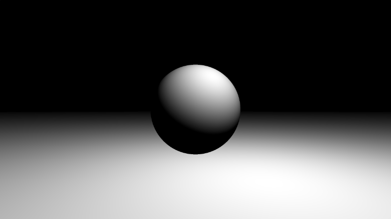
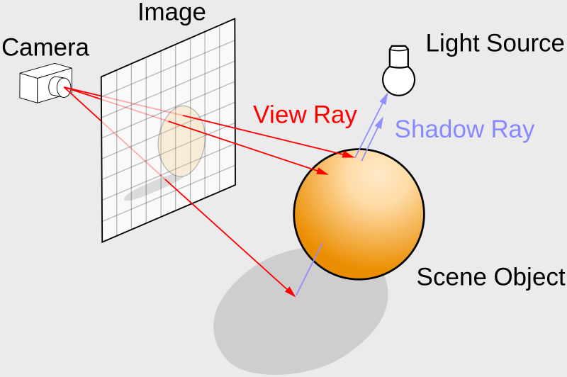
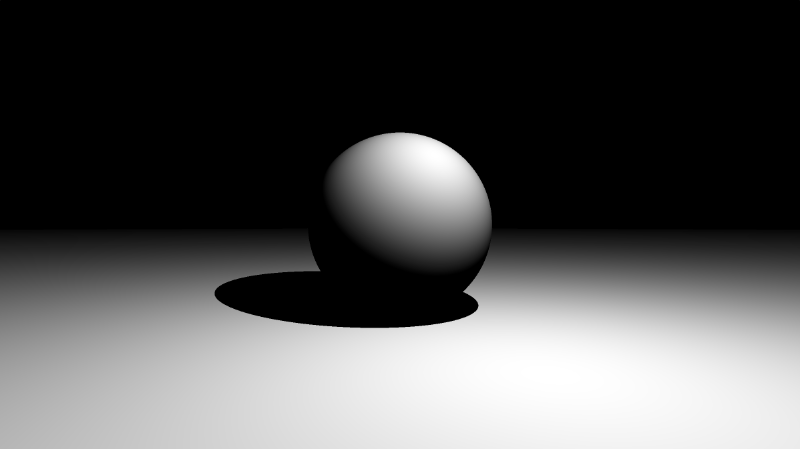
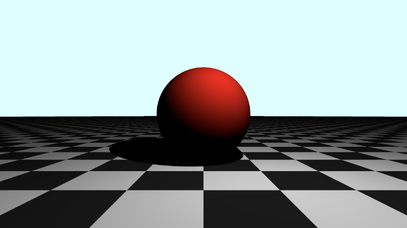
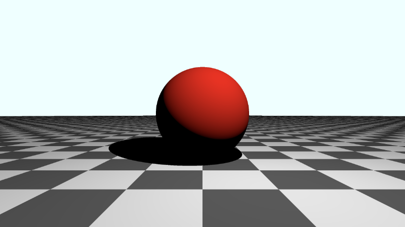
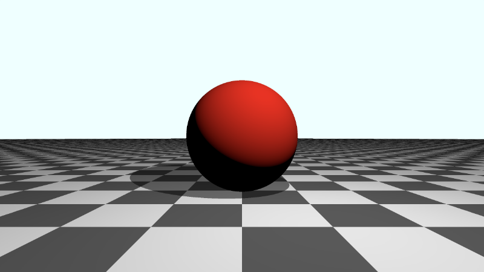
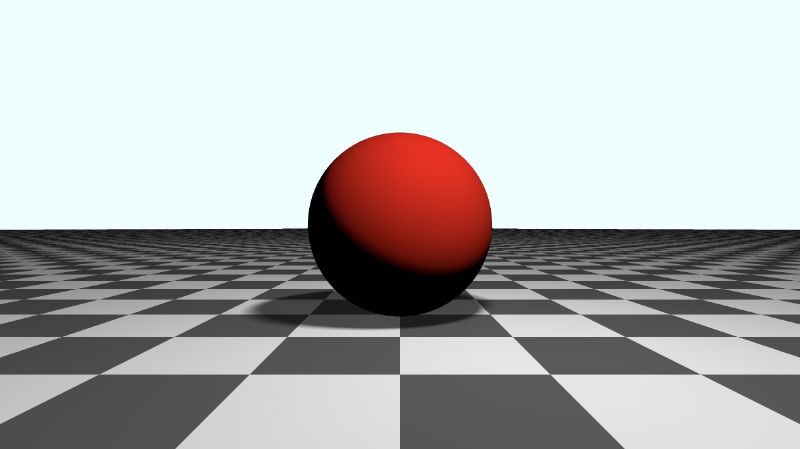
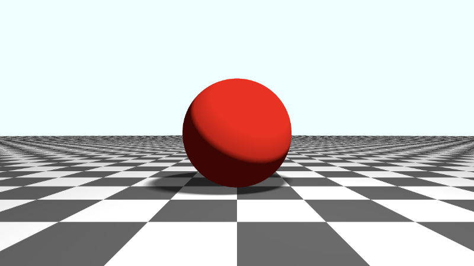

# 13.1 阴影
这次，本教程的起始代码将略有不同。我们将回到只使用一种颜色渲染场景，我们将回到使用没有观察点的基本摄像机。我还使 `rayMarch` 函数变得更简单一些。它接受两个参数而不是四个参数。无论如何，我们并没有真正使用最后两个参数。

```cpp
const int MAX_MARCHING_STEPS = 255;
const float MIN_DIST = 0.0;
const float MAX_DIST = 100.0;
const float PRECISION = 0.001;
const float EPSILON = 0.0005;

float sdSphere(vec3 p, float r, vec3 offset)
{
  return length(p - offset) - r;
}

float sdFloor(vec3 p) {
  return p.y + 1.;
}

float scene(vec3 p) {
  float co = min(sdSphere(p, 1., vec3(0, 0, -2)), sdFloor(p));
  return co;
}

float rayMarch(vec3 ro, vec3 rd) {
  float depth = MIN_DIST;
  float d; // distance ray has travelled

  for (int i = 0; i < MAX_MARCHING_STEPS; i++) {
    vec3 p = ro + depth * rd;
    d = scene(p);
    depth += d;
    if (d < PRECISION || depth > MAX_DIST) break;
  }

  d = depth;

  return d;
}

vec3 calcNormal(in vec3 p) {
    vec2 e = vec2(1, -1) * EPSILON;
    return normalize(
      e.xyy * scene(p + e.xyy) +
      e.yyx * scene(p + e.yyx) +
      e.yxy * scene(p + e.yxy) +
      e.xxx * scene(p + e.xxx));
}

void mainImage( out vec4 fragColor, in vec2 fragCoord )
{
  vec2 uv = (fragCoord-.5*iResolution.xy)/iResolution.y;
  vec3 backgroundColor = vec3(0);

  vec3 col = vec3(0);
  vec3 ro = vec3(0, 0, 3); // ray origin that represents camera position
  vec3 rd = normalize(vec3(uv, -1)); // ray direction

  float sd = rayMarch(ro, rd); // signed distance value to closest object

  if (sd > MAX_DIST) {
    col = backgroundColor; // ray didn't hit anything
  } else {
    vec3 p = ro + rd * sd; // point discovered from ray marching
    vec3 normal = calcNormal(p); // surface normal

    vec3 lightPosition = vec3(cos(iTime), 2, sin(iTime));
    vec3 lightDirection = normalize(lightPosition - p);

    float dif = clamp(dot(normal, lightDirection), 0., 1.); // diffuse reflection clamped between zero and one

    col = vec3(dif);
  }

  fragColor = vec4(col, 1.0);
}
```

运行代码后，我们应该看到一个非常基本的 `3D` 场景，其中包含球体、地板和漫反射。漫反射的颜色将是介于黑色和白色之间的灰色阴影。

<p align="center"></p>

## 基本阴影
让我们从学习如何添加非常简单的阴影开始。在我们开始编码之前，让我们看看下图来直观地了解算法将如何工作。

<p align="center"></p>
<p align="center">光线追踪图 by [**维基百科**](https://en.wikipedia.org/wiki/Ray_tracing_(graphics))上的数据</p>

我们的 `rayMarch` 函数实现了光线行进算法。我们目前使用它来发现场景中撞击最近对象或表面的点。但是，我们可以第二次使用它来生成一条新光线，并将该光线指向场景中的光源。在上图中，有从地板投射到光源的 `阴影光线`。

在我们的代码中，我们将第二次执行光线行进，其中新的光线原点等于 `p`，即我们从第一个光线行进步骤中发现的球体或地板上的点。新的光线方向将等于 `lightDirection`。在我们的代码中，这就像在漫反射计算下添加三行一样简单。

```cpp
float dif = clamp(dot(normal, lightDirection), 0., 1.); // diffuse reflection clamped between zero and one

vec3 newRayOrigin = p;
float shadowRayLength = rayMarch(newRayOrigin, lightDirection); // cast shadow ray to the light source
if (shadowRayLength < length(lightPosition - newRayOrigin)) dif *= 0.; // if the shadow ray hits the sphere, set the diffuse reflection to zero, simulating a shadow
```

但是，当您运行此代码时，屏幕将几乎完全显示为黑色。这是怎么回事？在第一个光线行进循环期间，我们从相机发射光线。如果光线击中比球体更靠近地板的点 p，则有向距离值将等于从相机到地板的长度。

当我们在第二个光线行进循环中使用相同的 p 值时，我们已经知道它比球体表面更靠近地板。因此，几乎所有东西看起来都像在阴影中，导致屏幕变黑。在第二个光线行进步骤中，我们需要选择一个非常接近 `p` 的值，这样就不会出现此问题。

一种常见的方法是将表面法线乘以一个很小的值，然后得到一个相邻点。我们将使用 `PRECISION` 变量作为微小值，它将 `p` 略微推向相邻点。

```cpp
vec3 newRayOrigin = p + normal * PRECISION;
```

当您运行代码时，您现在应该会看到一个阴影出现在球体下方。然而，在球体中心附近有一个奇怪的伪影。

<p align="center"></p>

我们可以将精度值乘以 2 以使其消失。

```cpp
vec3 newRayOrigin = p + normal * PRECISION * 2.;
```

<p align="center"></p>

在向场景添加阴影时，您可能需要通过乘以不同的因素来不断调整 `newRayOrigin` 以查看哪些有效。制作逼真的阴影并非易事，您可能会发现自己在尝试各种值，直到它看起来不错为止。

您完成的代码应如下所示：

```cpp
const int MAX_MARCHING_STEPS = 255;
const float MIN_DIST = 0.0;
const float MAX_DIST = 100.0;
const float PRECISION = 0.001;
const float EPSILON = 0.0005;

float sdSphere(vec3 p, float r, vec3 offset)
{
  return length(p - offset) - r;
}

float sdFloor(vec3 p) {
  return p.y + 1.;
}

float scene(vec3 p) {
  float co = min(sdSphere(p, 1., vec3(0, 0, -2)), sdFloor(p));
  return co;
}

float rayMarch(vec3 ro, vec3 rd) {
  float depth = MIN_DIST;
  float d; // distance ray has travelled

  for (int i = 0; i < MAX_MARCHING_STEPS; i++) {
    vec3 p = ro + depth * rd;
    d = scene(p);
    depth += d;
    if (d < PRECISION || depth > MAX_DIST) break;
  }

  d = depth;

  return d;
}

vec3 calcNormal(in vec3 p) {
    vec2 e = vec2(1, -1) * EPSILON;
    return normalize(
      e.xyy * scene(p + e.xyy) +
      e.yyx * scene(p + e.yyx) +
      e.yxy * scene(p + e.yxy) +
      e.xxx * scene(p + e.xxx));
}

void mainImage( out vec4 fragColor, in vec2 fragCoord )
{
  vec2 uv = (fragCoord-.5*iResolution.xy)/iResolution.y;
  vec3 backgroundColor = vec3(0);

  vec3 col = vec3(0);
  vec3 ro = vec3(0, 0, 3); // ray origin that represents camera position
  vec3 rd = normalize(vec3(uv, -1)); // ray direction

  float sd = rayMarch(ro, rd); // signed distance value to closest object

  if (sd > MAX_DIST) {
    col = backgroundColor; // ray didn't hit anything
  } else {
    vec3 p = ro + rd * sd; // point discovered from ray marching
    vec3 normal = calcNormal(p); // surface normal

    vec3 lightPosition = vec3(cos(iTime), 2, sin(iTime));
    vec3 lightDirection = normalize(lightPosition - p);

    float dif = clamp(dot(normal, lightDirection), 0., 1.); // diffuse reflection clamped between zero and one

    vec3 newRayOrigin = p + normal * PRECISION * 2.;
    float shadowRayLength = rayMarch(newRayOrigin, lightDirection);
    if (shadowRayLength < length(lightPosition - newRayOrigin)) dif *= 0.;

    col = vec3(dif);
  }

  fragColor = vec4(col, 1.0);
}
```

## 向彩色场景添加阴影
使用相同的技术，我们可以将阴影应用于我们在过去几个教程中一直使用的彩色场景。

```cpp
const int MAX_MARCHING_STEPS = 255;
const float MIN_DIST = 0.0;
const float MAX_DIST = 100.0;
const float PRECISION = 0.001;
const float EPSILON = 0.0005;

struct Surface {
    float sd; // signed distance value
    vec3 col; // color
};

Surface sdFloor(vec3 p, vec3 col) {
  float d = p.y + 1.;
  return Surface(d, col);
}

Surface sdSphere(vec3 p, float r, vec3 offset, vec3 col) {
  p = (p - offset);
  float d = length(p) - r;
  return Surface(d, col);
}

Surface opUnion(Surface obj1, Surface obj2) {
  if (obj2.sd < obj1.sd) return obj2;
  return obj1;
}

Surface scene(vec3 p) {
  vec3 floorColor = vec3(0.1 + 0.7 * mod(floor(p.x) + floor(p.z), 2.0));
  Surface co = sdFloor(p, floorColor);
  co = opUnion(co, sdSphere(p, 1., vec3(0, 0, -2), vec3(1, 0, 0)));
  return co;
}

Surface rayMarch(vec3 ro, vec3 rd) {
  float depth = MIN_DIST;
  Surface co; // closest object

  for (int i = 0; i < MAX_MARCHING_STEPS; i++) {
    vec3 p = ro + depth * rd;
    co = scene(p);
    depth += co.sd;
    if (co.sd < PRECISION || depth > MAX_DIST) break;
  }

  co.sd = depth;

  return co;
}

vec3 calcNormal(in vec3 p) {
    vec2 e = vec2(1, -1) * EPSILON;
    return normalize(
      e.xyy * scene(p + e.xyy).sd +
      e.yyx * scene(p + e.yyx).sd +
      e.yxy * scene(p + e.yxy).sd +
      e.xxx * scene(p + e.xxx).sd);
}

void mainImage( out vec4 fragColor, in vec2 fragCoord )
{
  vec2 uv = (fragCoord-.5*iResolution.xy)/iResolution.y;
  vec3 backgroundColor = vec3(0.835, 1, 1);

  vec3 col = vec3(0);
  vec3 ro = vec3(0, 0, 3); // ray origin that represents camera position
  vec3 rd = normalize(vec3(uv, -1)); // ray direction

  Surface co = rayMarch(ro, rd); // closest object

  if (co.sd > MAX_DIST) {
    col = backgroundColor; // ray didn't hit anything
  } else {
    vec3 p = ro + rd * co.sd; // point discovered from ray marching
    vec3 normal = calcNormal(p);

    vec3 lightPosition = vec3(cos(iTime), 2, sin(iTime));
    vec3 lightDirection = normalize(lightPosition - p);

    float dif = clamp(dot(normal, lightDirection), 0., 1.); // diffuse reflection

    vec3 newRayOrigin = p + normal * PRECISION * 2.;
    float shadowRayLength = rayMarch(newRayOrigin, lightDirection).sd; // cast shadow ray to the light source
    if (shadowRayLength < length(lightPosition - newRayOrigin)) dif *= 0.0; // shadow

    col = dif * co.col;

  }

  fragColor = vec4(col, 1.0); // Output to screen
}
```

如果运行此代码，您应该会看到一个带有移动光源（因此“移动”阴影）的红色球体，但整个场景看起来有点太暗了。

<p align="center"></p>

## Gamma 校正
我们可以应用一些 [**Gamma 校正**](https://en.wikipedia.org/wiki/Gamma_correction)，使较暗的颜色更亮。我们将在将最终颜色输出到屏幕之前添加此行。

```cpp
col = pow(col, vec3(1.0/2.2)); // Gamma correction
```

您的 mainImage 函数现在应如下所示：
```cpp
void mainImage( out vec4 fragColor, in vec2 fragCoord )
{
  vec2 uv = (fragCoord-.5*iResolution.xy)/iResolution.y;
  vec3 backgroundColor = vec3(0.835, 1, 1);

  vec3 col = vec3(0);
  vec3 ro = vec3(0, 0, 3); // ray origin that represents camera position
  vec3 rd = normalize(vec3(uv, -1)); // ray direction

  Surface co = rayMarch(ro, rd); // closest object

  if (co.sd > MAX_DIST) {
    col = backgroundColor; // ray didn't hit anything
  } else {
    vec3 p = ro + rd * co.sd; // point discovered from ray marching
    vec3 normal = calcNormal(p);

    vec3 lightPosition = vec3(cos(iTime), 2, sin(iTime));
    vec3 lightDirection = normalize(lightPosition - p);

    float dif = clamp(dot(normal, lightDirection), 0., 1.); // diffuse reflection

    vec3 newRayOrigin = p + normal * PRECISION * 2.;
    float shadowRayLength = rayMarch(newRayOrigin, lightDirection).sd; // cast shadow ray to the light source
    if (shadowRayLength < length(lightPosition - newRayOrigin)) dif *= 0.; // shadow

    col = dif * co.col;

  }

  col = pow(col, vec3(1.0/2.2)); // Gamma correction
  fragColor = vec4(col, 1.0); // Output to screen
}
```

当您运行代码时，您应该会看到整个场景看起来更亮。

<p align="center"></p>

阴影似乎还是有点太暗了。我们可以通过调整漫反射的缩放程度来减轻它。目前，在计算阴影中的点时，我们将地板和球体的漫反射颜色设置为零。

我们可以将 `scaling factor` 改为 `0.2`：

```cpp
if (shadowRayLength < length(lightPosition - newRayOrigin)) dif *= 0.2; // shadow
```

现在阴影看起来更好一些，您可以通过阴影看到地板的漫反射颜色。

<p align="center"></p>

## Soft Shadows 柔和阴影

在现实生活中，阴影往往有多个部分，包括[**本影、半影和前影**](https://en.wikipedia.org/wiki/Umbra,_penumbra_and_antumbra)。我们可以添加一个`柔和的阴影`，它试图通过使用 `Inigo Quilez` 网站上的算法来复制现实生活中的阴影。

下面是流行的 `Shadertoy` 着色器 [**Raymarching Primitives Commented**](https://www.shadertoy.com/view/ltyXD3) 中的`soft shadow`函数的实现。我已经进行了调整以使其与我们的代码兼容。

```cpp
float softShadow(vec3 ro, vec3 rd, float mint, float tmax) {
  float res = 1.0;
  float t = mint;

  for(int i = 0; i < 16; i++) {
    float h = scene(ro + rd * t).sd;
      res = min(res, 8.0*h/t);
      t += clamp(h, 0.02, 0.10);
      if(h < 0.001 || t > tmax) break;
  }

  return clamp( res, 0.0, 1.0 );
}
```

```cpp
float softShadow(vec3 ro, vec3 rd, float mint, float tmax) {
  float res = 1.0;
  float t = mint;

  for(int i = 0; i < 16; i++) {
    float h = scene(ro + rd * t).sd;
      res = min(res, 8.0*h/t);
      t += clamp(h, 0.02, 0.10);
      if(h < 0.001 || t > tmax) break;
  }

  return clamp( res, 0.0, 1.0 );
}
```
我们可以将阴影限制在 `0.1` 和 `1.0` 之间，以使阴影变亮一点，这样阴影就不会太暗。

<p align="center"></p>

注意柔和阴影的边缘。这是阴影和正常地板颜色之间的更平滑过渡。

## 应用 Fog
您可能已经注意到，不面向光线的球体的颜色看起来仍然太暗。我们可以尝试通过向漫反射 `dif` 添加 `0.5` 来减轻它。

```cpp
float dif = clamp(dot(normal, lightDirection), 0., 1.) + 0.5; // diffuse reflection
```

当您运行代码时，您会看到球体看起来更亮一些，但远处的地板背面看起来有点奇怪。

<p align="center"></p>

您可能经常看到人们通过应用**雾**来隐藏背景的任何不规则性。让我们在 `Gamma 校正`之前应用雾。

```cpp
col = mix(col, backgroundColor, 1.0 - exp(-0.0002 * co.sd * co.sd * co.sd)); // fog
```

现在，场景看起来更逼真了！

<p align="center"></p>

您可以在下面找到完成的代码：

```cpp
/* The MIT License
** Copyright © 2022 Nathan Vaughn
** Permission is hereby granted, free of charge, to any person obtaining a copy of this software and associated documentation files (the "Software"), to deal in the Software without restriction, including without limitation the rights to use, copy, modify, merge, publish, distribute, sublicense, and/or sell copies of the Software, and to permit persons to whom the Software is furnished to do so, subject to the following conditions: The above copyright notice and this permission notice shall be included in all copies or substantial portions of the Software. THE SOFTWARE IS PROVIDED "AS IS", WITHOUT WARRANTY OF ANY KIND, EXPRESS OR IMPLIED, INCLUDING BUT NOT LIMITED TO THE WARRANTIES OF MERCHANTABILITY, FITNESS FOR A PARTICULAR PURPOSE AND NONINFRINGEMENT. IN NO EVENT SHALL THE AUTHORS OR COPYRIGHT HOLDERS BE LIABLE FOR ANY CLAIM, DAMAGES OR OTHER LIABILITY, WHETHER IN AN ACTION OF CONTRACT, TORT OR OTHERWISE, ARISING FROM, OUT OF OR IN CONNECTION WITH THE SOFTWARE OR THE USE OR OTHER DEALINGS IN THE SOFTWARE.
**
** Example on how to create a shadow, apply gamma correction, and apply fog.
** Visit my tutorial to learn more: https://inspirnathan.com/posts/63-shadertoy-tutorial-part-16/
**
** Resources/Credit:
** Primitive SDFs: https://iquilezles.org/articles/distfunctions
** Soft Shadows: https://iquilezles.org/articles/rmshadows/
*/

const int MAX_MARCHING_STEPS = 255;
const float MIN_DIST = 0.0;
const float MAX_DIST = 100.0;
const float PRECISION = 0.001;
const float EPSILON = 0.0005;

struct Surface {
    float sd; // signed distance value
    vec3 col; // color
};

Surface sdFloor(vec3 p, vec3 col) {
  float d = p.y + 1.;
  return Surface(d, col);
}

Surface sdSphere(vec3 p, float r, vec3 offset, vec3 col) {
  p = (p - offset);
  float d = length(p) - r;
  return Surface(d, col);
}

Surface opUnion(Surface obj1, Surface obj2) {
  if (obj2.sd < obj1.sd) return obj2;
  return obj1;
}

Surface scene(vec3 p) {
  vec3 floorColor = vec3(0.1 + 0.7*mod(floor(p.x) + floor(p.z), 2.0));
  Surface co = sdFloor(p, floorColor);
  co = opUnion(co, sdSphere(p, 1., vec3(0, 0, -2), vec3(1, 0, 0)));
  return co;
}

Surface rayMarch(vec3 ro, vec3 rd) {
  float depth = MIN_DIST;
  Surface co; // closest object

  for (int i = 0; i < MAX_MARCHING_STEPS; i++) {
    vec3 p = ro + depth * rd;
    co = scene(p);
    depth += co.sd;
    if (co.sd < PRECISION || depth > MAX_DIST) break;
  }

  co.sd = depth;

  return co;
}

vec3 calcNormal(in vec3 p) {
    vec2 e = vec2(1, -1) * EPSILON;
    return normalize(
      e.xyy * scene(p + e.xyy).sd +
      e.yyx * scene(p + e.yyx).sd +
      e.yxy * scene(p + e.yxy).sd +
      e.xxx * scene(p + e.xxx).sd);
}

float softShadow(vec3 ro, vec3 rd, float mint, float tmax) {
  float res = 1.0;
  float t = mint;

  for(int i = 0; i < 16; i++) {
    float h = scene(ro + rd * t).sd;
      res = min(res, 8.0*h/t);
      t += clamp(h, 0.02, 0.10);
      if(h < 0.001 || t > tmax) break;
  }

  return clamp( res, 0.0, 1.0 );
}

void mainImage( out vec4 fragColor, in vec2 fragCoord )
{
  vec2 uv = (fragCoord-.5*iResolution.xy)/iResolution.y;
  vec3 backgroundColor = vec3(0.835, 1, 1);

  vec3 col = vec3(0);
  vec3 ro = vec3(0, 0, 3); // ray origin that represents camera position
  vec3 rd = normalize(vec3(uv, -1)); // ray direction

  Surface co = rayMarch(ro, rd); // closest object

  if (co.sd > MAX_DIST) {
    col = backgroundColor; // ray didn't hit anything
  } else {
    vec3 p = ro + rd * co.sd; // point discovered from ray marching
    vec3 normal = calcNormal(p);

    vec3 lightPosition = vec3(cos(iTime), 2, sin(iTime));
    vec3 lightDirection = normalize(lightPosition - p);

    float dif = clamp(dot(normal, lightDirection), 0., 1.) + 0.5; // diffuse reflection

    float softShadow = clamp(softShadow(p, lightDirection, 0.02, 2.5), 0.1, 1.0);

    col = dif * co.col * softShadow;
  }

  col = mix(col, backgroundColor, 1.0 - exp(-0.0002 * co.sd * co.sd * co.sd)); // fog
  col = pow(col, vec3(1.0/2.2)); // Gamma correction
  fragColor = vec4(col, 1.0); // Output to screen
}
```

## 结论

在本教程中，您学习了如何应用`硬阴影`、`软阴影`、灰度系数校正和雾。正如我们所看到的，添加阴影可能有点棘手。在本教程中，我讨论了如何向仅使用漫反射的场景添加阴影，但相同的原则也适用于具有其他类型反射的场景。您需要确保了解场景的照明方式，并预测阴影将如何影响场景中的颜色。我在本文中提到的只是向场景添加阴影的一种方法。深入研究 `Shadertoy` 上各种着色器的代码时，您会发现场景中设置光照的方式完全不同。