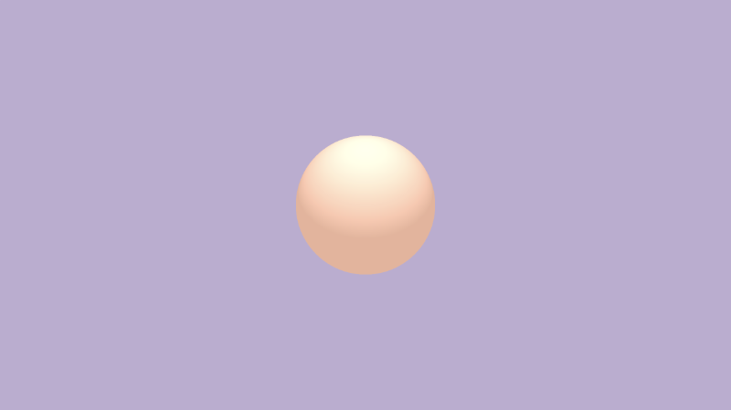

# 14.1 3D SDF 初始设置

## 初始设置
下面，我创建了一个光线行进模板，如果您打算使用 `Shadertoy` 和光线行进开发 `3D` 模型，它可能对您有用。我们将从本教程的这段代码开始。

```cpp
const int MAX_MARCHING_STEPS = 255;
const float MIN_DIST = 0.0;
const float MAX_DIST = 100.0;
const float PRECISION = 0.001;
const float EPSILON = 0.0005;
const float PI = 3.14159265359;
const vec3 COLOR_BACKGROUND = vec3(.741, .675, .82);
const vec3 COLOR_AMBIENT = vec3(0.42, 0.20, 0.1);

mat2 rotate2d(float theta) {
  float s = sin(theta), c = cos(theta);
  return mat2(c, -s, s, c);
}

float sdSphere(vec3 p, float r, vec3 offset)
{
  return length(p - offset) - r;
}

float scene(vec3 p) {
  return sdSphere(p, 1., vec3(0, 0, 0));
}

float rayMarch(vec3 ro, vec3 rd) {
  float depth = MIN_DIST;
  float d; // distance ray has travelled

  for (int i = 0; i < MAX_MARCHING_STEPS; i++) {
    vec3 p = ro + depth * rd;
    d = scene(p);
    depth += d;
    if (d < PRECISION || depth > MAX_DIST) break;
  }

  d = depth;

  return d;
}

vec3 calcNormal(in vec3 p) {
    vec2 e = vec2(1, -1) * EPSILON;
    return normalize(
      e.xyy * scene(p + e.xyy) +
      e.yyx * scene(p + e.yyx) +
      e.yxy * scene(p + e.yxy) +
      e.xxx * scene(p + e.xxx));
}

mat3 camera(vec3 cameraPos, vec3 lookAtPoint) {
    vec3 cd = normalize(lookAtPoint - cameraPos);
    vec3 cr = normalize(cross(vec3(0, 1, 0), cd));
    vec3 cu = normalize(cross(cd, cr));

    return mat3(-cr, cu, -cd);
}

void mainImage( out vec4 fragColor, in vec2 fragCoord )
{
  vec2 uv = (fragCoord-.5*iResolution.xy)/iResolution.y;
  vec2 mouseUV = iMouse.xy/iResolution.xy;

  if (mouseUV == vec2(0.0)) mouseUV = vec2(0.5); // trick to center mouse on page load

  vec3 col = vec3(0);
  vec3 lp = vec3(0);
  vec3 ro = vec3(0, 0, 3); // ray origin that represents camera position

  float cameraRadius = 2.;
  ro.yz = ro.yz * cameraRadius * rotate2d(mix(-PI/2., PI/2., mouseUV.y));
  ro.xz = ro.xz * rotate2d(mix(-PI, PI, mouseUV.x)) + vec2(lp.x, lp.z);

  vec3 rd = camera(ro, lp) * normalize(vec3(uv, -1)); // ray direction

  float d = rayMarch(ro, rd); // signed distance value to closest object

  if (d > MAX_DIST) {
    col = COLOR_BACKGROUND; // ray didn't hit anything
  } else {
    vec3 p = ro + rd * d; // point discovered from ray marching
    vec3 normal = calcNormal(p); // surface normal

    vec3 lightPosition = vec3(0, 2, 2);
    vec3 lightDirection = normalize(lightPosition - p) * .65; // The 0.65 is used to decrease the light intensity a bit

    float dif = clamp(dot(normal, lightDirection), 0., 1.) * 0.5 + 0.5; // diffuse reflection mapped to values between 0.5 and 1.0

    col = vec3(dif) + COLOR_AMBIENT;
  }

  fragColor = vec4(col, 1.0);
}
```

运行此代码时，您应该会看到一个球体出现在屏幕中央。

<p align="center"></p>

让我们分析代码，以确保我们了解此光线行进模板的工作原理。在代码的开头，我们将定义在本系列教程的[**第 6 部分**](/category/6-使用-ray-marching)中学到的常量。

```cpp
const int MAX_MARCHING_STEPS = 255;
const float MIN_DIST = 0.0;
const float MAX_DIST = 100.0;
const float PRECISION = 0.001;
const float EPSILON = 0.0005;
const float PI = 3.14159265359;
const vec3 COLOR_BACKGROUND = vec3(.741, .675, .82);
const vec3 COLOR_AMBIENT = vec3(0.42, 0.20, 0.1);
```

我们使用变量定义背景颜色和环境光颜色，以便我们可以快速更改 `3D` 对象在不同颜色下的外观。

接下来，我们定义 `rotate2d` 函数，用于沿 `2D` 平面旋转对象。这在[**第 10 部分**](https://inspirnathan.com/posts/56-shadertoy-tutorial-part-10)中进行了讨论。我们将使用它通过鼠标在 `3D` 模型周围移动相机。

```cpp
mat2 rotate2d(float theta) {
  float s = sin(theta), c = cos(theta);
  return mat2(c, -s, s, c);
}
```

以下函数是用于创建 `3D` 场景的基本实用程序函数。我们在 [**第 6 部分**](/category/6-使用-ray-marching) 中第一次了解光线行进时了解了这些内容。`sdSphere` 函数是用于创建球体的 `SDF`。`scene` 函数用于渲染场景中的所有对象。当您在 `Shadertoy` 上阅读其他人的代码时，您可能经常会看到这个称为 `map` 函数的函数。

```cpp
float sdSphere(vec3 p, float r, vec3 offset)
{
  return length(p - offset) - r;
}

float scene(vec3 p) {
  return sdSphere(p, 1., vec3(0));
}

float rayMarch(vec3 ro, vec3 rd) {
  float depth = MIN_DIST;
  float d; // distance ray has travelled

  for (int i = 0; i < MAX_MARCHING_STEPS; i++) {
    vec3 p = ro + depth * rd;
    d = scene(p);
    depth += d;
    if (d < PRECISION || depth > MAX_DIST) break;
  }

  d = depth;

  return d;
}

vec3 calcNormal(in vec3 p) {
    vec2 e = vec2(1, -1) * EPSILON;
    return normalize(
      e.xyy * scene(p + e.xyy) +
      e.yyx * scene(p + e.yyx) +
      e.yxy * scene(p + e.yxy) +
      e.xxx * scene(p + e.xxx));
}
```

接下来，我们有 `camera` 函数，用于使用观察点定义我们的相机模型。这在[**第 10 部分**](/category/10-具有观察点的相机模型)中进行了讨论。注视点相机模型允许我们将相机对准目标。

```cpp
mat3 camera(vec3 cameraPos, vec3 lookAtPoint) {
    vec3 cd = normalize(lookAtPoint - cameraPos);
    vec3 cr = normalize(cross(vec3(0, 1, 0), cd));
    vec3 cu = normalize(cross(cd, cr));

    return mat3(-cr, cu, -cd);
}
```

现在，我们来分析 `mainImage` 函数。我们正在设置 `UV` 坐标，以便像素坐标介于 `-0.5` 和 `0.5` 之间。我们还考虑了纵横比，这意味着 `x` 轴的值将介于不同的值之间，但仍介于负值和正值之间。

```cpp
vec2 uv = (fragCoord-.5*iResolution.xy)/iResolution.y;
```

由于我们使用鼠标围绕 `3D` 对象旋转，因此我们需要设置 `mouseUV` 坐标。我们将进行设置，以便在单击画布时坐标介于 `0` 和 `1` 之间。

```cpp
vec2 mouseUV = iMouse.xy/iResolution.xy;
```

不过有一个问题。当我们在 `Shadertoy` 上发布着色器，并且用户首次加载我们的着色器时，`mouseUV` 坐标的坐标将从 `（0， 0）` 开始。发生这种情况时，我们可以通过为其分配一个新值来 “欺骗” 着色器。

```cpp
if (mouseUV == vec2(0.0)) mouseUV = vec2(0.5); // trick to center mouse on page load
```

接下来，我们声明一个具有任意起始值的颜色变量 `col`。然后，我们设置观察点 `lp` 和光线原点 `ro`。这在[**第 10 部分**](/category/10-具有观察点的相机模型)中也进行了讨论。我们的球体目前在 `scene` 函数中没有偏移，因此它位于 `（0， 0， 0）`。我们应该使 `lookat point` 具有相同的值，但我们可以根据需要进行调整。

```cpp
vec3 col = vec3(0);
vec3 lp = vec3(0); // lookat point
vec3 ro = vec3(0, 0, 3); // ray origin that represents camera position
```

我们可以使用鼠标围绕相机旋转，但我们必须注意相机与 `3D` 对象的距离。正如我们在[**第 10 部分**](/category/10-具有观察点的相机模型)的结尾所学到的，我们可以使用 `rotate2d` 函数来移动相机，并使用 `cameraRadius` 来控制相机的距离。

```cpp
float cameraRadius = 2.;
ro.yz = ro.yz * cameraRadius * rotate2d(mix(-PI/2., PI/2., mouseUV.y));
ro.xz = ro.xz * rotate2d(mix(-PI, PI, mouseUV.x)) + vec2(lp.x, lp.z);

vec3 rd = camera(ro, lp) * normalize(vec3(uv, -1)); // ray direction
```

我希望这 make sense！还有其他方法可以在 Shadertoy 上实现相机。每个人的设置略有不同。选择最适合您的方法。