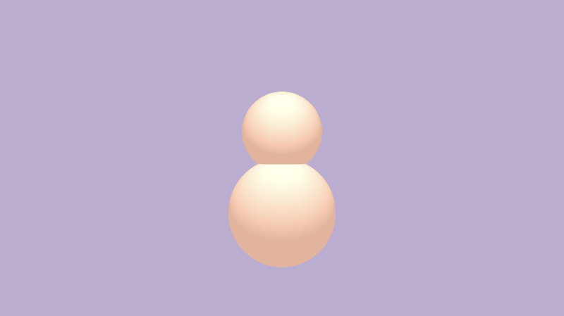
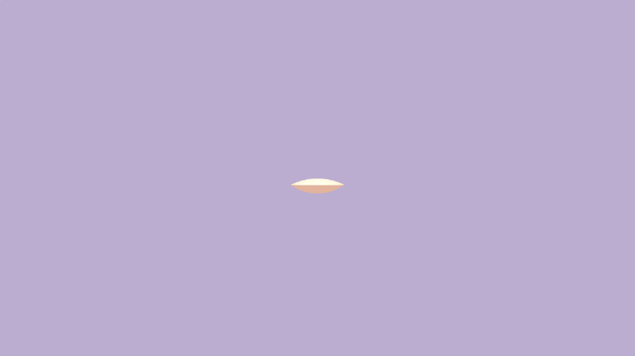
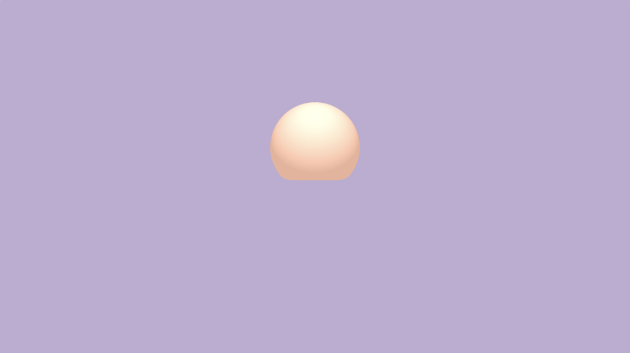
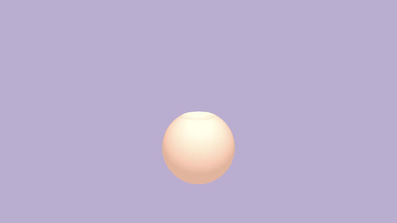
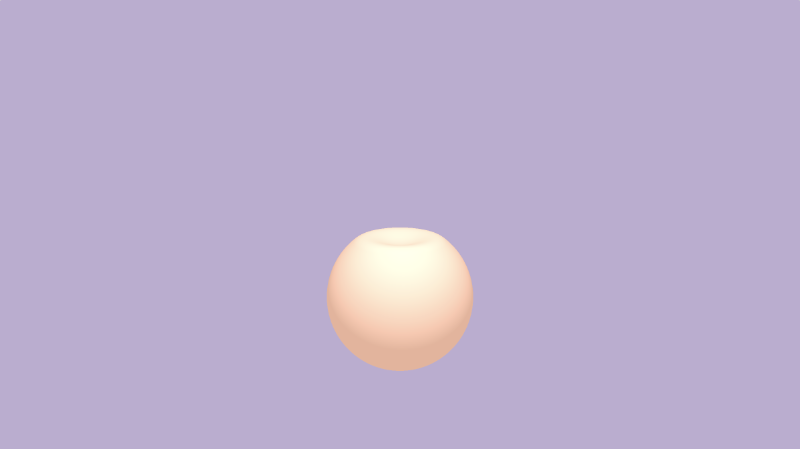

# 14.2 组合 3D SDF 操作

现在我们已经了解了我提供的光线行进模板，让我们了解 `3D SDF 操作`！我在本系列教程的[**第 5 部分**](/category/5-2d-sdf-操作和更多的形状)中介绍了 `2D SDF操作`。`3D SDF操作`有点相似。我们将使用实用函数将形状组合在一起或将形状彼此相减。这些功能可以在 `Inigo Quilez` 的 [**3D SDF**](https://www.iquilezles.org/www/articles/distfunctions/distfunctions.htm) 页面上找到。

在代码顶部附近定义实用程序函数，然后在 `scene` 函数中使用它。

**并集 Union**：将两个形状组合在一起或在屏幕上显示多个形状。我们现在应该已经熟悉了工会作。我们一直在使用 `min` 函数来绘制多个形状。

```cpp
float opUnion(float d1, float d2) {
  return min(d1, d2);
}

float scene(vec3 p) {
  float d1 = sdSphere(p, 1., vec3(0, -1, 0));
  float d2 = sdSphere(p, 0.75, vec3(0, 0.5, 0));
  return opUnion(d1, d2);
}
```

<p align="center"></p>

**平滑联合 Smooth Union**：将两个形状组合在一起，并使用参数 k 在边缘处混合它们。k 值等于零将导致正常的联合作。

```cpp
float opSmoothUnion(float d1, float d2, float k) {
  float h = clamp( 0.5 + 0.5*(d2-d1)/k, 0.0, 1.0 );
  return mix( d2, d1, h ) - k*h*(1.0-h);
}

float scene(vec3 p) {
  float d1 = sdSphere(p, 1., vec3(0, -1, 0));
  float d2 = sdSphere(p, 0.75, vec3(0, 0.5, 0));
  return opSmoothUnion(d1, d2, 0.2);
}
```
<p align="center"></p>

**交集 Intersection**：仅取两个形状相交的部分。
```cpp
float opIntersection(float d1, float d2) {
  return max(d1,d2);
}

float scene(vec3 p) {
  float d1 = sdSphere(p, 1., vec3(0, -1, 0));
  float d2 = sdSphere(p, 0.75, vec3(0, 0.5, 0));
  return opIntersection(d1, d2);
}
```
<p align="center"></p>

**平滑交集 Smooth Intersection**：将两个形状组合在一起，并使用参数 k 在边缘处混合它们。k 值等于零将导致正常的交集操作。

```cpp
float opSmoothIntersection(float d1, float d2, float k) {
  float h = clamp( 0.5 - 0.5*(d2-d1)/k, 0.0, 1.0 );
  return mix( d2, d1, h ) + k*h*(1.0-h);
}

float scene(vec3 p) {
  float d1 = sdSphere(p, 1., vec3(0, -1, 0));
  float d2 = sdSphere(p, 0.75, vec3(0, 0.5, 0));
  return opSmoothIntersection(d1, d2, 0.2);
}
```

<p align="center"></p>

**减法 Subtraction**：从 d2 中减去 d1。

```cpp
float opSubtraction(float d1, float d2 ) {
  return max(-d1, d2);
}

float scene(vec3 p) {
  float d1 = sdSphere(p, 1., vec3(0, -1, 0));
  float d2 = sdSphere(p, 0.75, vec3(0, 0.5, 0));
  return opSubtraction(d1, d2);
}
```

<p align="center"></p>

**平滑减法 Smooth Subtraction**：使用 k 围绕边缘从 d2 中平滑地减去 d1。
```cpp
float opSmoothSubtraction(float d1, float d2, float k) {
  float h = clamp( 0.5 - 0.5*(d2+d1)/k, 0.0, 1.0 );
  return mix( d2, -d1, h ) + k*h*(1.0-h);
}

float scene(vec3 p) {
  float d1 = sdSphere(p, 1., vec3(0, -1, 0));
  float d2 = sdSphere(p, 0.75, vec3(0, 0.5, 0));
  return opSmoothSubtraction(d1, d2, 0.2);
}
```
<p align="center"></p>

**减法 2 Subtraction 2**：从 d1 中减去 d2。

```cpp
float opSubtraction2(float d1, float d2 ) {
  return max(d1, -d2);
}

float scene(vec3 p) {
  float d1 = sdSphere(p, 1., vec3(0, -1, 0));
  float d2 = sdSphere(p, 0.75, vec3(0, 0.5, 0));
  return opSubtraction2(d1, d2);
}
```

<p align="center"></p>

**平滑减法 2 Smooth Subtraction 2**：使用 k 在边缘周围从 d1 中平滑地减去 d2。

```cpp
float opSmoothSubtraction2(float d1, float d2, float k) {
  float h = clamp( 0.5 - 0.5*(d2+d1)/k, 0.0, 1.0 );
  return mix( d1, -d2, h ) + k*h*(1.0-h);
}

float scene(vec3 p) {
  float d1 = sdSphere(p, 1., vec3(0, -1, 0));
  float d2 = sdSphere(p, 0.75, vec3(0, 0.5, 0));
  return opSmoothSubtraction2(d1, d2, 0.2);
}
```
<p align="center"></p>