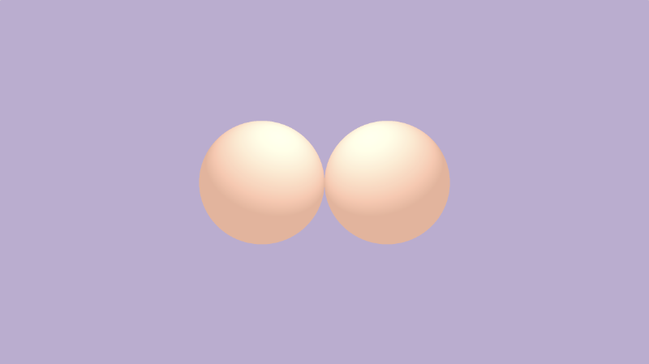
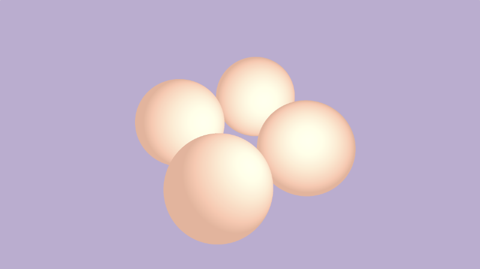
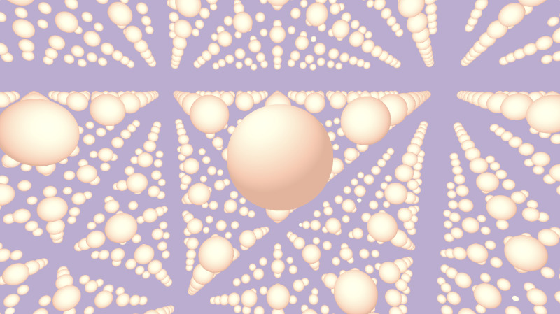
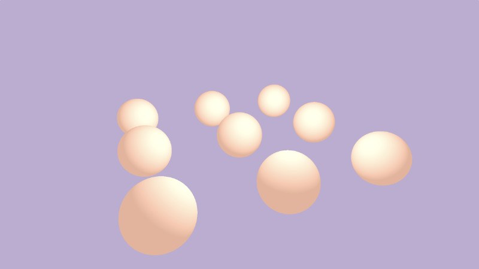
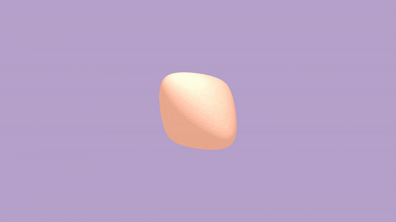

# 14.3 3D SDF 位置操作

`Inigo Quilez` 的 [**3D SDF**](https://www.iquilezles.org/www/articles/distfunctions/distfunctions.htm) 页面介绍了一组位置 `3D SDF`操作，我们可以使用这些作来帮助我们在绘制 3D 对象时节省一些工作。其中一些作也有助于节省性能，因为我们不必额外运行光线行进循环。

我们在前面的教程中学习了如何使用转换矩阵旋转形状，以及如何使用偏移量转换 `3D` 形状。如果需要缩放形状，只需更改 SDF 的尺寸即可。

如果要绘制对称场景，则使用 `opSymX`操作可能很有用。此作将使用您提供的 `SDF` 沿 `x` 轴创建重复的 `3D` 对象。如果我们在 `vec3（1， 0， 0）` 的偏移量处绘制球体，那么将在 `vec3（-1， 0， 0）` 处绘制等效球体。

```cpp
float opSymX(vec3 p, float r, vec3 o)
{
  p.x = abs(p.x);
  return sdSphere(p, r, o);
}

float scene(vec3 p) {
  return opSymX(p, 1., vec3(1, 0, 0));
}
```

<p align="center"></p>

如果要沿 `y` 轴或 `z` 轴使用对称性，则可以将 `p.x` 分别替换为 `p.y` 或 `p.z`。不要忘记调整球体偏移。

如果要沿两个轴绘制球体，而不仅仅是一个轴，则可以使用 `opSymXZ` 操作。这将沿 `XZ` 平面创建副本，从而产生四个球体。如果我们绘制一个偏移量为 `vec3（1， 0， 1）` 的球体，那么将在 `vec3（1， 0， 1）`、`vec3（-1， 0， 1）`、`vec3（1， 0， -1）` 和 `vec3（-1， 0， -1）` 处绘制一个球体。

```cpp
float opSymXZ(vec3 p, float r, vec3 o)
{
  p.xz = abs(p.xz);
  return sdSphere(p, r, o);
}

float scene(vec3 p) {
  return opSymXZ(p, 1., vec3(1, 0, 1));
}
```

<p align="center"></p>

有时，您希望跨一个或多个轴创建无限数量的 `3D` 对象。您可以使用 `opRep`作沿您选择的轴重复球体。参数 `c` 是用于控制沿每个轴的 `3D` 对象之间的间距的向量。

```cpp
float opRep(vec3 p, float r, vec3 o, vec3 c)
{
  vec3 q = mod(p+0.5*c,c)-0.5*c;
  return sdSphere(q, r, o);
}

float scene(vec3 p) {
  return opRep(p, 1., vec3(0), vec3(8));
}
```
<p align="center"></p>

如果只想重复 `3D` 对象一定次数而不是无限次，则可以使用 `opRepLim` 操作。参数 `c` 现在是浮点值，并且仍然控制每个重复的 `3D` 对象之间的间距。参数 `l` 是一个向量，用于控制形状应沿给定轴重复多少次。例如，值 `vec3（1， 0， 1）` 将沿正负 `x` 轴和 `z` 轴绘制一个额外的球体。

```cpp
float opRepLim(vec3 p, float r, vec3 o, float c, vec3 l)
{
  vec3 q = p-c*clamp(round(p/c),-l,l);
  return sdSphere(q, r, o);
}

float scene(vec3 p) {
  return opRepLim(p, 0.5, vec3(0), 2., vec3(1, 0, 1));
}
```

<p align="center"></p>

您还可以通过纵 `p` 的值并将其与 `SDF` 返回的值相加，对 `SDF` 执行变形或扭曲。在 `opDisplace`作中，您可以创建任何类型的数学运算来替换 `p` 的值，然后将该结果添加到您从 `SDF` 返回的原始值中。

```cpp
float opDisplace(vec3 p, float r, vec3 o)
{
  float d1 = sdSphere(p, r, o);
  float d2 = sin(p.x)*sin(p.y)*sin(p.z) * cos(iTime);
  return d1 + d2;
}

float scene(vec3 p) {
  return opDisplace(p, 1., vec3(0));
}
```

<p align="center"></p>

您可以在下面找到完成的代码，包括每个 `3D SDF` 操作的示例。

```cpp
const int MAX_MARCHING_STEPS = 255;
const float MIN_DIST = 0.0;
const float MAX_DIST = 100.0;
const float PRECISION = 0.001;
const float EPSILON = 0.0005;
const float PI = 3.14159265359;
const vec3 COLOR_BACKGROUND = vec3(.741, .675, .82);
const vec3 COLOR_AMBIENT = vec3(0.42, 0.20, 0.1);

mat2 rotate2d(float theta) {
  float s = sin(theta), c = cos(theta);
  return mat2(c, -s, s, c);
}

float sdSphere(vec3 p, float r, vec3 offset)
{
  return length(p - offset) - r;
}

float opUnion(float d1, float d2) {
  return min(d1, d2);
}

float opSmoothUnion(float d1, float d2, float k) {
  float h = clamp( 0.5 + 0.5*(d2-d1)/k, 0.0, 1.0 );
  return mix( d2, d1, h ) - k*h*(1.0-h);
}

float opIntersection(float d1, float d2) {
  return max(d1, d2);
}

float opSmoothIntersection(float d1, float d2, float k) {
  float h = clamp( 0.5 - 0.5*(d2-d1)/k, 0.0, 1.0 );
  return mix( d2, d1, h ) + k*h*(1.0-h);
}

float opSubtraction(float d1, float d2) {
  return max(-d1, d2);
}

float opSmoothSubtraction(float d1, float d2, float k) {
  float h = clamp( 0.5 - 0.5*(d2+d1)/k, 0.0, 1.0 );
  return mix( d2, -d1, h ) + k*h*(1.0-h);
}

float opSubtraction2(float d1, float d2) {
  return max(d1, -d2);
}

float opSmoothSubtraction2(float d1, float d2, float k) {
  float h = clamp( 0.5 - 0.5*(d2+d1)/k, 0.0, 1.0 );
  return mix( d1, -d2, h ) + k*h*(1.0-h);
}

float opSymX(vec3 p, float r, vec3 o)
{
  p.x = abs(p.x);
  return sdSphere(p, r, o);
}

float opSymXZ(vec3 p, float r, vec3 o)
{
  p.xz = abs(p.xz);
  return sdSphere(p, r, o);
}

float opRep(vec3 p, float r, vec3 o, vec3 c)
{
  vec3 q = mod(p+0.5*c,c)-0.5*c;
  return sdSphere(q, r, o);
}

float opRepLim(vec3 p, float r, vec3 o, float c, vec3 l)
{
  vec3 q = p-c*clamp(round(p/c),-l,l);
  return sdSphere(q, r, o);
}

float opDisplace(vec3 p, float r, vec3 o)
{
  float d1 = sdSphere(p, r, o);
  float d2 = sin(p.x)*sin(p.y)*sin(p.z) * cos(iTime);
  return d1 + d2;
}

float scene(vec3 p) {
  float d1 = sdSphere(p, 1., vec3(0, -1, 0));
  float d2 = sdSphere(p, 0.75, vec3(0, 0.5, 0));
  //return d1;
  //return d2;
  //return opUnion(d1, d2);
  //return opSmoothUnion(d1, d2, 0.2);
  //return opIntersection(d1, d2);
  //return opSmoothIntersection(d1, d2, 0.2);
  //return opSubtraction(d1, d2);
  //return opSmoothSubtraction(d1, d2, 0.2);
  //return opSubtraction2(d1, d2);
  //return opSmoothSubtraction2(d1, d2, 0.2);
  //return opSymX(p, 1., vec3(1, 0, 0));
  //return opSymXZ(p, 1., vec3(1, 0, 1));
  //return opRep(p, 1., vec3(0), vec3(8));
  //return opRepLim(p, 0.5, vec3(0), 2., vec3(1, 0, 1));
  return opDisplace(p, 1., vec3(0));
}

float rayMarch(vec3 ro, vec3 rd) {
  float depth = MIN_DIST;
  float d; // distance ray has travelled

  for (int i = 0; i < MAX_MARCHING_STEPS; i++) {
    vec3 p = ro + depth * rd;
    d = scene(p);
    depth += d;
    if (d < PRECISION || depth > MAX_DIST) break;
  }

  d = depth;

  return d;
}

vec3 calcNormal(in vec3 p) {
    vec2 e = vec2(1, -1) * EPSILON;
    return normalize(
      e.xyy * scene(p + e.xyy) +
      e.yyx * scene(p + e.yyx) +
      e.yxy * scene(p + e.yxy) +
      e.xxx * scene(p + e.xxx));
}

mat3 camera(vec3 cameraPos, vec3 lookAtPoint) {
    vec3 cd = normalize(lookAtPoint - cameraPos);
    vec3 cr = normalize(cross(vec3(0, 1, 0), cd));
    vec3 cu = normalize(cross(cd, cr));

    return mat3(-cr, cu, -cd);
}

void mainImage( out vec4 fragColor, in vec2 fragCoord )
{
  vec2 uv = (fragCoord-.5*iResolution.xy)/iResolution.y;
  vec2 mouseUV = iMouse.xy/iResolution.xy;

  if (mouseUV == vec2(0.0)) mouseUV = vec2(0.5); // trick to center mouse on page load

  vec3 col = vec3(0);
  vec3 lp = vec3(0);
  vec3 ro = vec3(0, 0, 3); // ray origin that represents camera position

  float cameraRadius = 2.;
  ro.yz = ro.yz * cameraRadius * rotate2d(mix(-PI/2., PI/2., mouseUV.y));
  ro.xz = ro.xz * rotate2d(mix(-PI, PI, mouseUV.x)) + vec2(lp.x, lp.z);

  vec3 rd = camera(ro, lp) * normalize(vec3(uv, -1)); // ray direction

  float d = rayMarch(ro, rd); // signed distance value to closest object

  if (d > MAX_DIST) {
    col = COLOR_BACKGROUND; // ray didn't hit anything
  } else {
    vec3 p = ro + rd * d; // point discovered from ray marching
    vec3 normal = calcNormal(p); // surface normal

    vec3 lightPosition = vec3(0, 2, 2);
    vec3 lightDirection = normalize(lightPosition - p) * .65; // The 0.65 is used to decrease the light intensity a bit

    float dif = clamp(dot(normal, lightDirection), 0., 1.) * 0.5 + 0.5; // diffuse reflection mapped to values between 0.5 and 1.0

    col = vec3(dif) + COLOR_AMBIENT;
  }

  fragColor = vec4(col, 1.0);
}
```

## 结论

在本教程中，我们学习了如何使用`组合 SDF 操作`，例如并集、交集和差集。我们还学习了如何使用`SDF 位置操作`来帮助沿不同轴将重复对象绘制到场景中。