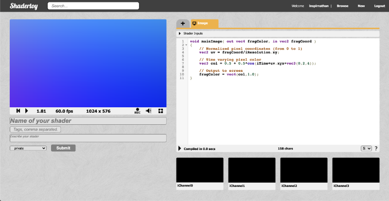
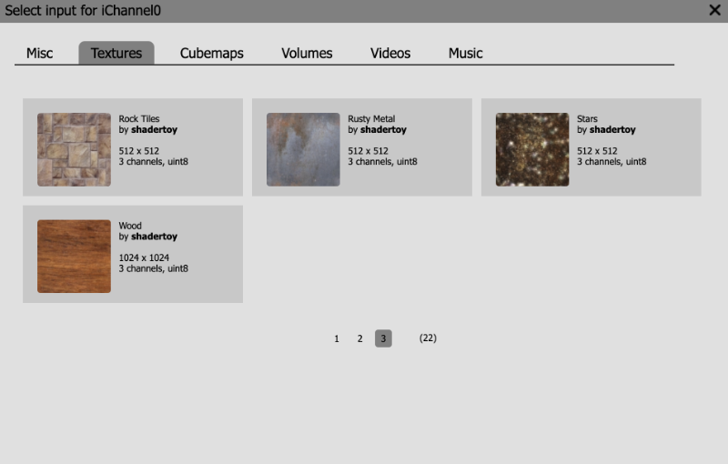
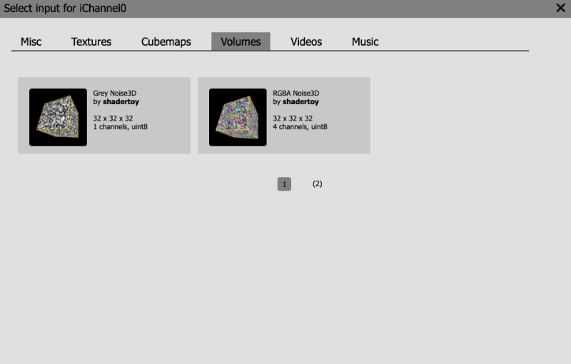

# 15.1 Channels 通道

`Shadertoy` 使用称为`通道`的概念来访问不同类型的数据。在 `Shadertoy` 用户界面的底部，您将看到四个黑框：`iChannel0`、`iChannel1`、`iChannel2` 和 `iChannel3`。

如果您单击任何 `Channel`，将出现一个弹出窗口。您可以从各种交互式元素、纹理、立方体贴图、volumes、视频和音乐中进行选择。

**Misc 选项卡**中，您可以从键盘、网络摄像头、麦克风等交互式元素中进行选择，甚至可以播放来自 `SoundCloud` 的音乐。缓冲区 `Buffer A`、`Buffer B`、`Buffer C` 和 `Buffer D` 允许您创建`多通道`着色器。将它们视为可以添加到着色器管道的额外着色器。`Cubemap A` 输入是一种特殊类型的着色器程序，可让您创建自己的立方体贴图。然后，您可以将该立方体贴图传递给缓冲区或 `mainImage”` 程序。我们将在下一个教程中讨论立方体贴图。

**Textures 选项卡**。您将找到三页的 `2D` 纹理供您选择。将 `2D` 纹理视为我们可以从中提取像素值的图像。截至撰写本文时，您只能使用 `Shadertoy`为您提供的纹理，不能从 `Shadertoy` 外部导入图像。但是，有一些方法可以使用此着色器中的细节在本地规避此问题。

**Cubemaps 选项卡**包含一系列可供选择的立方体贴图。我们将在下一个教程中更多地讨论它们。立方体贴图通常用于 `Unity` 等游戏引擎中，用于渲染您周围的 `3D` 世界。

**Volumes 选项卡** 包含 `3D` 纹理。典型的 `2D` 纹理使用 `UV` 坐标来访问沿 `x` 轴（U 值）和 `y` 轴（V 值）的数据。在 `3D` 纹理中，使用 `UVW` 坐标，其中 `W` 值用于 `z` 轴。您可以将 `3D` 纹理想象成一个立方体，其中立方体上的每个像素都代表我们可以提取的数据。这就像从三维数组中提取数据。

**Video 选项卡** 包含随时间变化的 `2D 纹理`（或图像）。也就是说，它们在 `Shadertoy` 画布中播放视频。人们使用 `Shadertoy` 上的视频来试验依赖于上一帧数据的后处理效果或图像效果。`Britney Spears`和`Claude Van Damme`视频非常适合测试绿屏效果（又名色度键合成 [**Chroma key compositing**](https://en.wikipedia.org/wiki/Chroma_key)）。

**Music 选项卡** 允许您播放 `Shadertoy` 为您提供的一系列歌曲。如果用户访问您的 `Shader`，如果您从其中一个频道的此选项卡中选择了一首歌曲，则音乐将自动播放。

