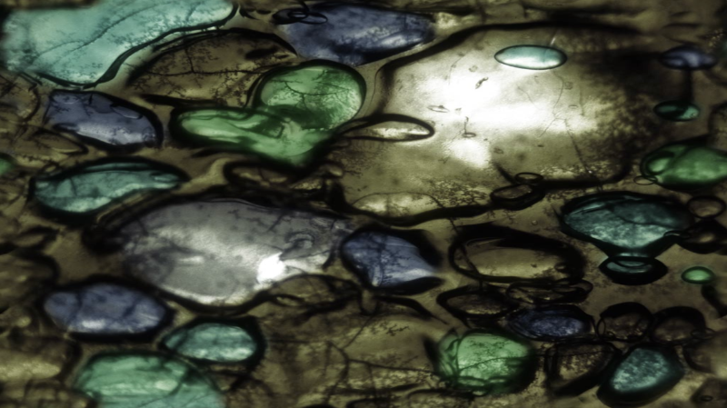

# 15.2 使用纹理

在 `Shadertoy` 中使用纹理非常简单。打开新着色器并将代码替换为以下内容：

```cpp
void mainImage( out vec4 fragColor, in vec2 fragCoord )
{
  vec2 uv = fragCoord/iResolution.xy; // Normalized pixel coordinates (from 0 to 1)

  vec4 col = texture(iChannel0, uv);

  fragColor = vec4(col); // Output to screen
}
```

然后，单击 `iChannel0` 框。当弹出窗口出现时，转到 `Textures` 选项卡。我们将选择 `Abstract 1` 纹理，但让我们检查一下弹出菜单中显示的一些细节。

<p align="center"></p>

它表示此纹理的分辨率为 `1024x1024` 像素，这意味着此图像最好在方形或比例画布中查看。它还有 `3` 个通道（红色、绿色、蓝色），每个通道都是 `uint8` 类型，一个 `8` 位的无符号整数。

继续并单击`Abstract 1`将此纹理加载到 `iChannel0` 中。然后，运行着色器程序。您应该会看到纹理出现在 `Shadertoy` 画布中。

<p align="center"></p>

让我们分析一下着色器程序中的代码。

```cpp
void mainImage( out vec4 fragColor, in vec2 fragCoord )
{
  vec2 uv = fragCoord/iResolution.xy; // Normalized pixel coordinates (from 0 to 1)

  vec4 col = texture(iChannel0, uv);

  fragColor = vec4(col); // Output to screen
}
```

`UV 坐标`在 `x` 轴和 `y` 轴上介于 `0` 和 `1` 之间。请记住，点 `（0， 0）` 从画布的左下角开始。`texture` 函数使用 `iChannel0` 和 `UV 坐标`从纹理中检索所谓的**纹素 texels**。

**纹素 texels** 是纹理上特定坐标的值。对于 2D 纹理（如图像），纹素是像素值。我们假设 UV 坐标在图像上介于 0 和 1 之间，则对 2D 纹理进行采样。然后，我们可以将纹理 UV 映射到整个 Shadertoy 画布上。

<p align="center"></p>

对于 `3D` 纹理，您可以将纹素视为 `3D` 坐标处的像素值。您通常不会看到 `3D` 纹理如此频繁地使用，除非您正在处理噪声生成或体积光线行进。

您可能很好奇，当我们将 `iChannel0` 作为参数传递给 `texture` 函数时，它是什么类型。`Shadertoy` 负责为您设置采样器。采样器是一种将纹理单元绑定到着色器的方法。采样器的类型将根据您加载到四个通道 **（iChannel0、iChannel1、iChannel2、iChannel3）** 之一的**资源类型**而变化。

在本例中，我们将 `2D` 纹理加载到 `iChannel0` 中。因此，`iChannel0` 的类型为 `sampler2D`。您可以在 `OpenGL Wiki` 页面上查看可用的其他采样器类型。

假设您想创建一个函数，让您传入其中一个通道。您可以通过以下代码执行此作：

```cpp
vec3 get2DTexture( sampler2D sam, vec2 uv ) {
  return texture(sam, uv).rgb;
}

void mainImage( out vec4 fragColor, in vec2 fragCoord )
{
  vec2 uv = fragCoord/iResolution.xy; // Normalized pixel coordinates (from 0 to 1)

  vec3 col = vec3(0.);

  col = get2DTexture(iChannel0, uv);
  col += get2DTexture(iChannel1, uv);

  fragColor = vec4(col,1.0); // Output to screen
}
```

如果单击 `iChannel1` 框，选择`Abstract 3`纹理，然后运行代码，您应该会看到两个图像混合在一起。

<p align="center"></p>

我们创建的 `get2DTexture` 函数接受 `sampler2D` 类型作为其第一个参数。当您在通道中使用 `2D` 纹理时，`Shadertoy` 会自动为您返回 `sampler2D` 类型的数据。

如果要在 `Shadertoy` 画布中播放视频，可以按照与 `2D` 纹理相同的步骤进行操作。只需在 `iChannel0` 中选择一个视频，您应该会看到视频开始自动播放。


