# 15.3 通道设置

好了，现在让我们看看我们可以更改的一些通道设置。首先，将以下代码粘贴到着色器中：

```cpp
void mainImage( out vec4 fragColor, in vec2 fragCoord )
{
  vec2 uv = fragCoord/iResolution.xy; // Normalized pixel coordinates (from 0 to 1)

  vec4 col = texture(iChannel0, uv);

  fragColor = vec4(col); // Output to screen
}
```

然后，我们将使用新的纹理。单击 `iChannel0` 框，转到`Textures`选项卡，转到第 `2` 页，您应该会看到`Nyancat`纹理。

<p align="center">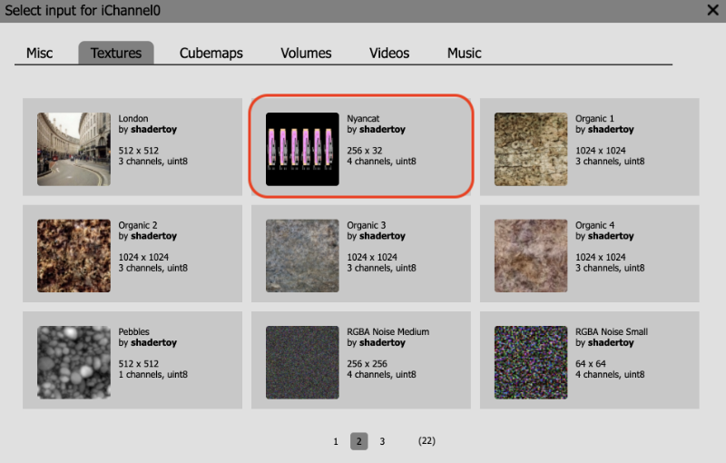</p>

`Nyancat`纹理是一个 `256x32` 的图像，具有 `4` 个通道（红色、绿色、蓝色和 Alpha）。单击此纹理，使其显示在 `iChannel0` 中。

<p align="center">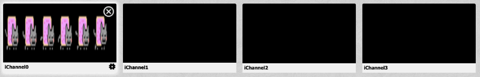</p>

运行代码时，您应该会看到 `Nyan Cats` 出现，但它们看起来模糊不清。

<p align="center"></p>

要解决此问题，我们需要通过单击通道框右下角的小齿轮图标来调整通道设置。

<p align="center">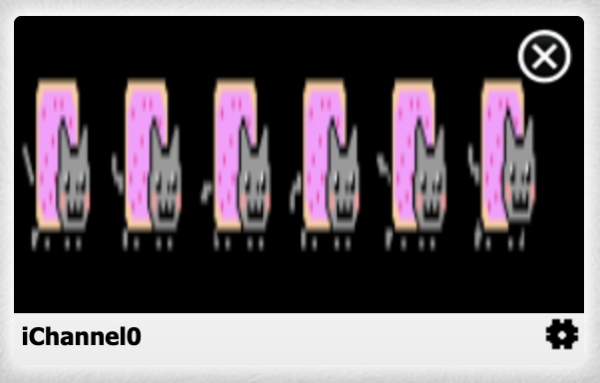</p>

这将打开一个包含三个设置的菜单：`Filter`、`Wrap` 和 `VFlip`。

<p align="center">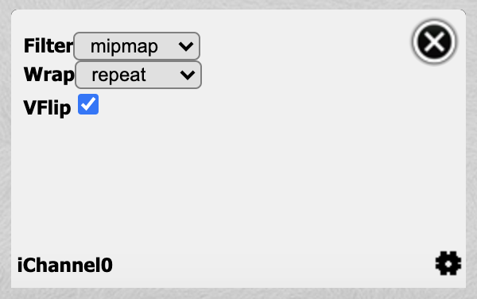</p>

`Filter （过滤器）` 选项允许您更改用于过滤纹理的算法类型。纹理和 `Shadertoy` 画布的尺寸并不总是匹配，因此使用过滤器对纹理进行采样。默认情况下，`Filter （过滤器）` 选项设置为 `mipmap`。单击下拉菜单并选择 `nearest` 以使用 `nearest-neighbor interpolation`。当您的纹理或图像是**像素画的 pixelated**，并且您希望保持像素化外观时，这种类型的滤镜非常有用。

<p align="center">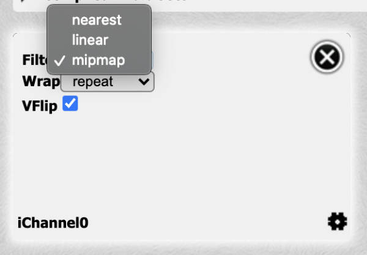</p>

当您将过滤器更改为`nearest`时，您应该会看到 `Nyan Cats` 看起来超级清晰。

<p align="center">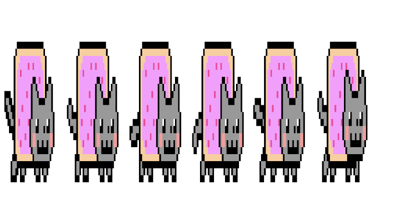</p>

不过，`Nyan Cats` 看起来有点被压扁了。让我们通过将 `x` 轴缩放 `0.25` 来解决这个问题。

```cpp
void mainImage( out vec4 fragColor, in vec2 fragCoord )
{
  vec2 uv = fragCoord/iResolution.xy; // Normalized pixel coordinates (from 0 to 1)

  uv.x *= 0.25;

  vec4 col = texture(iChannel0, uv);

  fragColor = vec4(col); // Output to screen
}
```

当您运行代码时，`Nyan Cats` 看起来不会再被压扁了。

<p align="center">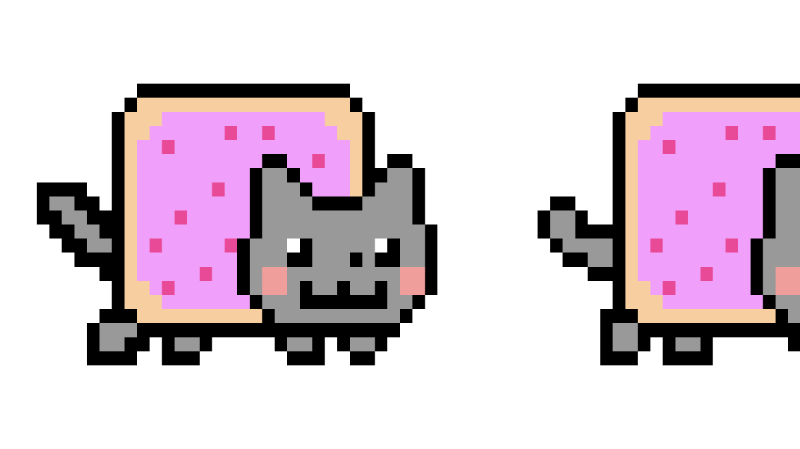</p>

您可以使用 `VFlip` 选项将纹理上下颠倒或垂直翻转。取消选中通道设置中 `VFlip` 旁边的复选框，以查看 `Nyan Cats` 倒置。

<p align="center">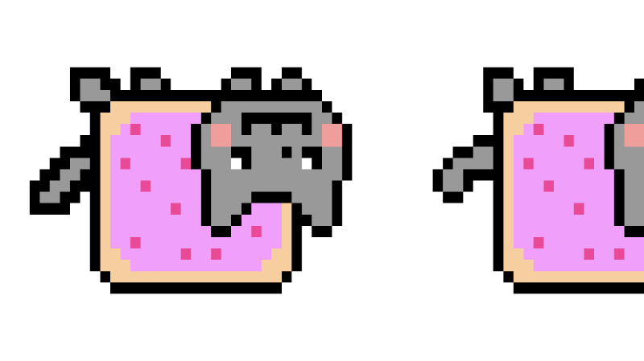</p>

返回并检查 `VFlip` 选项以使 `Nyan Cats` 恢复正常。您可以通过从 `uv.x` 中减去偏移量并使用 `iTime` 为场景制作动画来使 `Nyan Cats` 移动。

```cpp
void mainImage( out vec4 fragColor, in vec2 fragCoord )
{
  vec2 uv = fragCoord/iResolution.xy; // Normalized pixel coordinates (from 0 to 1)

  uv.x *= 0.25;

  uv.x -= iTime * 0.05;

  vec4 col = texture(iChannel0, uv);

  fragColor = vec4(col); // Output to screen
}
```

<p align="center">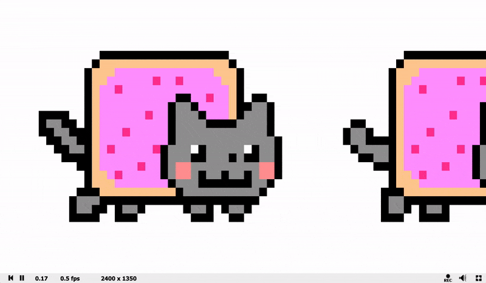</p>

默认情况下，`Wrap` 模式设置为 `repeat`。这意味着，当 `UV 坐标`超出 `0` 和 `1` 的边界时，它将开始从纹理采样，并在 `0` 和 `1` 之间重复。由于我们正在使 `uv.x` 越来越小，我们肯定会超出 `0` 的边界，但采样器足够聪明，可以弄清楚如何适应。

如果您不希望这种重复行为，则可以将 `Wrap` 模式设置为 `clamp`。

<p align="center">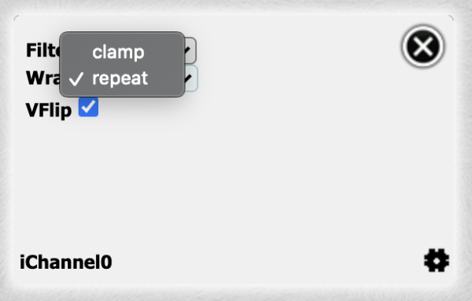</p>

如果你将时间重置回零，那么你会看到，在 `UV 坐标`超出 `0` 或 `1` 的边界后，我们再也看不到 `Nyan Cats`。

<p align="center">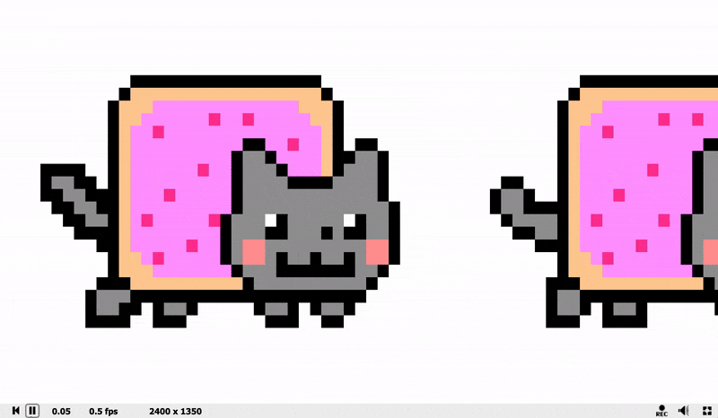</p>

由于 `Nyancat` 纹理提供四个通道，因此还有一个 `Alpha` 通道，因此我们可以轻松地交换背景。确保 `timer` 设置回零并运行以下代码：

```cpp
void mainImage( out vec4 fragColor, in vec2 fragCoord )
{
  vec2 uv = fragCoord/iResolution.xy; // Normalized pixel coordinates (from 0 to 1)

  vec4 col = vec4(0.75);

  uv.x *= 0.25;
  uv.x -= iTime * 0.05;

  vec4 texCol = texture(iChannel0, uv);

  col = mix(col, texCol, texCol.a);

  fragColor = vec4(col); // Output to screen
}
```

`Nyancat` 纹理的 `alpha` 值为零，除了 `Nyan Cats` 所在的位置。这让我们在它们后面设置一个背景颜色。

<p align="center">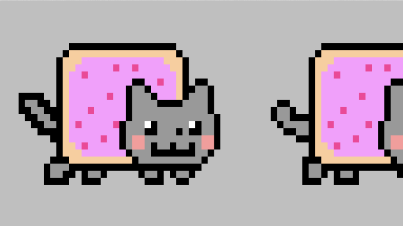</p>

请记住，大多数纹理只有三个通道。某些纹理只有一个通道，例如`Bayer`纹理。这意味着红色通道将包含数据，但其他三个通道不包含数据，这就是为什么您在使用它时可能会看到红色的原因。某些纹理用于创建噪点或以特定方式置换形状。您甚至可以将纹理用作高度贴图，以根据纹理中存储的颜色值来塑造地形的高度。**纹理有多种用途**。


