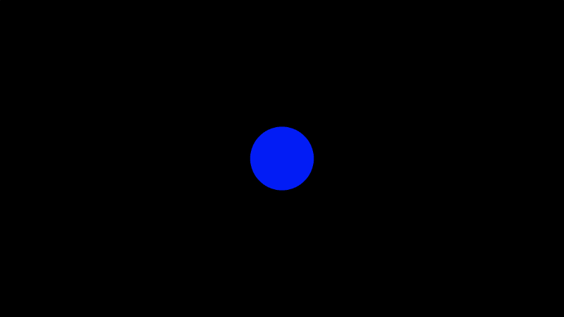

# 15.5 使用键盘

您可能已经在 `Shadertoy` 上看到过允许用户使用键盘控制场景的[**着色器**](https://www.shadertoy.com/view/sdf3RS)。我编写了一个着色器，演示了如何使用键盘移动对象，并使用缓冲区来存储每次按键的结果。如果转到此着色器，您应该会看到一个带有缓冲区、缓冲区 A 和 `mainImage` 着色器的多通道着色器。

在 `Buffer A` 中，您应该看到以下代码：

```cpp
// Numbers are based on JavaScript key codes: https://keycode.info/
const int KEY_LEFT  = 37;
const int KEY_UP    = 38;
const int KEY_RIGHT = 39;
const int KEY_DOWN  = 40;

vec2 handleKeyboard(vec2 offset) {
    float velocity = 1. / 100.; // This will cause offset to change by 0.01 each time an arrow key is pressed

    // texelFetch(iChannel1, ivec2(KEY, 0), 0).x will return a value of one if key is pressed, zero if not pressed
    vec2 left = texelFetch(iChannel1, ivec2(KEY_LEFT, 0), 0).x * vec2(-1, 0);
    vec2 up = texelFetch(iChannel1, ivec2(KEY_UP,0), 0).x * vec2(0, 1);
    vec2 right = texelFetch(iChannel1, ivec2(KEY_RIGHT, 0), 0).x * vec2(1, 0);
    vec2 down = texelFetch(iChannel1, ivec2(KEY_DOWN, 0), 0).x * vec2(0, -1);

    offset += (left + up + right + down) * velocity;

    return offset;
}

void mainImage( out vec4 fragColor, in vec2 fragCoord )
{
    // Return the offset value from the last frame (zero if it's first frame)
    vec2 offset = texelFetch( iChannel0, ivec2(0, 0), 0).xy;

    // Pass in the offset of the last frame and return a new offset based on keyboard input
    offset = handleKeyboard(offset);

    // Store offset in the XY values of every pixel value and pass this data to the "Image" shader and the next frame of Buffer A
    fragColor = vec4(offset, 0, 0);
}
```

在 `Image` 着色器中，您应该看到以下代码：

```cpp
float sdfCircle(vec2 uv, float r, vec2 offset) {
    float x = uv.x - offset.x;
    float y = uv.y - offset.y;

    float d = length(vec2(x, y)) - r;

    return step(0., -d);
}

vec3 drawScene(vec2 uv) {
    vec3 col = vec3(0);

    // Fetch the offset from the XY part of the pixel values returned by Buffer A
    vec2 offset = texelFetch( iChannel0, ivec2(0,0), 0 ).xy;

    float blueCircle = sdfCircle(uv, 0.1, offset);

    col = mix(col, vec3(0, 0, 1), blueCircle);

    return col;
}

void mainImage( out vec4 fragColor, in vec2 fragCoord )
{
    vec2 uv = fragCoord/iResolution.xy; // <0, 1>
    uv -= 0.5; // <-0.5,0.5>
    uv.x *= iResolution.x/iResolution.y; // fix aspect ratio

    vec3 col = drawScene(uv);

    // Output to screen
    fragColor = vec4(col,1.0);
}
```

我的多通道着色器在画布上绘制一个圆圈，并允许您使用键盘移动它。实际发生的情况是，我们从按键中得到一个值 `1` 或 `0`，并使用该值来控制圆的偏移值。

<p align="center"></p>

如果您查看 `Buffer A` 内部，您会注意到我正在 `Buffer A` 中使用 `iChannel0` 中的 `Buffer A`。这怎么可能呢？当您在 `Buffer A` 着色器中使用 `Buffer A` 时，您将可以访问运行的最后一帧的 `fragColor` 值。

没有递归。据我所知，你不能在 `GLSL` 中使用递归。因此，所有内容都必须以迭代方式编码。但是，这并不能阻止我们逐帧使用缓冲区。

[**texelFetch**](https://www.khronos.org/registry/OpenGL-Refpages/gl4/html/texelFetch.xhtml) 函数在纹理中执行单个纹素值的查找。不过，键盘不是纹理，那么它是如何工作的呢？`Shadertoy` 本质上是将内容粘合在一起，以便我们从着色器中访问浏览器的键盘事件，就像它是纹理一样。我们可以通过使用 `texelFetch` 来检查是否按下了某个键来访问按键操作。

我们根据某个键是未按下还是被按下来返回 `0` 或 `1`。然后，我们可以将该值乘以速度来调整圆的偏移量。偏移值将传递到缓冲区 A 的下一帧。然后，它将传递到 `Image` 着色器。

如果场景以每秒 `60` 帧 （fps） 的速度运行，则意味着每 `1/60` 秒绘制一帧。在多通道着色器的一次传递期间，我们将从最后一帧的 Buffer A 值中提取，将其传递到当前帧的 `Buffer A` 着色器中，将该结果传递给`Image`着色器，然后将像素绘制到画布上。此循环将每帧重复一次或每秒重复 `60` 次。

其他交互元素（例如我们计算机的麦克风）也可以像纹理一样访问。请阅读下面的资源，查看 `Inigo Quilez` 创建的有关如何在 `Shadertoy` 中使用各种交互式元素的示例。

## 结论
纹理是计算机图形学和游戏开发中一个非常重要的概念。`GLSL` 和其他着色器语言提供用于访问纹理数据的函数。`Shadertoy` 为您处理了很多繁重的工作，因此您可以通过通道快速访问纹理或交互式元素。您可以使用纹理来存储颜色值，然后使用这些颜色来表示不同类型的数据，例如高度、位移、深度或您能想到的任何其他数据。

请参阅以下资源，了解如何在 `Shadertoy` 中使用各种交互式元素。

1. [**Khronos: Data Type (GLSL) Khronos：数据类型 （GLSL）**](https://www.khronos.org/opengl/wiki/Data_Type_(GLSL))
2. [**Khronos: texture  Khronos：质地**](https://www.khronos.org/registry/OpenGL-Refpages/gl4/html/texture.xhtml)
3. [**Khronos: texelFetch  Khronos：texelFetch**](https://www.khronos.org/registry/OpenGL-Refpages/gl4/html/texelFetch.xhtml)
4. [**Khronos: Sampler (GLSL)  Khronos： 采样器 （GLSL）**](https://www.khronos.org/opengl/wiki/Sampler_(GLSL))
5. [**2D Movement with Keyboard 使用键盘进行 2D 移动**](https://www.shadertoy.com/view/sdf3RS)
6. [**Input - Keyboard  输入 - 键盘**](https://www.shadertoy.com/view/lsXGzf)
7. [**Input - Microphone  输入 - 麦克风**](https://www.shadertoy.com/view/llSGDh)
8. [**Input - Mouse  输入 - 鼠标**](https://www.shadertoy.com/view/Mss3zH)
9. [**Input - Sound  输入 - 声音**](https://www.shadertoy.com/view/Xds3Rr)
10. [**Input - SoundCloud  输入 - SoundCloud**](https://www.shadertoy.com/view/MsdGzn)
11. [**Input - Time  输入 - 时间**](https://www.shadertoy.com/view/lsXGz8)
12. [**Input - TimeDelta  输入 - TimeDelta**](https://www.shadertoy.com/view/lsKGWV)
13. [**Input - 3D Texture  输入 - 3D 纹理**](https://www.shadertoy.com/view/4llcR4)
14. [**Example - mainCubemap  示例 - mainCubemap**](https://www.shadertoy.com/view/4ttyzn)
15. [**Cheap Cubemap  便宜的立方体贴图**](https://www.shadertoy.com/view/ltl3D8)


