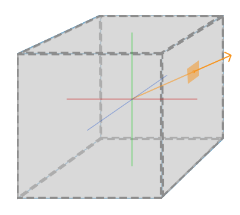
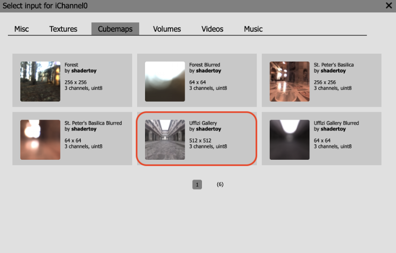
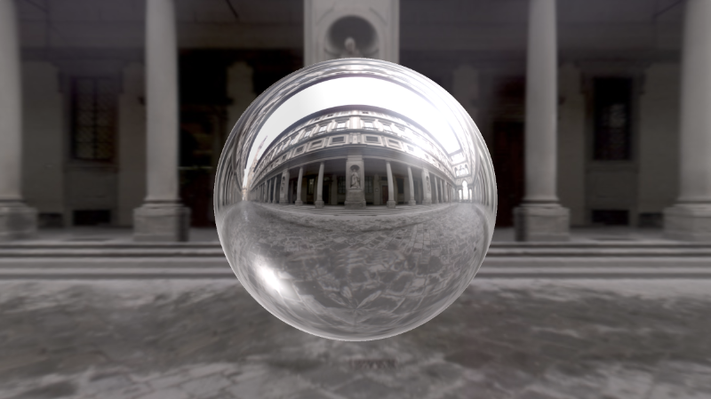
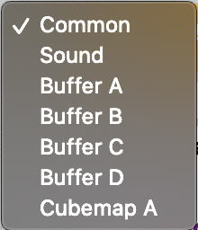
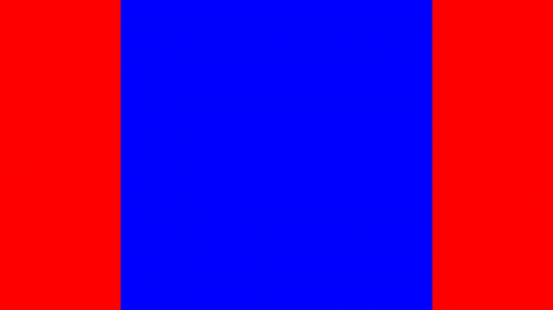

# 16.1 Cubemaps 立方体贴图

立方体贴图是一种特殊类型的纹理，可以认为它包含六个单独的 `2D` 纹理，每个纹理形成一个立方体的面。您可能已经在 Unity 和 Unreal Engine 等游戏引擎中使用过立方体贴图。在 `Shadertoy` 中，立方体贴图允许您创建动态 `3D` 背景，该背景会根据摄像机的面对位置而变化。`Shadertoy` 画布的每个像素都将由光线方向决定。

[**Learn OpenGL**](https://learnopengl.com/Advanced-OpenGL/Cubemaps) 网站提供了一个很好的图像来直观地展示立方体贴图的工作原理。

<p align="center"></p>
<p align="center">[**Learn OpenGL**](https://learnopengl.com/Advanced-OpenGL/Cubemaps) 的立方体贴图</p>

我们假设摄像机位于立方体的中心，并指向立方体的一个或多个面。在上图中，光线方向决定了要从立方体贴图的哪个部分采样。

让我们在 `Shadertoy` 中练习一下。创建一个新着色器，然后单击 `iChannel0` 框。点击 `Cubemaps` 选项卡并选择 `Uffizi Gallery` 立方体贴图。

<p align="center"></p>

然后，将所有代码替换为以下内容：

```cpp
const float PI = 3.14159265359;

mat2 rotate2d(float theta) {
  float s = sin(theta), c = cos(theta);
  return mat2(c, -s, s, c);
}

mat3 camera(vec3 cameraPos, vec3 lookAtPoint) {
    vec3 cd = normalize(lookAtPoint - cameraPos);
    vec3 cr = normalize(cross(vec3(0, 1, 0), cd));
    vec3 cu = normalize(cross(cd, cr));

    return mat3(-cr, cu, -cd);
}

void mainImage( out vec4 fragColor, in vec2 fragCoord )
{
  vec2 uv = (fragCoord-.5*iResolution.xy)/iResolution.y;
  vec2 mouseUV = iMouse.xy/iResolution.xy;
  if (mouseUV == vec2(0.0)) mouseUV = vec2(0.5); // trick to center mouse on page load

  vec3 lp = vec3(0);
  vec3 ro = vec3(0, 0, 3);
  ro.yz *= rotate2d(mix(-PI/2., PI/2., mouseUV.y));
  ro.xz *= rotate2d(mix(-PI, PI, mouseUV.x));

  vec3 rd = camera(ro, lp) * normalize(vec3(uv, -1));

  vec3 col = texture(iChannel0, rd).rgb;

  fragColor = vec4(col, 1.0);
}
```

这段代码看起来很熟悉吗？我采用了我们在本教程的 Shadertoy 教程系列的[**第 14 部分**](/category/14-3d-sdf-操作)开头使用的部分代码。我们使用 lookat 相机模型来调整光线方向 `rd`。

每个像素的颜色 `col` 将等于从 `iChannel0` 中存储的立方体贴图中采样的颜色值。我们在上一个教程中学习了如何访问纹理。但是，从立方体贴图访问值需要我们传入光线方向 `rd`，而不是像我们对 `2D` 纹理所做的那样传递 `uv` 坐标。

```cpp
vec3 col = texture(iChannel0, rd).rgb;
```

您可以使用鼠标环顾立方体贴图，因为我们使用 `iMouse` 全局变量来控制光线原点 `ro`，即摄像机的位置。相机功能根据 `ro` 和 `lp` 而变化，因此光线方向会随着我们移动鼠标而变化。看起来背景现在是动态的 `3D` 场景了！

<p align="center"></p>

## 使用立方体贴图的反射

使用立方体贴图，我们可以使对象看起来是反光的。让我们使用光线行进向场景添加一个球体。

将您的代码替换为以下内容：

```cpp
const int MAX_MARCHING_STEPS = 255;
const float MIN_DIST = 0.0;
const float MAX_DIST = 100.0;
const float PRECISION = 0.001;
const float EPSILON = 0.0005;
const float PI = 3.14159265359;

mat2 rotate2d(float theta) {
  float s = sin(theta), c = cos(theta);
  return mat2(c, -s, s, c);
}

float sdSphere(vec3 p, float r )
{
  return length(p) - r;
}

float sdScene(vec3 p) {
  return sdSphere(p, 1.);
}

float rayMarch(vec3 ro, vec3 rd) {
  float depth = MIN_DIST;

  for (int i = 0; i < MAX_MARCHING_STEPS; i++) {
    vec3 p = ro + depth * rd;
    float d = sdScene(p);
    depth += d;
    if (d < PRECISION || depth > MAX_DIST) break;
  }

  return depth;
}

vec3 calcNormal(vec3 p) {
    vec2 e = vec2(1.0, -1.0) * EPSILON;
    float r = 1.;
    return normalize(
      e.xyy * sdScene(p + e.xyy) +
      e.yyx * sdScene(p + e.yyx) +
      e.yxy * sdScene(p + e.yxy) +
      e.xxx * sdScene(p + e.xxx));
}

mat3 camera(vec3 cameraPos, vec3 lookAtPoint) {
    vec3 cd = normalize(lookAtPoint - cameraPos);
    vec3 cr = normalize(cross(vec3(0, 1, 0), cd));
    vec3 cu = normalize(cross(cd, cr));

    return mat3(-cr, cu, -cd);
}

vec3 phong(vec3 lightDir, float lightIntensity, vec3 rd, vec3 normal) {
  vec3 cubemapReflectionColor = texture(iChannel0, reflect(rd, normal)).rgb;

  vec3 K_a = 1.5 * vec3(0.0,0.5,0.8) * cubemapReflectionColor; // Reflection
  vec3 K_d = vec3(1);
  vec3 K_s = vec3(1);
  float alpha = 50.;

  float diffuse = clamp(dot(lightDir, normal), 0., 1.);
  float specular = pow(clamp(dot(reflect(lightDir, normal), -rd), 0., 1.), alpha);

  return lightIntensity * (K_a + K_d * diffuse + K_s * specular);
}

float fresnel(vec3 n, vec3 rd) {
  return pow(clamp(1. - dot(n, -rd), 0., 1.), 5.);
}

void mainImage( out vec4 fragColor, in vec2 fragCoord )
{
  vec2 uv = (fragCoord-.5*iResolution.xy)/iResolution.y;
  vec2 mouseUV = iMouse.xy/iResolution.xy;
  if (mouseUV == vec2(0.0)) mouseUV = vec2(0.5); // trick to center mouse on page load

  vec3 lp = vec3(0);
  vec3 ro = vec3(0, 0, 3);
  ro.yz *= rotate2d(mix(-PI/2., PI/2., mouseUV.y));
  ro.xz *= rotate2d(mix(-PI, PI, mouseUV.x));

  vec3 rd = camera(ro, lp) * normalize(vec3(uv, -1));

  vec3 col = texture(iChannel0, rd).rgb;

  float d = rayMarch(ro, rd);

  vec3 p = ro + rd * d;
  vec3 normal = calcNormal(p);

  vec3 lightPosition1 = vec3(1, 1, 1);
  vec3 lightDirection1 = normalize(lightPosition1 - p);
  vec3 lightPosition2 = vec3(-8, -6, -5);
  vec3 lightDirection2 = normalize(lightPosition2 - p);

  float lightIntensity1 = 0.6;
  float lightIntensity2 = 0.3;

  vec3 sphereColor = phong(lightDirection1, lightIntensity1, rd, normal);
  sphereColor += phong(lightDirection2, lightIntensity2, rd, normal);
  sphereColor += fresnel(normal, rd) * 0.4;

  col = mix(col, sphereColor, step(d - MAX_DIST, 0.));

  fragColor = vec4(col, 1.0);
}
```
运行代码时，您应该会在场景中心看到一个金属外观的球体。

<p align="center"></p>

我们使用的是我们在[**第 11 部分**](/category/11-phong-光照模型)中学到的 Phong 反射模型和我们在[**第 12 部分**](/category/12-菲涅尔和边缘照明)中学到的菲涅耳反射。

```cpp
vec3 phong(vec3 lightDir, float lightIntensity, vec3 rd, vec3 normal) {
  vec3 cubemapReflectionColor = texture(iChannel0, reflect(rd, normal)).rgb;

  vec3 K_a = 1.5 * vec3(0.0,0.5,0.8) * cubemapReflectionColor; // Reflection
  vec3 K_d = vec3(1);
  vec3 K_s = vec3(1);
  float alpha = 50.;

  float diffuse = clamp(dot(lightDir, normal), 0., 1.);
  float specular = pow(clamp(dot(reflect(lightDir, normal), -rd), 0., 1.), alpha);

  return lightIntensity * (K_a + K_d * diffuse + K_s * specular);
}
```

球体的环境颜色将是立方体贴图的颜色。但是，请注意，我们不是将光线方向 `rd` 传递到纹理函数中，而是使用 `reflect` 函数来查找反射光线方向，就像光线从球体上反弹一样。这将产生球形反射的错觉，使球体看起来像一面镜子。

```cpp
vec3 cubemapReflectionColor = texture(iChannel0, reflect(rd, normal)).rgb;
vec3 K_a = cubemapReflectionColor;
```

我们也可以找点乐子，给球体的颜色添加一点蓝色调。

```cpp
vec3 cubemapReflectionColor = texture(iChannel0, reflect(rd, normal)).rgb;
vec3 K_a = 1.5 * vec3(0.0,0.5,0.8) * cubemapReflectionColor;
```

<p align="center"></p>

Beautiful!  美丽！

## 如何使用 Cube A 着色器

我们可以使用 `Cube A` 选项在 `Shadertoy` 中创建自定义立方体贴图。首先，让我们创建一个新的着色器。在上一个教程中，我们了解到，可以通过单击 `Shadertoy` 用户界面顶部`Image`选项卡旁边的加号来添加缓冲区。

<p align="center"></p>

单击加号后，我们应该会看到一个菜单出现。选择 `Cubemap A` 选项。

<p align="center"></p>

当您选择 `Cubemap A` 选项时，您应该会看到一个新选项卡出现在 `Image` 选项卡的左侧。此选项卡将显示`Cube A`。默认情况下，`Shadertoy` 将为此`Cube A`着色器提供以下代码。

```cpp
void mainCubemap( out vec4 fragColor, in vec2 fragCoord, in vec3 rayOri, in vec3 rayDir )
{
    // Ray direction as color
    vec3 col = 0.5 + 0.5*rayDir;

    // Output to cubemap
    fragColor = vec4(col,1.0);
}
```

我们现在定义的不是 `mainImage` 函数，而是 `mainCubemap` 函数。它会自动为您提供光线方向 `rayDir`。它还提供了一个光线原点 `rayOri`，以防您需要它来基于它执行计算。

假设我们想要生成一个自定义立方体贴图，该贴图在相对面上为红色，在相对面上为蓝色，在相对面上为绿色。从本质上讲，我们将构建一个立方体形状的动态背景，并使用鼠标移动摄像机。它将如下所示。

<p align="center"></p>

我们将 `Cube A` 着色器中的代码替换为以下代码：

```cpp
float max3(vec3 rd) {
   return max(max(rd.x, rd.y), rd.z);
}

void mainCubemap( out vec4 fragColor, in vec2 fragCoord, in vec3 rayOri, in vec3 rayDir )
{
    vec3 rd = abs(rayDir);

    vec3 col = vec3(0);
    if (max3(rd) == rd.x) col = vec3(1, 0, 0);
    if (max3(rd) == rd.y) col = vec3(0, 1, 0);
    if (max3(rd) == rd.z) col = vec3(0, 0, 1);

    fragColor = vec4(col,1.0); // Output cubemap
}
```

让我解释一下这里发生了什么。`max3` 函数是我创建的一个函数，用于获取三维向量 `vec3` 的每个分量的最大值。在 `mainCubemap` 函数中，我们采用光线方向的绝对值 `rayDir`。为什么？如果光线方向为 `vec3（1， 0， 0）`，光线方向为 `vec3（-1， 0， 0）`，那么我们希望像素颜色为红色。因此，立方体的相对面将是红色的。

我们取光线方向每个分量的最大值，以确定 `X`、`Y` 和 `Z` 轴上的哪个分量更大。这将让我们创建一个 `square` 形状。

假设您正在查看一个立方体并计算立方体每个面上的表面法线。您最终会得到六个唯一的表面法线：`vec3（1， 0， 0）`， `vec3（0， 1， 0）`， `vec3（0， 0， 1）`， `vec3（-1， 0， 0）`， `vec3（0， -1， 0）`， `vec3（0， 0， -1）`。通过获取光线方向的最大值，我们基本上创建了这六条表面法线之一。由于我们采用光线方向的绝对值，因此我们只需要检查三种不同的情况。

现在我们了解了这段代码的工作原理，让我们回到 `Image` 着色器。单击 `iChannel0` 框，单击出现的弹出菜单中的`Misc`选项卡，然后选择`Cubemap A`选项。

然后，将以下代码添加到 `Image` 着色器中：

```cpp
const float PI = 3.14159265359;

mat2 rotate2d(float theta) {
  float s = sin(theta), c = cos(theta);
  return mat2(c, -s, s, c);
}

mat3 camera(vec3 cameraPos, vec3 lookAtPoint) {
    vec3 cd = normalize(lookAtPoint - cameraPos);
    vec3 cr = normalize(cross(vec3(0, 1, 0), cd));
    vec3 cu = normalize(cross(cd, cr));

    return mat3(-cr, cu, -cd);
}

void mainImage( out vec4 fragColor, in vec2 fragCoord )
{
  vec2 uv = (fragCoord-.5*iResolution.xy)/iResolution.y;
  vec2 mouseUV = iMouse.xy/iResolution.xy;
  if (mouseUV == vec2(0.0)) mouseUV = vec2(0.5); // trick to center mouse on page load

  vec3 lp = vec3(0);
  vec3 ro = vec3(0, 0, 3);
  ro.yz *= rotate2d(mix(-PI/2., PI/2., mouseUV.y));
  ro.xz *= rotate2d(mix(-PI, PI, mouseUV.x));

  vec3 rd = camera(ro, lp) * normalize(vec3(uv, -0.5)); // Notice how we're using -0.5 as the zoom factor instead of -1

  vec3 col = texture(iChannel0, rd).rgb;

  fragColor = vec4(col, 1.0);
}
```

此代码类似于我们在本教程前面使用的代码。我们没有使用`Uffizi Gallery`立方体贴图，而是使用我们在`Cube A`选项卡中创建的自定义立方体贴图。我们还通过将缩放系数从 `-1` 更改为 `-0.5` 来稍微缩小。

```cpp
vec3 rd = camera(ro, lp) * normalize(vec3(uv, -0.5));
```

当您运行着色器时，您应该会看到一个彩色的背景，使我们看起来像在一个立方体中。Neat！

## 结论

在本教程中，我们学习了如何使用 `Shadertoy` 提供的立方体贴图，并学习了如何创建我们自己的立方体贴图。我们可以使用 `texture` 函数通过光线方向访问存储在立方体贴图中的值。如果我们想创建反射，我们可以将 `reflect` 函数与光线方向和表面法线一起使用，以创建更逼真的反射。通过使用`Cube A`着色器，我们可以创建自定义立方体贴图。


