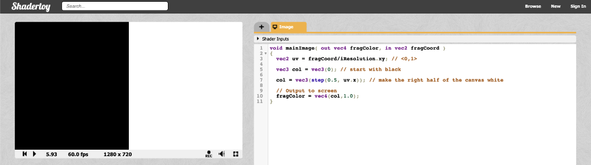
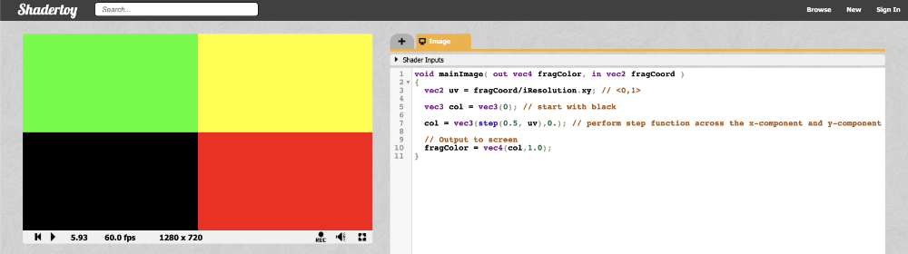

# 2.1 先来一个小练习

在绘制第一个 2D 形状之前，让我们对 Shadertoy 进行更多练习。创建一个新着色器并将起始代码替换为以下内容：
```cpp
void mainImage( out vec4 fragColor, in vec2 fragCoord )
{
  vec2 uv = fragCoord/iResolution.xy; // <0,1>

  vec3 col = vec3(0); // start with black

  if (uv.x > .5) col = vec3(1); // make the right half of the canvas white

  // Output to screen
  fragColor = vec4(col,1.0);
}
```
由于我们的着色器在所有像素上并行运行，因此我们必须依靠 **if 语句**根据像素在屏幕上的位置绘制不同的颜色。根据您的显卡和用于着色器代码的编译器，使用内置函数（如 **step**）的性能可能会更高。

让我们看一下相同的示例，但改用 step 函数：
```cpp
void mainImage( out vec4 fragColor, in vec2 fragCoord )
{
  vec2 uv = fragCoord/iResolution.xy; // <0,1>

  vec3 col = vec3(0); // start with black

  col = vec3(step(0.5, uv.x)); // make the right half of the canvas white

  // Output to screen
  fragColor = vec4(col,1.0);
}
```

画布的左半部分将是黑色的，画布的右半部分将是白色的。
<p align="center"></p>
**step函数**接受两个输入：阶跃函数的边和用于生成阶跃函数的值。如果 function 参数中的第二个参数大于第一个参数，则返回值 1。否则，返回值 0。

你也可以对向量中的每个分量执行 step 函数：

```cpp
void mainImage( out vec4 fragColor, in vec2 fragCoord )
{
  vec2 uv = fragCoord/iResolution.xy; // <0,1>

  vec3 col = vec3(0); // start with black

  col = vec3(step(0.5, uv), 0); // perform step function across the x-component and y-component of uv

  // Output to screen
  fragColor = vec4(col,1.0);
}
```

由于 step 函数同时对画布的 X 组件和 Y 组件进行操作，因此应该会看到画布被拆分为四种颜色。
<p align="center"></p>
