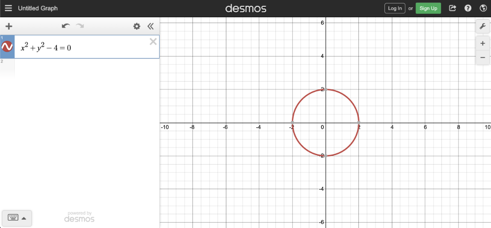
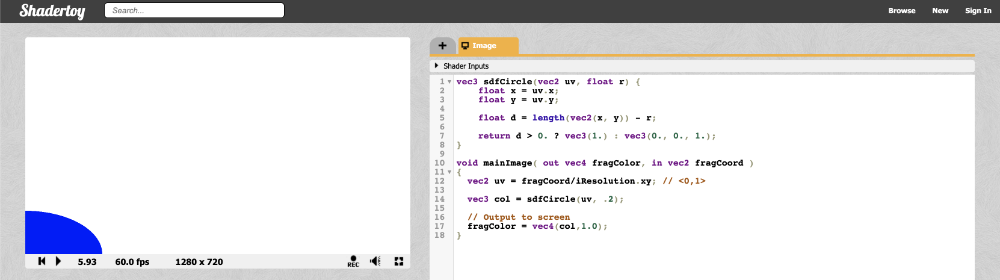
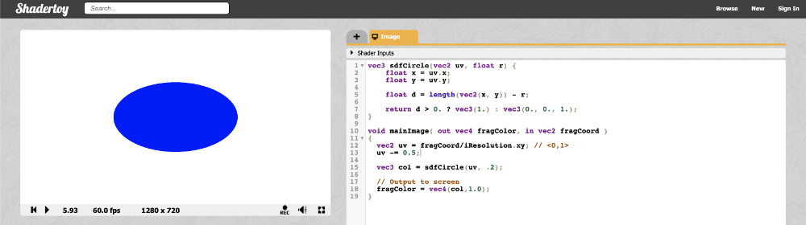
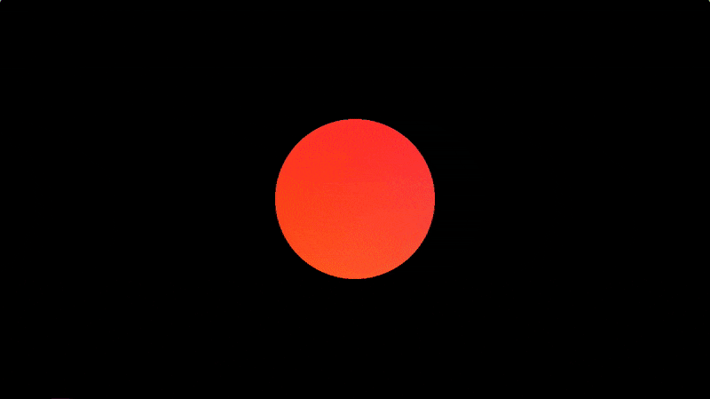

# 2.2 如何画一个圆
圆的方程由以下定义：
```cpp
x^2 + y^2 = r^2

x = x-coordinate on graph
y = y-coordinate on graph
r = radius of circle
```
我们可以重新排列变量，使方程等于零：
```cpp
x^2 + y^2 - r^2 = 0
```
要在图表上可视化这一点，您可以使用 [**Desmos calculator**](https://www.desmos.com/calculator)绘制以下内容：
```
x^2 + y^2 - 4 = 0
```
如果复制上述代码段并将其粘贴到 **Desmos calculator=** 中，那么您应该会看到一个半径为 2 的圆的图形。圆心位于坐标 (0, 0) 处。
<p align="center"></p>

在 Shadertoy 中，我们可以使用这个方程的左侧 （LHS） 来画一个圆。让我们创建一个名为 sdfCircle 的函数，该函数返回 XY 坐标处每个像素的颜色 white，以便方程大于 0，否则返回颜色 blue。

该函数的 **sdf** 部分引用了一个称为**有符号距离函数 （SDF）** 的概念，也称为有符号距离场。在 3D 中绘制时，使用 SDF 更为常见，但我也会将这个术语用于 2D 形状。

我们将在 mainImage 函数中调用新函数来使用它。
```cpp
vec3 sdfCircle(vec2 uv, float r) {
    float x = uv.x;
    float y = uv.y;

    float d = length(vec2(x, y)) - r;

    return d > 0. ? vec3(1.) : vec3(0., 0., 1.);
}

void mainImage( out vec4 fragColor, in vec2 fragCoord )
{
  vec2 uv = fragCoord/iResolution.xy; // <0,1>

  vec3 col = sdfCircle(uv, .2); // Call this function on each pixel to check if the coordinate lies inside or outside of the circle

  // Output to screen
  fragColor = vec4(col,1.0);
}
```

如果你想知道我为什么使用 `0.` 而不是简单地用 `0` 来代替**没有小数点的 0**，这是因为在整数的末尾添加一个小数会使它成为 float 而不是 int 的类型。当您使用需要 float 类型数字的函数时，将小数放在整数的末尾是满足编译器要求的最简单方法。

我们使用的半径为 0.2，因为我们的坐标系设置为仅具有介于 0 和 1 之间的 UV 值。当你运行代码时，会注意到似乎有些错误。
<p align="center"></p>

画布的左下角似乎有四分之一的蓝色的圆。为什么？因为我们的坐标系当前设置为原点在左下角。我们需要将每个值移动 0.5 以获得画布中心坐标系的原点。

从 UV 坐标中减去 0.5：
```cpp
vec2 uv = fragCoord/iResolution.xy; // <0,1>
uv -= 0.5; // <-0.5, 0.5>
```

现在，x 轴和 y 轴的范围都介于 -0.5 和 0.5 之间，这意味着坐标系的原点位于画布的中心。然而，我们面临另一个问题......
<p align="center"></p>

我们的圆看起来有点拉长，所以它看起来更像一个椭圆。这是由画布的纵横比引起的。当画布的宽度和高度不匹配时，圆圈将显示为拉伸。我们可以通过将 UV 坐标的 X 分量乘以画布的纵横比来解决此问题。
```cpp
vec2 uv = fragCoord/iResolution.xy; // <0,1>
uv -= 0.5; // <-0.5, 0.5>
uv.x *= iResolution.x/iResolution.y; // fix aspect ratio
```
这意味着 X 分量不再介于 -0.5 和 0.5 之间。它将在与画布的纵横比成比例的值之间移动，而纵横比将由浏览器或网页的宽度决定（如果您使用 Chrome DevTools 之类的工具来更改宽度）。

你完成的代码应如下所示：
```cpp
vec3 sdfCircle(vec2 uv, float r) {
  float x = uv.x;
  float y = uv.y;

  float d = length(vec2(x, y)) - r;

  return d > 0. ? vec3(1.) : vec3(0., 0., 1.);
}

void mainImage( out vec4 fragColor, in vec2 fragCoord )
{
  vec2 uv = fragCoord/iResolution.xy; // <0,1>
  uv -= 0.5;
  uv.x *= iResolution.x/iResolution.y; // fix aspect ratio

  vec3 col = sdfCircle(uv, .2);

  // Output to screen
  fragColor = vec4(col,1.0);
}
```
运行代码后，您应该会看到一个完美比例的蓝色圆圈！🎉
:::tip tip
请注意，这只是给圆圈着色的一种方式。我们将在本教程系列的第 4 部分中学习另一种方法。它将帮助我们在画布上绘制多个形状。
:::

我们可以从中获得一些乐趣！我们可以使用全局 iTime 变量来随时间更改颜色。通过使用余弦 （cos） 函数，我们可以一遍又一遍地循环显示同一组颜色。由于余弦函数在值 -1 和 1 之间振荡，因此我们需要将此范围调整为 0 到 1 之间的值。

请记住，最终片段颜色中任何小于零的颜色值都将自动固定为零。同样，任何大于 1 的颜色值都将被限制为 1。通过调整范围，我们可以获得更广泛的颜色范围。
```cpp
vec3 sdfCircle(vec2 uv, float r) {
  float x = uv.x;
  float y = uv.y;

  float d = length(vec2(x, y)) - r;

  return d > 0. ? vec3(0.) : 0.5 + 0.5 * cos(iTime + uv.xyx + vec3(0,2,4));
}

void mainImage( out vec4 fragColor, in vec2 fragCoord )
{
  vec2 uv = fragCoord/iResolution.xy; // <0,1>
  uv -= 0.5;
  uv.x *= iResolution.x/iResolution.y; // fix aspect ratio

  vec3 col = sdfCircle(uv, .2);

  // Output to screen
  fragColor = vec4(col,1.0);
}
```
运行代码后，您应该会看到圆圈在各种颜色之间发生变化。
<p align="center"></p>

您可能会对 uv.xyx 中的语法感到困惑。这称为 **Swizzling**。我们可以使用变量的分量创建新的向量。让我们看一个例子。
```cpp
vec3 col = vec3(0.2, 0.4, 0.6);
vec3 col2 = col.xyx;
vec3 col3 = vec3(0.2, 0.4, 0.2);
```
在上面的代码片段中，col2 和 col3 的值是相同的。