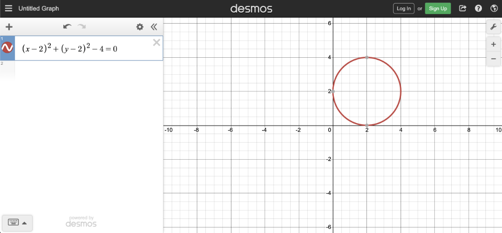
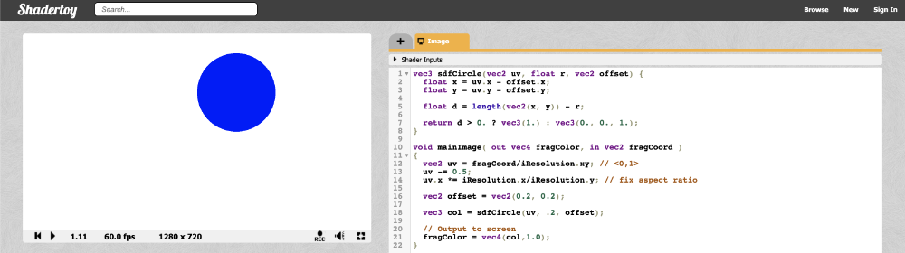
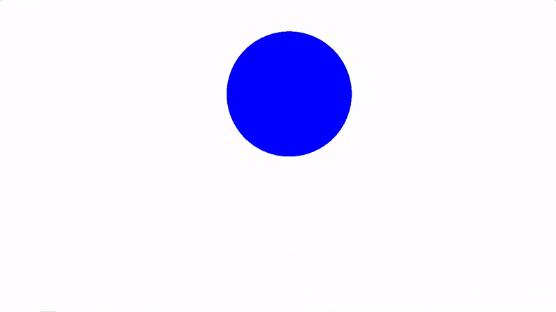

# 2.3 移动圆圈
要移动圆，我们需要对圆方程内的 XY 坐标应用偏移。因此，我们的方程将如下所示：
```cpp
(x - offsetX)^2 + (y - offsetY)^2 - r^2 = 0

x = x-coordinate on graph
y = y-coordinate on graph
r = radius of circle
offsetX = how much to move the center of the circle in the x-axis
offsetY = how much to move the center of the circle in the y-axis
```
你可以通过复制和粘贴以下代码来再次在 [**Desmos calculator**](https://www.desmos.com/calculator) 中进行实验：
```
(x - 2)^2 + (y - 2)^2 - 4 = 0
```
<p align="center"></p>

在 Shadertoy 中，我们可以调整 sdfCircle 函数以允许偏移，然后将圆心移动 0.2。
```cpp
vec3 sdfCircle(vec2 uv, float r, vec2 offset) {
  float x = uv.x - offset.x;
  float y = uv.y - offset.y;

  float d = length(vec2(x, y)) - r;

  return d > 0. ? vec3(1.) : vec3(0., 0., 1.);
}

void mainImage( out vec4 fragColor, in vec2 fragCoord )
{
  vec2 uv = fragCoord/iResolution.xy; // <0,1>
  uv -= 0.5;
  uv.x *= iResolution.x/iResolution.y; // fix aspect ratio

  vec2 offset = vec2(0.2, 0.2); // move the circle 0.2 units to the right and 0.2 units up

  vec3 col = sdfCircle(uv, .2, offset);

  // Output to screen
  fragColor = vec4(col,1.0);
}
```
<p align="center"></p>
你可以再次在某些位置使用全局 **iTime** 变量，为你的画布赋予生命并为你的圆圈添加动画。
```cpp
vec3 sdfCircle(vec2 uv, float r, vec2 offset) {
  float x = uv.x - offset.x;
  float y = uv.y - offset.y;

  float d = length(vec2(x, y)) - r;

  return d > 0. ? vec3(1.) : vec3(0., 0., 1.);
}

void mainImage( out vec4 fragColor, in vec2 fragCoord )
{
  vec2 uv = fragCoord/iResolution.xy; // <0,1>
  uv -= 0.5;
  uv.x *= iResolution.x/iResolution.y; // fix aspect ratio

  vec2 offset = vec2(sin(iTime*2.)*0.2, cos(iTime*2.)*0.2); // move the circle clockwise

  vec3 col = sdfCircle(uv, .2, offset);

  // Output to screen
  fragColor = vec4(col,1.0);
}
```
上面的代码将沿顺时针方向的圆形路径移动圆，就像它绕原点旋转一样。通过将 **iTime** 乘以一个值，可以加快动画制作速度。通过将正弦或余弦函数的输出乘以一个值，可以控制圆从画布中心移动的距离。你将在 **iTime** 中大量使用正弦和余弦函数，因为它们会产生振荡。

<p align="center"></p>
