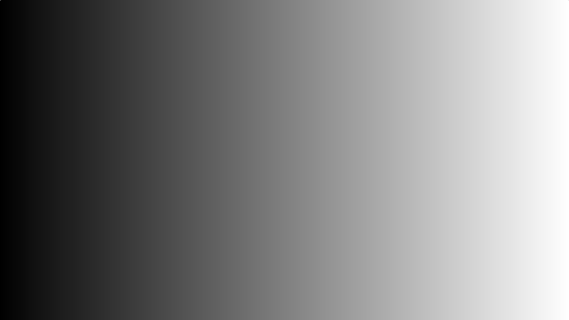
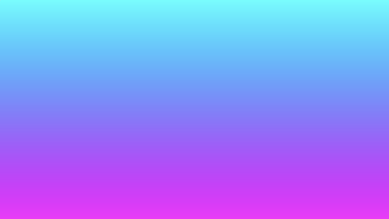

# 4.1 Mix 函数
我们先看一下 [**mix**](https://www.khronos.org/registry/OpenGL-Refpages/gl4/html/mix.xhtml) 函数。当我们将多个 2D 形状渲染到场景中时，此功能对我们来说特别有用。

**mix** 函数在两个值之间线性插值。在其他着色器语言（如 [**HLSL**](https://en.wikipedia.org/wiki/High-Level_Shading_Language)）中，此函数称为 [**lerp**](https://docs.microsoft.com/en-us/windows/win32/direct3dhlsl/dx-graphics-hlsl-lerp)。

函数 mix(x, y, a) 的线性插值基于以下公式：
```
x * (1 - a) + y * a

x = first value
y = second value
a = value that linearly interpolates between x and y
```
将第三个参数 a 视为一个滑块，用于选择 x 和 y 之间的值。

你将看到着色器中大量使用的 mix 函数。这是创建颜色渐变的好方法。让我们看一个例子：
```cpp
void mainImage( out vec4 fragColor, in vec2 fragCoord )
{
    vec2 uv = fragCoord/iResolution.xy; // <0, 1>

    float interpolatedValue = mix(0., 1., uv.x);
    vec3 col = vec3(interpolatedValue);

    // Output to screen
    fragColor = vec4(col,1.0);
}
```

在上面的代码中，我们使用 mix 函数来获取屏幕上跨 x 轴的每个像素的插值。通过在红色、绿色和蓝色通道中使用相同的值，我们得到了一个从黑色到白色的渐变，中间有灰色阴影。

<p align="center"></p>

我们还可以沿 y 轴使用 mix 函数：
```cpp
float interpolatedValue = mix(0., 1., uv.y);
```
<p align="center"></p>

利用这些知识，我们可以在像素着色器中创建彩色渐变。我们来定义一个专门用于设置画布背景颜色的函数。
```cpp
vec3 getBackgroundColor(vec2 uv) {
    uv += 0.5; // remap uv from <-0.5,0.5> to <0,1>
    vec3 gradientStartColor = vec3(1., 0., 1.);
    vec3 gradientEndColor = vec3(0., 1., 1.);
    return mix(gradientStartColor, gradientEndColor, uv.y); // gradient goes from bottom to top
}

void mainImage( out vec4 fragColor, in vec2 fragCoord )
{
    vec2 uv = fragCoord/iResolution.xy; // <0, 1>
    uv -= 0.5; // <-0.5,0.5>
    uv.x *= iResolution.x/iResolution.y; // fix aspect ratio

    vec3 col = getBackgroundColor(uv);

    // Output to screen
    fragColor = vec4(col,1.0);
}
```
这将产生一个介于紫色和青色阴影之间的冷渐变。
<p align="center"></p>

当对 vector 使用 mix 函数时，它将使用第三个参数在分量基础上对每个 vector 进行插值。它将通过 gradientStartColor 向量的红色分量（或 x 分量）和 gradientEndColor 向量的红色分量的插值器函数运行。相同的策略将应用于每个向量的绿色 （y 分量） 和蓝色 （z 分量） 通道。

我们将 uv 的值增加了 0.5，因为在大多数情况下，我们将使用介于负数和正数之间的 uv 值。如果我们将负值传递给最终的 fragColor，那么它将被固定为零。我们将范围从负值移开，以便在整个范围内显示颜色。

