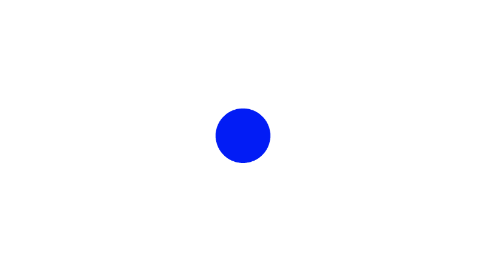
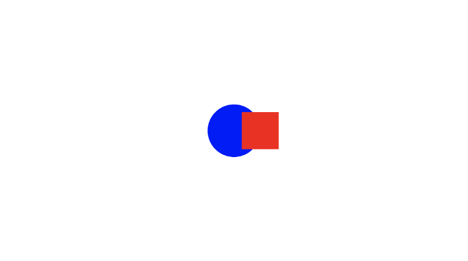

# 4.2 绘制 2D 形状的另一方法
在前面的教程中，我们学习了如何使用 2D SDF 创建 2D 形状，例如圆形和方形。但是，sdfCircle 和 sdfSquare 函数以 vec3 向量的形式返回颜色。

通常，SDF 返回 float 值，而不是 vec3 值。请记住，**SDF** 是 **signed distance fields** 的首字母缩写词。因此，我们希望它们返回 float 类型的 distance。在 3D SDF 中，这通常是正确的，但在 2D SDF 中，我发现根据像素是位于形状内部还是外部，返回 1 或 0 更有用，我们稍后将看到。

该距离是相对于某个点（通常是形状的中心）的。如果圆的中心位于原点 （0， 0），那么我们知道圆边缘上的任何点都等于圆的半径，因此方程式为：

```
x^2 + y^2 = r^2

Or, when rearranged,
x^2 + y^2 - r^2 = 0

where x^2 + y^2 - r^2 = distance = d
```

如果距离大于零，则我们知道我们在圆之外。如果距离小于零，则我们在圆内。如果距离正好等于零，那么我们就在圆的边缘。这就是 **signed distance field** 的 **signed** 部分发挥作用的地方。距离可以是负数或正数，具体取决于像素坐标是在形状内部还是外部。

在本系列教程的[**第 2 部分**](/circles-anmiation/how-to-draw-circle)中，我们使用以下代码绘制了一个蓝色圆圈：
```cpp
vec3 sdfCircle(vec2 uv, float r) {
  float x = uv.x;
  float y = uv.y;

  float d = length(vec2(x, y)) - r;

  return d > 0. ? vec3(1.) : vec3(0., 0., 1.);
  // draw background color if outside the shape
  // draw circle color if inside the shape
}

void mainImage( out vec4 fragColor, in vec2 fragCoord )
{
  vec2 uv = fragCoord/iResolution.xy; // <0,1>
  uv -= 0.5;
  uv.x *= iResolution.x/iResolution.y; // fix aspect ratio

  vec3 col = sdfCircle(uv, .2);

  // Output to screen
  fragColor = vec4(col,1.0);
}
```

这种方法的问题在于，我们被迫绘制一个颜色为 blue 的圆圈和一个颜色为 white 的背景。

我们需要使代码更抽象一些，这样我们就可以彼此独立地绘制背景和形状颜色。这将允许我们在场景中绘制多个形状，并为每个形状和背景选择我们想要的任何颜色。

让我们看看绘制蓝色圆圈的另一种方法：
```cpp
float sdfCircle(vec2 uv, float r, vec2 offset) {
  float x = uv.x - offset.x;
  float y = uv.y - offset.y;

  return length(vec2(x, y)) - r;
}

vec3 drawScene(vec2 uv) {
  vec3 col = vec3(1);
  float circle = sdfCircle(uv, 0.1, vec2(0, 0));

  col = mix(vec3(0, 0, 1), col, step(0., circle));

  return col;
}

void mainImage( out vec4 fragColor, in vec2 fragCoord )
{
  vec2 uv = fragCoord/iResolution.xy; // <0, 1>
  uv -= 0.5; // <-0.5,0.5>
  uv.x *= iResolution.x/iResolution.y; // fix aspect ratio

  vec3 col = drawScene(uv);

  // Output to screen
  fragColor = vec4(col,1.0);
}
```
在上面的代码中，我们现在抽象出一些东西。我们有一个负责渲染场景的 **drawScene** 函数，**sdfCircle** 现在返回一个浮点数，该浮点数表示屏幕上的像素与圆上的点之间的**有符号距离**。

我们在 [**第 2 部分**](/circles-anmiation/practice) 中了解了 step 函数。它返回值 1 或 0，具体取决于第二个参数的值。实际上，以下内容是等效的：
```cpp
float result = step(0., circle);
float result = circle > 0. ? 1. : 0.;
```

如果 **signed distance** 值大于零，则表示该点位于圆内。如果该值小于或等于零，则表示该点位于圆的外部或边缘。

在 drawScene 函数中，我们使用 mix 函数将白色背景色与蓝色混合。circle 的值将决定像素是白色（背景）还是蓝色（圆圈）。从这个意义上说，我们可以将 mix 函数用作 “切换”，它将根据第三个参数的值在形状颜色或背景颜色之间切换。

<p align="center"></p>

以这种方式使用 SDF 基本上可以让我们仅在像素位于形状内的坐标时绘制形状。否则，它应该绘制之前的颜色。

让我们添加一个稍微偏离中心的正方形。
```cpp
float sdfCircle(vec2 uv, float r, vec2 offset) {
  float x = uv.x - offset.x;
  float y = uv.y - offset.y;

  return length(vec2(x, y)) - r;
}

float sdfSquare(vec2 uv, float size, vec2 offset) {
  float x = uv.x - offset.x;
  float y = uv.y - offset.y;

  return max(abs(x), abs(y)) - size;
}

vec3 drawScene(vec2 uv) {
  vec3 col = vec3(1);
  float circle = sdfCircle(uv, 0.1, vec2(0, 0));
  float square = sdfSquare(uv, 0.07, vec2(0.1, 0));

  col = mix(vec3(0, 0, 1), col, step(0., circle));
  col = mix(vec3(1, 0, 0), col, step(0., square));

  return col;
}

void mainImage( out vec4 fragColor, in vec2 fragCoord )
{
  vec2 uv = fragCoord/iResolution.xy; // <0, 1>
  uv -= 0.5; // <-0.5,0.5>
  uv.x *= iResolution.x/iResolution.y; // fix aspect ratio

  vec3 col = drawScene(uv);

  // Output to screen
  fragColor = vec4(col,1.0);
}
```

将 **mix** 函数与这种方法结合使用，可以轻松地将多个 2D 形状渲染到场景中！
<p align="center"></p>