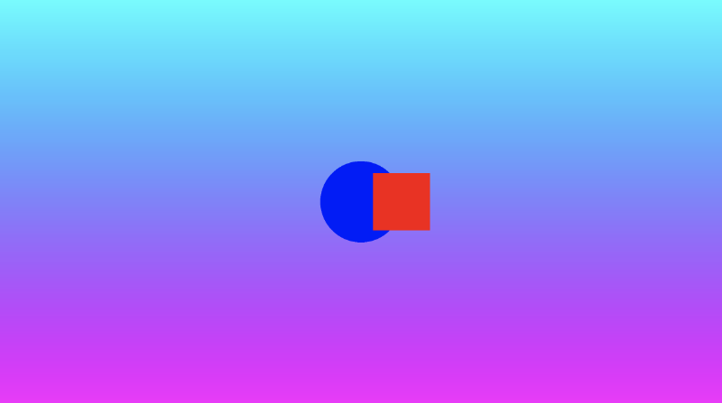

# 4.3 自定义背景和绘制多个形状
凭借我们学到的知识，我们可以轻松自定义背景，同时保持形状的颜色不变。让我们添加一个函数，该函数返回背景的渐变颜色，并在 drawScene 函数的顶部使用它。
```cpp
vec3 getBackgroundColor(vec2 uv) {
    uv += 0.5; // remap uv from <-0.5,0.5> to <0,1>
    vec3 gradientStartColor = vec3(1., 0., 1.);
    vec3 gradientEndColor = vec3(0., 1., 1.);
    return mix(gradientStartColor, gradientEndColor, uv.y); // gradient goes from bottom to top
}

float sdfCircle(vec2 uv, float r, vec2 offset) {
  float x = uv.x - offset.x;
  float y = uv.y - offset.y;

  return length(vec2(x, y)) - r;
}

float sdfSquare(vec2 uv, float size, vec2 offset) {
  float x = uv.x - offset.x;
  float y = uv.y - offset.y;
  return max(abs(x), abs(y)) - size;
}

vec3 drawScene(vec2 uv) {
  vec3 col = getBackgroundColor(uv);
  float circle = sdfCircle(uv, 0.1, vec2(0, 0));
  float square = sdfSquare(uv, 0.07, vec2(0.1, 0));

  col = mix(vec3(0, 0, 1), col, step(0., circle));
  col = mix(vec3(1, 0, 0), col, step(0., square));

  return col;
}

void mainImage( out vec4 fragColor, in vec2 fragCoord )
{
  vec2 uv = fragCoord/iResolution.xy; // <0, 1>
  uv -= 0.5; // <-0.5,0.5>
  uv.x *= iResolution.x/iResolution.y; // fix aspect ratio

  vec3 col = drawScene(uv);

  // Output to screen
  fragColor = vec4(col,1.0);
}
```

Simply stunning! 🤩  简直令人惊叹！🤩
<p align="center"></p>

这件抽象的数字艺术作为[P**不可替代的代币(NFT)**](https://en.wikipedia.org/wiki/Non-fungible_token)🤔会赚很多钱吗？可能不会，但人们可以希望😅。

# 结论  
在本课程中，我们创作了一件精美的数字艺术作品。我们学习了如何使用 mix 函数创建颜色渐变，以及如何使用它来渲染形状，这些形状彼此重叠或在背景图层之上呈现。在下一课中，我将讨论我们可以绘制的其他 2D 形状，例如心形和星星。