# 5.1 2D SDF 操作
在前面的教程中，我们已经了解了如何绘制原始 2D 形状（如圆形和正方形），我们可以使用 2D SDF 操作通过将原始形状组合在一起来创建更复杂的形状。

## 组合操作
让我们从 2D 形状的一些简单样板代码开始：

```cpp
vec3 getBackgroundColor(vec2 uv) {
  uv = uv * 0.5 + 0.5; // remap uv from <-0.5,0.5> to <0.25,0.75>
  vec3 gradientStartColor = vec3(1., 0., 1.);
  vec3 gradientEndColor = vec3(0., 1., 1.);
  return mix(gradientStartColor, gradientEndColor, uv.y); // gradient goes from bottom to top
}

float sdCircle(vec2 uv, float r, vec2 offset) {
  float x = uv.x - offset.x;
  float y = uv.y - offset.y;

  return length(vec2(x, y)) - r;
}

float sdSquare(vec2 uv, float size, vec2 offset) {
  float x = uv.x - offset.x;
  float y = uv.y - offset.y;

  return max(abs(x), abs(y)) - size;
}

vec3 drawScene(vec2 uv) {
  vec3 col = getBackgroundColor(uv);
  float d1 = sdCircle(uv, 0.1, vec2(0., 0.));
  float d2 = sdSquare(uv, 0.1, vec2(0.1, 0));

  float res; // result
  res = d1;

  res = step(0., res); // Same as res > 0. ? 1. : 0.;

  col = mix(vec3(1,0,0), col, res);
  return col;
}

void mainImage( out vec4 fragColor, in vec2 fragCoord )
{
  vec2 uv = fragCoord/iResolution.xy; // <0, 1>
  uv -= 0.5; // <-0.5,0.5>
  uv.x *= iResolution.x/iResolution.y; // fix aspect ratio

  vec3 col = drawScene(uv);

  fragColor = vec4(col,1.0); // Output to screen
}
```
请注意我现在是如何使用 **sdCircle** 而不是 **sdfCircle**（在前面的教程中使用）作为函数名称的。**Inigo Quilez** 的网站通常在形状名称前面使用 **sd**，但我使用 **sdf** 来帮助清楚地表明这些是**有符号距离字段 （SDF）**。

当您运行代码时，您应该会看到一个带有渐变背景色的红色圆圈，类似于我们在上一个教程中学到的内容。
<p align="center">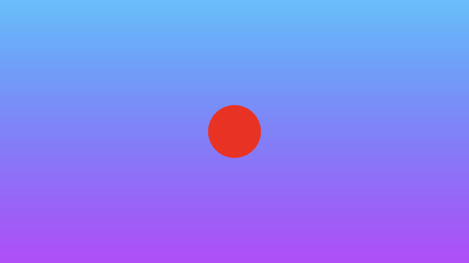</p>

注意我们在哪些地方使用 mix 函数：
```cpp
col = mix(vec3(1,0,0), col, res);
```
这行表示获取结果，并根据 res 的值（结果）选择颜色 red 或 col 的值（当前是背景颜色）。

现在，让我们讨论可以执行的各种 SDF 操作。我们将研究圆和正方形之间的交互。

**联合(Union)**：将两个形状组合在一起。

```cpp
vec3 drawScene(vec2 uv) {
  vec3 col = getBackgroundColor(uv);
  float d1 = sdCircle(uv, 0.1, vec2(0., 0.));
  float d2 = sdSquare(uv, 0.1, vec2(0.1, 0));

  float res; // result
  res = min(d1, d2); // union

  res = step(0., res); // Same as res > 0. ? 1. : 0.;

  col = mix(vec3(1,0,0), col, res);
  return col;
}
```
<p align="center">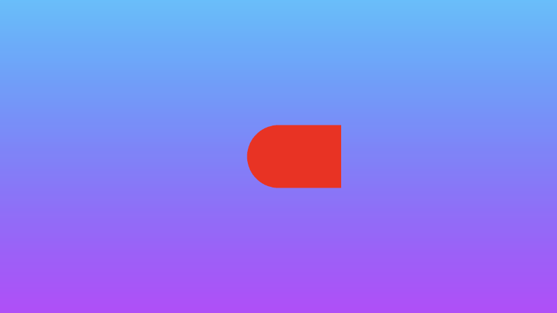</p>

**相交(Intersection)**：仅取两个形状相交的部分。
```cpp
vec3 drawScene(vec2 uv) {
  vec3 col = getBackgroundColor(uv);
  float d1 = sdCircle(uv, 0.1, vec2(0., 0.));
  float d2 = sdSquare(uv, 0.1, vec2(0.1, 0));

  float res; // result
  res = max(d1, d2); // intersection

  res = step(0., res); // Same as res > 0. ? 1. : 0.;

  col = mix(vec3(1,0,0), col, res);
  return col;
}
```
<p align="center">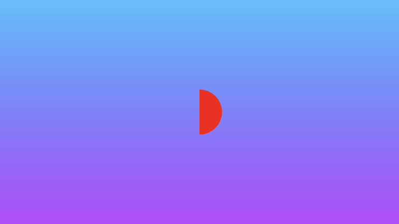</p>

**减法(Subtraction)**：从 d2 中减去 d1。

```cpp
vec3 drawScene(vec2 uv) {
  vec3 col = getBackgroundColor(uv);
  float d1 = sdCircle(uv, 0.1, vec2(0., 0.));
  float d2 = sdSquare(uv, 0.1, vec2(0.1, 0));

  float res; // result
  res = max(-d1, d2); // subtraction - subtract d1 from d2

  res = step(0., res); // Same as res > 0. ? 1. : 0.;

  col = mix(vec3(1,0,0), col, res);
  return col;
}
```
<p align="center">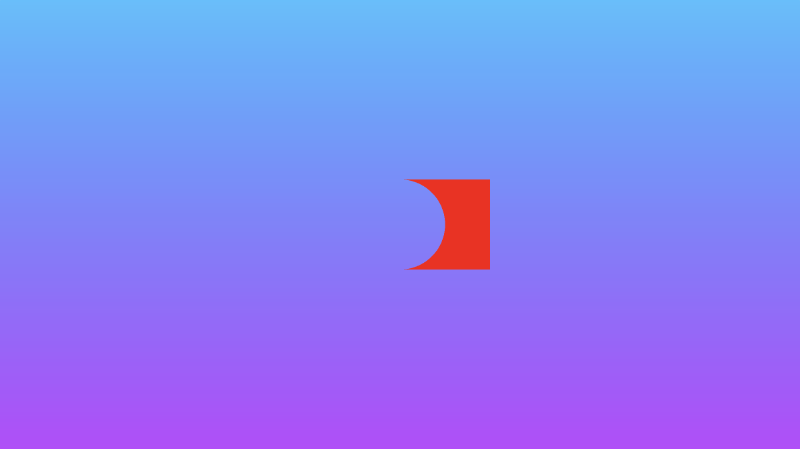</p>

**减法(Subtraction)**：从 d1 中减去 d2。
```cpp
vec3 drawScene(vec2 uv) {
  vec3 col = getBackgroundColor(uv);
  float d1 = sdCircle(uv, 0.1, vec2(0., 0.));
  float d2 = sdSquare(uv, 0.1, vec2(0.1, 0));

  float res; // result
  res = max(d1, -d2); // subtraction - subtract d2 from d1

  res = step(0., res); // Same as res > 0. ? 1. : 0.;

  col = mix(vec3(1,0,0), col, res);
  return col;
}
```
<p align="center">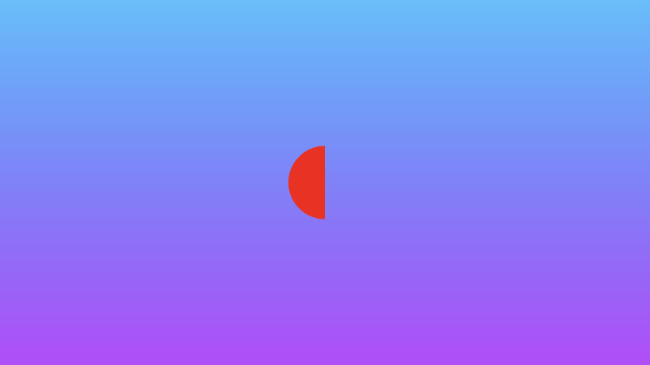</p>

**XOR**：独占的 “OR” 运算将获取两个形状中彼此不相交的部分。
```cpp
vec3 drawScene(vec2 uv) {
  vec3 col = getBackgroundColor(uv);
  float d1 = sdCircle(uv, 0.1, vec2(0., 0.));
  float d2 = sdSquare(uv, 0.1, vec2(0.1, 0));

  float res; // result
  res = max(min(d1, d2), -max(d1, d2)); // xor

  res = step(0., res); // Same as res > 0. ? 1. : 0.;

  col = mix(vec3(1,0,0), col, res);
  return col;
}
```
<p align="center">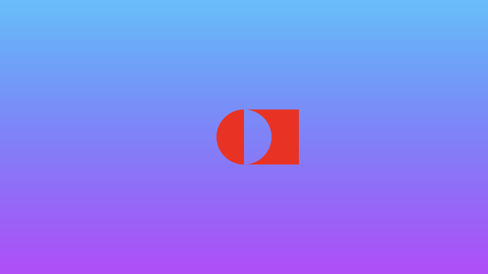</p>

我们还可以创建“平滑”的 2D SDF 操作，以平滑地混合形状相交处周围的边缘。当我讨论 3D 形状时，您会发现这些操作更适用，但它们也适用于 2D！

将以下函数添加到代码顶部：

```cpp
// smooth min
float smin(float a, float b, float k) {
  float h = clamp(0.5+0.5*(b-a)/k, 0.0, 1.0);
  return mix(b, a, h) - k*h*(1.0-h);
}

// smooth max
float smax(float a, float b, float k) {
  return -smin(-a, -b, k);
}
```
平滑并集：将两个形状组合在一起，但平滑地混合它们相交的边缘。

```cpp
vec3 drawScene(vec2 uv) {
  vec3 col = getBackgroundColor(uv);
  float d1 = sdCircle(uv, 0.1, vec2(0., 0.));
  float d2 = sdSquare(uv, 0.1, vec2(0.1, 0));

  float res; // result
  res = smin(d1, d2, 0.05); // smooth union

  res = step(0., res); // Same as res > 0. ? 1. : 0.;

  col = mix(vec3(1,0,0), col, res);
  return col;
}
```
<p align="center">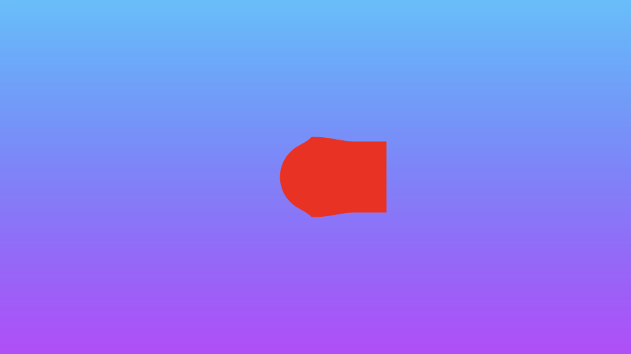</p>

平滑交集：只取两个形状相交处的两个部分，但平滑混合它们相交处的边缘。
```cpp
vec3 drawScene(vec2 uv) {
  vec3 col = getBackgroundColor(uv);
  float d1 = sdCircle(uv, 0.1, vec2(0., 0.));
  float d2 = sdSquare(uv, 0.1, vec2(0.1, 0));

  float res; // result
  res = smax(d1, d2, 0.05); // smooth intersection

  res = step(0., res); // Same as res > 0. ? 1. : 0.;

  col = mix(vec3(1,0,0), col, res);
  return col;
}
```
<p align="center">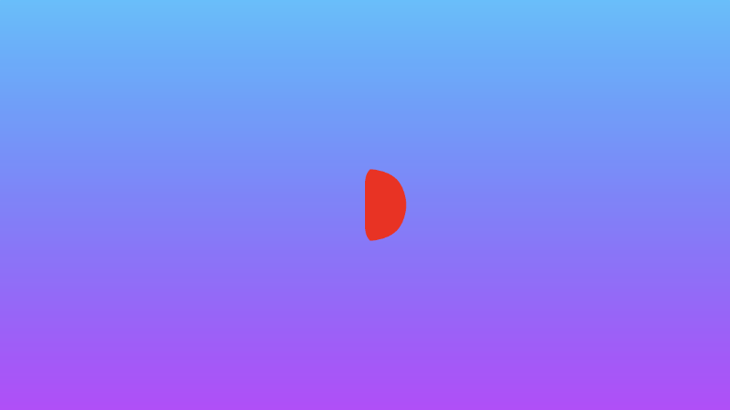</p>

您可以在下面找到完成的代码。取消注释掉要查看的任何组合 2D SDF 操作的行。

```cpp
// smooth min
float smin(float a, float b, float k) {
  float h = clamp(0.5+0.5*(b-a)/k, 0.0, 1.0);
  return mix(b, a, h) - k*h*(1.0-h);
}

// smooth max
float smax(float a, float b, float k) {
  return -smin(-a, -b, k);
}

vec3 getBackgroundColor(vec2 uv) {
  uv = uv * 0.5 + 0.5; // remap uv from <-0.5,0.5> to <0.25,0.75>
  vec3 gradientStartColor = vec3(1., 0., 1.);
  vec3 gradientEndColor = vec3(0., 1., 1.);
  return mix(gradientStartColor, gradientEndColor, uv.y); // gradient goes from bottom to top
}

float sdCircle(vec2 uv, float r, vec2 offset) {
  float x = uv.x - offset.x;
  float y = uv.y - offset.y;

  return length(vec2(x, y)) - r;
}

float sdSquare(vec2 uv, float size, vec2 offset) {
  float x = uv.x - offset.x;
  float y = uv.y - offset.y;

  return max(abs(x), abs(y)) - size;
}

vec3 drawScene(vec2 uv) {
  vec3 col = getBackgroundColor(uv);
  float d1 = sdCircle(uv, 0.1, vec2(0., 0.));
  float d2 = sdSquare(uv, 0.1, vec2(0.1, 0));

  float res; // result
  res = d1;
  //res = d2;
  //res = min(d1, d2); // union
  //res = max(d1, d2); // intersection
  //res = max(-d1, d2); // subtraction - subtract d1 from d2
  //res = max(d1, -d2); // subtraction - subtract d2 from d1
  //res = max(min(d1, d2), -max(d1, d2)); // xor
  //res = smin(d1, d2, 0.05); // smooth union
  //res = smax(d1, d2, 0.05); // smooth intersection

  res = step(0., res); // Same as res > 0. ? 1. : 0.;

  col = mix(vec3(1,0,0), col, res);
  return col;
}

void mainImage( out vec4 fragColor, in vec2 fragCoord )
{
  vec2 uv = fragCoord/iResolution.xy; // <0, 1>
  uv -= 0.5; // <-0.5,0.5>
  uv.x *= iResolution.x/iResolution.y; // fix aspect ratio

  vec3 col = drawScene(uv);

  fragColor = vec4(col,1.0); // Output to screen
}
```

## 操作位置 2D SDF 
[**Inigo Quilez 的 3D SDF 页面**](https://www.iquilezles.org/www/articles/distfunctions/distfunctions.htm)介绍了一组位置 3D SDF 操作，但我们也可以在 2D 中使用这些操作。我将在后面的**第 14 部分**中讨论 3D SDF 操作。在本教程中，我将介绍位置 2D SDF 操作，这些操作可以帮助我们在绘制 2D 形状时节省时间并提高性能。

如果要绘制对称场景，则使用 opSymX 操作可能很有用。此操作将使用您提供的 SDF 沿 x 轴创建重复的 2D 形状。如果我们在 vec2(0.2, 0) 的偏移量处绘制一个圆，那么将在 vec2(-0.2,0) 处绘制一个等效的圆。

```cpp
float opSymX(vec2 p, float r)
{
  p.x = abs(p.x);
  return sdCircle(p, r, vec2(0.2, 0));
}

vec3 drawScene(vec2 uv) {
  vec3 col = getBackgroundColor(uv);

  float res; // result
  res = opSymX(uv, 0.1);

  res = step(0., res);
  col = mix(vec3(1,0,0), col, res);
  return col;
}
```
<p align="center">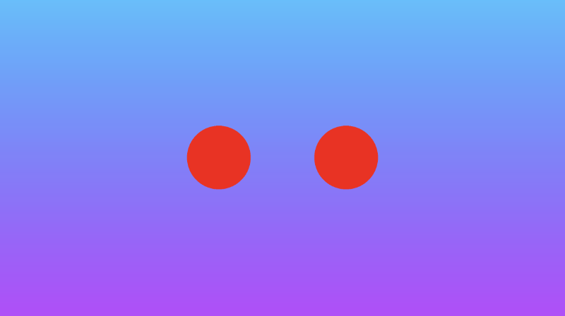</p>
我们也可以沿 y 轴执行类似的操作。使用 opSymY 操作，如果我们在 vec2(0, 0.2) 的偏移量处绘制一个圆，那么将在 vec2(0, -0.2) 处绘制一个等效的圆。

```cpp
float opSymY(vec2 p, float r)
{
  p.y = abs(p.y);
  return sdCircle(p, r, vec2(0, 0.2));
}

vec3 drawScene(vec2 uv) {
  vec3 col = getBackgroundColor(uv);

  float res; // result
  res = opSymY(uv, 0.1);

  res = step(0., res);
  col = mix(vec3(1,0,0), col, res);
  return col;
}
```
<p align="center">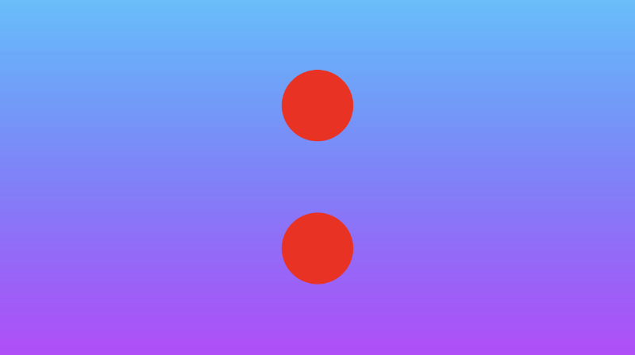</p>

如果要沿两个轴绘制圆，而不仅仅是一个轴，则可以使用 opSymXY 操作。这将沿 x 轴和 y 轴创建副本，从而生成四个圆。如果我们绘制一个偏移量为 vec2(0.2, 0) 的圆，那么将在 vec2(0.2, 0.2)、vec2(0.2, -0.2)、vec2(-0.2, -0.2) 和 vec2(-0.2, 0.2) 处绘制一个圆。

```cpp
float opSymXY(vec2 p, float r)
{
  p = abs(p);
  return sdCircle(p, r, vec2(0.2));
}

vec3 drawScene(vec2 uv) {
  vec3 col = getBackgroundColor(uv);

  float res; // result
  res = opSymXY(uv, 0.1);

  res = step(0., res);
  col = mix(vec3(1,0,0), col, res);
  return col;
}
```

<p align="center">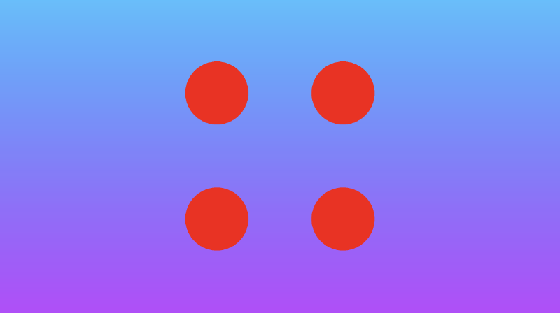</p>

有时，您可能希望跨一个或多个轴创建无限数量的 2D 对象。您可以使用 **opRep** 操作沿您选择的轴重复圆圈。参数 c 是一个向量，用于控制沿每个轴的 2D 对象之间的间距。

```cpp
float opRep(vec2 p, float r, vec2 c)
{
  vec2 q = mod(p+0.5*c,c)-0.5*c;
  return sdCircle(q, r, vec2(0));
}

vec3 drawScene(vec2 uv) {
  vec3 col = getBackgroundColor(uv);

  float res; // result
  res = opRep(uv, 0.05, vec2(0.2, 0.2));

  res = step(0., res);
  col = mix(vec3(1,0,0), col, res);
  return col;
}
```

<p align="center">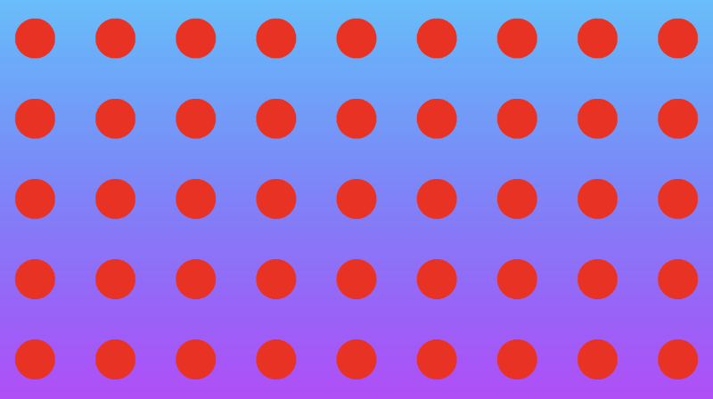</p>

如果只想重复 2D 对象一定次数而不是无限次，则可以使用 **opRepLim** 操作。参数 c 现在是浮点值，并且仍然控制每个重复的 2D 对象之间的间距。参数 l 是一个向量，用于控制形状应沿给定轴重复多少次。例如，值 vec2(2, 2) 将沿正负 x 轴和 y 轴绘制一个额外的圆。

```cpp
float opRepLim(vec2 p, float r, float c, vec2 l)
{
  vec2 q = p-c*clamp(round(p/c),-l,l);
  return sdCircle(q, r, vec2(0));
}

vec3 drawScene(vec2 uv) {
  vec3 col = getBackgroundColor(uv);

  float res; // result
  res = opRepLim(uv, 0.05, 0.15, vec2(2, 2));

  res = step(0., res);
  col = mix(vec3(1,0,0), col, res);
  return col;
}
```
<p align="center">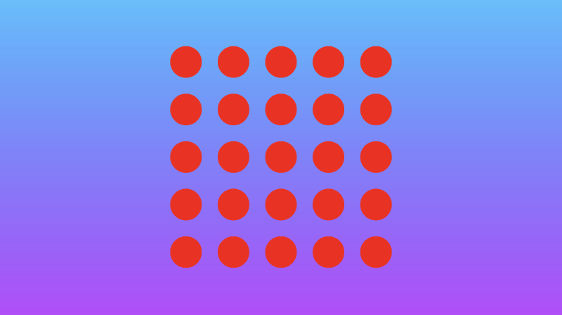</p>

您还可以通过操纵 uv 坐标，并将其与从 SDF 返回的值相加，对 SDF 执行变形或扭曲。在 **opDisplace** 操作中，您可以创建任何类型的数学运算来替换 p 的值，然后将该结果添加到您从 SDF 返回的原始值中。

```cpp
float opDisplace(vec2 p, float r)
{
  float d1 = sdCircle(p, r, vec2(0));
  float s = 0.5; // scaling factor

  float d2 = sin(s * p.x * 1.8); // Some arbitrary values I played around with

  return d1 + d2;
}

vec3 drawScene(vec2 uv) {
  vec3 col = getBackgroundColor(uv);

  float res; // result
  res = opDisplace(uv, 0.1); // Kinda looks like an egg

  res = step(0., res);
  col = mix(vec3(1,0,0), col, res);
  return col;
}
```

<p align="center">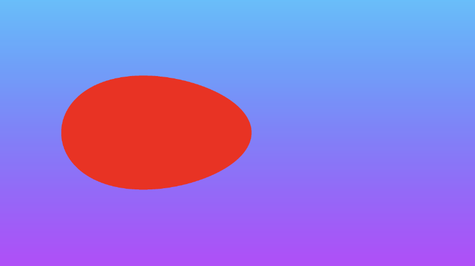</p>

下面是完成的代码。可以取消注释掉要查看的任何操作位置 2D SDF 的行。

```cpp
vec3 getBackgroundColor(vec2 uv) {
  uv = uv * 0.5 + 0.5; // remap uv from <-0.5,0.5> to <0.25,0.75>
  vec3 gradientStartColor = vec3(1., 0., 1.);
  vec3 gradientEndColor = vec3(0., 1., 1.);
  return mix(gradientStartColor, gradientEndColor, uv.y); // gradient goes from bottom to top
}

float sdCircle(vec2 uv, float r, vec2 offset) {
  float x = uv.x - offset.x;
  float y = uv.y - offset.y;

  return length(vec2(x, y)) - r;
}

float opSymX(vec2 p, float r)
{
  p.x = abs(p.x);
  return sdCircle(p, r, vec2(0.2, 0));
}

float opSymY(vec2 p, float r)
{
  p.y = abs(p.y);
  return sdCircle(p, r, vec2(0, 0.2));
}

float opSymXY(vec2 p, float r)
{
  p = abs(p);
  return sdCircle(p, r, vec2(0.2));
}

float opRep(vec2 p, float r, vec2 c)
{
  vec2 q = mod(p+0.5*c,c)-0.5*c;
  return sdCircle(q, r, vec2(0));
}

float opRepLim(vec2 p, float r, float c, vec2 l)
{
  vec2 q = p-c*clamp(round(p/c),-l,l);
  return sdCircle(q, r, vec2(0));
}

float opDisplace(vec2 p, float r)
{
  float d1 = sdCircle(p, r, vec2(0));
  float s = 0.5; // scaling factor

  float d2 = sin(s * p.x * 1.8); // Some arbitrary values I played around with

  return d1 + d2;
}

vec3 drawScene(vec2 uv) {
  vec3 col = getBackgroundColor(uv);

  float res; // result
  res = opSymX(uv, 0.1);
  //res = opSymY(uv, 0.1);
  //res = opSymXY(uv, 0.1);
  //res = opRep(uv, 0.05, vec2(0.2, 0.2));
  //res = opRepLim(uv, 0.05, 0.15, vec2(2, 2));
  //res = opDisplace(uv, 0.1);

  res = step(0., res);
  col = mix(vec3(1,0,0), col, res);
  return col;
}

void mainImage( out vec4 fragColor, in vec2 fragCoord )
{
  vec2 uv = fragCoord/iResolution.xy; // <0, 1>
  uv -= 0.5; // <-0.5,0.5>
  uv.x *= iResolution.x/iResolution.y; // fix aspect ratio

  vec3 col = drawScene(uv);

  fragColor = vec4(col,1.0); // Output to screen
}
```

