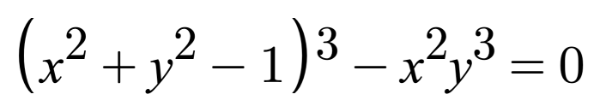

# 5.3 心形
在本节中，我将教您如何使用 Shadertoy 绘制心形。请记住，心形有多种样式。我将向您展示如何使用 [**Wolfram MathWorld**](https://mathworld.wolfram.com/HeartCurve.html) 中的方程式创建一种特定风格的心形。

<p align="center"></p>

如果我们想对这条心形曲线应用偏移量，那么我们需要先从 x 分量和 y 分量中减去它，然后再对它们进行任何类型的操作（例如取幂）。

```
s = x - offsetX
t = y - offsetY

(s^2 + t^2 - 1)^3 - s^2 * t^3 = 0

x = x-coordinate on graph
y = y-coordinate on graph
```

可以使用我在 [**Desmos**](https://www.desmos.com/calculator/1ihio0t4bb) 上创建的图表来调整心形曲线上的偏移量。

现在，如何在 Shadertoy 中为心形创建 SDF？我们只需将方程的左侧 （LHS） 设置为等于距离 d。然后，这与我们在第 4 部分中学到的过程相同。

```c
float sdHeart(vec2 uv, float size, vec2 offset) {
  float x = uv.x - offset.x;
  float y = uv.y - offset.y;
  float xx = x * x;
  float yy = y * y;
  float yyy = yy * y;
  float group = xx + yy - size;
  float d = group * group * group - xx * yyy;

  return d;
}

vec3 drawScene(vec2 uv) {
  vec3 col = vec3(1);
  float heart = sdHeart(uv, 0.04, vec2(0));

  col = mix(vec3(1, 0, 0), col, step(0., heart));

  return col;
}

void mainImage( out vec4 fragColor, in vec2 fragCoord )
{
  vec2 uv = fragCoord/iResolution.xy; // <0, 1>
  uv -= 0.5; // <-0.5,0.5>
  uv.x *= iResolution.x/iResolution.y; // fix aspect ratio

  vec3 col = drawScene(uv);

  // Output to screen
  fragColor = vec4(col,1.0);
}
```
<p align="center"></p>

