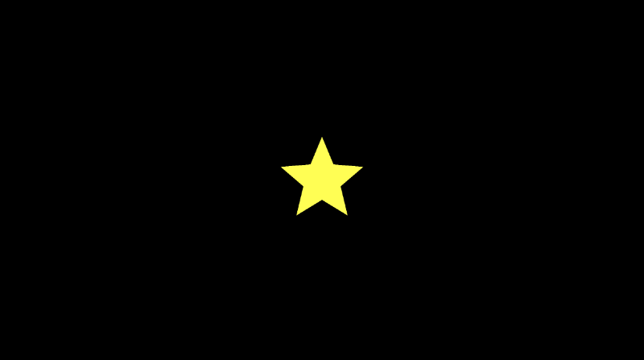
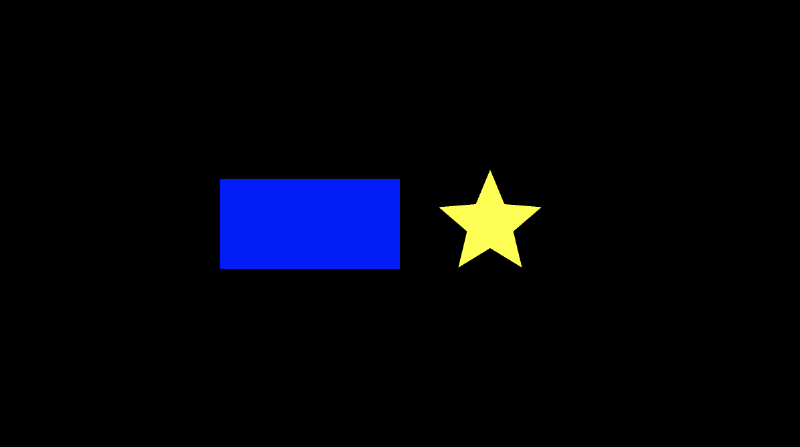
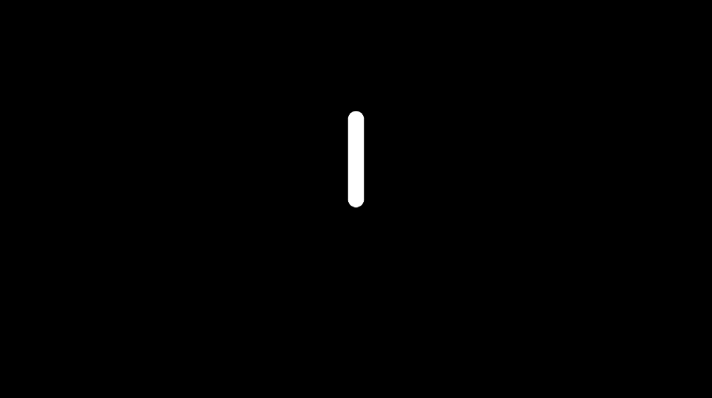
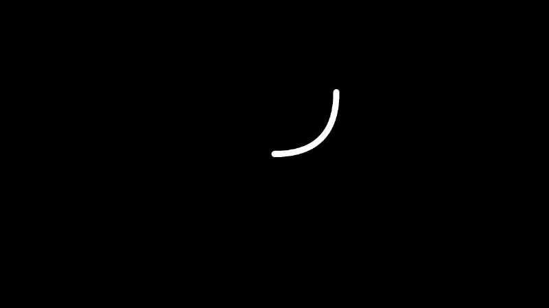

# 5.5 更多 sdf 形状

[**Inigo Quilez**](https://www.iquilezles.org/) 创建了许多 2D SDF 和 3D SDF，供 Shadertoy 的开发人员使用。在本节中，我将讨论如何使用他的 [**2D SDF**](https://www.iquilezles.org/www/articles/distfunctions2d/distfunctions2d.htm) 列表以及我们在 Shadertoy 系列的第 4 部分中学到的技术来绘制 2D 形状。

使用 SDF 创建形状时，它们通常称为**基元(primitives)**，因为它们构成了创建更抽象形状的构建块。对于 2D，在画布上绘制形状非常简单，但当我们讨论 3D 形状时，它会变得更加复杂。

## 绘制 star
让我们用星星 SDF 练习，因为画星星总是很有趣。导航到 Inigo Quilez 的[**网站**](https://www.iquilezles.org/www/articles/distfunctions2d/distfunctions2d.htm)并向下滚动到名为“Star 5 - exact”的 SDF。它应具有以下定义：

```cpp
float sdStar5(in vec2 p, in float r, in float rf)
{
  const vec2 k1 = vec2(0.809016994375, -0.587785252292);
  const vec2 k2 = vec2(-k1.x,k1.y);
  p.x = abs(p.x);
  p -= 2.0*max(dot(k1,p),0.0)*k1;
  p -= 2.0*max(dot(k2,p),0.0)*k2;
  p.x = abs(p.x);
  p.y -= r;
  vec2 ba = rf*vec2(-k1.y,k1.x) - vec2(0,1);
  float h = clamp( dot(p,ba)/dot(ba,ba), 0.0, r );
  return length(p-ba*h) * sign(p.y*ba.x-p.x*ba.y);
}
```

不用担心函数中的 **in** 限定符。如果需要，您可以删除它们，因为如果未指定任何条件，则 **in** 是默认限定符。

让我们使用以下代码创建一个新的 Shadertoy 着色器：

```cpp
float sdStar5(in vec2 p, in float r, in float rf)
{
  const vec2 k1 = vec2(0.809016994375, -0.587785252292);
  const vec2 k2 = vec2(-k1.x,k1.y);
  p.x = abs(p.x);
  p -= 2.0*max(dot(k1,p),0.0)*k1;
  p -= 2.0*max(dot(k2,p),0.0)*k2;
  p.x = abs(p.x);
  p.y -= r;
  vec2 ba = rf*vec2(-k1.y,k1.x) - vec2(0,1);
  float h = clamp( dot(p,ba)/dot(ba,ba), 0.0, r );
  return length(p-ba*h) * sign(p.y*ba.x-p.x*ba.y);
}

vec3 drawScene(vec2 uv) {
  vec3 col = vec3(0);
  float star = sdStar5(uv, 0.12, 0.45);

  col = mix(vec3(1, 1, 0), col, step(0., star));

  return col;
}

void mainImage( out vec4 fragColor, in vec2 fragCoord )
{
  vec2 uv = fragCoord/iResolution.xy; // <0, 1>
  uv -= 0.5; // <-0.5,0.5>
  uv.x *= iResolution.x/iResolution.y; // fix aspect ratio

  vec3 col = drawScene(uv);

  // Output to screen
  fragColor = vec4(col,1.0);
}
```

当我们运行这段代码时，您应该能够看到一个亮黄色的星星！⭐

<p align="center"></p>

不过，还缺少一件事。我们需要在 sdStar5 函数的开头添加一个偏移量，将 UV 坐标稍微移动一下。我们可以添加一个名为 offset 的新参数，我们可以从向量 p 中减去这个偏移量，它表示我们传递给此函数的 UV 坐标。

我们完成的代码应该是这样的：

```cpp
float sdStar5(in vec2 p, in float r, in float rf, vec2 offset)
{
  p -= offset; // This will subtract offset.x from p.x and subtract offset.y from p.y
  const vec2 k1 = vec2(0.809016994375, -0.587785252292);
  const vec2 k2 = vec2(-k1.x,k1.y);
  p.x = abs(p.x);
  p -= 2.0*max(dot(k1,p),0.0)*k1;
  p -= 2.0*max(dot(k2,p),0.0)*k2;
  p.x = abs(p.x);
  p.y -= r;
  vec2 ba = rf*vec2(-k1.y,k1.x) - vec2(0,1);
  float h = clamp( dot(p,ba)/dot(ba,ba), 0.0, r );
  return length(p-ba*h) * sign(p.y*ba.x-p.x*ba.y);
}

vec3 drawScene(vec2 uv) {
  vec3 col = vec3(0);
  float star = sdStar5(uv, 0.12, 0.45, vec2(0.2, 0)); // Add an offset to shift the star's position

  col = mix(vec3(1, 1, 0), col, step(0., star));

  return col;
}

void mainImage( out vec4 fragColor, in vec2 fragCoord )
{
  vec2 uv = fragCoord/iResolution.xy; // <0, 1>
  uv -= 0.5; // <-0.5,0.5>
  uv.x *= iResolution.x/iResolution.y; // fix aspect ratio

  vec3 col = drawScene(uv);

  // Output to screen
  fragColor = vec4(col,1.0);
}
```

## 使用 sdBox SDF
绘制方框/矩形很常见，因此我们将选择标题为“方框 - 精确”的 SDF。它具有以下定义：

```cpp
float sdBox( in vec2 p, in vec2 b )
{
  vec2 d = abs(p)-b;
  return length(max(d,0.0)) + min(max(d.x,d.y),0.0);
}
```

我们将向函数声明添加一个 offset 参数。

```cpp
float sdBox( in vec2 p, in vec2 b, vec2 offset )
{
  p -= offset;
  vec2 d = abs(p)-b;
  return length(max(d,0.0)) + min(max(d.x,d.y),0.0);
}
```

现在，我们应该能够毫无问题地渲染 box 和 star：

```cpp
float sdBox( in vec2 p, in vec2 b, vec2 offset )
{
  p -= offset;
  vec2 d = abs(p)-b;
  return length(max(d,0.0)) + min(max(d.x,d.y),0.0);
}

float sdStar5(in vec2 p, in float r, in float rf, vec2 offset)
{
  p -= offset; // This will subtract offset.x from p.x and subtract offset.y from p.y
  const vec2 k1 = vec2(0.809016994375, -0.587785252292);
  const vec2 k2 = vec2(-k1.x,k1.y);
  p.x = abs(p.x);
  p -= 2.0*max(dot(k1,p),0.0)*k1;
  p -= 2.0*max(dot(k2,p),0.0)*k2;
  p.x = abs(p.x);
  p.y -= r;
  vec2 ba = rf*vec2(-k1.y,k1.x) - vec2(0,1);
  float h = clamp( dot(p,ba)/dot(ba,ba), 0.0, r );
  return length(p-ba*h) * sign(p.y*ba.x-p.x*ba.y);
}

vec3 drawScene(vec2 uv) {
  vec3 col = vec3(0);
  float box = sdBox(uv, vec2(0.2, 0.1), vec2(-0.2, 0));
  float star = sdStar5(uv, 0.12, 0.45, vec2(0.2, 0));

  col = mix(vec3(1, 1, 0), col, step(0., star));
  col = mix(vec3(0, 0, 1), col, step(0., box));

  return col;
}

void mainImage( out vec4 fragColor, in vec2 fragCoord )
{
  vec2 uv = fragCoord/iResolution.xy; // <0, 1>
  uv -= 0.5; // <-0.5,0.5>
  uv.x *= iResolution.x/iResolution.y; // fix aspect ratio

  vec3 col = drawScene(uv);

  // Output to screen
  fragColor = vec4(col,1.0);
}
```
<p align="center"></p>

只需进行一些小的调整，我们就可以从 Inigo Quilez 的网站上挑选许多 2D SDF，并将它们以偏移量绘制到画布上。

但是请注意，某些 SDF 需要在他的 3D SDF 页面上定义的函数：

```cpp
float dot2( in vec2 v ) { return dot(v,v); }
float dot2( in vec3 v ) { return dot(v,v); }
float ndot( in vec2 a, in vec2 b ) { return a.x*b.x - a.y*b.y; }
```
## 使用 sdSegment SDF
Inigo Quilez [**网站**](https://www.iquilezles.org/www/articles/distfunctions2d/distfunctions2d.htm)上的一些 2D SDF 用于线段或曲线，因此我们可能需要稍微改变我们的方法。让我们看看标题为“Segment - exact（线段 - 精确）”的 SDF。它具有以下定义：

```cpp
float sdSegment( in vec2 p, in vec2 a, in vec2 b )
{
  vec2 pa = p-a, ba = b-a;
  float h = clamp( dot(pa,ba)/dot(ba,ba), 0.0, 1.0 );
  return length( pa - ba*h );
}
```

让我们尝试使用这个 SDF，看看会发生什么。

```cpp
float sdSegment( in vec2 p, in vec2 a, in vec2 b )
{
  vec2 pa = p-a, ba = b-a;
  float h = clamp( dot(pa,ba)/dot(ba,ba), 0.0, 1.0 );
  return length( pa - ba*h );
}

vec3 drawScene(vec2 uv) {
  vec3 col = vec3(0);
  float segment = sdSegment(uv, vec2(0, 0), vec2(0, .2));

  col = mix(vec3(1, 1, 1), col, step(0., segment));

  return col;
}

void mainImage( out vec4 fragColor, in vec2 fragCoord )
{
  vec2 uv = fragCoord/iResolution.xy; // <0, 1>
  uv -= 0.5; // <-0.5,0.5>
  uv.x *= iResolution.x/iResolution.y; // fix aspect ratio

  vec3 col = drawScene(uv);

  // Output to screen
  fragColor = vec4(col,1.0);
}
```

当我们运行此代码时，我们将看到一个完全黑色的画布。一些 SDF 要求我们更仔细地查看代码。目前，该区段太细，无法在我们的画布中看到。为了给线段一些厚度，我们可以从返回的距离中减去一个值。

```cpp
float sdSegment( in vec2 p, in vec2 a, in vec2 b )
{
  vec2 pa = p-a, ba = b-a;
  float h = clamp( dot(pa,ba)/dot(ba,ba), 0.0, 1.0 );
  return length( pa - ba*h );
}

vec3 drawScene(vec2 uv) {
  vec3 col = vec3(0);
  float segment = sdSegment(uv, vec2(0, 0), vec2(0, 0.2));

  col = mix(vec3(1, 1, 1), col, step(0., segment - 0.02)); // Subtract 0.02 from the returned "signed distance" value of the segment

  return col;
}

void mainImage( out vec4 fragColor, in vec2 fragCoord )
{
  vec2 uv = fragCoord/iResolution.xy; // <0, 1>
  uv -= 0.5; // <-0.5,0.5>
  uv.x *= iResolution.x/iResolution.y; // fix aspect ratio

  vec3 col = drawScene(uv);

  // Output to screen
  fragColor = vec4(col,1.0);
}
```

现在，我们可以看到我们的区段出现！它从坐标 （0, 0) 开始，到 (0, 0.2) 结束。在对 sdSegment 函数的调用中，使用输入向量 a 和 b，以不同的方式移动和拉伸线段。如果要使段更细或更宽，可以将 0.02 替换为另一个数字。


<p align="center"></p>

您还可以使用 **smoothstep** 函数使线段在边缘周围看起来模糊。

```cpp
float sdSegment( in vec2 p, in vec2 a, in vec2 b )
{
  vec2 pa = p-a, ba = b-a;
  float h = clamp( dot(pa,ba)/dot(ba,ba), 0.0, 1.0 );
  return length( pa - ba*h );
}

vec3 drawScene(vec2 uv) {
  vec3 col = vec3(0);
  float segment = sdSegment(uv, vec2(0, 0), vec2(0, .2));

  col = mix(vec3(1, 1, 1), col, smoothstep(0., 0.02, segment));

  return col;
}

void mainImage( out vec4 fragColor, in vec2 fragCoord )
{
  vec2 uv = fragCoord/iResolution.xy; // <0, 1>
  uv -= 0.5; // <-0.5,0.5>
  uv.x *= iResolution.x/iResolution.y; // fix aspect ratio

  vec3 col = drawScene(uv);

  // Output to screen
  fragColor = vec4(col,1.0);
}
```

现在看起来正在发光！

<p align="center"></p>

## 使用 sdBezier SDF

Inigo Quilez 的网站也有贝塞尔曲线的 SDF。更具体地说，他有一个二次贝塞尔曲线的 SDF。查找标题为“Quadratic Bezier - exact”（二次贝塞尔曲线 - 精确）的 SDF。它具有以下定义：

```cpp
float sdBezier( in vec2 pos, in vec2 A, in vec2 B, in vec2 C )
{
    vec2 a = B - A;
    vec2 b = A - 2.0*B + C;
    vec2 c = a * 2.0;
    vec2 d = A - pos;
    float kk = 1.0/dot(b,b);
    float kx = kk * dot(a,b);
    float ky = kk * (2.0*dot(a,a)+dot(d,b)) / 3.0;
    float kz = kk * dot(d,a);
    float res = 0.0;
    float p = ky - kx*kx;
    float p3 = p*p*p;
    float q = kx*(2.0*kx*kx-3.0*ky) + kz;
    float h = q*q + 4.0*p3;
    if( h >= 0.0)
    {
        h = sqrt(h);
        vec2 x = (vec2(h,-h)-q)/2.0;
        vec2 uv = sign(x)*pow(abs(x), vec2(1.0/3.0));
        float t = clamp( uv.x+uv.y-kx, 0.0, 1.0 );
        res = dot2(d + (c + b*t)*t);
    }
    else
    {
        float z = sqrt(-p);
        float v = acos( q/(p*z*2.0) ) / 3.0;
        float m = cos(v);
        float n = sin(v)*1.732050808;
        vec3  t = clamp(vec3(m+m,-n-m,n-m)*z-kx,0.0,1.0);
        res = min( dot2(d+(c+b*t.x)*t.x),
                   dot2(d+(c+b*t.y)*t.y) );
        // the third root cannot be the closest
        // res = min(res,dot2(d+(c+b*t.z)*t.z));
    }
    return sqrt( res );
}
```

这是一个相当大的函数！请注意，此函数使用实用函数 dot2。这在他的 3D SDF 页面上定义。

二次贝塞尔曲线接受三个控制点。在 2D 中，每个控制点都将是一个具有 x 分量和 y 分量的 vec2 值。您可以使用我在 Desmos 上创建的图表来调整控制点。

与 sdSegment 一样，我们必须从返回的 “signed distance” 中减去一个小值才能正确查看曲线。让我们看看如何使用 GLSL 代码绘制二次贝塞尔曲线：

```cpp
float dot2( in vec2 v ) { return dot(v,v); }

float sdBezier( in vec2 pos, in vec2 A, in vec2 B, in vec2 C )
{
    vec2 a = B - A;
    vec2 b = A - 2.0*B + C;
    vec2 c = a * 2.0;
    vec2 d = A - pos;
    float kk = 1.0/dot(b,b);
    float kx = kk * dot(a,b);
    float ky = kk * (2.0*dot(a,a)+dot(d,b)) / 3.0;
    float kz = kk * dot(d,a);
    float res = 0.0;
    float p = ky - kx*kx;
    float p3 = p*p*p;
    float q = kx*(2.0*kx*kx-3.0*ky) + kz;
    float h = q*q + 4.0*p3;
    if( h >= 0.0)
    {
        h = sqrt(h);
        vec2 x = (vec2(h,-h)-q)/2.0;
        vec2 uv = sign(x)*pow(abs(x), vec2(1.0/3.0));
        float t = clamp( uv.x+uv.y-kx, 0.0, 1.0 );
        res = dot2(d + (c + b*t)*t);
    }
    else
    {
        float z = sqrt(-p);
        float v = acos( q/(p*z*2.0) ) / 3.0;
        float m = cos(v);
        float n = sin(v)*1.732050808;
        vec3  t = clamp(vec3(m+m,-n-m,n-m)*z-kx,0.0,1.0);
        res = min( dot2(d+(c+b*t.x)*t.x),
                   dot2(d+(c+b*t.y)*t.y) );
        // the third root cannot be the closest
        // res = min(res,dot2(d+(c+b*t.z)*t.z));
    }
    return sqrt( res );
}

vec3 drawScene(vec2 uv) {
    vec3 col = vec3(0);
    vec2 A = vec2(0, 0);
    vec2 B = vec2(0.2, 0);
    vec2 C = vec2(0.2, 0.2);
    float curve = sdBezier(uv, A, B, C);

    col = mix(vec3(1, 1, 1), col, step(0., curve - 0.01));

    return col;
}

void mainImage( out vec4 fragColor, in vec2 fragCoord )
{
    vec2 uv = fragCoord/iResolution.xy; // <0, 1>
    uv -= 0.5; // <-0.5,0.5>
    uv.x *= iResolution.x/iResolution.y; // fix aspect ratio

    vec3 col = drawScene(uv);

    // Output to screen
    fragColor = vec4(col,1.0);
}
```

运行代码时，您应该会看到二次贝塞尔曲线出现。

<p align="center"></p>

尝试玩弄控制点！记得！您可以使用我的 [**Desmos graph**](https://www.desmos.com/calculator/xdhowj4wkk) 来提供帮助！

您可以将 2D 操作与 Bezier 曲线一起使用，以创建有趣的效果。我们可以从一个圆中减去两条贝塞尔曲线，得到某种网球🎾。由您来探索您可以使用呈现给您的工具创建的所有内容！

<p align="center"></p>

您可以在下面找到用于制作网球的完成代码：

```cpp
vec3 getBackgroundColor(vec2 uv) {
  uv = uv * 0.5 + 0.5; // remap uv from <-0.5,0.5> to <0.25,0.75>
  vec3 gradientStartColor = vec3(1., 0., 1.);
  vec3 gradientEndColor = vec3(0., 1., 1.);
  return mix(gradientStartColor, gradientEndColor, uv.y); // gradient goes from bottom to top
}

float sdCircle(vec2 uv, float r, vec2 offset) {
  float x = uv.x - offset.x;
  float y = uv.y - offset.y;

  return length(vec2(x, y)) - r;
}

float dot2( in vec2 v ) { return dot(v,v); }

float sdBezier( in vec2 pos, in vec2 A, in vec2 B, in vec2 C )
{
    vec2 a = B - A;
    vec2 b = A - 2.0*B + C;
    vec2 c = a * 2.0;
    vec2 d = A - pos;
    float kk = 1.0/dot(b,b);
    float kx = kk * dot(a,b);
    float ky = kk * (2.0*dot(a,a)+dot(d,b)) / 3.0;
    float kz = kk * dot(d,a);
    float res = 0.0;
    float p = ky - kx*kx;
    float p3 = p*p*p;
    float q = kx*(2.0*kx*kx-3.0*ky) + kz;
    float h = q*q + 4.0*p3;
    if( h >= 0.0)
    {
        h = sqrt(h);
        vec2 x = (vec2(h,-h)-q)/2.0;
        vec2 uv = sign(x)*pow(abs(x), vec2(1.0/3.0));
        float t = clamp( uv.x+uv.y-kx, 0.0, 1.0 );
        res = dot2(d + (c + b*t)*t);
    }
    else
    {
        float z = sqrt(-p);
        float v = acos( q/(p*z*2.0) ) / 3.0;
        float m = cos(v);
        float n = sin(v)*1.732050808;
        vec3  t = clamp(vec3(m+m,-n-m,n-m)*z-kx,0.0,1.0);
        res = min( dot2(d+(c+b*t.x)*t.x),
                   dot2(d+(c+b*t.y)*t.y) );
        // the third root cannot be the closest
        // res = min(res,dot2(d+(c+b*t.z)*t.z));
    }
    return sqrt( res );
}

vec3 drawScene(vec2 uv) {
  vec3 col = getBackgroundColor(uv);
  float d1 = sdCircle(uv, 0.2, vec2(0., 0.));
  vec2 A = vec2(-0.2, 0.2);
  vec2 B = vec2(0, 0);
  vec2 C = vec2(0.2, 0.2);
  float d2 = sdBezier(uv, A, B, C) - 0.03;
  float d3 = sdBezier(uv*vec2(1,-1), A, B, C) - 0.03;

  float res; // result
  res = max(d1, -d2); // subtraction - subtract d2 from d1
  res = max(res, -d3); // subtraction - subtract d3 from the result

  res = smoothstep(0., 0.01, res); // antialias entire result

  col = mix(vec3(.8,.9,.2), col, res);
  return col;
}

void mainImage( out vec4 fragColor, in vec2 fragCoord )
{
  vec2 uv = fragCoord/iResolution.xy; // <0, 1>
  uv -= 0.5; // <-0.5,0.5>
  uv.x *= iResolution.x/iResolution.y; // fix aspect ratio

  vec3 col = drawScene(uv);

  fragColor = vec4(col,1.0); // Output to screen
}
```

##  结论
在本教程中，我们学习了如何通过绘制心形❤️和其他形状来表达对着色器的更多爱。我们学习了如何绘制星形、线段和二次贝塞尔曲线。当然，我使用 2D SDF 绘制形状的技术只是个人喜好。我们可以通过多种方式将 2D 形状绘制到画布上。我们还学习了如何将基元形状组合在一起以创建更复杂的形状。在下一篇文章中，我们将开始学习如何使用 raymarching 绘制 3D 形状和场景！🎉