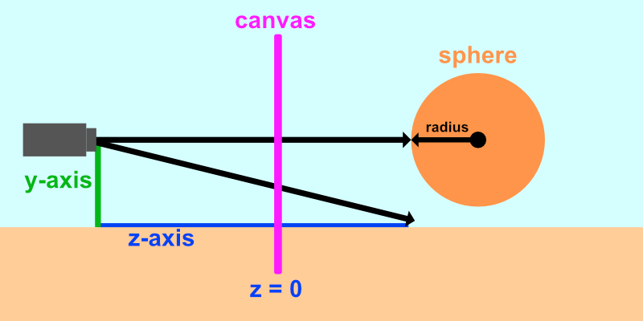
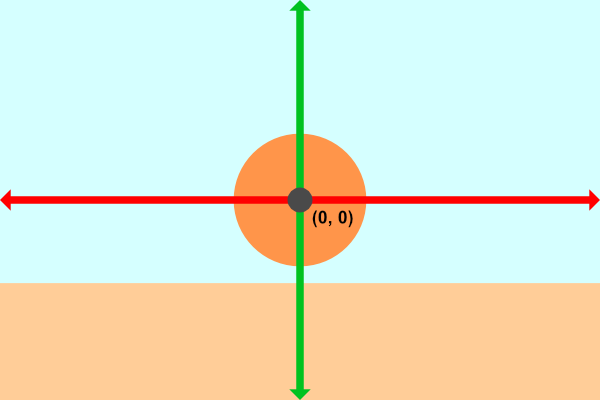
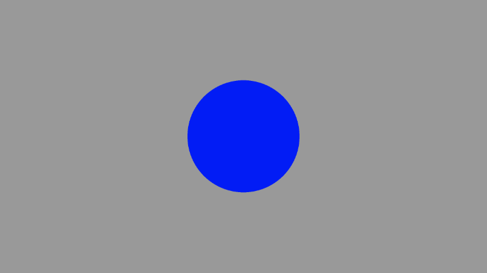
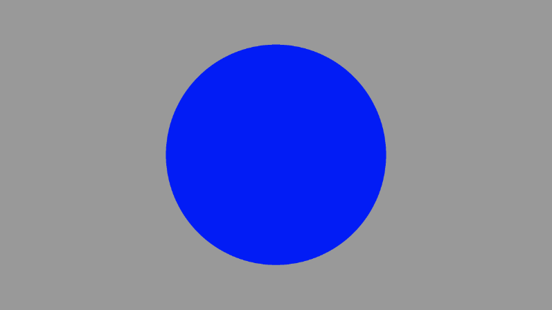
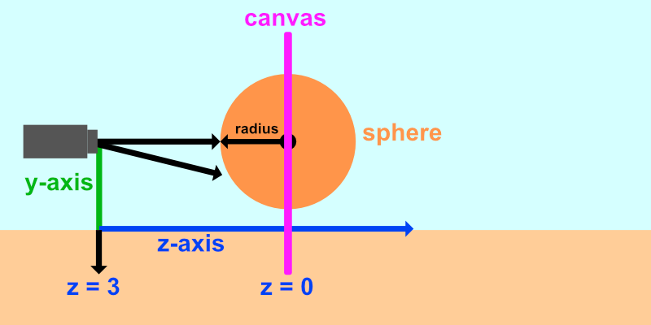

# 6.3 Ray Marching

在本文的部分，我将讨论如何在 Shadertoy 中使用光线行进算法。有许多优秀的在线教程教授光线行进，例如 Jamie Wong 的[**教程**](http://jamie-wong.com/2016/07/15/ray-marching-signed-distance-functions/)。为了帮助您可视化光线行进以及为什么它有时被称为球体追踪，Shadertoy 上的[**教程**](https://www.shadertoy.com/view/4dSfRc)是一个宝贵的资源。

我将逐步帮助分解光线行进的过程，因此即使计算机图形经验很少，您也可以开始创建 3D 场景。

我们将创建一个简单的摄像机，以便我们可以在 Shadertoy 画布中模拟 3D 场景。让我们想象一下我们的场景首先会是什么样子。我们将从最基本的对象开始：球体。

<p align="center"></p>

上图显示了我们将在 Shadertoy 中创建的 3D 场景的侧视图。未显示 x 轴，因为它指向查看器。我们的摄像机将被视为一个坐标为 （0， 0， 5） 的点，这意味着它沿 z 轴距离画布 5 个单位。与前面的教程一样，我们将重新映射 UV 坐标，使原点位于画布的中心。

<p align="center"></p>

上图以 x 轴（红色）和 y 轴（绿色）表示从我们的视角来看的画布。我们将从摄像机的视角查看场景。从摄像机直接射出的光线穿过画布的原点，将击中我们的球体。对角线光线以一定角度从摄像机发射并撞击地面（如果它存在于场景中）。如果光线没有击中任何东西，那么我们将渲染背景色。

现在我们了解了我们将要构建的内容，让我们开始编码吧！创建一个新的 Shadertoy 着色器，并将内容替换为以下内容以设置我们的画布：

```cpp
void mainImage( out vec4 fragColor, in vec2 fragCoord )
{
  vec2 uv = fragCoord/iResolution.xy; // <0, 1>
  uv -= 0.5; // <-0.5,0.5>
  uv.x *= iResolution.x/iResolution.y; // fix aspect ratio

  vec3 col = vec3(0);

  // Output to screen
  fragColor = vec4(col,1.0);
}
```

为了使我们的代码更简洁，我们可以在一行而不是 3 行中重新映射 UV 坐标。我们现在已经习惯了这段代码的作用！

```cpp
void mainImage( out vec4 fragColor, in vec2 fragCoord )
{
  vec2 uv = (fragCoord - .5 * iResolution.xy) / iResolution.y; // Condense 3 lines down to a single line!

  vec3 col = vec3(0);

  // Output to screen
  fragColor = vec4(col,1.0);
}
```

光线原点 ro 将是相机的位置。我们将它设置在我们正在查看的 “画布” 后面 5 个单位。

```cpp
vec3 ro = vec3(0, 0, 5);
```

接下来，我们将添加光线方向 rd，该方向将根据像素坐标而变化。我们将 z 分量设置为 -1，以便每条光线都射向我们的场景。然后，我们将对整个向量进行归一化。

```cpp
vec3 rd = normalize(vec3(uv, -1));
```

然后，我们将设置一个变量，该变量返回与光线行进算法的距离：

```cpp
float d = rayMarch(ro, rd, 0., 100.);
```

让我们创建一个名为 rayMarch 的函数，用于实现光线行进算法：

```cpp
float rayMarch(vec3 ro, vec3 rd, float start, float end) {
  float depth = start;

  for (int i = 0; i < 255; i++) {
    vec3 p = ro + depth * rd;
    float d = sdSphere(p, 1.);
    depth += d;
    if (d < 0.001 || depth > end) break;
  }

  return depth;
}
```

让我们更仔细地研究一下光线行进算法。我们从 0 的深度开始，然后逐渐增加深度。我们的测试点等于光线原点（我们的相机位置）加上深度乘以光线方向。请记住，光线行进算法将针对每个像素运行，并且每个像素将确定不同的光线方向。

我们获取测试点 p，并将其传递给 sdSphere 函数，我们将定义为：

```cpp
float sdSphere(vec3 p, float r)
{
  return length(p) - r; // p is the test point and r is the radius of the sphere
}
```

然后，我们将按 `sdSphere` 函数返回的距离值来增加深度。如果距离与球体的距离在 0.001 个单位以内，那么我们认为它离球体足够近。这表示精度。如果要使该值更准确，可以降低该值。

如果距离大于某个阈值（在本例中为 100），则光线走得太远，我们应该停止光线行进循环。我们不希望光线继续到无穷大，因为这会浪费计算资源，如果光线没有击中任何东西，就会使 for 循环永远运行。

最后，我们将根据光线是否击中某物来添加颜色：

```cpp
if (d > 100.0) {
  col = vec3(0.6); // ray didn't hit anything
} else {
  col = vec3(0, 0, 1); // ray hit something
}
```

我们完成的代码应如下所示：

```cpp
float sdSphere(vec3 p, float r )
{
  return length(p) - r;
}

float rayMarch(vec3 ro, vec3 rd, float start, float end) {
  float depth = start;

  for (int i = 0; i < 255; i++) {
    vec3 p = ro + depth * rd;
    float d = sdSphere(p, 1.);
    depth += d;
    if (d < 0.001 || depth > end) break;
  }

  return depth;
}

void mainImage( out vec4 fragColor, in vec2 fragCoord )
{
  vec2 uv = (fragCoord-.5*iResolution.xy)/iResolution.y;

  vec3 col = vec3(0);
  vec3 ro = vec3(0, 0, 5); // ray origin that represents camera position
  vec3 rd = normalize(vec3(uv, -1)); // ray direction

  float d = rayMarch(ro, rd, 0., 100.); // distance to sphere

  if (d > 100.0) {
    col = vec3(0.6); // ray didn't hit anything
  } else {
    col = vec3(0, 0, 1); // ray hit something
  }

  // Output to screen
  fragColor = vec4(col, 1.0);
}
```

我们似乎在重用一些数字，所以让我们设置一些常量全局变量。在 `GLSL` 中，我们可以使用 `const` 关键字告诉编译器我们不打算更改这些变量：

```cpp
const int MAX_MARCHING_STEPS = 255;
const float MIN_DIST = 0.0;
const float MAX_DIST = 100.0;
const float PRECISION = 0.001;
```
或者，我们也可以使用 [**preprocessor 指令**](https://www.khronos.org/opengl/wiki/Core_Language_(GLSL)#Preprocessor_directives)。您可能会看到人们在定义常量时使用 #define 等预处理器指令。使用 #define 的一个优点是，您可以使用 #ifdef 来检查变量是否在稍后的代码中定义。**#define` 和 `const** 之间存在[**差异**](https://stackoverflow.com/questions/6442328/what-is-the-difference-between-define-and-const)，因此请选择你喜欢的 **const** 以及最适合你的方案的 **const**。

如果我们重写常量变量以使用 #define 预处理器指令，则我们将得到以下内容：

```cpp
#define MAX_MARCHING_STEPS 255
#define MIN_DIST 0.0
#define MAX_DIST 100.0
#define PRECISION 0.001
```

请注意，我们不使用等号，也不在使用预处理器指令的每一行末尾包含分号。

*#define* 关键字允许我们定义变量和函数，但出于类型安全性，我更喜欢使用 *const* 代替。

使用这些常量全局变量，代码现在应如下所示：

```cpp
const int MAX_MARCHING_STEPS = 255;
const float MIN_DIST = 0.0;
const float MAX_DIST = 100.0;
const float PRECISION = 0.001;

float sdSphere(vec3 p, float r )
{
  return length(p) - r;
}

float rayMarch(vec3 ro, vec3 rd, float start, float end) {
  float depth = start;

  for (int i = 0; i < MAX_MARCHING_STEPS; i++) {
    vec3 p = ro + depth * rd;
    float d = sdSphere(p, 1.);
    depth += d;
    if (d < PRECISION || depth > end) break;
  }

  return depth;
}

void mainImage( out vec4 fragColor, in vec2 fragCoord )
{
  vec2 uv = (fragCoord-.5*iResolution.xy)/iResolution.y;

  vec3 col = vec3(0);
  vec3 ro = vec3(0, 0, 5); // ray origin that represents camera position
  vec3 rd = normalize(vec3(uv, -1)); // ray direction

  float d = rayMarch(ro, rd, MIN_DIST, MAX_DIST); // distance to sphere

  if (d > MAX_DIST) {
    col = vec3(0.6); // ray didn't hit anything
  } else {
    col = vec3(0, 0, 1); // ray hit something
  }

  // Output to screen
  fragColor = vec4(col, 1.0);
}
```

当我们运行代码时，我们应该会看到一个球体的图像。它看起来像一个圆圈，但它绝对是一个球体！

<p align="center"></p>

如果我们改变相机的位置，我们可以放大和缩小以证明我们正在查看 3D 对象。将场景中摄像机和虚拟画布之间的距离从 5 增加到 3 应该会使球体看起来更大，就像我们向前移动了一点一样。

```cpp
vec3 ro = vec3(0, 0, 3); // ray origin
```

<p align="center"></p>

不过有一个问题。目前，我们的球体中心位于坐标 （0， 0， 0），这与我之前介绍的图像不同。我们的场景设置为摄像机非常靠近球体。

<p align="center"></p>

让我们向球体添加一个偏移量，类似于我们在本教程系列的第 2 部分中对圆所做的操作。

```cpp
float sdSphere(vec3 p, float r )
{
  vec3 offset = vec3(0, 0, -2);
  return length(p - offset) - r;
}
```

这将使球体沿 z 轴向前推两个单位。这应该会使球体看起来更小，因为它现在离摄像机更远了。