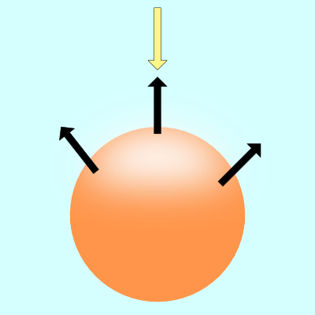
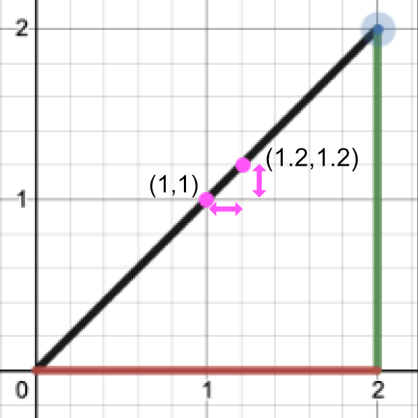
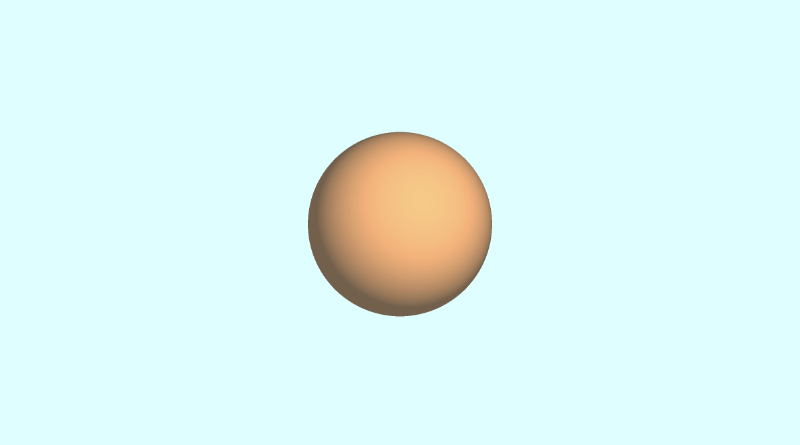

# 6.4 Lighting 照明

为了使这个形状看起来更像一个球体，我们需要添加光照。在现实世界中，光线会沿随机方向从对象上散射。

<p align="center"></p>

对象的显示方式会有所不同，具体取决于它们被光源（如太阳）照亮的程度。

<p align="center"></p>

上图中的黑色箭头表示球体的一些表面法线。如果表面法线指向光源，则球体上的该点看起来比球体的其余部分更亮。如果表面法线完全远离光源，则球体的该部分将显得更暗。

有多种类型的照明模型用于模拟现实世界。我们将研究 [**Lambert**](https://en.wikipedia.org/wiki/Lambertian_reflectance) 照明来模拟漫反射。这通常是通过在光源的光线方向和[**表面法线 (surface normal)**](https://en.wikipedia.org/wiki/Normal_(geometry))方向之间取点积来完成的。

```cpp
vec3 diffuseReflection = dot(normal, lightDirection);
```

表面法线通常是归一化向量，因为我们只关心方向。要找到这个方向，我们需要使用 gradient。表面法线将等于表面在表面上某一点处的梯度。

求梯度就像求一条线的斜率。你可能在学校里被告知要记住这句话，“rise over run”。在 3D 坐标空间中，我们可以使用渐变来查找表面上的点指向的 “方向”。

如果你上过微积分课，那么你可能学过一条线的斜率实际上只是线上两点之间的一个极小的差值。

<p align="center"></p>

让我们通过执行 “rise over run” 来找到斜率：

```
Point 1 = (1, 1)
Point 2 = (1.2, 1.2)

Rise / Run = (y2 - y1) / (x2 - x1) = (1.2 - 1) / (1.2 - 1) = 0.2 / 0.2 = 1

Therefore, the slope is equal to one.
```

要找到表面的梯度，我们需要两个点。我们将在球体表面上取一个点，并从中减去一个小数字以获得第二个点。这将让我们执行一个廉价的技巧来找到梯度。然后，我们可以将此梯度值用作表面法线。

给定一个表面 f（x，y，z），沿该表面的梯度将具有以下方程：

<p align="center"></p>

看起来像字母“e”的卷曲符号是希腊字母 epsilon。它将表示球体表面某个点旁边的一个微小值。

在 GLSL 中，我们将创建一个名为 `calcNormal` 的函数，该函数接收我们从 rayMarch 函数返回的样本点。

```cpp
vec3 calcNormal(vec3 p) {
  float e = 0.0005; // epsilon
  float r = 1.; // radius of sphere
  return normalize(vec3(
    sdSphere(vec3(p.x + e, p.y, p.z), r) - sdSphere(vec3(p.x - e, p.y, p.z), r),
    sdSphere(vec3(p.x, p.y + e, p.z), r) - sdSphere(vec3(p.x, p.y - e, p.z), r),
    sdSphere(vec3(p.x, p.y, p.z  + e), r) - sdSphere(vec3(p.x, p.y, p.z - e), r)
  ));
}
```

我们实际上可以使用 [**Swizzling**](https://www.khronos.org/opengl/wiki/Data_Type_(GLSL)#Swizzling) 和 vector arithmetic 来创建一种计算小梯度的替代方法。请记住，我们的目标是在球体表面（或近似球体表面）上的两个接近点之间创建一个小的渐变。虽然这种新方法与上面的代码并不完全相同，但它对于创建一个近似指向法线向量方向的小值非常有效。也就是说，它在创建渐变方面效果很好。

```cpp
vec3 calcNormal(vec3 p) {
  vec2 e = vec2(1.0, -1.0) * 0.0005; // epsilon
  float r = 1.; // radius of sphere
  return normalize(
    e.xyy * sdSphere(p + e.xyy, r) +
    e.yyx * sdSphere(p + e.yyx, r) +
    e.yxy * sdSphere(p + e.yxy, r) +
    e.xxx * sdSphere(p + e.xxx, r));
}
```

:::tip tip
如果您想比较每个 calcNormal 实现之间的差异，我创建了一个小型 JavaScript [程序](https://gist.github.com/inspirnathan/aec5d735194ba556cad69af15d76c831)，它模拟了 GLSL 代码的某些行为。
:::

需要注意的重要一点是，calcNormal 函数返回一个射线方向，该方向表示球体上点的朝向。

接下来，我们需要为光源指定一个位置。将其视为 3D 空间中的一个小点。

```cpp
vec3 lightPosition = vec3(2, 2, 4);
```

现在，我们将使光源始终指向球体。因此，光线方向将是光线位置与我们从光线行进循环返回的点之间的差值。

```cpp
vec3 lightDirection = normalize(lightPosition - p);
```

要找到照射到球体表面的光量，我们必须计算点积。在 *GLSL* 中，我们使用 *dot* 函数来计算这个值。

```
float dif = dot(normal, lightDirection); // dif = diffuse reflection
```

当我们在法向矢量和光向矢量之间取点积时，我们最终可能会得到一个负值。为了将值保持在 0 和 1 之间，以便我们获得更大的值范围，我们可以使用 clamp 函数。

```cpp
float dif = clamp(dot(normal, lightDirection), 0., 1.);
```

总而言之，我们最终得到以下代码：

```cpp
const int MAX_MARCHING_STEPS = 255;
const float MIN_DIST = 0.0;
const float MAX_DIST = 100.0;
const float PRECISION = 0.001;

float sdSphere(vec3 p, float r )
{
  vec3 offset = vec3(0, 0, -2);
  return length(p - offset) - r;
}

float rayMarch(vec3 ro, vec3 rd, float start, float end) {
  float depth = start;

  for (int i = 0; i < MAX_MARCHING_STEPS; i++) {
    vec3 p = ro + depth * rd;
    float d = sdSphere(p, 1.);
    depth += d;
    if (d < PRECISION || depth > end) break;
  }

  return depth;
}

vec3 calcNormal(vec3 p) {
    vec2 e = vec2(1.0, -1.0) * 0.0005; // epsilon
    float r = 1.; // radius of sphere
    return normalize(
      e.xyy * sdSphere(p + e.xyy, r) +
      e.yyx * sdSphere(p + e.yyx, r) +
      e.yxy * sdSphere(p + e.yxy, r) +
      e.xxx * sdSphere(p + e.xxx, r));
}

void mainImage( out vec4 fragColor, in vec2 fragCoord )
{
  vec2 uv = (fragCoord-.5*iResolution.xy)/iResolution.y;

  vec3 col = vec3(0);
  vec3 ro = vec3(0, 0, 3); // ray origin that represents camera position
  vec3 rd = normalize(vec3(uv, -1)); // ray direction

  float d = rayMarch(ro, rd, MIN_DIST, MAX_DIST); // distance to sphere

  if (d > MAX_DIST) {
    col = vec3(0.6); // ray didn't hit anything
  } else {
    vec3 p = ro + rd * d; // point on sphere we discovered from ray marching
    vec3 normal = calcNormal(p);
    vec3 lightPosition = vec3(2, 2, 4);
    vec3 lightDirection = normalize(lightPosition - p);

    // Calculate diffuse reflection by taking the dot product of
    // the normal and the light direction.
    float dif = clamp(dot(normal, lightDirection), 0., 1.);

    col = vec3(dif);
  }

  // Output to screen
  fragColor = vec4(col, 1.0);
}
```

当您运行此代码时，您应该会看到一个点亮的球体！现在，你知道我说的是实话。现在绝对看起来像一个球体！😁

<p align="center"></p>

如果尝试使用 *lightPosition* 变量，则应该能够在 3D 世界坐标中移动光源。移动光线应该会影响球体的着色量。如果将光源移动到摄像机后面，您应该会看到球体的中心看起来要亮得多。

```cpp
vec3 lightPosition = vec3(2, 2, 7);
```

您还可以通过将漫反射值乘以颜色向量来更改球体的颜色：

```cpp
col = vec3(dif) * vec3(1, 0.58, 0.29);
```

<p align="center"></p>

如果要添加一点环境光颜色，可以调整限制范围，这样球体在着色区域中就不会完全显示为黑色：

```cpp
float dif = clamp(dot(normal, lightDirection), 0.3, 1.);
```

您还可以更改背景颜色，并在球体的颜色中添加一点此颜色，以便它很好地混合。看起来有点像我们在本教程前面看到的参考图像，是吧？😎

<p align="center"></p>

作为参考，以下是我用于创建上述图像的完整代码。

```cpp
const int MAX_MARCHING_STEPS = 255;
const float MIN_DIST = 0.0;
const float MAX_DIST = 100.0;
const float PRECISION = 0.001;

float sdSphere(vec3 p, float r )
{
  vec3 offset = vec3(0, 0, -2);
  return length(p - offset) - r;
}

float rayMarch(vec3 ro, vec3 rd, float start, float end) {
  float depth = start;

  for (int i = 0; i < MAX_MARCHING_STEPS; i++) {
    vec3 p = ro + depth * rd;
    float d = sdSphere(p, 1.);
    depth += d;
    if (d < PRECISION || depth > end) break;
  }

  return depth;
}

vec3 calcNormal(vec3 p) {
    vec2 e = vec2(1.0, -1.0) * 0.0005; // epsilon
    float r = 1.; // radius of sphere
    return normalize(
      e.xyy * sdSphere(p + e.xyy, r) +
      e.yyx * sdSphere(p + e.yyx, r) +
      e.yxy * sdSphere(p + e.yxy, r) +
      e.xxx * sdSphere(p + e.xxx, r));
}

void mainImage( out vec4 fragColor, in vec2 fragCoord )
{
  vec2 uv = (fragCoord-.5*iResolution.xy)/iResolution.y;
  vec3 backgroundColor = vec3(0.835, 1, 1);

  vec3 col = vec3(0);
  vec3 ro = vec3(0, 0, 3); // ray origin that represents camera position
  vec3 rd = normalize(vec3(uv, -1)); // ray direction

  float d = rayMarch(ro, rd, MIN_DIST, MAX_DIST); // distance to sphere

  if (d > MAX_DIST) {
    col = backgroundColor; // ray didn't hit anything
  } else {
    vec3 p = ro + rd * d; // point on sphere we discovered from ray marching
    vec3 normal = calcNormal(p);
    vec3 lightPosition = vec3(2, 2, 7);
    vec3 lightDirection = normalize(lightPosition - p);

    // Calculate diffuse reflection by taking the dot product of
    // the normal and the light direction.
    float dif = clamp(dot(normal, lightDirection), 0.3, 1.);

    // Multiply the diffuse reflection value by an orange color and add a bit
    // of the background color to the sphere to blend it more with the background.
    col = dif * vec3(1, 0.58, 0.29) + backgroundColor * .2;
  }

  // Output to screen
  fragColor = vec4(col, 1.0);
}
```

## 结论
唷！这篇文章花了大约一个周末的时间写成并写好了，但我希望您在学习射线行进时玩得开心！我们迈出了创建3D对象的第一步，只使用屏幕上的像素和一种聪明的算法。下次再见，祝您编码愉快！
