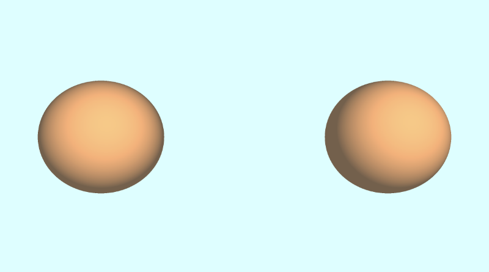

# 7.1 绘制多个 3D 对象

在上一个教程中，我们学习了如何使用 Shadertoy 绘制球体，但我们的场景仅设置为处理绘制一个形状。

让我们重新构建代码，以便名为 **sdScene** 的函数负责返回场景中最近的形状。

```cpp
const int MAX_MARCHING_STEPS = 255;
const float MIN_DIST = 0.0;
const float MAX_DIST = 100.0;
const float PRECISION = 0.001;

float sdSphere(vec3 p, float r )
{
  vec3 offset = vec3(0, 0, -2);
  return length(p - offset) - r;
}

float sdScene(vec3 p) {
  return sdSphere(p, 1.);
}

float rayMarch(vec3 ro, vec3 rd, float start, float end) {
  float depth = start;

  for (int i = 0; i < MAX_MARCHING_STEPS; i++) {
    vec3 p = ro + depth * rd;
    float d = sdScene(p);
    depth += d;
    if (d < PRECISION || depth > end) break;
  }

  return depth;
}

vec3 calcNormal(in vec3 p) {
    vec2 e = vec2(1.0, -1.0) * 0.0005; // epsilon
    float r = 1.; // radius of sphere
    return normalize(
      e.xyy * sdScene(p + e.xyy) +
      e.yyx * sdScene(p + e.yyx) +
      e.yxy * sdScene(p + e.yxy) +
      e.xxx * sdScene(p + e.xxx));
}

void mainImage( out vec4 fragColor, in vec2 fragCoord )
{
  vec2 uv = (fragCoord-.5*iResolution.xy)/iResolution.y;
  vec3 backgroundColor = vec3(0.835, 1, 1);

  vec3 col = vec3(0);
  vec3 ro = vec3(0, 0, 3); // ray origin that represents camera position
  vec3 rd = normalize(vec3(uv, -1)); // ray direction

  float d = rayMarch(ro, rd, MIN_DIST, MAX_DIST); // distance to sphere

  if (d > MAX_DIST) {
    col = backgroundColor; // ray didn't hit anything
  } else {
    vec3 p = ro + rd * d; // point on sphere we discovered from ray marching
    vec3 normal = calcNormal(p);
    vec3 lightPosition = vec3(2, 2, 7);
    vec3 lightDirection = normalize(lightPosition - p);

    // Calculate diffuse reflection by taking the dot product of
    // the normal and the light direction.
    float dif = clamp(dot(normal, lightDirection), 0.3, 1.);

    // Multiply the diffuse reflection value by an orange color and add a bit
    // of the background color to the sphere to blend it more with the background.
    col = dif * vec3(1, 0.58, 0.29) + backgroundColor * .2;
  }

  // Output to screen
  fragColor = vec4(col, 1.0);
}
```

请注意 **sdSphere** 的每个实例都已替换为 **sdScene**。如果我们想向场景中添加更多对象，我们可以使用 **min 函数**来获取场景中最近的对象。

```cpp
float sdScene(vec3 p) {
  float sphereLeft = sdSphere(p, 1.);
  float sphereRight = sdSphere(p, 1.);
  return min(sphereLeft, sphereRight);
}
```
不过，目前，这些球体是相互重叠的。让我们向 sdSphere 函数添加一个 offset 参数：

```cpp
float sdSphere(vec3 p, float r, vec3 offset )
{
  return length(p - offset) - r;
}
```

然后，我们可以为每个球体添加偏移量：

```cpp
float sdScene(vec3 p) {
  float sphereLeft = sdSphere(p, 1., vec3(-2.5, 0, -2));
  float sphereRight = sdSphere(p, 1., vec3(2.5, 0, -2));
  return min(sphereLeft, sphereRight);
}
```
完成的代码应如下所示：

```cpp
const int MAX_MARCHING_STEPS = 255;
const float MIN_DIST = 0.0;
const float MAX_DIST = 100.0;
const float PRECISION = 0.001;

float sdSphere(vec3 p, float r, vec3 offset )
{
  return length(p - offset) - r;
}

float sdScene(vec3 p) {
  float sphereLeft = sdSphere(p, 1., vec3(-2.5, 0, -2));
  float sphereRight = sdSphere(p, 1., vec3(2.5, 0, -2));
  return min(sphereLeft, sphereRight);
}

float rayMarch(vec3 ro, vec3 rd, float start, float end) {
  float depth = start;

  for (int i = 0; i < MAX_MARCHING_STEPS; i++) {
    vec3 p = ro + depth * rd;
    float d = sdScene(p);
    depth += d;
    if (d < PRECISION || depth > end) break;
  }

  return depth;
}

vec3 calcNormal(in vec3 p) {
    vec2 e = vec2(1.0, -1.0) * 0.0005; // epsilon
    float r = 1.; // radius of sphere
    return normalize(
      e.xyy * sdScene(p + e.xyy) +
      e.yyx * sdScene(p + e.yyx) +
      e.yxy * sdScene(p + e.yxy) +
      e.xxx * sdScene(p + e.xxx));
}

void mainImage( out vec4 fragColor, in vec2 fragCoord )
{
  vec2 uv = (fragCoord-.5*iResolution.xy)/iResolution.y;
  vec3 backgroundColor = vec3(0.835, 1, 1);

  vec3 col = vec3(0);
  vec3 ro = vec3(0, 0, 3); // ray origin that represents camera position
  vec3 rd = normalize(vec3(uv, -1)); // ray direction

  float d = rayMarch(ro, rd, MIN_DIST, MAX_DIST); // distance to sphere

  if (d > MAX_DIST) {
    col = backgroundColor; // ray didn't hit anything
  } else {
    vec3 p = ro + rd * d; // point on sphere we discovered from ray marching
    vec3 normal = calcNormal(p);
    vec3 lightPosition = vec3(2, 2, 7);
    vec3 lightDirection = normalize(lightPosition - p);

    // Calculate diffuse reflection by taking the dot product of
    // the normal and the light direction.
    float dif = clamp(dot(normal, lightDirection), 0.3, 1.);

    // Multiply the diffuse reflection value by an orange color and add a bit
    // of the background color to the sphere to blend it more with the background.
    col = dif * vec3(1, 0.58, 0.29) + backgroundColor * .2;
  }

  // Output to screen
  fragColor = vec4(col, 1.0);
}
```

运行我们的代码后，我们应该看到两个橙色球体彼此略微相距。

<p align="center"></p>