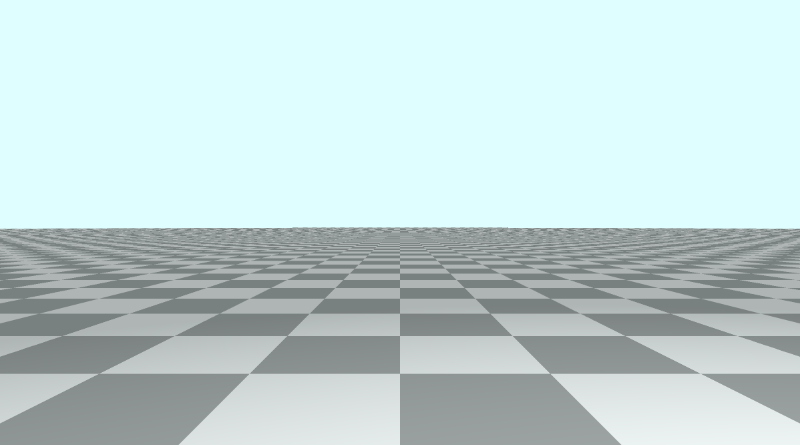
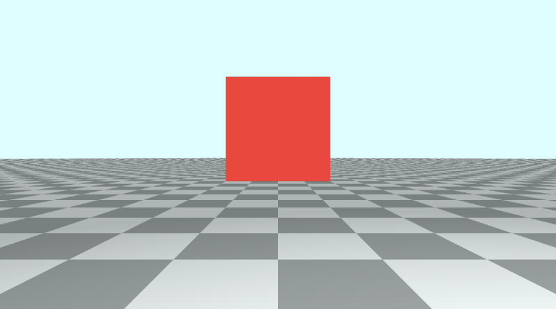
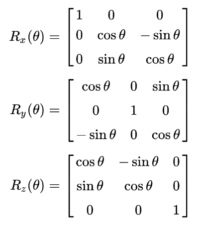
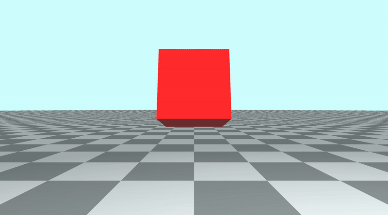
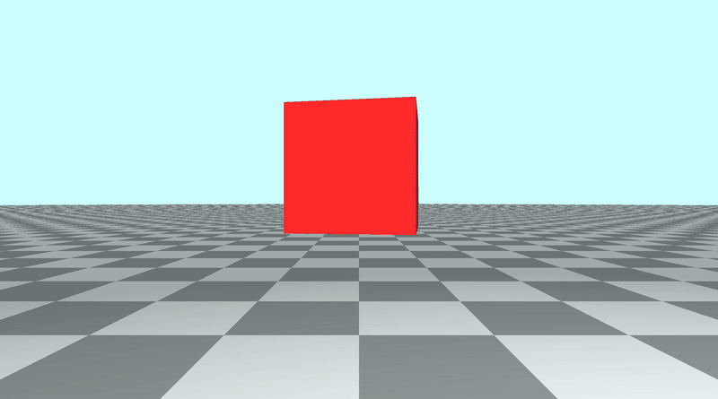
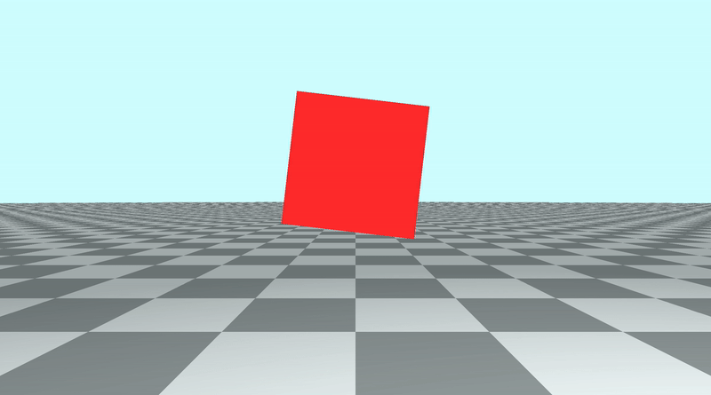
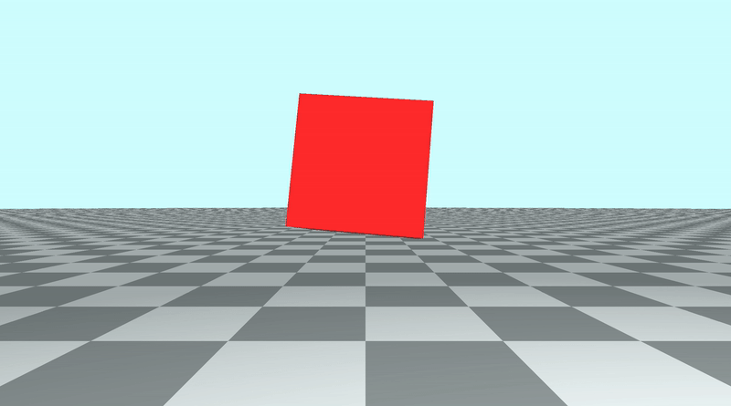
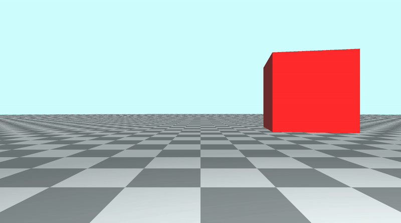

# 8.1 旋转

让我们创建一个新的着色器，并使用此 Shadertoy 系列的第 7 部分末尾的代码。但是，我们将删除球体。

```cpp
const int MAX_MARCHING_STEPS = 255;
const float MIN_DIST = 0.0;
const float MAX_DIST = 100.0;
const float PRECISION = 0.001;

struct Surface {
    float sd; // signed distance value
    vec3 col; // color
};

Surface sdFloor(vec3 p, vec3 col) {
  float d = p.y + 1.;
  return Surface(d, col);
}

Surface minWithColor(Surface obj1, Surface obj2) {
  if (obj2.sd < obj1.sd) return obj2;
  return obj1;
}

Surface sdScene(vec3 p) {
  vec3 floorColor = vec3(1. + 0.7*mod(floor(p.x) + floor(p.z), 2.0));
  Surface co = sdFloor(p, floorColor);
  return co;
}

Surface rayMarch(vec3 ro, vec3 rd, float start, float end) {
  float depth = start;
  Surface co; // closest object

  for (int i = 0; i < MAX_MARCHING_STEPS; i++) {
    vec3 p = ro + depth * rd;
    co = sdScene(p);
    depth += co.sd;
    if (co.sd < PRECISION || depth > end) break;
  }

  co.sd = depth;

  return co;
}

vec3 calcNormal(in vec3 p) {
    vec2 e = vec2(1.0, -1.0) * 0.0005; // epsilon
    return normalize(
      e.xyy * sdScene(p + e.xyy).sd +
      e.yyx * sdScene(p + e.yyx).sd +
      e.yxy * sdScene(p + e.yxy).sd +
      e.xxx * sdScene(p + e.xxx).sd);
}

void mainImage( out vec4 fragColor, in vec2 fragCoord )
{
  vec2 uv = (fragCoord-.5*iResolution.xy)/iResolution.y;
  vec3 backgroundColor = vec3(0.835, 1, 1);

  vec3 col = vec3(0);
  vec3 ro = vec3(0, 0, 3); // ray origin that represents camera position
  vec3 rd = normalize(vec3(uv, -1)); // ray direction

  Surface co = rayMarch(ro, rd, MIN_DIST, MAX_DIST); // closest object

  if (co.sd > MAX_DIST) {
    col = backgroundColor; // ray didn't hit anything
  } else {
    vec3 p = ro + rd * co.sd; // point on cube or floor we discovered from ray marching
    vec3 normal = calcNormal(p);
    vec3 lightPosition = vec3(2, 2, 7);
    vec3 lightDirection = normalize(lightPosition - p);

    float dif = clamp(dot(normal, lightDirection), 0.3, 1.); // diffuse reflection

    col = dif * co.col + backgroundColor * .2; // Add a bit of background color to the diffuse color
  }

  // Output to screen
  fragColor = vec4(col, 1.0);
}
```

运行代码后，您应该会看到平铺地板和浅蓝色背景色。
<p align="center"></p>

## 添加一个cube
接下来，我们将利用 `Inigo Quilez` 网站上的 [**3D SDF**](https://www.iquilezles.org/www/articles/distfunctions/distfunctions.htm) 列表来添加一个立方体。在`Primitives（图元）`部分下，您将找到一个标有`Box - exact`的 SDF，我们将使用它来渲染立方体。

```cpp
float sdBox( vec3 p, vec3 b )
{
  vec3 q = abs(p) - b;
  return length(max(q,0.0)) + min(max(q.x,max(q.y,q.z)),0.0);
}
```

为了使其与我们在上一个教程中学到的代码兼容，并为对象添加唯一颜色，我们需要返回 `Surface` 类型的值，而不是浮点数。我们还将向函数添加两个参数：`offset` 和 `color`。

```cpp
Surface sdBox( vec3 p, vec3 b, vec3 offset, vec3 col)
{
  p = p - offset;
  vec3 q = abs(p) - b;
  float d = length(max(q,0.0)) + min(max(q.x,max(q.y,q.z)),0.0);
  return Surface(d, col);
}
```

第一个参数 `p` 是采样点，第二个参数 `b` 是表示框边界的 `vec3` 变量。使用 `x`、`y` 和 `z`分量控制长方体的宽度、高度和深度。如果我们使这三个值都相同，那么我们最终会得到一个立方体。

让我们在 3D 场景中插入一个立方体：

```cpp
Surface sdScene(vec3 p) {
  vec3 floorColor = vec3(1. + 0.7*mod(floor(p.x) + floor(p.z), 2.0));
  Surface co = sdFloor(p, floorColor);
  co = minWithColor(co, sdBox(p, vec3(1), vec3(0, 0.5, -4), vec3(1, 0, 0)));
  return co;
}
```

此立方体的尺寸为 `1x1x1`，位置为 `(0, 0.5, -4)`，颜色为红色。
<p align="center"></p>

## 旋转矩阵

在线性代数中，[**变换矩阵**](https://en.wikipedia.org/wiki/Transformation_matrix)用于对 `2D` 和 `3D` 形状执行各种操作：拉伸、挤压、旋转、剪切和反射。每个矩阵表示一个操作。

通过将图形上的点（或 `GLSL` 代码中的样本点）乘以转换矩阵，我们可以执行这些操作中的任何一个。我们还可以将这些变换矩阵中的任何一个相乘，以创建执行多个运算的新变换矩阵。

由于**矩阵乘法是不满足交换律**的，因此我们将矩阵相乘的顺序很重要。如果旋转形状，然后切变，则最终得到的结果与先切变后旋转的结果不同。同样，如果先沿 `x` 轴旋转形状，然后再沿 `z` 轴旋转形状，则如果颠倒这些作的顺序，则最终可能会得到不同的结果。

旋转矩阵是一种变换矩阵。我们来看看本教程中将使用的[**旋转矩阵**](https://en.wikipedia.org/wiki/Rotation_matrix#Basic_rotations)。

<p align="center"></p>
<p align="center">Rotation Matrices 来自 [维基百科](https://en.wikipedia.org/wiki/Rotation_matrix#Basic_rotations)上的数据</p>

在上图中，我们有三个旋转矩阵，每个旋转矩阵对应 3D 中的每个轴。这些将允许我们围绕轴旋转形状，就好像体操运动员绕着杠铃或杆子摆动一样。

在代码的顶部，让我们添加跨每个轴的旋转矩阵的函数。我们还将添加一个返回[**单位矩阵**](https://en.wikipedia.org/wiki/Identity_matrix)的函数，以便我们可以选择不执行任何类型的转换。

```cpp
// Rotation matrix around the X axis.
mat3 rotateX(float theta) {
    float c = cos(theta);
    float s = sin(theta);
    return mat3(
        vec3(1, 0, 0),
        vec3(0, c, -s),
        vec3(0, s, c)
    );
}

// Rotation matrix around the Y axis.
mat3 rotateY(float theta) {
    float c = cos(theta);
    float s = sin(theta);
    return mat3(
        vec3(c, 0, s),
        vec3(0, 1, 0),
        vec3(-s, 0, c)
    );
}

// Rotation matrix around the Z axis.
mat3 rotateZ(float theta) {
    float c = cos(theta);
    float s = sin(theta);
    return mat3(
        vec3(c, -s, 0),
        vec3(s, c, 0),
        vec3(0, 0, 1)
    );
}

// Identity matrix.
mat3 identity() {
    return mat3(
        vec3(1, 0, 0),
        vec3(0, 1, 0),
        vec3(0, 0, 1)
    );
}
```

我们现在需要调整 `sdBox` 函数以接受矩阵变换作为另一个参数。我们将采样点乘以旋转矩阵。在将采样点移动到由偏移量定义的某个世界坐标后，将应用此变换。

```cpp
Surface sdBox( vec3 p, vec3 b, vec3 offset, vec3 col, mat3 transform)
{
  p = (p - offset) * transform;
  vec3 q = abs(p) - b;
  float d = length(max(q,0.0)) + min(max(q.x,max(q.y,q.z)),0.0);
  return Surface(d, col);
}
```

然后我们需要修改 `sdScene` 函数，在对 `sdBox` 函数的调用中插入一个新参数：
```cpp
Surface sdScene(vec3 p) {
  vec3 floorColor = vec3(1. + 0.7*mod(floor(p.x) + floor(p.z), 2.0));
  Surface co = sdFloor(p, floorColor);
  co = minWithColor(co, sdBox(p, vec3(1), vec3(0, 0.5, -4), vec3(1, 0, 0), rotateX(iTime)));
  return co;
}
```
我们可以在 `rotateX`、`rotateY` 和 `rotateZ` 之间分别在 `x` 轴、`y` 轴和 `z`轴上旋转立方体。角度将设置为 `iTime`，因此我们可以看到立方体旋转随时间的动画效果。立方体的枢轴点将是它自己的中心。

下面是在调用 `sdBox` 函数时使用 `rotateX (iTime)` 沿 `x`轴旋转立方体的示例。
<p align="center"></p>

下面是在调用 `sdBox` 函数时使用 `rotateY（iTime）` 沿 `y` 轴旋转立方体的示例。
<p align="center"></p>

下面是在调用 `sdBox` 函数时使用 `rotateZ（iTime）` 沿 `z` 轴旋转立方体的示例。
<p align="center"></p>

为了防止任何类型的旋转，我们可以调用 `identity` 函数：
```cpp
Surface sdScene(vec3 p) {
  vec3 floorColor = vec3(1. + 0.7*mod(floor(p.x) + floor(p.z), 2.0));
  Surface co = sdFloor(p, floorColor);
  co = minWithColor(co, sdBox(p, vec3(1), vec3(0, 0.5, -4), vec3(1, 0, 0), identity())); // By using the identity matrix, the cube's orientation remains the same
  return co;
}
```

您还可以通过将各个矩阵转换相乘来组合它们。这将导致立方体同时在所有轴上旋转。

```cpp
Surface sdScene(vec3 p) {
  vec3 floorColor = vec3(1. + 0.7*mod(floor(p.x) + floor(p.z), 2.0));
  Surface co = sdFloor(p, floorColor);
  co = minWithColor(co, sdBox(
      p,
      vec3(1),
      vec3(0, 0.5, -4),
      vec3(1, 0, 0),
      rotateX(iTime) * rotateY(iTime) * rotateZ(iTime) // Combine rotation matrices
  ));
  return co;
}
```
<p align="center"></p>

您可以在下面找到已完成代码的示例：
```cpp
// Rotation matrix around the X axis.
mat3 rotateX(float theta) {
    float c = cos(theta);
    float s = sin(theta);
    return mat3(
        vec3(1, 0, 0),
        vec3(0, c, -s),
        vec3(0, s, c)
    );
}

// Rotation matrix around the Y axis.
mat3 rotateY(float theta) {
    float c = cos(theta);
    float s = sin(theta);
    return mat3(
        vec3(c, 0, s),
        vec3(0, 1, 0),
        vec3(-s, 0, c)
    );
}

// Rotation matrix around the Z axis.
mat3 rotateZ(float theta) {
    float c = cos(theta);
    float s = sin(theta);
    return mat3(
        vec3(c, -s, 0),
        vec3(s, c, 0),
        vec3(0, 0, 1)
    );
}

// Identity matrix.
mat3 identity() {
    return mat3(
        vec3(1, 0, 0),
        vec3(0, 1, 0),
        vec3(0, 0, 1)
    );
}

const int MAX_MARCHING_STEPS = 255;
const float MIN_DIST = 0.0;
const float MAX_DIST = 100.0;
const float PRECISION = 0.001;

struct Surface {
    float sd; // signed distance value
    vec3 col; // color
};

Surface sdBox( vec3 p, vec3 b, vec3 offset, vec3 col, mat3 transform)
{
  p = (p - offset) * transform;
  vec3 q = abs(p) - b;
  float d = length(max(q,0.0)) + min(max(q.x,max(q.y,q.z)),0.0);
  return Surface(d, col);
}

Surface sdFloor(vec3 p, vec3 col) {
  float d = p.y + 1.;
  return Surface(d, col);
}

Surface minWithColor(Surface obj1, Surface obj2) {
  if (obj2.sd < obj1.sd) return obj2;
  return obj1;
}

Surface sdScene(vec3 p) {
  vec3 floorColor = vec3(1. + 0.7*mod(floor(p.x) + floor(p.z), 2.0));
  Surface co = sdFloor(p, floorColor);
  co = minWithColor(co, sdBox(
      p,
      vec3(1),
      vec3(0, 0.5, -4),
      vec3(1, 0, 0),
      rotateX(iTime)*rotateY(iTime)*rotateZ(iTime) // Combine rotation matrices
  ));
  return co;
}

Surface rayMarch(vec3 ro, vec3 rd, float start, float end) {
  float depth = start;
  Surface co; // closest object

  for (int i = 0; i < MAX_MARCHING_STEPS; i++) {
    vec3 p = ro + depth * rd;
    co = sdScene(p);
    depth += co.sd;
    if (co.sd < PRECISION || depth > end) break;
  }

  co.sd = depth;

  return co;
}

vec3 calcNormal(in vec3 p) {
    vec2 e = vec2(1.0, -1.0) * 0.0005; // epsilon
    return normalize(
      e.xyy * sdScene(p + e.xyy).sd +
      e.yyx * sdScene(p + e.yyx).sd +
      e.yxy * sdScene(p + e.yxy).sd +
      e.xxx * sdScene(p + e.xxx).sd);
}

void mainImage( out vec4 fragColor, in vec2 fragCoord )
{
  vec2 uv = (fragCoord-.5*iResolution.xy)/iResolution.y;
  vec3 backgroundColor = vec3(0.835, 1, 1);

  vec3 col = vec3(0);
  vec3 ro = vec3(0, 0, 3); // ray origin that represents camera position
  vec3 rd = normalize(vec3(uv, -1)); // ray direction

  Surface co = rayMarch(ro, rd, MIN_DIST, MAX_DIST); // closest object

  if (co.sd > MAX_DIST) {
    col = backgroundColor; // ray didn't hit anything
  } else {
    vec3 p = ro + rd * co.sd; // point on cube or floor we discovered from ray marching
    vec3 normal = calcNormal(p);
    vec3 lightPosition = vec3(2, 2, 7);
    vec3 lightDirection = normalize(lightPosition - p);

    float dif = clamp(dot(normal, lightDirection), 0.3, 1.); // diffuse reflection

    col = dif * co.col + backgroundColor * .2; // Add a bit of background color to the diffuse color
  }

  // Output to screen
  fragColor = vec4(col, 1.0);
}
```

## 围绕枢轴点旋转
如果我们想让立方体看起来像是围绕一个不是立方体中心的外部枢轴点旋转，那么我们必须修改 `sdBox` 函数，以便在转换后将立方体移动一定距离。
```cpp
Surface sdBox( vec3 p, vec3 b, vec3 offset, vec3 col, mat3 transform)
{
  p = (p - offset) * transform - vec3(3, 0, 0); // Move the cube as it is rotating
  vec3 q = abs(p) - b;
  float d = length(max(q,0.0)) + min(max(q.x,max(q.y,q.z)),0.0);
  return Surface(d, col);
}
```

如果我们在 `sdScene` 函数中使用 `rotateY（iTime）`，立方体似乎会沿着距离立方体一定距离的枢轴点绕 `y` 轴旋转。在这个例子中，我们使用 `vec3（3， 0， 0）` 让立方体保持 `3` 个单位的距离，同时它围绕位于 `（0， 0.5， -4）` 的枢轴点旋转，这是我们在 `sdScene` 函数中分配给 `sdBox` 的偏移量。
<p align="center"></p>
以下是用于创建上述图像的完整代码：

```cpp
// Rotation matrix around the X axis.
mat3 rotateX(float theta) {
    float c = cos(theta);
    float s = sin(theta);
    return mat3(
        vec3(1, 0, 0),
        vec3(0, c, -s),
        vec3(0, s, c)
    );
}

// Rotation matrix around the Y axis.
mat3 rotateY(float theta) {
    float c = cos(theta);
    float s = sin(theta);
    return mat3(
        vec3(c, 0, s),
        vec3(0, 1, 0),
        vec3(-s, 0, c)
    );
}

// Rotation matrix around the Z axis.
mat3 rotateZ(float theta) {
    float c = cos(theta);
    float s = sin(theta);
    return mat3(
        vec3(c, -s, 0),
        vec3(s, c, 0),
        vec3(0, 0, 1)
    );
}

// Identity matrix.
mat3 identity() {
    return mat3(
        vec3(1, 0, 0),
        vec3(0, 1, 0),
        vec3(0, 0, 1)
    );
}

const int MAX_MARCHING_STEPS = 255;
const float MIN_DIST = 0.0;
const float MAX_DIST = 100.0;
const float PRECISION = 0.001;

struct Surface {
    float sd; // signed distance value
    vec3 col; // color
};

Surface sdBox( vec3 p, vec3 b, vec3 offset, vec3 col, mat3 transform)
{
  p = (p - offset) * transform - vec3(3, 0, 0); // Move the cube as it is rotating
  vec3 q = abs(p) - b;
  float d = length(max(q,0.0)) + min(max(q.x,max(q.y,q.z)),0.0);
  return Surface(d, col);
}

Surface sdFloor(vec3 p, vec3 col) {
  float d = p.y + 1.;
  return Surface(d, col);
}

Surface minWithColor(Surface obj1, Surface obj2) {
  if (obj2.sd < obj1.sd) return obj2;
  return obj1;
}

Surface sdScene(vec3 p) {
  vec3 floorColor = vec3(1. + 0.7*mod(floor(p.x) + floor(p.z), 2.0));
  Surface co = sdFloor(p, floorColor);
  co = minWithColor(co, sdBox(p, vec3(1), vec3(0, 0.5, -4), vec3(1, 0, 0), rotateY(iTime)));
  return co;
}

Surface rayMarch(vec3 ro, vec3 rd, float start, float end) {
  float depth = start;
  Surface co; // closest object

  for (int i = 0; i < MAX_MARCHING_STEPS; i++) {
    vec3 p = ro + depth * rd;
    co = sdScene(p);
    depth += co.sd;
    if (co.sd < PRECISION || depth > end) break;
  }

  co.sd = depth;

  return co;
}

vec3 calcNormal(in vec3 p) {
    vec2 e = vec2(1.0, -1.0) * 0.0005; // epsilon
    return normalize(
      e.xyy * sdScene(p + e.xyy).sd +
      e.yyx * sdScene(p + e.yyx).sd +
      e.yxy * sdScene(p + e.yxy).sd +
      e.xxx * sdScene(p + e.xxx).sd);
}

void mainImage( out vec4 fragColor, in vec2 fragCoord )
{
  vec2 uv = (fragCoord-.5*iResolution.xy)/iResolution.y;
  vec3 backgroundColor = vec3(0.835, 1, 1);

  vec3 col = vec3(0);
  vec3 ro = vec3(0, 0, 3); // ray origin that represents camera position
  vec3 rd = normalize(vec3(uv, -1)); // ray direction

  Surface co = rayMarch(ro, rd, MIN_DIST, MAX_DIST); // closest object

  if (co.sd > MAX_DIST) {
    col = backgroundColor; // ray didn't hit anything
  } else {
    vec3 p = ro + rd * co.sd; // point on cube or floor we discovered from ray marching
    vec3 normal = calcNormal(p);
    vec3 lightPosition = vec3(2, 2, 7);
    vec3 lightDirection = normalize(lightPosition - p);

    float dif = clamp(dot(normal, lightDirection), 0.3, 1.); // diffuse reflection

    col = dif * co.col + backgroundColor * .2; // Add a bit of background color to the diffuse color
  }

  // Output to screen
  fragColor = vec4(col, 1.0);
}
```

## 结论
在本教程中，我们学习了如何在 3D 空间中的每个轴上旋转立方体。我们还学习了如何围绕外部枢轴点旋转立方体，使其看起来像是围绕空间中的某个点旋转。您今天学到的知识也适用于所有其他 3D 对象。我们选择了立方体而不是球体，因为它更容易检查我们的旋转矩阵是否🙂起作用。


