# 9.1 摄像机移动

## 初始设置
让我们创建一个新着色器并添加以下样板代码。
```cpp
// Rotation matrix around the X axis.
mat3 rotateX(float theta) {
    float c = cos(theta);
    float s = sin(theta);
    return mat3(
        vec3(1, 0, 0),
        vec3(0, c, -s),
        vec3(0, s, c)
    );
}

// Rotation matrix around the Y axis.
mat3 rotateY(float theta) {
    float c = cos(theta);
    float s = sin(theta);
    return mat3(
        vec3(c, 0, s),
        vec3(0, 1, 0),
        vec3(-s, 0, c)
    );
}

// Rotation matrix around the Z axis.
mat3 rotateZ(float theta) {
    float c = cos(theta);
    float s = sin(theta);
    return mat3(
        vec3(c, -s, 0),
        vec3(s, c, 0),
        vec3(0, 0, 1)
    );
}

// Identity matrix.
mat3 identity() {
    return mat3(
        vec3(1, 0, 0),
        vec3(0, 1, 0),
        vec3(0, 0, 1)
    );
}

const int MAX_MARCHING_STEPS = 255;
const float MIN_DIST = 0.0;
const float MAX_DIST = 100.0;
const float PRECISION = 0.001;

struct Surface {
    float sd; // signed distance value
    vec3 col; // color
};

Surface sdBox( vec3 p, vec3 b, vec3 offset, vec3 col, mat3 transform)
{
  p = (p - offset) * transform; // apply transformation matrix
  vec3 q = abs(p) - b;
  float d = length(max(q,0.0)) + min(max(q.x,max(q.y,q.z)),0.0);
  return Surface(d, col);
}

Surface sdFloor(vec3 p, vec3 col) {
  float d = p.y + 1.;
  return Surface(d, col);
}

Surface minWithColor(Surface obj1, Surface obj2) {
  if (obj2.sd < obj1.sd) return obj2;
  return obj1;
}

Surface sdScene(vec3 p) {
  vec3 floorColor = vec3(1. + 0.7*mod(floor(p.x) + floor(p.z), 2.0));
  Surface co = sdFloor(p, floorColor);
  co = minWithColor(co, sdBox(p, vec3(1), vec3(0, 0.5, -4), vec3(1, 0, 0), identity()));
  return co;
}

Surface rayMarch(vec3 ro, vec3 rd, float start, float end) {
  float depth = start;
  Surface co; // closest object

  for (int i = 0; i < MAX_MARCHING_STEPS; i++) {
    vec3 p = ro + depth * rd;
    co = sdScene(p);
    depth += co.sd;
    if (co.sd < PRECISION || depth > end) break;
  }

  co.sd = depth;

  return co;
}

vec3 calcNormal(in vec3 p) {
    vec2 e = vec2(1.0, -1.0) * 0.0005; // epsilon
    return normalize(
      e.xyy * sdScene(p + e.xyy).sd +
      e.yyx * sdScene(p + e.yyx).sd +
      e.yxy * sdScene(p + e.yxy).sd +
      e.xxx * sdScene(p + e.xxx).sd);
}

void mainImage( out vec4 fragColor, in vec2 fragCoord )
{
  vec2 uv = (fragCoord-.5*iResolution.xy)/iResolution.y;
  vec3 backgroundColor = vec3(0.835, 1, 1);

  vec3 col = vec3(0);
  vec3 ro = vec3(0, 0, 3); // ray origin that represents camera position
  vec3 rd = normalize(vec3(uv, -1)); // ray direction

  Surface co = rayMarch(ro, rd, MIN_DIST, MAX_DIST); // closest object

  if (co.sd > MAX_DIST) {
    col = backgroundColor; // ray didn't hit anything
  } else {
    vec3 p = ro + rd * co.sd; // point on cube or floor we discovered from ray marching
    vec3 normal = calcNormal(p);
    vec3 lightPosition = vec3(2, 2, 7);
    vec3 lightDirection = normalize(lightPosition - p);

    float dif = clamp(dot(normal, lightDirection), 0.3, 1.); // diffuse reflection

    col = dif * co.col + backgroundColor * .2; // Add a bit of background color to the diffuse color
  }

  // Output to screen
  fragColor = vec4(col, 1.0);
}
```
此代码将创建一个具有平铺地板、天空（背景色）和红色立方体的场景。它还包含我们在[**上一个教程**](/category/8-3d-旋转)中学到的旋转矩阵。

<p align="center"></p>

## 平移摄像机
平移摄像机实际上是非常基本的。摄像机当前正指向一个立方体，该立方体沿 `z` 轴与摄像机保持一定距离，略微漂浮在空中。由于我们的坐标系使用右手定则，因此 `z` 轴在远离相机时为负值，在靠近相机时为正值。

<p align="center">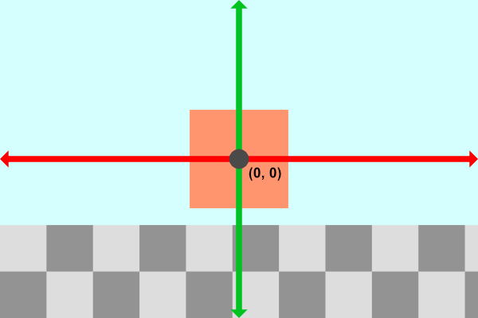</p>

我们的相机位于由变量 `ro` 定义的位置，该变量是光线原点。目前，它设置为等于 `vec3（0， 0， 3）`。要沿 `x` 方向平移相机，我们只需调整 `ro` 的 `x` 分量即可。

```cpp
vec3 ro = vec3(1, 0, 3);
```
我们的摄像机现在已经向右移动，这产生了将立方体向左移动的效果。
<p align="center">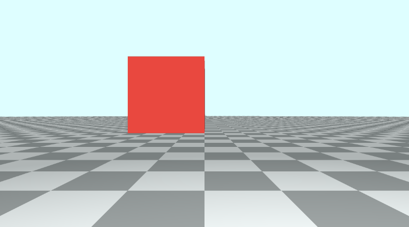</p>

同样，我们可以调整 `ro` 的 `y` 分量以向上或向下移动相机。
```cpp
vec3 ro = vec3(0, 1, 3);
```
向上移动摄像机具有向下移动立方体和地板的效果。

<p align="center">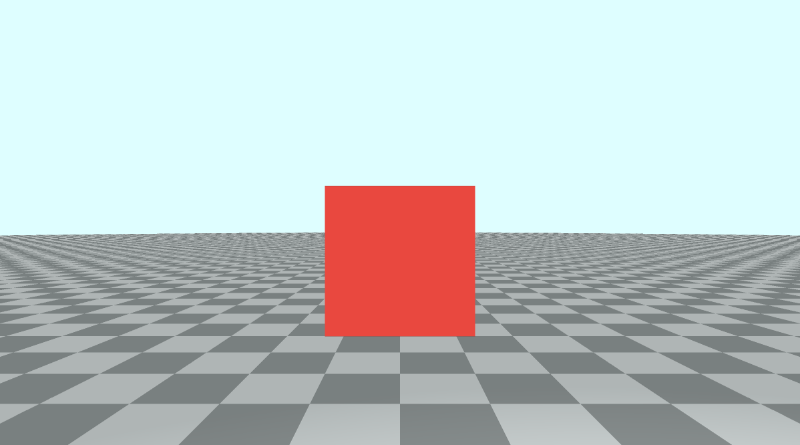</p>

您可以分别沿 `x` 轴和 `y` 轴使用 `cos` 和 `sin` 函数沿圆形路径平移相机。

```cpp
  vec3 ro = vec3(cos(iTime), sin(iTime) + 0.1, 3);
```
<p align="center">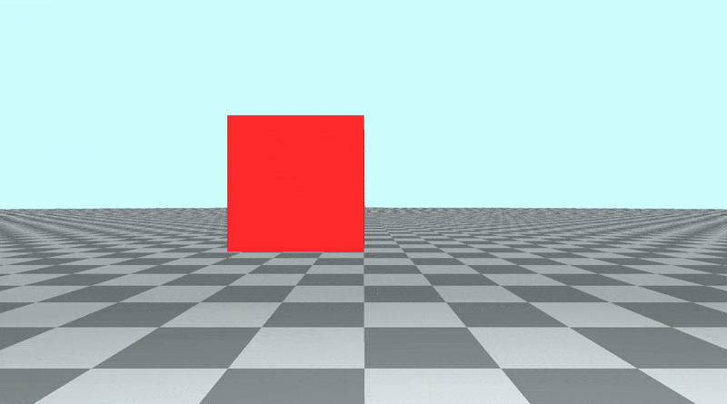</p>

显然，当你稍微浸入地板时，它开始看起来很奇怪，因此我在 `y`分量中添加了 `0.1` 以防止可能发生的闪烁效果。

## 倾斜/旋转相机
假设我们想保持相机位置 `ro` 相同，但我们想向上、向下、向左或向右倾斜相机。也许我们甚至想将相机完全转动，使相机以 `180` 度角旋转。这涉及将变换矩阵应用于光线方向 `rd`。

让我们将光线原点设置回正常状态：
```cpp
vec3 ro = vec3(0, 0, 3);
```

立方体现在应该看起来在画布上居中。目前，我们的侧视图场景类似于下图：
<p align="center">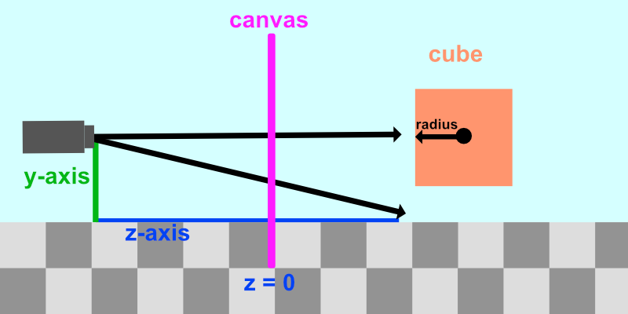</p>

我们希望保持摄像机位置不变，但能够向任何方向倾斜。假设我们想将相机向上倾斜。我们的场景将类似于下图：
<p align="center">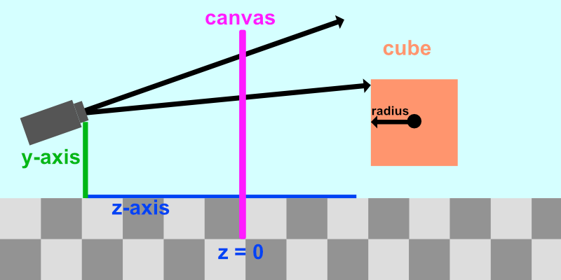</p>

**请注意，从摄像机射出的光线也是向上倾斜的。倾斜摄像机意味着倾斜从摄像机发射的所有光线。**

倾斜相机类似于[**飞机主轴**](https://en.wikipedia.org/wiki/Aircraft_principal_axes)。
<p align="center">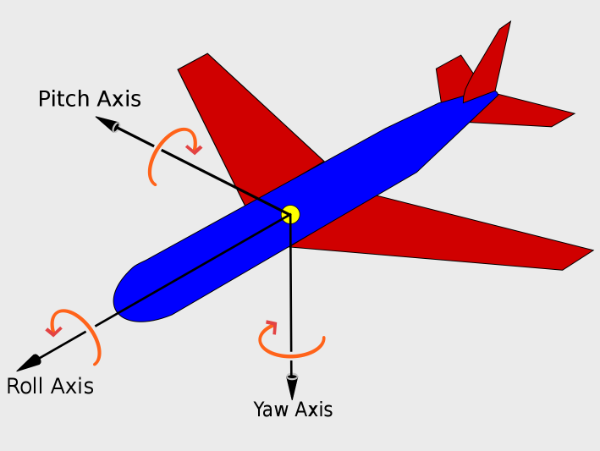</p>

摄像机不仅可以沿 `x` 轴、`y` 轴或 `z` 轴平移，还可以沿三个旋转轴倾斜（或旋转）：俯仰、偏航和滚动。这意味着相机有六个自由度：三个位置轴和三个旋转轴。

<p align="center">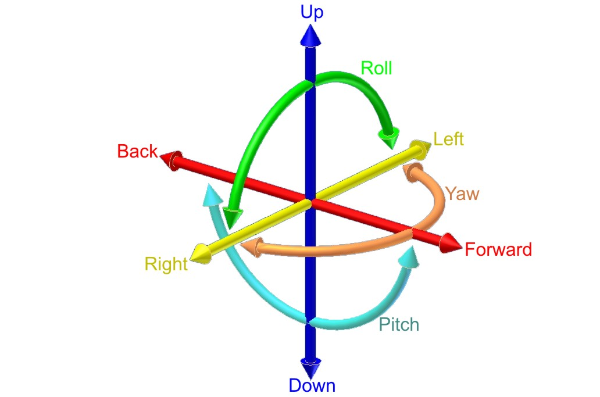</p>
<p align="center">六自由度 （DOF） 由 [**Simple English Wikipedia**](https://simple.wikipedia.org/wiki/Pitch,_yaw,_and_roll) 提供</p>

我们可以使用在上一个教程中使用的相同旋转矩阵来应用俯仰、偏航和滚动。

使用 `rotateX` 函数应用 **俯仰（pitch）**，使用 `rotateY` 函数应用 **偏转（yaw）**，使用 `rotateZ` 函数应用 **滚动 （roll）**。

如果我们想向上/向下倾斜相机，或应用 `pitch`，那么我们需要将 `rotateX` 函数应用于光线方向 `rd`。

```cpp
vec3 rd = normalize(vec3(uv, -1));
rd *= rotateX(0.3);
```

我们只需将光线方向乘以一个或多个旋转矩阵即可倾斜相机。这将倾斜从摄像机发射的每条光线的方向，从而改变我们在 `Shadertoy` 画布中看到的视图。

让我们为倾斜设置动画，使 `pitch` 角度在 `-0.5` 和 `0.5` 之间振荡。

```cpp
vec3 rd = normalize(vec3(uv, -1));
rd *= rotateX(sin(iTime) * 0.5);
```
<p align="center">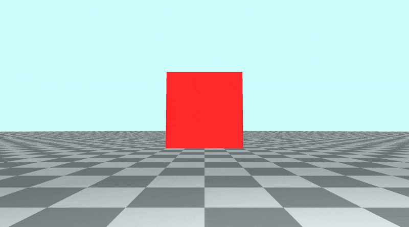</p>

要向左/向右倾斜相机，或应用 `yaw`，我们需要应用 `rotateY` 函数。

```cpp
vec3 rd = normalize(vec3(uv, -1));
rd *= rotateY(sin(iTime) * 0.5);
```
<p align="center">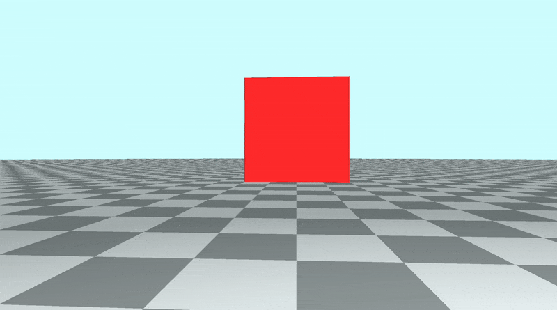</p>

要将相机从一侧倾斜到另一侧，或应用 `滚动`，我们需要应用 `rotateZ` 函数。做一个桶滚！🐰

```cpp
vec3 rd = normalize(vec3(uv, -1));
rd *= rotateZ(sin(iTime) * 0.5);
```

<p align="center"></p>

## 将相机旋转 360 度
我们还可以在负 pi 和正 pi 之间应用偏航，以围绕完整的 360 度角旋转场景。

```cpp
const float PI = 3.14159265359;
vec3 rd = normalize(vec3(uv, -1));
rd *= rotateY(sin(iTime * 0.5) * PI); // 0.5 is used to slow the animation down
```

<p align="center"></p>

当你看向相机后面时，你可能会在地面上发现一个发光点。这个发光点是光源的位置，当前设置为 `vec3 (2, 2, 7)`。由于正 `z` 轴通常设置为位于相机后面，因此当您转动相机时，您最终会看到光线。

<p align="center">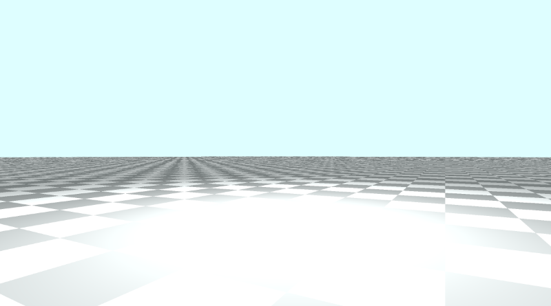</p>

您认为发光点是愚人节的笑话，但它实际上是[**第 6 部分**](/category/6-使用-ray-marching)中漫反射计算的结果。

```cpp
float dif = clamp(dot(normal, lightDirection), 0.3, 1.);
col = dif * co.col + backgroundColor * .2;
```
由于我们根据漫反射和表面法线为地板着色，因此在光照位置所在的位置，地板看起来最亮。如果要删除此太阳黑子，则必须从照明计算中删除地板。

通常，这应该不是问题，因为光线在相机后面。如果您想让场景的地板上摄像机转动，那么您可能需要删除发光点。

消除我喜欢称之为`太阳黑子`或`太阳眩光`的一种方法是为场景中的每个对象分配一个 `ID`。然后，在执行光线行进后，您可以通过检查地板是否是场景中最近的对象，从照明计算中删除地板。

```cpp
// Rotation matrix around the X axis.
mat3 rotateX(float theta) {
    float c = cos(theta);
    float s = sin(theta);
    return mat3(
        vec3(1, 0, 0),
        vec3(0, c, -s),
        vec3(0, s, c)
    );
}

// Rotation matrix around the Y axis.
mat3 rotateY(float theta) {
    float c = cos(theta);
    float s = sin(theta);
    return mat3(
        vec3(c, 0, s),
        vec3(0, 1, 0),
        vec3(-s, 0, c)
    );
}

// Rotation matrix around the Z axis.
mat3 rotateZ(float theta) {
    float c = cos(theta);
    float s = sin(theta);
    return mat3(
        vec3(c, -s, 0),
        vec3(s, c, 0),
        vec3(0, 0, 1)
    );
}

// Identity matrix.
mat3 identity() {
    return mat3(
        vec3(1, 0, 0),
        vec3(0, 1, 0),
        vec3(0, 0, 1)
    );
}

const int MAX_MARCHING_STEPS = 255;
const float MIN_DIST = 0.0;
const float MAX_DIST = 100.0;
const float PRECISION = 0.001;

struct Surface {
    float sd; // signed distance value
    vec3 col; // color
    int id; // identifier for each surface/object
};

/*
Surface IDs:
1. Floor
2. Box
*/

Surface sdBox( vec3 p, vec3 b, vec3 offset, vec3 col, mat3 transform)
{
  p = (p - offset) * transform;
  vec3 q = abs(p) - b;
  float d = length(max(q,0.0)) + min(max(q.x,max(q.y,q.z)),0.0);
  return Surface(d, col, 2);
}

Surface sdFloor(vec3 p, vec3 col) {
  float d = p.y + 1.;
  return Surface(d, col, 1);
}

Surface minWithColor(Surface obj1, Surface obj2) {
  if (obj2.sd < obj1.sd) return obj2;
  return obj1;
}

Surface sdScene(vec3 p) {
  vec3 floorColor = vec3(.5 + 0.3*mod(floor(p.x) + floor(p.z), 2.0));
  Surface co = sdFloor(p, floorColor);
  co = minWithColor(co, sdBox(p, vec3(1), vec3(0, 0.5, -4), vec3(1, 0, 0), identity()));
  return co;
}

Surface rayMarch(vec3 ro, vec3 rd, float start, float end) {
  float depth = start;
  Surface co; // closest object

  for (int i = 0; i < MAX_MARCHING_STEPS; i++) {
    vec3 p = ro + depth * rd;
    co = sdScene(p);
    depth += co.sd;
    if (co.sd < PRECISION || depth > end) break;
  }

  co.sd = depth;

  return co;
}

vec3 calcNormal(in vec3 p) {
    vec2 e = vec2(1.0, -1.0) * 0.0005; // epsilon
    return normalize(
      e.xyy * sdScene(p + e.xyy).sd +
      e.yyx * sdScene(p + e.yyx).sd +
      e.yxy * sdScene(p + e.yxy).sd +
      e.xxx * sdScene(p + e.xxx).sd);
}

void mainImage( out vec4 fragColor, in vec2 fragCoord )
{
  vec2 uv = (fragCoord-.5*iResolution.xy)/iResolution.y;
  vec3 backgroundColor = vec3(0.835, 1, 1);

  vec3 col = vec3(0);
  vec3 ro = vec3(0, 0, 3); // ray origin that represents camera position

  const float PI = 3.14159265359;
  vec3 rd = normalize(vec3(uv, -1));
  rd *= rotateY(sin(iTime * 0.5) * PI); // 0.5 is used to slow the animation down

  Surface co = rayMarch(ro, rd, MIN_DIST, MAX_DIST); // closest object

  if (co.sd > MAX_DIST) {
    col = backgroundColor; // ray didn't hit anything
  } else {
    vec3 p = ro + rd * co.sd; // point on cube or floor we discovered from ray marching
    vec3 normal = calcNormal(p);

    // check material ID
    if( co.id == 1 ) // floor
    {
        col = co.col;
    } else {
      // lighting
      vec3 lightPosition = vec3(2, 2, 7);
      vec3 lightDirection = normalize(lightPosition - p);

      // color
      float dif = clamp(dot(normal, lightDirection), 0.3, 1.); // diffuse reflection
      col = dif * co.col + backgroundColor * .2; // Add a bit of background color to the diffuse color
    }
  }

  // Output to screen
  fragColor = vec4(col, 1.0);
}
```

使用这种方法，地板照明看起来会有点不同，但太阳黑子会消失！
<p align="center"></p>

通过为每个表面、材质或对象分配 **ID**，我们可以跟踪在执行光线行进后被光线击中的对象。这对于应用一个或多个对象唯一的光照或着色计算非常有用。