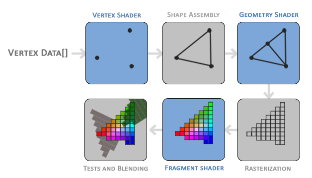
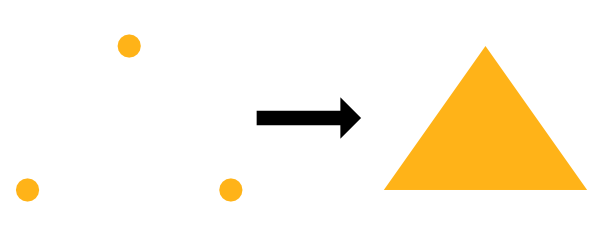
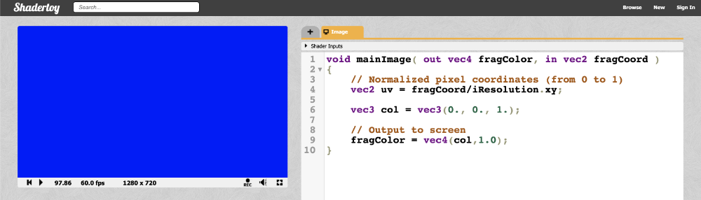
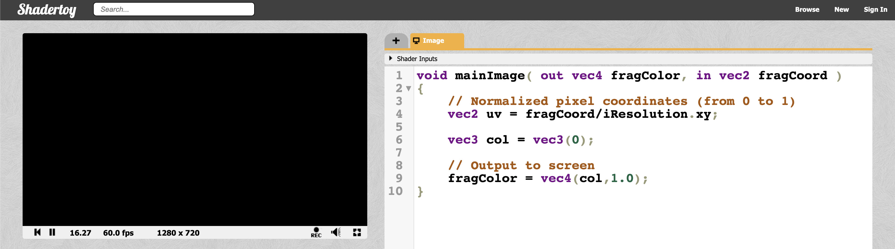
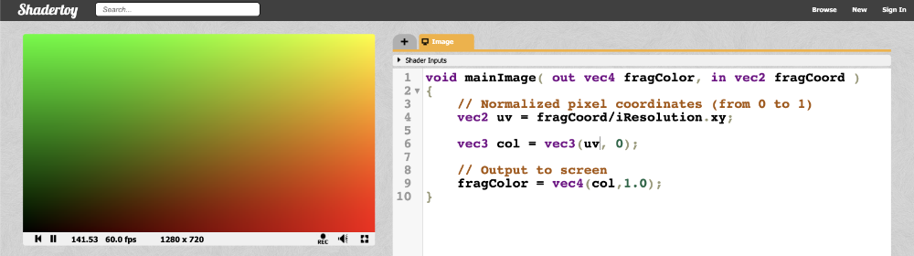

# 写在我们正式开始前

先贴一个我自己写的 [**Shadertoy**](https://www.shadertoy.com/view/XX3cDr) 是我自己头像的 **Voxel Art Avatar**      
网站至少你应该注册过了吧，Emmm..可以去给我[**点个赞**](https://www.shadertoy.com/view/XX3cDr)，哈哈 :)
<div style={{ width: '100%', height: 0, paddingBottom: '56.25%', position: 'relative' }}>
  <iframe 
    src="https://www.shadertoy.com/embed/XX3cDr?gui=true&t=10&paused=false&muted=false" 
    style={{ position: 'absolute', top: 0, left: 0, width: '100%', height: '100%', border: '1px solid #ccc' }}
    frameBorder="1" 
    allowFullScreen
    title="Shadertoy Frame"
  />
</div>

##### 注：本教程翻译自 [**Nathan Vaughn**](https://inspirnathan.com/about) 博客上的 [**Shadertoy 英文教程**](https://inspirnathan.com/posts/47-shadertoy-tutorial-part-1)，有兴趣的可以去观摩学习英文原版。
 
你好！我的朋友，我最近对着色器以及它们的神奇之处着迷。今天，我将讨论如何使用一个名为 [Shadertoy](https://www.shadertoy.com/) 的出色在线工具创建像素着色器，该工具由两位非常有才华的人 [Inigo Quilez](https://www.iquilezles.org/) 和 [Pol Jeremias](http://www.poljeremias.com/) 创建。

## 什么是着色器（Shader）？
[着色器(Shader)](https://en.wikipedia.org/wiki/Shader)是功能强大的程序，最初用于对 3D 场景中的对象进行着色。如今，着色器有多种用途。着色器程序通常在计算机的图形处理单元 （GPU） 上运行，它们可以在其中并行运行。
:::tip tip

了解着色器在 GPU 上并行运行非常重要。你写的程序将同时为 Shadertoy 中的每个像素独立运行。

:::
[高级着色语言 （HLSL）](https://en.wikipedia.org/wiki/High-Level_Shading_Language) 和 [OpenGL 着色语言 （GLSL）](https://en.wikipedia.org/wiki/OpenGL_Shading_Language) 等着色器语言是用于对 GPU 渲染管道进行编程的最常用语言。这些语言的语法类似于 [C 编程语言](https://en.wikipedia.org/wiki/C_(programming_language))。

当你玩 Minecraft 等游戏时，着色器用于使世界看起来是 3D，因为你从 2D 屏幕（即计算机显示器或手机屏幕）查看世界。着色器还可以通过调整光线与对象的交互方式或对象在屏幕上的渲染方式来彻底改变游戏的外观。此 [YouTube 视频](https://www.youtube.com/watch?v=1BnNAu_L4FA)展示了 10 个着色器，它们可以使 Minecraft 看起来完全不同并展示着色器的美感。


通常我们会看到着色器有两种形式：顶点着色器（vertex shaders）和片段着色器（fragment shaders）。顶点着色器用于创建各种对象的 3D 网格的顶点，例如球体、立方体、大象、3D 游戏的主角等。来自顶点着色器的信息将传递给几何着色器（geometry shaders），然后几何着色器可以在片段着色器之前操作这些顶点或执行额外操作。你通常不会听到太多关于几何着色器的讨论。管道的最后一部分是片段着色器。片段着色器计算像素的最终颜色，并确定是否应向用户显示像素。


<p align="center"></p>
<p align="center">[Learn OpenGL](https://learnopengl.com/Getting-started/Hello-Triangle) 提供的管线渲染阶段</p>


例如，假设我们有一个顶点着色器，它以三角形的形式在屏幕上绘制三个点/顶点。一旦这些顶点传递到片段着色器，就可以自动填充每个顶点之间的像素颜色。GPU 非常了解如何**插值**。假设为顶点着色器中的每个顶点分配了颜色，则 GPU 可以在每个顶点之间插入颜色以填充三角形。

<p align="center"></p>

在 **Unity** 或 **Unreal** 等游戏引擎中，顶点着色器和片段着色器大量用于 3D 游戏。Unity 在着色器之上提供了一个称为 ShaderLab 的抽象，这是一种位于 HLSL 之上的语言，可帮助你更轻松地为游戏编写着色器。此外，Unity 还提供了一个名为 **Shader Graph** 的可视化工具，让你无需编写代码即可构建着色器。如果你在 Google 上搜索“Unity 着色器”，你会发现数百个执行许多不同功能的着色器。你可以创建着色器，使对象发光，使角色变得半透明，甚至创建将着色器应用于游戏整个视图的“图像效果”。可以使用着色器的方式有无数种。


你可能经常听到片段着色器被称为**像素着色器（pixel shaders）**。大多情况下术语“**片段着色器（ragment shader）**”更准确。而在某些应用程序（如 Shadertoy）中，需要将每个像素绘制到屏幕上，因此在该上下文中称它们为像素着色器貌似更有道理。


着色器还负责渲染游戏中的着色和光照，但它们的用途远不止于此。着色器程序可以在 GPU 上运行，那么为什么不利用它提供的并行化呢？你可以创建一个**计算着色器（compute shader）**，在 GPU 而不是 CPU 中运行大量计算。事实上，**Tensorflow.js** 利用 GPU 在浏览器中更快地训练机器学习模型。


## 什么是 Shadertoy？

在接下来的系列文章中，我将讨论 Shadertoy。Shadertoy 是一个帮助用户创建像素着色器并与他人共享的网站，类似于带有 HTML、CSS 和 JavaScript 的 **Codepen**。
:::tip tip

在学习本教程时，请确保你使用的是支持 WebGL 2.0 的现代浏览器，例如 Google Chrome。

:::

Shadertoy 利用 **WebGL API** 使用 GPU 在浏览器中渲染图形。WebGL 允许你在 GLSL 中编写着色器并支持硬件加速。也就是说，你可以利用 GPU 并行处理屏幕上的像素，以加快渲染速度。还记得在使用 **HTML Canvas API** 时必须使用 ctx.getContext（'2d'） 吗？Shadertoy 使用具有 webgl 上下文的画布而不是 2d，因此可以使用 WebGL 以更高的性能将像素绘制到屏幕上。
:::warning warning

尽管 Shadertoy 使用 GPU 来帮助提高渲染性能，但在打开执行大量计算的某人的 Shadertoy 着色器时，你的计算机速度可能会稍慢。请确保你计算机的 GPU 可以处理它，并了解它可能会很快耗尽设备的电池。

:::

现代 3D 游戏引擎（如 Unity 和 Unreal Engine）以及 3D 建模软件（如 Blender）运行速度非常快，因为它们同时使用顶点和片段着色器，并且可以为你执行大量优化。在 Shadertoy 中，你**无权访问顶点着色器**。你必须依靠**光线行进（Ray Marching）** 和 **符号距离场/函数 （SDF）** 等算法来渲染 3D 场景，这在计算上可能很昂贵。


请注意，在 Shadertoy 中编写着色器并不能保证它们可以在其他环境（如 Unity）中工作。你可能必须将 GLSL 代码转换为目标环境支持的语法，例如 HLSL。Shadertoy 还提供了在其他环境中可能不支持的全局变量。不过，不要让它阻止你！完全可以调整 Shadertoy 代码并在游戏或建模软件中使用它们。它只需要一些额外的工作。事实上，**Shadertoy 是在游戏引擎或建模软件中使用着色器之前对其进行试验的好方法**。


Shadertoy 是练习使用 GLSL 创建着色器的好方法，可帮助你更数学地思考。绘制 3D 场景需要大量的矢量运算。这在智力上是刺激性的，是向朋友炫耀你的技能的好方法。如果你浏览 Shadertoy，你会看到大量仅用数学和代码绘制的精美作品！一旦你掌握了 Shadertoy 的窍门，你就会发现它真的非常有趣！

## Shadertoy 简介
Shadertoy 负责设置支持 WebGL 的 HTML 画布，因此你只需担心使用 GLSL 编程语言编写着色器逻辑即可。缺点是，**Shadertoy 不允许你编写顶点着色器，而只允许你编写像素着色器**。它实质上提供了一个环境，用于试验着色器的片段端，因此你可以并行操作画布上的所有像素。

在 Shadertoy 的顶部导航栏上，你可以单击 **New** 以启动新的着色器。

<p align="center"></p>

让我们分析一下我们在屏幕上看到的一切。显然，我们在右侧看到一个用于编写 GLSL 代码的代码编辑器，但让我来介绍一下大多数可用的工具，按照上图中进行的编号。

1. 用于显示着色器代码输出的画布。你的着色器将针对画布中的每个像素并行运行。
2. 左：将时间倒回零。中间：播放/暂停着色器动画。右：自页面加载以来的时间（以秒为单位）。
3. 每秒帧数 （fps） 将让你知道你的计算机处理着色器的能力。通常运行在 60fps 左右或更低。
4. 画布分辨率（宽乘高）。这些值在 “iResolution” 全局变量中提供给你。
5. 左：通过按下、录制并再次按下来录制 html 视频。中间：调整着色器中播放音频的音量。右：按该符号可将画布展开至全屏模式。
6. 单击加号图标以添加其他脚本。缓冲区（A、B、C、D）可以使用 Shadertoy 提供的“通道”进行访问。使用 “Common” 在脚本之间共享代码。当想要编写生成音频的着色器时，请使用 “Sound”。使用 “Cubemap” 生成立方体贴图。 
7. 单击小箭头可查看 Shadertoy 提供的全局变量列表。你可以在着色器代码中使用这些变量。
8. 单击小箭头以编译着色器代码，并在画布中查看输出。你可以使用 Alt+Enter 或 Option+Enter 快速编译代码。你可以单击“Compiled in ...”查看编译后的代码。
9. Shadertoy 提供了四个通道，可以通过全局变量（如 “iChannel0”、“iChannel1 等”）在代码中访问这些通道。如果你单击其中一个通道，你可以以键盘、网络摄像头、音频等形式向着色器添加纹理或交互性。
10. Shadertoy 提供了在代码窗口中调整文本大小的选项。如果单击问号，则可以看到有关用于运行代码的编译器的信息。你还可以查看 Shadertoy 添加了哪些函数或输入。

Shadertoy 提供了一个很好的环境来编写 GLSL 代码，但请记住，它注入了变量、函数和其他实用程序，这可能使其与在其他环境中编写的 GLSL 代码略有不同。Shadertoy 提供这些功能是为了在开发着色器时为你提供方便。例如，变量“iTime”是一个全局变量，用于访问自页面加载以来经过的时间（以秒为单位）。

## 了解着色器代码

```cpp title="首次在 Shadertoy 中启动新着色器时，会发现以下代码："
void mainImage( out vec4 fragColor, in vec2 fragCoord )
{
  // Normalized pixel coordinates (from 0 to 1)
  vec2 uv = fragCoord/iResolution.xy;

  vec3 col = 0.5 + 0.5*cos(iTime+uv.xyx+vec3(0,2,4));

  // Output to screen
  fragColor = vec4(col,1.0);
}
```
可以通过按上图第 8 条中提到的小箭头来运行代码，或者按 Alt+Center 或 Option+Enter 作为键盘快捷键。

如果你以前从未使用过着色器，那也没关系！我将尽我所能解释你在 Shadertoy 中编写着色器时使用的 GLSL 语法。你马上就会注意到，这是一种静态类型的语言，如 C、C++、Java 和 C#。GLSL 也使用类型的概念。其中一些类型包括：bool （布尔值）、int （整数）、float （十进制） 和 vec （向量）。GLSL 还要求在每行的末尾放置分号。否则，编译器将引发错误。

在上面的代码片段中，我们定义了一个 mainImage 函数，该函数必须存在于 Shadertoy 着色器中。它不返回任何内容，因此返回类型为 void。它接受两个参数：fragColor 和 fragCoord。

你可能会对**in** 和 **out** 关键字迷惑。对于 Shadertoy，你通常只需在 mainImage 函数中考虑这些关键字。还记得我说过着色器允许我们为 GPU 渲染管道编写程序吗？将 in 和 out 视为输入和输出。Shadertoy 为我们提供了一个输入，我们将写入一个颜色作为输出。

在继续之前，让我们将代码更改为更简单的代码：
```cpp title="glsl"
void mainImage( out vec4 fragColor, in vec2 fragCoord )
{
  // Normalized pixel coordinates (from 0 to 1)
  vec2 uv = fragCoord/iResolution.xy;

  vec3 col = vec3(0., 0., 1.); // RGB values

  // Output to screen
  fragColor = vec4(col,1.0);
}
```

当我们运行着色器程序时，我们应该最终得到一个完全蓝色的画布。着色器程序对画布上的每个像素**同时（IN PARALLEL）** 运行。请记住这一点非常重要。您必须考虑如何编写代码，以便根据像素坐标更改像素的颜色。事实证明，我们只需像素坐标就可以创作出令人惊叹的艺术品！

<p align="center"></p>

在着色器中，我们使用介于 0 和 1 之间的范围指定 RGB（红色、绿色、蓝色）值。如果颜色值介于 0 和 255 之间，则可以通过除以 255 来规范化它们。

我们已经了解了如何更改画布的颜色，但是我们的着色器程序内部发生了什么？mainImage 函数中的第一行声明一个名为 uv 的变量，该变量的类型为 vec2。如果你还记得你在学校里的向量算术，这意味着我们有一个带有 “x” 分量和 “y” 分量的向量。类型为 vec3 的变量将具有额外的 “z” 分量。

您可能在学校里学过 3D 坐标系。它允许我们在纸或其他一些平面上绘制 3D 坐标。显然，在 2D 表面上可视化 3D 有点困难，因此古代杰出的数学家创建了一个 3D 坐标系来帮助我们可视化 3D 空间中的点。

但是，您应该将着色器代码中的向量视为可以容纳 1 到 4 个值的“数组”。有时，矢量可以保存有关 3D 空间中 XYZ 坐标的信息，也可以包含有关 RGB 值的信息。因此，以下内容在着色器程序中是等效的：

```
color.r = color.x
color.g = color.y
color.b = color.z
color.a = color.w
```

是的，可以有类型为 vec4 的变量，字母 w 或 a 用于表示第四个值。a 代表“alpha”，因为颜色可以具有 alpha 通道以及正常的 RGB 值。我猜他们选择 w 是因为它在字母表中的 x 之前，而且他们已经到达了最后一个字母🤷。

**uv 变量**实际上并不代表任何事物的首字母缩略词。它指的是 UV 映射主题，通常用于在 3D 对象上映射纹理片段（例如图像）。与 Shadertoy 不同，UV 映射的概念更适用于允许您访问顶点着色器的环境，但您仍然可以在 Shadertoy 中利用纹理数据。

**fragCoord 变量**表示画布的 XY 坐标。左下角从 （0， 0） 开始，右上角是 （iResolution.x， iResolution.y）。通过将 fragCoord 除以 iResolution.xy，我们能够标准化 0 和 1 之间的像素坐标。

请注意，我们可以很容易地在两个相同类型的变量之间执行算术运算，即使它们是向量。这与对单个组件执行操作相同：

```cpp
uv = fragCoord/iResolution.xy

// The above is the same as:
uv.x = fragCoord.x/iResolution.x
uv.y = fragCoord.y/iResolution.y
```

当我们使用 iResolution.xy ，.xy 部分仅指矢量的 XY 分量。这样，即使 iResolution 恰好是 vec3 类型，我们也只剥离我们关心的向量的分量。

根据这篇 [**Stack Overflow 博文**](https://stackoverflow.com/questions/27888323/what-does-iresolution-mean-in-a-shader)，z 分量表示像素纵横比，通常为 1.0。值为 1 表示您的显示器具有方形像素。您通常不会看到人们那么频繁地使用 iResolution 的 z 分量（如果有的话）。

我们也可以在定义 vector 时使用简单的方式。下面的代码片段将整个画布的颜色设置为黑色。
```cpp
void mainImage( out vec4 fragColor, in vec2 fragCoord )
{
  // Normalized pixel coordinates (from 0 to 1)
  vec2 uv = fragCoord/iResolution.xy;

  vec3 col = vec3(0); // Same as vec3(0, 0, 0)

  // Output to screen
  fragColor = vec4(col,1.0);
}
```
<p align="center"></p>
当我们定义一个向量时，着色器代码足够智能，如果只指定一个值，则可以在向量的所有值上应用相同的值。因此 vec3（0） 扩展为 vec3（0,0,0）。

:::tip tip

如果您尝试使用小于零的值作为输出片段颜色，它将被限制为零。同样，任何大于 1 的值都将被限制为 1。这仅适用于最终片段颜色中的颜色值。

:::

请务必记住，在 Shadertoy 和大多数着色器环境中进行调试通常主要是可视化的。**你没有像 console.log 这样的东西来拯救你。您必须使用颜色来帮助您调试。**

让我们尝试使用以下代码在屏幕上可视化像素坐标：

```cpp
void mainImage( out vec4 fragColor, in vec2 fragCoord )
{
  // Normalized pixel coordinates (from 0 to 1)
  vec2 uv = fragCoord/iResolution.xy;

  vec3 col = vec3(uv, 0); // This is the same as vec3(uv.x, uv.y, 0)

  // Output to screen
  fragColor = vec4(col,1.0);
}
```

我们最终应该得到一张混合了黑色、红色、绿色和黄色的画布。
<p align="center"></p>

这看起来很漂亮，但它对我们有什么帮助呢？uv 变量表示 x 轴和 y 轴上介于 0 和 1 之间的标准化画布坐标。画布的左下角有坐标 (0, 0)。画布的右上角为坐标 (1, 1)。

在 col 变量中，我们将其设置为等于 (uv.x, uv.y, 0)，这意味着画布中不应出现任何蓝色。当 uv.x 和 uv.y 等于 0 时，我们得到黑色。当它们都等于 1 时，我们就会得到黄色，因为在计算机图形学中，黄色是红色和绿色值的组合。画布的左上角是 (0, 1)，这意味着 col 变量等于 (0, 1, 0)，即绿色。右下角的坐标为 (1, 0)，这意味着 col 等于 (1, 0, 0)，即红色。

## 结论

唷！在本文中，我介绍了许多有关着色器和 Shadertoy 的信息。我希望你还和我在一起！当我第一次学习着色器时，就像进入了一个全新的编程领域。这与我习惯的完全不同，但它令人兴奋且具有挑战性！在接下来的系列文章中，我将讨论如何在画布上创建形状并制作动画！