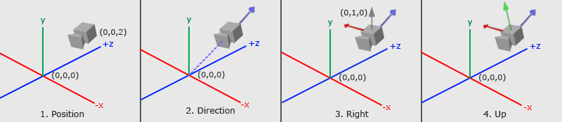
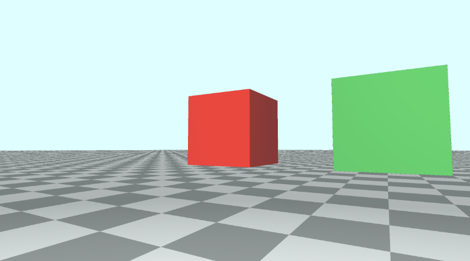
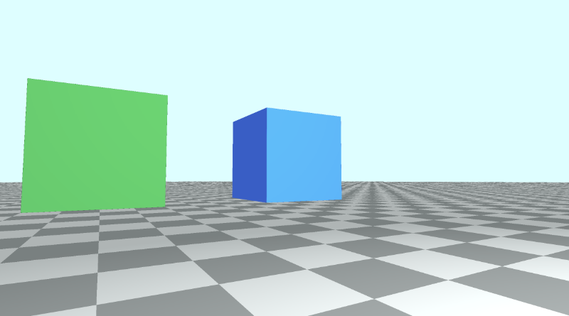
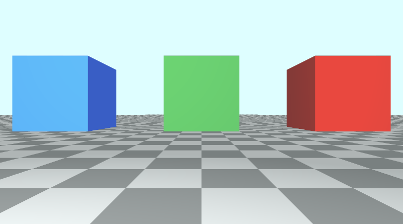
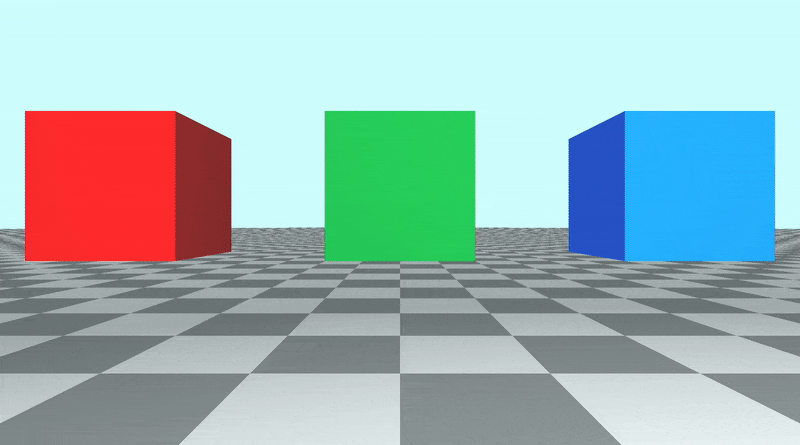

# 10.1 带有观察点的相机模型

## 初始设置
让我们创建一个新的着色器，并添加以下我们将用于本教程的样板代码。请注意现在如何在代码顶部定义常量。

```cpp
// Constants
const int MAX_MARCHING_STEPS = 255;
const float MIN_DIST = 0.0;
const float MAX_DIST = 100.0;
const float PRECISION = 0.001;
const float EPSILON = 0.0005;
const float PI = 3.14159265359;

// Rotation matrix around the X axis.
mat3 rotateX(float theta) {
    float c = cos(theta);
    float s = sin(theta);
    return mat3(
        vec3(1, 0, 0),
        vec3(0, c, -s),
        vec3(0, s, c)
    );
}

// Rotation matrix around the Y axis.
mat3 rotateY(float theta) {
    float c = cos(theta);
    float s = sin(theta);
    return mat3(
        vec3(c, 0, s),
        vec3(0, 1, 0),
        vec3(-s, 0, c)
    );
}

// Rotation matrix around the Z axis.
mat3 rotateZ(float theta) {
    float c = cos(theta);
    float s = sin(theta);
    return mat3(
        vec3(c, -s, 0),
        vec3(s, c, 0),
        vec3(0, 0, 1)
    );
}

// Identity matrix.
mat3 identity() {
    return mat3(
        vec3(1, 0, 0),
        vec3(0, 1, 0),
        vec3(0, 0, 1)
    );
}

struct Surface {
    float sd; // signed distance value
    vec3 col; // color
};

Surface sdBox( vec3 p, vec3 b, vec3 offset, vec3 col, mat3 transform)
{
  p = (p - offset) * transform; // apply transformation matrix
  vec3 q = abs(p) - b;
  float d = length(max(q,0.0)) + min(max(q.x,max(q.y,q.z)),0.0);
  return Surface(d, col);
}

Surface sdFloor(vec3 p, vec3 col) {
  float d = p.y + 1.;
  return Surface(d, col);
}

Surface minWithColor(Surface obj1, Surface obj2) {
  if (obj2.sd < obj1.sd) return obj2;
  return obj1;
}

Surface sdScene(vec3 p) {
  vec3 floorColor = vec3(1. + 0.7*mod(floor(p.x) + floor(p.z), 2.0));
  Surface co = sdFloor(p, floorColor);
  co = minWithColor(co, sdBox(p, vec3(1), vec3(-4, 0.5, -4), vec3(1, 0, 0), identity())); // left cube
  co = minWithColor(co, sdBox(p, vec3(1), vec3(0, 0.5, -4), vec3(0, 0.65, 0.2), identity())); // center cube
  co = minWithColor(co, sdBox(p, vec3(1), vec3(4, 0.5, -4), vec3(0, 0.55, 2), identity())); // right cube
  return co;
}

Surface rayMarch(vec3 ro, vec3 rd, float start, float end) {
  float depth = start;
  Surface co; // closest object

  for (int i = 0; i < MAX_MARCHING_STEPS; i++) {
    vec3 p = ro + depth * rd;
    co = sdScene(p);
    depth += co.sd;
    if (co.sd < PRECISION || depth > end) break;
  }

  co.sd = depth;

  return co;
}

vec3 calcNormal(in vec3 p) {
    vec2 e = vec2(1, -1) * EPSILON;
    return normalize(
      e.xyy * sdScene(p + e.xyy).sd +
      e.yyx * sdScene(p + e.yyx).sd +
      e.yxy * sdScene(p + e.yxy).sd +
      e.xxx * sdScene(p + e.xxx).sd);
}

void mainImage( out vec4 fragColor, in vec2 fragCoord )
{
  vec2 uv = (fragCoord-.5*iResolution.xy)/iResolution.y;
  vec3 backgroundColor = vec3(0.835, 1, 1);

  vec3 col = vec3(0);
  vec3 ro = vec3(0, 0, 3); // ray origin that represents camera position
  vec3 rd = normalize(vec3(uv, -1)); // ray direction

  Surface co = rayMarch(ro, rd, MIN_DIST, MAX_DIST); // closest object

  if (co.sd > MAX_DIST) {
    col = backgroundColor; // ray didn't hit anything
  } else {
    vec3 p = ro + rd * co.sd; // point on cube or floor we discovered from ray marching
    vec3 normal = calcNormal(p);
    vec3 lightPosition = vec3(2, 2, 7);
    vec3 lightDirection = normalize(lightPosition - p);

    float dif = clamp(dot(normal, lightDirection), 0.3, 1.); // diffuse reflection

    col = dif * co.col + backgroundColor * .2; // Add a bit of background color to the diffuse color
  }

  // Output to screen
  fragColor = vec4(col, 1.0);
}
```

此代码将生成一个包含三个立方体的场景，每个立方体具有不同的颜色：红色、绿色和蓝色。

<p align="center"></p>

## LookAt 点
目前，当我们想要移动相机时，我们必须调整光线原点的值。要倾斜相机，我们需要将光线方向乘以旋转矩阵。

另一种方法是创建一个接受相机位置（或光线原点）和注视点的相机函数。然后，此函数将返回一个 3x3 变换矩阵，我们可以将光线方向乘以该矩阵。

```cpp
mat3 camera(vec3 cameraPos, vec3 lookAtPoint) {
    vec3 cd = normalize(lookAtPoint - cameraPos); // camera direction
    vec3 cr = normalize(cross(vec3(0, 1, 0), cd)); // camera right
    vec3 cu = normalize(cross(cd, cr)); // camera up

    return mat3(-cr, cu, -cd);
}
```

要了解我们是如何得出这个矩阵的，让我们看看下图。它是在网站 [**Learn OpenGL**](https://learnopengl.com/) 上创建的，该网站是学习 OpenGL 图形 API 的绝佳资源。

<p align="center"></p>
<p align="center">由 [**Learn OpenGL**](https://learnopengl.com/Getting-started/Camera) 提供的摄像机/视图空间 提供</p>

上图传达了很多关于 `3x3` 矩阵是如何创建的。我们需要通过分析三个重要的摄像机向量来弄清楚摄像机的观察位置以及它的倾斜方式：`Camera direction`向量、`Camera right`向量和 `Camera up` 向量。

在第 `1` 步中，我们从相机位置`cameraPos`开始，该位置等于代码中的光线原点 `ro`。

在第 `2` 步中，我们创建一个相对于 `lookat` 点的相机方向向量。在图像中，观察点位于 `3D` 空间中的原点，但我们可以将此点移动到任何我们想要的任何位置。请注意摄像机方向如何指向远离摄像机的方向。这意味着它使用了我们在 第 `6` 部分 中了解的右手定则。

```cpp
vec3 cd = normalize(lookAtPoint - cameraPos); // camera direction
```

在步骤 `3` 中，有一个灰色矢量从摄像机直接指向上方。方向向量 `（0, 1, 0)` 表示 `y` 轴的单位向量。我们通过取 `y` 轴的单位向量和相机方向之间的叉积来创建“相机右”向量。这将创建指向摄像机右侧的红色矢量。

```cpp
normalize(cross(vec3(0, 1, 0), cd)); // camera right
```

在第 `4` 步中，我们通过取相机方向向量和 `camera right` 向量之间的叉积来找到 `camera up` 向量。此“相机向上”矢量在图像中由从相机伸出的绿色矢量表示。

```cpp
vec3 cu = normalize(cross(cd, cr)); // camera up
```

最后，我们通过将这些向量组合在一起来创建一个转换矩阵：

```cpp
mat3 camera(vec3 cameraPos, vec3 lookAtPoint) {
    vec3 cd = normalize(lookAtPoint - cameraPos); // camera direction
    vec3 cr = normalize(cross(vec3(0, 1, 0), cd)); // camera right
    vec3 cu = normalize(cross(cd, cr)); // camera up

    return mat3(-cr, cu, -cd); // negative signs can be turned positive (or vice versa) to flip coordinate space conventions
}
```

让我们看看 `camera` 函数的 `return` 语句：
```cpp
return mat3(-cr, cu, -cd);
```

正负从何而来？由我们来定义一个约定，即如何标记 3D 空间中每个轴的正方向或负方向。这是我将在本教程中使用的约定。我们很快就会看到当我们翻转方向时会发生什么。

## 应用相机矩阵

现在我们已经创建了一个 `camera` 函数，让我们在 `mainImage` 函数中使用它。我们将创建一个 `lookat` 点并将其传递给 `camera` 函数。然后，我们将它返回的矩阵乘以光线方向，类似于我们在[**第 9 部分**](/category/9-摄像机移动)中所做的。

```cpp
vec3 lp = vec3(0, 0, 0); // lookat point (aka camera target)
vec3 ro = vec3(0, 0, 3); // ray origin that represents camera position
vec3 rd = camera(ro, lp) * normalize(vec3(uv, -1)); // ray direction
```

当您运行代码时，场景看起来应该几乎相同。但是，摄像机现在以 3D 空间中的原点为目标。由于立方体离地面 0.5 个单位，因此摄像机会从中心略微倾斜。我们可以通过更改注视点来匹配绿色立方体的位置，从而将相机直接对准绿色立方体的中心。

```cpp
vec3 lp = vec3(0, 0.5, -4);
```

假设我们现在想查看红色立方体。它目前在 `3D` 空间中的位置为 `（-4， 0.5， -4）`。让我们更改 `lookat` 点以匹配该位置。

```cpp
vec3 lp = vec3(-4, 0.5, -4);
```

您应该看到摄像机现在指向红色立方体，并且它应该位于画布的中心。

<p align="center"></p>

现在让我们看看蓝色立方体。它在 `3D` 空间中的位置为 `（4， 0.5， -4）`，因此我们将 `lookat point` 更改为等于该值。

```cpp
vec3 lp = vec3(4, 0.5, -4);
```

您应该看到摄像机现在指向蓝色立方体，并且它应该位于画布的中心。
<p align="center"></p>

您可以在下面找到完成的代码：

```cpp
// Constants
const int MAX_MARCHING_STEPS = 255;
const float MIN_DIST = 0.0;
const float MAX_DIST = 100.0;
const float PRECISION = 0.001;
const float EPSILON = 0.0005;
const float PI = 3.14159265359;

// Rotation matrix around the X axis.
mat3 rotateX(float theta) {
    float c = cos(theta);
    float s = sin(theta);
    return mat3(
        vec3(1, 0, 0),
        vec3(0, c, -s),
        vec3(0, s, c)
    );
}

// Rotation matrix around the Y axis.
mat3 rotateY(float theta) {
    float c = cos(theta);
    float s = sin(theta);
    return mat3(
        vec3(c, 0, s),
        vec3(0, 1, 0),
        vec3(-s, 0, c)
    );
}

// Rotation matrix around the Z axis.
mat3 rotateZ(float theta) {
    float c = cos(theta);
    float s = sin(theta);
    return mat3(
        vec3(c, -s, 0),
        vec3(s, c, 0),
        vec3(0, 0, 1)
    );
}

// Identity matrix.
mat3 identity() {
    return mat3(
        vec3(1, 0, 0),
        vec3(0, 1, 0),
        vec3(0, 0, 1)
    );
}

struct Surface {
    float sd; // signed distance value
    vec3 col; // color
};

Surface sdBox( vec3 p, vec3 b, vec3 offset, vec3 col, mat3 transform)
{
  p = (p - offset) * transform; // apply transformation matrix
  vec3 q = abs(p) - b;
  float d = length(max(q,0.0)) + min(max(q.x,max(q.y,q.z)),0.0);
  return Surface(d, col);
}

Surface sdFloor(vec3 p, vec3 col) {
  float d = p.y + 1.;
  return Surface(d, col);
}

Surface minWithColor(Surface obj1, Surface obj2) {
  if (obj2.sd < obj1.sd) return obj2;
  return obj1;
}

Surface sdScene(vec3 p) {
  vec3 floorColor = vec3(1. + 0.7*mod(floor(p.x) + floor(p.z), 2.0));
  Surface co = sdFloor(p, floorColor);
  co = minWithColor(co, sdBox(p, vec3(1), vec3(-4, 0.5, -4), vec3(1, 0, 0), identity())); // left cube
  co = minWithColor(co, sdBox(p, vec3(1), vec3(0, 0.5, -4), vec3(0, 0.65, 0.2), identity())); // center cube
  co = minWithColor(co, sdBox(p, vec3(1), vec3(4, 0.5, -4), vec3(0, 0.55, 2), identity())); // right cube
  return co;
}

Surface rayMarch(vec3 ro, vec3 rd, float start, float end) {
  float depth = start;
  Surface co; // closest object

  for (int i = 0; i < MAX_MARCHING_STEPS; i++) {
    vec3 p = ro + depth * rd;
    co = sdScene(p);
    depth += co.sd;
    if (co.sd < PRECISION || depth > end) break;
  }

  co.sd = depth;

  return co;
}

vec3 calcNormal(in vec3 p) {
    vec2 e = vec2(1, -1) * EPSILON;
    return normalize(
      e.xyy * sdScene(p + e.xyy).sd +
      e.yyx * sdScene(p + e.yyx).sd +
      e.yxy * sdScene(p + e.yxy).sd +
      e.xxx * sdScene(p + e.xxx).sd);
}

mat3 camera(vec3 cameraPos, vec3 lookAtPoint) {
    vec3 cd = normalize(lookAtPoint - cameraPos); // camera direction
    vec3 cr = normalize(cross(vec3(0, 1, 0), cd)); // camera right
    vec3 cu = normalize(cross(cd, cr)); // camera up

    return mat3(-cr, cu, -cd);
}

void mainImage( out vec4 fragColor, in vec2 fragCoord )
{
  vec2 uv = (fragCoord-.5*iResolution.xy)/iResolution.y;
  vec3 backgroundColor = vec3(0.835, 1, 1);

  vec3 col = vec3(0);
  vec3 lp = vec3(4, 0.5, -4); // lookat point (aka camera target)
  vec3 ro = vec3(0, 0, 3); // ray origin that represents camera position
  vec3 rd = camera(ro, lp) * normalize(vec3(uv, -1)); // ray direction

  Surface co = rayMarch(ro, rd, MIN_DIST, MAX_DIST); // closest object

  if (co.sd > MAX_DIST) {
    col = backgroundColor; // ray didn't hit anything
  } else {
    vec3 p = ro + rd * co.sd; // point on cube or floor we discovered from ray marching
    vec3 normal = calcNormal(p);
    vec3 lightPosition = vec3(2, 2, 7);
    vec3 lightDirection = normalize(lightPosition - p);

    float dif = clamp(dot(normal, lightDirection), 0.3, 1.); // diffuse reflection

    col = dif * co.col + backgroundColor * .2; // Add a bit of background color to the diffuse color
  }

  // Output to screen
  fragColor = vec4(col, 1.0);
}
```

## 调整正负方向的约定
之前，我们看到 camera 函数返回一个由三个相机向量组成的矩阵。

```cpp
mat3 camera(vec3 cameraPos, vec3 lookAtPoint) {
    vec3 cd = normalize(lookAtPoint - cameraPos); // camera direction
    vec3 cr = normalize(cross(vec3(0, 1, 0), cd)); // camera right
    vec3 cu = normalize(cross(cd, cr)); // camera up

    return mat3(-cr, cu, -cd);
}
```

如果我们设置 `Lookat` 点以将相机对准绿色立方体，则有以下代码：

```cpp
vec3 lp = vec3(0, 0.5, -4); // lookat point (aka camera target)
vec3 ro = vec3(0, 0, 3); // ray origin that represents camera position
vec3 rd = camera(ro, lp) * normalize(vec3(uv, -1)); // ray direction
```

这将生成本教程开头的场景，其中红色立方体位于绿色立方体的左侧，蓝色立方体位于绿色立方体的右侧。

<p align="center"></p>

如果我们决定在 camera 函数中使用正的 cr 值，那么让我们看看会发生什么。

<p align="center"></p>

红色立方体和蓝色立方体似乎交换了位置，但要注意地砖。他们也被调换了。`摄像机右侧`矢量是相反的，这会导致整个场景翻转，就像查看原始场景的镜像一样。
使用正 `cr` 会影响相机看到的内容，也会使我们的立方体的位置看起来令人困惑。我们的 `x` 轴设计为画布中心的左侧为负值，中心右侧的正值。翻转 `cr` 也意味着翻转那个约定。

如果我们将相机方向的值 `cd` 反转为正值而不是负值，它会转动相机，因为它会翻转我们的 `z` 轴约定。

翻转 `z` 轴约定的另一种方法是对光线方向的 `z` 分量使用正值。

```cpp
vec3 rd = normalize(vec3(uv, 1)); // positive one is being used instead of negative one
```

当您将这种替代相机模型与注视点一起使用时，最好了解您为每个轴上的正或负设置的约定。

你可以尝试使用 `cr`、`cu` 和 `cd` 来制作一些有趣的效果。确保将光线方向 `rd`，改回使用负 `1`。

以下代码可以在 `z` 轴上创建 `slingshot` 效果，使其看起来像是摄像机非常快速地缩小和放大。也许这可以用来创造 `warp drive` 效果？🤔

```cpp
mat3 camera(vec3 cameraPos, vec3 lookAtPoint) {
    vec3 cd = normalize(lookAtPoint - cameraPos); // camera direction
    vec3 cr = normalize(cross(vec3(0, 1, 0), cd)); // camera right
    vec3 cu = normalize(cross(cd, cr)); // camera up

    return mat3(-cr, cu, abs(cos(iTime)) * -cd);
}
```

<p align="center"></p>

继续将相机矩阵更改回正常，然后再继续本教程的下一部分。
```cpp
mat3 camera(vec3 cameraPos, vec3 lookAtPoint) {
    vec3 cd = normalize(lookAtPoint - cameraPos); // camera direction
    vec3 cr = normalize(cross(vec3(0, 1, 0), cd)); // camera right
    vec3 cu = normalize(cross(cd, cr)); // camera up

    return mat3(-cr, cu, -cd);
}
```
