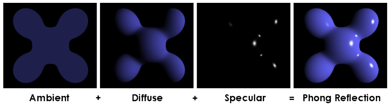
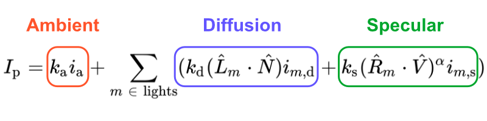
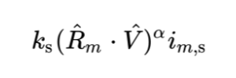
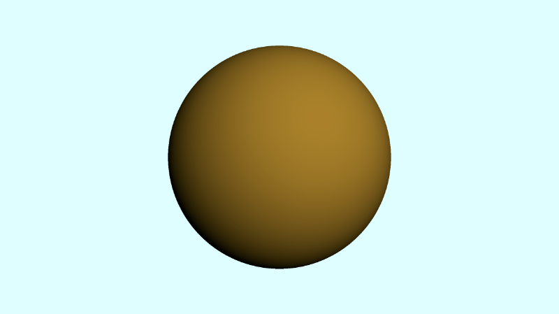
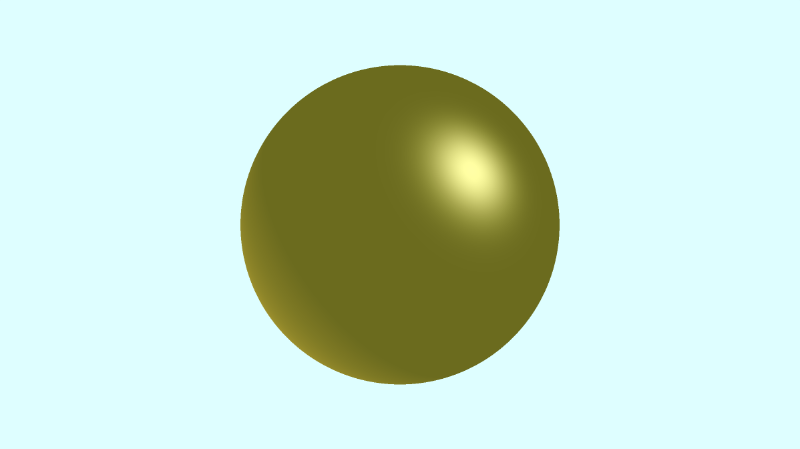

# 11.1 Phong 模型
在本系列教程的[**第 6 部分**](/category/6-使用-ray-marching)中，我们学习了如何使用漫反射（[**Lambertian reflection**](https://en.wikipedia.org/wiki/Lambertian_reflectance)）为 3D 对象着色。到目前为止，我们一直在使用这个光照模型，但这个模型有点受限。

`Phong` 反射模型以创作者 `Bui Tuong Phong` 的名字命名，有时称为`Phong illumination`或`Phong lighting`。它由三部分组成：**环境照明**（ambient lighting）、**漫反射**（lambertian reflection）和**镜面反射**（specular reflection）。

<p align="center"></p>
<p align="center">Phong Reflection Model 来自 [**维基百科**](https://en.wikipedia.org/wiki/Phong_reflection_model)上的数据</p>

`Phong` 反射模型提供了一个方程，用于计算表面上每个点的照明度`I_p`。

<p align="center"></p>
<p align="center">Phong Reflection Equation 来自 [**维基百科**](https://en.wikipedia.org/wiki/Phong_reflection_model)上的数据</p>

这个方程可能看起来很复杂，但我会解释它的每个部分！此方程由三个主要部分组成：环境、漫反射和高光。下标 `m` 是指场景中的灯光数量。我们假设现在只存在一个灯。

<p align="center"></p>

第一部分表示环境光项。在 `GLSL` 代码中，它可以由以下内容表示：

```cpp
float k_a = 0.6; // a value of our choice, typically between zero and one
vec3 i_a = vec3(0.7, 0.7, 0); // a color of our choice

vec3 ambient = k_a * i_a;
```

`k_a` 值是环境反射常数，即渲染的场景中所有点中存在的环境项的反射比率。`i_a` 值控制环境照明，有时计算为所有光源的贡献之和。

`Phong` 反射方程的第二部分表示扩散反射项。在 `GLSL` 代码中，它可以由以下内容表示：

```cpp
vec3 p = ro + rd * d; // point on surface found by ray marching
vec3 N = calcNormal(p); // surface normal
vec3 lightPosition = vec3(1, 1, 1);
vec3 L = normalize(lightPosition - p);

float k_d = 0.5; // a value of our choice, typically between zero and one
vec3 dotLN = dot(L, N);
vec3 i_d = vec3(0.7, 0.5, 0); // a color of our choice

vec3 diffuse = k_d * dotLN * i_d;
```
值 `k_d` 是漫反射常数，即入射光漫射项的反射率 `Lambertian` 反射率的反射率。值 `dotLN` 是我们在前面的教程中一直使用的漫反射。它代表了朗伯式的倒影。值 `i_d` 是场景中光源的强度，在本例中由 `color` 值定义。

`Phong 反射方程`的第三部分稍微复杂一些。它表示镜面反射项。在现实生活中，金属和抛光表面等材质具有镜面反射，根据摄像机角度或观看者面对对象的位置，这些反射看起来更亮。因此，该项是场景中摄像机位置的函数。

<p align="center"></p>

在 `GLSL` 代码中，它可以由以下内容表示：

```cpp
vec3 p = ro + rd * d; // point on surface found by ray marching
vec3 N = calcNormal(p); // surface normal
vec3 lightPosition = vec3(1, 1, 1);
vec3 L = normalize(lightPosition - p);

float k_s = 0.6; // a value of our choice, typically between zero and one

vec3 R = reflect(L, N);
vec3 V = -rd; // direction pointing toward viewer (V) is just the negative of the ray direction

vec3 dotRV = dot(R, V);
vec3 i_s = vec3(1, 1, 1); // a color of our choice
float alpha = 10.;

vec3 specular = k_s * pow(dotRV, alpha) * i_s;
```

值 `k_s` 是镜面反射常数，即入射光的镜面反射项的反射比率。

矢量 `R`是镜面反射的光线从表面反射时所采用的方向。

<p align="center"></p>

根据维基百科，Phong 反射模型使用以下公式计算反射光线方向。

<p align="center"></p>

如前所述，下标 `m` 指的是场景中的灯光数量。每个字母上方的小帽子 `^` 表示我们应该使用每个向量的归一化版本。`矢量 L` 是指光线方向。`向量 N` 是指表面法线。

`GLSL` 提供了一个名为 `reflect` 的便捷函数，它可以为我们计算来自入射光线的反射光线的方向。此函数采用两个参数：入射光线方向矢量和法线矢量。

在内部，反射函数等于 `I - 2.0 * dot（N， I） * N`，其中 `I` 是入射光线方向，`N` 是法线矢量。如果我们将这个方程乘以 `-1`，我们最终会得到与维基百科上的反射方程相同的方程。这完全是轴约定的问题。

镜面反射代码片段中的`矢量 V` 表示指向查看器或摄像机的方向。我们可以将其设置为等于光线方向的负值 `rd`。

`alpha` 项用于控制球体上的“光泽度”量。较低的值会使其看起来更亮。

## 把它们放在一起

让我们将到目前为止学到的所有内容放在代码中。我们将从场景中的简单球体开始，然后像我们在[**第 10 部分**](/category/10-具有观察点的相机模型)中学到的那样，为摄像机模型使用注视点。

```cpp
const int MAX_MARCHING_STEPS = 255;
const float MIN_DIST = 0.0;
const float MAX_DIST = 100.0;
const float PRECISION = 0.001;

float sdSphere(vec3 p, float r )
{
  return length(p) - r;
}

float sdScene(vec3 p) {
  return sdSphere(p, 1.);
}

float rayMarch(vec3 ro, vec3 rd) {
  float depth = MIN_DIST;

  for (int i = 0; i < MAX_MARCHING_STEPS; i++) {
    vec3 p = ro + depth * rd;
    float d = sdScene(p);
    depth += d;
    if (d < PRECISION || depth > MAX_DIST) break;
  }

  return depth;
}

vec3 calcNormal(vec3 p) {
    vec2 e = vec2(1.0, -1.0) * 0.0005;
    return normalize(
      e.xyy * sdScene(p + e.xyy) +
      e.yyx * sdScene(p + e.yyx) +
      e.yxy * sdScene(p + e.yxy) +
      e.xxx * sdScene(p + e.xxx));
}

mat3 camera(vec3 cameraPos, vec3 lookAtPoint) {
    vec3 cd = normalize(lookAtPoint - cameraPos); // camera direction
    vec3 cr = normalize(cross(vec3(0, 1, 0), cd)); // camera right
    vec3 cu = normalize(cross(cd, cr)); // camera up

    return mat3(-cr, cu, -cd);
}

void mainImage( out vec4 fragColor, in vec2 fragCoord )
{
  vec2 uv = (fragCoord-.5*iResolution.xy)/iResolution.y;
  vec3 backgroundColor = vec3(0.835, 1, 1);
  vec3 col = vec3(0);

  vec3 lp = vec3(0); // lookat point (aka camera target)
  vec3 ro = vec3(0, 0, 3);

  vec3 rd = camera(ro, lp) * normalize(vec3(uv, -1)); // ray direction

  float d = rayMarch(ro, rd);

  if (d > MAX_DIST) {
    col = backgroundColor;
  } else {
      vec3 p = ro + rd * d;
      vec3 normal = calcNormal(p);
      vec3 lightPosition = vec3(2, 2, 7);
      vec3 lightDirection = normalize(lightPosition - p);

      float diffuse = clamp(dot(lightDirection, normal), 0., 1.);

      col = diffuse * vec3(0.7, 0.5, 0);
  }

  fragColor = vec4(col, 1.0);
}
```
运行代码时，您应该会在场景中看到一个具有漫射照明的简单球体。

<p align="center"></p>

不过这很无聊。我们想要一个闪亮的球体！目前，我们只根据漫反射照明或朗伯反射为球体着色。让我们添加一个环境光和镜面反射组件来完成 `Phong` 反射模型。我们还将稍微调整光线方向，以便球体的右上角出现光泽。

```cpp
void mainImage( out vec4 fragColor, in vec2 fragCoord )
{
  vec2 uv = (fragCoord-.5*iResolution.xy)/iResolution.y;
  vec3 backgroundColor = vec3(0.835, 1, 1);
  vec3 col = vec3(0);

  vec3 lp = vec3(0); // lookat point (aka camera target)
  vec3 ro = vec3(0, 0, 3);

  vec3 rd = camera(ro, lp) * normalize(vec3(uv, -1)); // ray direction

  float d = rayMarch(ro, rd);

  if (d > MAX_DIST) {
    col = backgroundColor;
  } else {
      vec3 p = ro + rd * d; // point on surface found by ray marching
      vec3 normal = calcNormal(p); // surface normal

      // light
      vec3 lightPosition = vec3(-8, -6, -5);
      vec3 lightDirection = normalize(lightPosition - p);

      // ambient
      float k_a = 0.6;
      vec3 i_a = vec3(0.7, 0.7, 0);
      vec3 ambient = k_a * i_a;

      // diffuse
      float k_d = 0.5;
      float dotLN = clamp(dot(lightDirection, normal), 0., 1.);
      vec3 i_d = vec3(0.7, 0.5, 0);
      vec3 diffuse = k_d * dotLN * i_d;

      // specular
      float k_s = 0.6;
      float dotRV = clamp(dot(reflect(lightDirection, normal), -rd), 0., 1.);
      vec3 i_s = vec3(1, 1, 1);
      float alpha = 10.;
      vec3 specular = k_s * pow(dotRV, alpha) * i_s;

      // final sphere color
      col = ambient + diffuse + specular;
  }

  fragColor = vec4(col, 1.0);
}
```

和以前一样，我们固定每个点积的结果，使值介于 `0` 和 `1` 之间。当我们运行代码时，我们应该看到球体在球体的右上角闪闪发光。

<p align="center"></p>