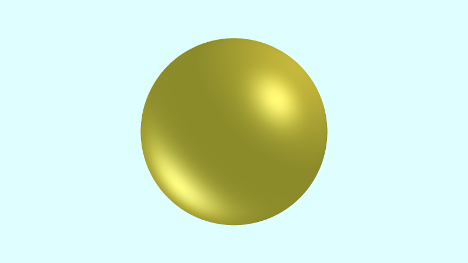
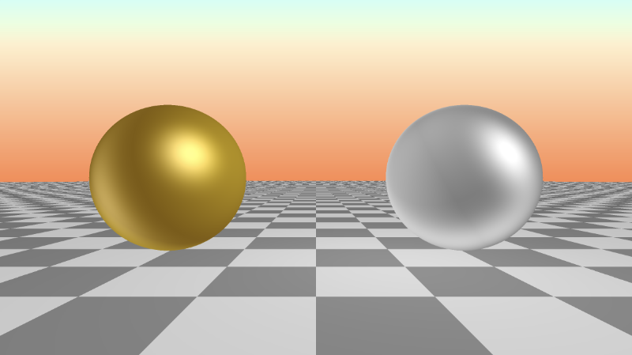

# 11.2 多个光源

您可能已经注意到，`Phong` 反射方程对漫反射和镜面反射分量使用求和。如果向场景中添加更多灯光，则每个灯光都将具有漫反射和镜面反射组件。

<p align="center"></p>


## 多个光源
为了更轻松地处理多个光源，我们将创建一个 `phong` 函数。由于这个场景只为一个对象着色，我们也可以在 `phong` 函数中放置反射系数`（k_a、k_d、k_s）`和强度。

```cpp
const int MAX_MARCHING_STEPS = 255;
const float MIN_DIST = 0.0;
const float MAX_DIST = 100.0;
const float PRECISION = 0.001;

float sdSphere(vec3 p, float r )
{
  return length(p) - r;
}

float sdScene(vec3 p) {
  return sdSphere(p, 1.);
}

float rayMarch(vec3 ro, vec3 rd) {
  float depth = MIN_DIST;

  for (int i = 0; i < MAX_MARCHING_STEPS; i++) {
    vec3 p = ro + depth * rd;
    float d = sdScene(p);
    depth += d;
    if (d < PRECISION || depth > MAX_DIST) break;
  }

  return depth;
}

vec3 calcNormal(vec3 p) {
    vec2 e = vec2(1.0, -1.0) * 0.0005;
    return normalize(
      e.xyy * sdScene(p + e.xyy) +
      e.yyx * sdScene(p + e.yyx) +
      e.yxy * sdScene(p + e.yxy) +
      e.xxx * sdScene(p + e.xxx));
}

mat3 camera(vec3 cameraPos, vec3 lookAtPoint) {
    vec3 cd = normalize(lookAtPoint - cameraPos); // camera direction
    vec3 cr = normalize(cross(vec3(0, 1, 0), cd)); // camera right
    vec3 cu = normalize(cross(cd, cr)); // camera up

    return mat3(-cr, cu, -cd);
}

vec3 phong(vec3 lightDir, vec3 normal, vec3 rd) {
  // ambient
  float k_a = 0.6;
  vec3 i_a = vec3(0.7, 0.7, 0);
  vec3 ambient = k_a * i_a;

  // diffuse
  float k_d = 0.5;
  float dotLN = clamp(dot(lightDir, normal), 0., 1.);
  vec3 i_d = vec3(0.7, 0.5, 0);
  vec3 diffuse = k_d * dotLN * i_d;

  // specular
  float k_s = 0.6;
  float dotRV = clamp(dot(reflect(lightDir, normal), -rd), 0., 1.);
  vec3 i_s = vec3(1, 1, 1);
  float alpha = 10.;
  vec3 specular = k_s * pow(dotRV, alpha) * i_s;

  return ambient + diffuse + specular;
}

void mainImage( out vec4 fragColor, in vec2 fragCoord )
{
  vec2 uv = (fragCoord-.5*iResolution.xy)/iResolution.y;
  vec3 backgroundColor = vec3(0.835, 1, 1);
  vec3 col = vec3(0);

  vec3 lp = vec3(0); // lookat point (aka camera target)
  vec3 ro = vec3(0, 0, 3);

  vec3 rd = camera(ro, lp) * normalize(vec3(uv, -1)); // ray direction

  float d = rayMarch(ro, rd);

  if (d > MAX_DIST) {
    col = backgroundColor;
  } else {
      vec3 p = ro + rd * d; // point on surface found by ray marching
      vec3 normal = calcNormal(p); // surface normal

      // light #1
      vec3 lightPosition1 = vec3(-8, -6, -5);
      vec3 lightDirection1 = normalize(lightPosition1 - p);
      float lightIntensity1 = 0.6;

      // light #2
      vec3 lightPosition2 = vec3(1, 1, 1);
      vec3 lightDirection2 = normalize(lightPosition2 - p);
      float lightIntensity2 = 0.7;

      // final sphere color
      col = lightIntensity1 * phong(lightDirection1, normal, rd);
      col += lightIntensity2 * phong(lightDirection2, normal , rd);
  }

  fragColor = vec4(col, 1.0);
}
```

我们可以将 `phong` 函数的结果乘以光强度值，这样球体就不会显得太亮。当您运行代码时，您的球体应该看起来更闪亮!!

<p align="center"></p>

## 为多个对象着色
将所有反射系数和强度都放在 `phong` 函数中不是很实用。场景中可以有多个对象，这些对象具有不同的材质类型。某些对象可能看起来有光泽和反射，而其他对象几乎没有镜面反射。

创建可应用于一个或多个对象的材质更有意义。每种材质都有自己的环境、漫反射和镜面反射分量系数。我们可以为材质创建一个结构体，该结构体将保存 `Phong` 反射模型所需的所有信息。

```cpp
struct Material {
  vec3 ambientColor; // k_a * i_a
  vec3 diffuseColor; // k_d * i_d
  vec3 specularColor; // k_s * i_s
  float alpha; // shininess
};
```

我们将创建一个具有平铺地板和两个球体的场景。首先，我们将创建三种材质。我们将创建一个返回金色材质的 `gold` 函数、一个返回银色材质的 `silver` 函数和一个返回棋盘图案的 `checkerboard` 函数。正如您所料，棋盘格图案不会很闪亮，但金属会！

```cpp
Material gold() {
  vec3 aCol = 0.5 * vec3(0.7, 0.5, 0);
  vec3 dCol = 0.6 * vec3(0.7, 0.7, 0);
  vec3 sCol = 0.6 * vec3(1, 1, 1);
  float a = 5.;

  return Material(aCol, dCol, sCol, a);
}

Material silver() {
  vec3 aCol = 0.4 * vec3(0.8);
  vec3 dCol = 0.5 * vec3(0.7);
  vec3 sCol = 0.6 * vec3(1, 1, 1);
  float a = 5.;

  return Material(aCol, dCol, sCol, a);
}

Material checkerboard(vec3 p) {
  vec3 aCol = vec3(1. + 0.7*mod(floor(p.x) + floor(p.z), 2.0)) * 0.3;
  vec3 dCol = vec3(0.3);
  vec3 sCol = vec3(0);
  float a = 1.;

  return Material(aCol, dCol, sCol, a);
}
```

我们将创建一个 `opUnion` 函数，该函数的作用与我们在前面的教程中使用的 `minWithColor` 函数相同。

```cpp
Surface opUnion(Surface obj1, Surface obj2) {
  if (obj2.sd < obj1.sd) return obj2;
  return obj1;
}
```

我们的场景将使用 `opUnion` 函数将平铺地板和球体添加到场景中：

```cpp
Surface scene(vec3 p) {
  Surface sFloor = Surface(1, p.y + 1., checkerboard(p));
  Surface sSphereGold = Surface(2, sdSphere(p - vec3(-2, 0, 0), 1.), gold());
  Surface sSphereSilver = Surface(3, sdSphere(p - vec3(2, 0, 0), 1.), silver());

  Surface co = opUnion(sFloor, sSphereGold);
  co = opUnion(co, sSphereSilver);
  return co;
}
```

我们将向 `phong` 函数添加一个接受 `Material` 的参数。此材质将保存 `Phong` 反射模型的每个组件所需的所有颜色值。

```cpp
vec3 phong(vec3 lightDir, vec3 normal, vec3 rd, Material mat) {
  // ambient
  vec3 ambient = mat.ambientColor;

  // diffuse
  float dotLN = clamp(dot(lightDir, normal), 0., 1.);
  vec3 diffuse = mat.diffuseColor * dotLN;

  // specular
  float dotRV = clamp(dot(reflect(lightDir, normal), -rd), 0., 1.);
  vec3 specular = mat.specularColor * pow(dotRV, mat.alpha);

  return ambient + diffuse + specular;
}
```

在 `mainImage` 函数中，我们可以将最近对象的材质传递给 `phong` 函数。

```cpp
col = lightIntensity1 * phong(lightDirection1, normal, rd, co.mat);
col += lightIntensity2 * phong(lightDirection2, normal , rd, co.mat);
```

将所有这些放在一起，我们得到以下代码。
```cpp
const int MAX_MARCHING_STEPS = 255;
const float MIN_DIST = 0.0;
const float MAX_DIST = 100.0;
const float PRECISION = 0.001;

float sdSphere(vec3 p, float r )
{
  return length(p) - r;
}

struct Material {
  vec3 ambientColor; // k_a * i_a
  vec3 diffuseColor; // k_d * i_d
  vec3 specularColor; // k_s * i_s
  float alpha; // shininess
};

struct Surface {
  int id; // id of object
  float sd; // signed distance
  Material mat;
};

Material gold() {
  vec3 aCol = 0.5 * vec3(0.7, 0.5, 0);
  vec3 dCol = 0.6 * vec3(0.7, 0.7, 0);
  vec3 sCol = 0.6 * vec3(1, 1, 1);
  float a = 5.;

  return Material(aCol, dCol, sCol, a);
}

Material silver() {
  vec3 aCol = 0.4 * vec3(0.8);
  vec3 dCol = 0.5 * vec3(0.7);
  vec3 sCol = 0.6 * vec3(1, 1, 1);
  float a = 5.;

  return Material(aCol, dCol, sCol, a);
}

Material checkerboard(vec3 p) {
  vec3 aCol = vec3(1. + 0.7*mod(floor(p.x) + floor(p.z), 2.0)) * 0.3;
  vec3 dCol = vec3(0.3);
  vec3 sCol = vec3(0);
  float a = 1.;

  return Material(aCol, dCol, sCol, a);
}

Surface opUnion(Surface obj1, Surface obj2) {
  if (obj2.sd < obj1.sd) return obj2;
  return obj1;
}

Surface scene(vec3 p) {
  Surface sFloor = Surface(1, p.y + 1., checkerboard(p));
  Surface sSphereGold = Surface(2, sdSphere(p - vec3(-2, 0, 0), 1.), gold());
  Surface sSphereSilver = Surface(3, sdSphere(p - vec3(2, 0, 0), 1.), silver());

  Surface co = opUnion(sFloor, sSphereGold); // closest object
  co = opUnion(co, sSphereSilver);
  return co;
}

Surface rayMarch(vec3 ro, vec3 rd) {
  float depth = MIN_DIST;
  Surface co;

  for (int i = 0; i < MAX_MARCHING_STEPS; i++) {
    vec3 p = ro + depth * rd;
    co = scene(p);
    depth += co.sd;
    if (co.sd < PRECISION || depth > MAX_DIST) break;
  }

  co.sd = depth;

  return co;
}

vec3 calcNormal(vec3 p) {
    vec2 e = vec2(1.0, -1.0) * 0.0005;
    return normalize(
      e.xyy * scene(p + e.xyy).sd +
      e.yyx * scene(p + e.yyx).sd +
      e.yxy * scene(p + e.yxy).sd +
      e.xxx * scene(p + e.xxx).sd);
}

mat3 camera(vec3 cameraPos, vec3 lookAtPoint) {
    vec3 cd = normalize(lookAtPoint - cameraPos); // camera direction
    vec3 cr = normalize(cross(vec3(0, 1, 0), cd)); // camera right
    vec3 cu = normalize(cross(cd, cr)); // camera up

    return mat3(-cr, cu, -cd);
}

vec3 phong(vec3 lightDir, vec3 normal, vec3 rd, Material mat) {
  // ambient
  vec3 ambient = mat.ambientColor;

  // diffuse
  float dotLN = clamp(dot(lightDir, normal), 0., 1.);
  vec3 diffuse = mat.diffuseColor * dotLN;

  // specular
  float dotRV = clamp(dot(reflect(lightDir, normal), -rd), 0., 1.);
  vec3 specular = mat.specularColor * pow(dotRV, mat.alpha);

  return ambient + diffuse + specular;
}

void mainImage( out vec4 fragColor, in vec2 fragCoord )
{
  vec2 uv = (fragCoord-.5*iResolution.xy)/iResolution.y;
  vec3 backgroundColor = mix(vec3(1, .341, .2), vec3(0, 1, 1), uv.y) * 1.6;
  vec3 col = vec3(0);

  vec3 lp = vec3(0); // lookat point (aka camera target)
  vec3 ro = vec3(0, 0, 5);

  vec3 rd = camera(ro, lp) * normalize(vec3(uv, -1)); // ray direction

  Surface co = rayMarch(ro, rd); // closest object

  if (co.sd > MAX_DIST) {
    col = backgroundColor;
  } else {
      vec3 p = ro + rd * co.sd; // point on surface found by ray marching
      vec3 normal = calcNormal(p); // surface normal

      // light #1
      vec3 lightPosition1 = vec3(-8, -6, -5);
      vec3 lightDirection1 = normalize(lightPosition1 - p);
      float lightIntensity1 = 0.9;

      // light #2
      vec3 lightPosition2 = vec3(1, 1, 1);
      vec3 lightDirection2 = normalize(lightPosition2 - p);
      float lightIntensity2 = 0.5;

      // final color of object
      col = lightIntensity1 * phong(lightDirection1, normal, rd, co.mat);
      col += lightIntensity2 * phong(lightDirection2, normal , rd, co.mat);
  }

  fragColor = vec4(col, 1.0);
}
```

当我们运行这段代码时，我们应该看到一个金色的球体和银色的球体漂浮在日落前。Gorgeous！

<p align="center"></p>

## 结论
在本课中，我们学习了 `Phong` 反射模型如何通过向对象添加一点眩光或光泽来真正改善场景的外观。我们还学习了如何使用结构体为场景中的每个对象分配不同的材质。确保着色器很有趣！😃