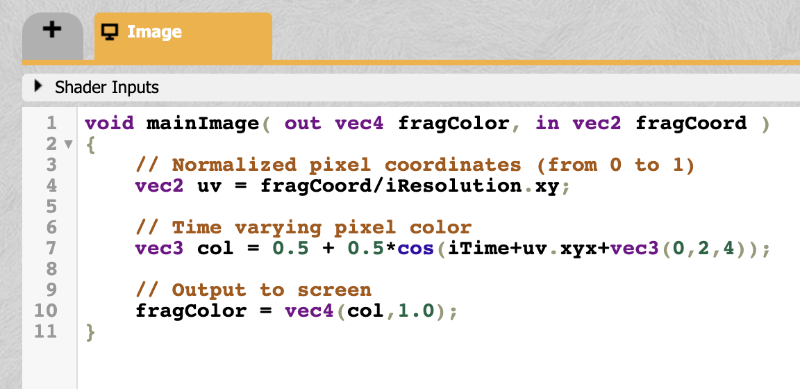

# 15.4 缓冲区

`Shadertoy` 提供缓冲区支持。您可以在每个缓冲区中运行完全不同的着色器。每个着色器都有自己的最终 `fragColor`，可以传递给另一个缓冲区或我们一直在使用的 `mainImage` 着色器。

有四个缓冲区：Buffer A、Buffer B、Buffer C 和 Buffer D。每个缓冲区可以容纳自己的四个通道。要访问缓冲区，我们使用四个通道之一。让我们练习一下缓冲区，看看如何使用它们。

在代码上方，靠近 `Shadertoy` 用户界面顶部的地方，您应该会看到一个标记为`Image`的选项卡。`Image` 选项卡表示我们在前面的教程中一直使用的主着色器。要添加缓冲区，只需单击 `Image 选项卡`左侧的加号 `（+）`。

<p align="center"></p>

从那里，您将看到一个可供选择的项目下拉列表：`Common`、`Sound`、`Buffer A`、`Buffer B`、`Buffer C`、`Buffer D`、`Cubemap A`。

<p align="center"></p>

`Common` 选项用于在 `Image` 着色器、所有缓冲区和其他着色器（包括 `Sound` 和 `Cubemap A`）之间共享代码。`Sound 选项`允许您创建生成声音的着色器。`Cubemap A` 选项允许您生成自己的立方体贴图。在本教程中，我将介绍缓冲区，这些缓冲区是返回 `vec4` 类型（红色、绿色、蓝色、`alpha`）颜色的普通着色器。

选择 `Buffer A`。您应该会看到为您提供的默认代码。

```cpp
void mainImage( out vec4 fragColor, in vec2 fragCoord )
{
  fragColor = vec4(0.0,0.0,1.0,1.0);
}
```

看起来这段代码只是返回每个像素的颜色 `blue`。接下来，让我们回到 `Image` 选项卡。点击 `iChannel0`，转到 `Misc` 选项卡，然后选择 `Buffer A`。现在，您应该将缓冲区 `A` 用于 `iChannel0`。在 `Image` 着色器中，粘贴以下代码。

```cpp
void mainImage( out vec4 fragColor, in vec2 fragCoord )
{
  vec2 uv = fragCoord/iResolution.xy;

  vec3 col = texture(iChannel0, uv).rgb;

  col += vec3(1, 0, 0);

  // Output to screen
  fragColor = vec4(col, 1.0);
}
```

运行代码时，您应该会看到整个画布变为紫色。这是因为我们从缓冲区 A 中获取颜色值，将其传递到图像着色器中，将红色添加到我们从缓冲区 A 获得的蓝色中，然后将结果输出到屏幕上。

从本质上讲，缓冲区为您提供了更多的工作空间。您可以在 `Buffer A` 中创建整个着色器，将结果传递给另一个缓冲区以对其执行更多处理，然后将结果传递给 `Image` 着色器以输出最终结果。将其视为一个管道，您可以在其中不断将一个着色器的输出传递到下一个着色器。这就是为什么利用缓冲区或其他着色器的着色器通常称为多通道着色器的原因。


