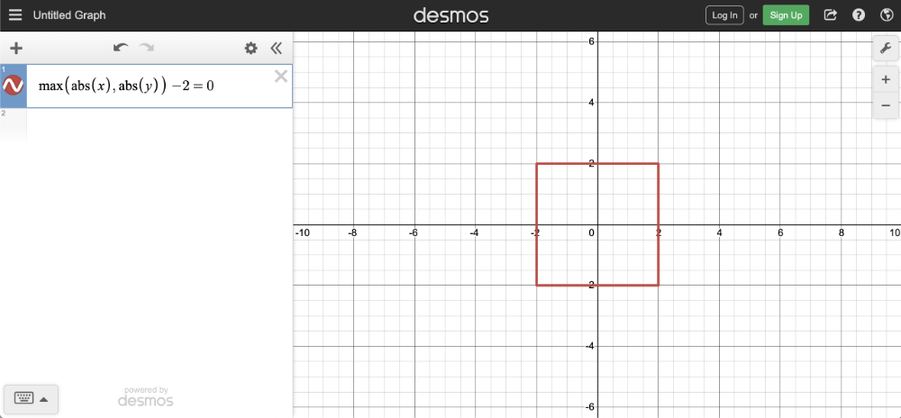
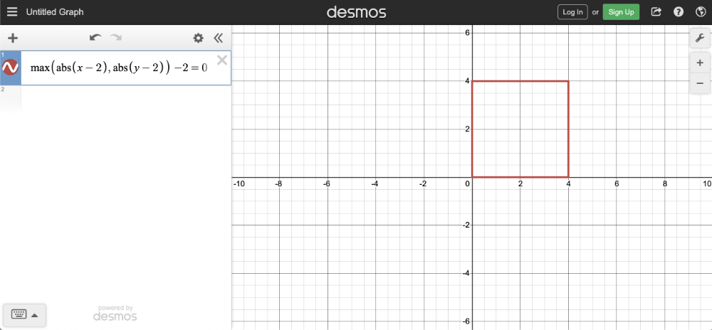
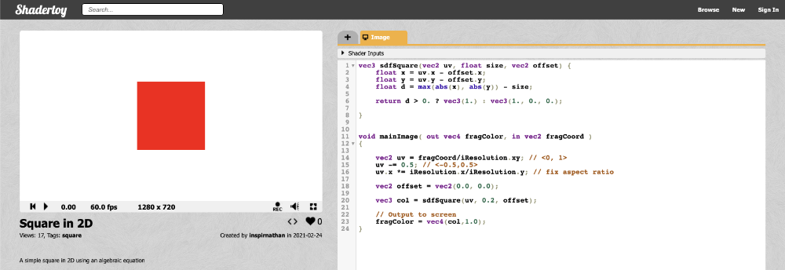
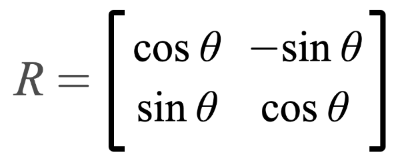
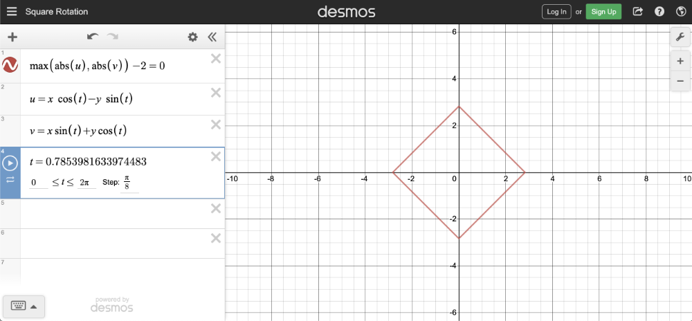
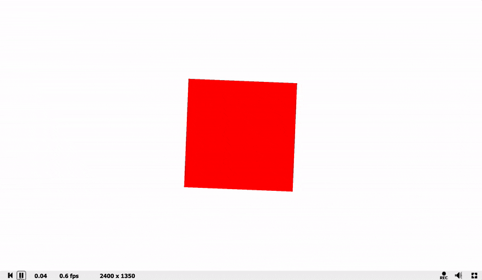

# 3.1 正方形和旋转矩阵
## 如何绘制正方形
绘制正方形与绘制圆形非常相似，只是我们将使用不同的方程。事实上，如果你有一个方程式，你几乎可以绘制任何你想要的 2D 形状！

方形方程由以下定义：
```
max(abs(x), abs(y)) = r

x = x-coordinate on graph
y = y-coordinate on graph
r = radius of square
```

我们可以重新排列变量，使方程等于零：
```
max(abs(x), abs(y)) - r = 0
```

要在图表上可视化这一点，您可以使用 [**Desmos calculator**](https://www.desmos.com/calculator) 绘制以下内容：
```
max(abs(x), abs(y)) - 2 = 0
```

如果您复制上述代码段并将其粘贴到 Desmos 计算器中，那么您应该会看到一个半径为 2 的正方形图形。正方形的中心位于原点 （0， 0） 处。
<p align="center"></p>

还可以包含偏移量：
```
max(abs(x - offsetX), abs(y - offsetY)) - r = 0

offsetX = how much to move the center of the square in the x-axis
offsetY = how much to move the center of the square in the y-axis
```
<p align="center"></p>

使用像素着色器绘制正方形的步骤与上一个教程非常相似，其中我们创建了一个圆。现在，我们将专门为正方形创建一个函数。

```cpp
vec3 sdfSquare(vec2 uv, float size, vec2 offset) {
  float x = uv.x - offset.x;
  float y = uv.y - offset.y;
  float d = max(abs(x), abs(y)) - size;

  return d > 0. ? vec3(1.) : vec3(1., 0., 0.);
}

void mainImage( out vec4 fragColor, in vec2 fragCoord )
{
  vec2 uv = fragCoord/iResolution.xy; // <0, 1>
  uv -= 0.5; // <-0.5,0.5>
  uv.x *= iResolution.x/iResolution.y; // fix aspect ratio

  vec2 offset = vec2(0.0, 0.0);

  vec3 col = sdfSquare(uv, 0.2, offset);

  // Output to screen
  fragColor = vec4(col,1.0);
}
```
耶！现在我们有一个红色方块！🟥
<p align="center"></p>

## 旋转形状

可以使用以下表示法给出的[**旋转矩阵(rotation matrix)**](https://mathworld.wolfram.com/RotationMatrix.html)来旋转形状：
<p align="center"></p>

矩阵可以帮助我们处理多个线性方程和线性变换。实际上，旋转矩阵是一种变换矩阵。我们可以使用矩阵来执行其他转换，例如剪切、平移或反射。

:::tip tip
如果您想尝试矩阵算术，您可以使用 [**Demos Matrix Calculator**](https://www.desmos.com/matrix) 或 [**WolframAlpha**](https://www.wolframalpha.com/)。如果您需要复习矩阵，可以在 YouTube 上观看 Derek Banas 的[**精彩视频**](https://www.youtube.com/watch?v=l3S1gKQLm4s)。
:::

我们可以使用我在 Desmos 上创建的图表来帮助可视化旋转。我创建了一组参数方程，这些方程使用线性方程形式的旋转矩阵。
<p align="center"></p>

线性方程式是通过将旋转矩阵乘以计算的向量 [x，y] 获得的。结果是旋转后变换的 x 坐标和变换的 y 坐标的方程。

在 Shadertoy 中，我们只关心旋转矩阵，而不关心线性方程形式。我讨论线性方程形式只是为了显示 Desmos 中的旋转。

我们可以在着色器代码中创建一个 rotate 函数，该函数接受 UV 坐标和旋转正方形的角度。它将返回旋转矩阵乘以 UV 坐标。然后，我们将通过传入 XY 坐标来调用 sdfSquare 函数中的 rotate 函数，该坐标偏移量为偏移量（如果存在）。我们将使用 iTime 作为角度，以便正方形动画化。

```cpp
vec2 rotate(vec2 uv, float th) {
  return mat2(cos(th), sin(th), -sin(th), cos(th)) * uv;
}

vec3 sdfSquare(vec2 uv, float size, vec2 offset) {
  float x = uv.x - offset.x;
  float y = uv.y - offset.y;
  vec2 rotated = rotate(vec2(x,y), iTime);
  float d = max(abs(rotated.x), abs(rotated.y)) - size;

  return d > 0. ? vec3(1.) : vec3(1., 0., 0.);
}

void mainImage( out vec4 fragColor, in vec2 fragCoord )
{
  vec2 uv = fragCoord/iResolution.xy; // <0, 1>
  uv -= 0.5; // <-0.5,0.5>
  uv.x *= iResolution.x/iResolution.y; // fix aspect ratio

  vec2 offset = vec2(0.0, 0.0);

  vec3 col = sdfSquare(uv, 0.2, offset);

  // Output to screen
  fragColor = vec4(col,1.0);
}
```

请注意我们在 Shadertoy 中是如何定义矩阵的。让我们更仔细地检查 rotate 函数。

```cpp
vec2 rotate(vec2 uv, float th) {
  return mat2(cos(th), sin(th), -sin(th), cos(th)) * uv;
}

```
根据这个关于 [**GLSL 的 wiki**](https://en.wikibooks.org/wiki/GLSL_Programming/Vector_and_Matrix_Operations)，我们用逗号分隔的值来定义一个矩阵，但我们首先通过矩阵列。由于这是 mat2 类型的矩阵，因此它是一个 2x2 矩阵。前两个值表示第一列，后两个值表示第二列。在 [**WolframAlpha**](https://www.wolframalpha.com/input/?i=%5B%5Bcos%28t%29%2C-sin%28t%29%5D%2C%5Bsin%28t%29%2Ccos%28t%29%5D%5D+*%5Bx%2Cy%5D) 等工具中，您可以插入值 row-first 并使用方括号分隔每一行。在试验矩阵时，请记住这一点。

我们的 rotate 函数返回一个 vec2 类型的值，因为 2x2 矩阵 （mat2） 乘以 vec2 向量会返回另一个 vec2 向量。

当我们运行代码时，我们应该看到正方形沿顺时针方向旋转。

<p align="center"></p>

## 结论

在本课中，我们学习了如何使用变换矩阵绘制正方形并旋转它。使用您从本教程和上一个教程中获得的知识，您可以使用方程式或 SDF 为该形状绘制您想要的任何 2D 形状！

在下一篇文章中，我将讨论如何在画布上绘制多个形状，同时能够更改背景颜色。
