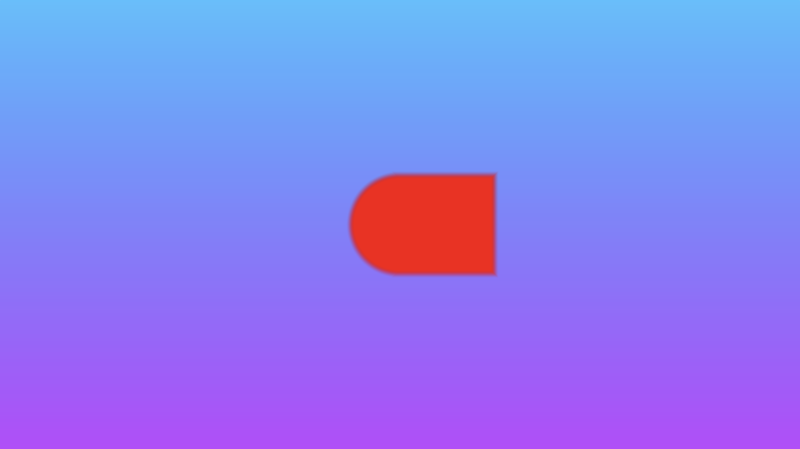

# 5.2 抗锯齿
如果要添加任何[**抗锯齿**](https://en.wikipedia.org/wiki/Spatial_anti-aliasing)，则可以使用 [**smoothstep**](https://registry.khronos.org/OpenGL-Refpages/gl4/html/smoothstep.xhtml) 函数来平滑形状的边缘。

**smoothstep(edge0, edge1, x）** 函数接受三个参数，并在 edge0 < x < edge1 时执行 0 和 1 之间的 [**Hermite 插值**](https://en.wikipedia.org/wiki/Hermite_interpolation) 。

```
edge0: Specifies the value of the lower edge of the Hermite function.

edge1: Specifies the value of the upper edge of the Hermite function.

x: Specifies the source value for interpolation.

t = clamp((x - edge0) / (edge1 - edge0), 0.0, 1.0);
return t * t * (3.0 - 2.0 * t);
```

:::tip tip
[**smoothstep 函数说明**](https://registry.khronos.org/OpenGL-Refpages/gl4/html/smoothstep.xhtml)会说如果 edge0 大于或等于 edge1，那么 smoothstep 函数将返回一个 undefined 的值。但是，这是不正确的。smoothstep 函数的结果仍由 Hermite 插值函数确定，即使 edge0 大于 edge1。
:::

如果你仍然感到困惑，[**The Book of Shaders**](https://thebookofshaders.com/glossary/?search=smoothstep) 中的此页面可能会帮助您可视化 smoothstep 函数。从本质上讲，它的行为类似于 step 函数，只是有一些额外的步骤（没有双关语）。 😂

让我们用 smoothstep 函数替换 step 函数，看看圆和正方形的并集之间的结果如何表现。

```c
vec3 getBackgroundColor(vec2 uv) {
  uv = uv * 0.5 + 0.5; // remap uv from <-0.5,0.5> to <0.25,0.75>
  vec3 gradientStartColor = vec3(1., 0., 1.);
  vec3 gradientEndColor = vec3(0., 1., 1.);
  return mix(gradientStartColor, gradientEndColor, uv.y); // gradient goes from bottom to top
}

float sdCircle(vec2 uv, float r, vec2 offset) {
  float x = uv.x - offset.x;
  float y = uv.y - offset.y;

  return length(vec2(x, y)) - r;
}

float sdSquare(vec2 uv, float size, vec2 offset) {
  float x = uv.x - offset.x;
  float y = uv.y - offset.y;

  return max(abs(x), abs(y)) - size;
}

vec3 drawScene(vec2 uv) {
  vec3 col = getBackgroundColor(uv);
  float d1 = sdCircle(uv, 0.1, vec2(0., 0.));
  float d2 = sdSquare(uv, 0.1, vec2(0.1, 0));

  float res; // result
  res = min(d1, d2); // union

  res = smoothstep(0., 0.02, res); // antialias entire result

  col = mix(vec3(1,0,0), col, res);
  return col;
}

void mainImage( out vec4 fragColor, in vec2 fragCoord )
{
  vec2 uv = fragCoord/iResolution.xy; // <0, 1>
  uv -= 0.5; // <-0.5,0.5>
  uv.x *= iResolution.x/iResolution.y; // fix aspect ratio

  vec3 col = drawScene(uv);

  fragColor = vec4(col,1.0); // Output to screen
}
```

我们最终得到一个边缘略微模糊的形状。
<p align="center"></p>

**smoothstep** 函数帮助我们在颜色之间创建平滑过渡，这对于实现抗锯齿很有用。您可能还会看到人们使用 **smoothstep** 来创建自发光对象或霓虹灯发光效果。它在着色器中经常使用。


