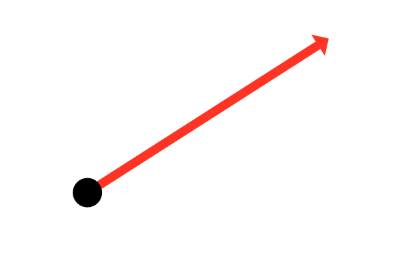
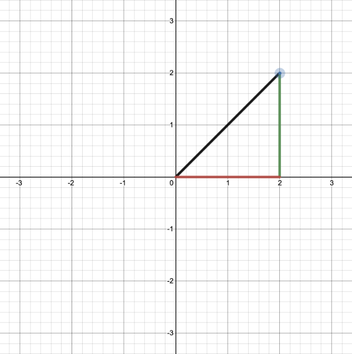
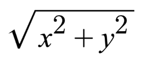
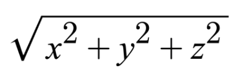
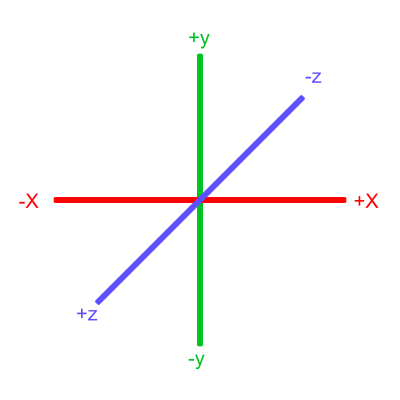

# 6.1 Ray 简介

您是否曾经浏览过 Shadertoy，却看到令人惊叹的作品让您惊叹不已？人们是如何在只有一个像素着色器而没有 3D 模型的情况下创建如此令人惊叹的场景的？这是魔法吗？他们有数学或图形设计博士学位吗？他们中的一些人可能有，但大多数不会！

## Ray

您在 Shadertoy 上看到的大多数 3D 场景都使用某种形式的[**光线跟踪(ray tracing)**](https://en.wikipedia.org/wiki/Ray_tracing_(graphics))或 **光线行进(ray marching)** 算法。这些算法通常用于[**计算机图形学**](https://en.wikipedia.org/wiki/Computer_graphics_(computer_science))领域。在 Shadertoy 中创建 3D 场景的第一步是了解[**光线**](https://mathworld.wolfram.com/Ray.html)。

来看一条光线！

<p align="center"></p>

就是这样？它看起来像一个点，上面有一个箭头指向它。是的，确实如此！黑点表示光线原点，红色箭头表示光线指向某个方向。在创建 3D 场景时，您将大量使用光线，因此最好了解它们的工作原理。

光线由原点和方向组成，但我这是什么意思呢？

射线原点只是射线的起点。在 2D 中，我们可以在 GLSL 中创建一个变量来表示原点：

```cpp
vec2 rayOrigin = vec2(0, 0);
```

如果您参加过一些线性代数或微积分课程，您可能会感到困惑。为什么我们要分配一个点作为向量？不是所有的向量都有方向吗？从数学上讲，[**向量**](https://en.wikipedia.org/wiki/Euclidean_vector)既有长度又有方向，但在这种情况下，我们谈论的是向量数据类型。

在 GLSL 等着色器语言中，我们可以使用 vec2 来存储我们想要的任意两个值，就好像它是一个数组一样（不要与 GLSL 语言规范中的实际数组混淆）。在 vec3 类型的变量中，我们可以存储三个值。这些值可以表示各种内容：颜色、坐标、圆半径或您想要的任何其他内容。对于射线原点，我们选择了我们的值来表示 XY 坐标，例如 (0, 0)。

光线方向是经过归一化的向量，其大小为 1。在二维中，我们可以在 GLSL 中创建一个变量来表示方向：

```cpp
vec2 rayDirection = vec2(1, 0);
```

通过将光线方向设置为等于 vec2（1， 0），我们表示光线指向右侧一个单位。

<p align="center"></p>

2D 向量可以具有 x 分量和 y 分量。下面是一个方向为 vec2（2， 2） 的射线示例，其中黑线表示射线。它以与原点成 45 度角指向对角线和右侧。红色水平线表示射线的 x 分量，绿色垂直线表示 y 分量。您可以使用我在 [**Desmos**](https://www.desmos.com/calculator/mvdjc2mvp5) 中创建的图形来调整矢量。

<p align="center"></p>

不过，此射线并未标准化。如果我们找到射线方向的大小，我们会发现它不等于 1。对于二维矢量，可以使用以下公式计算大小：

<p align="center"></p>

让我们计算射线的大小（长度）vec2（2,2）。

```cpp
length(vec2(2,2)) = sqrt(x^2 + y^2) = sqrt(2^2 + 2^2) = sqrt(4 + 4) = sqrt(8)
```

大小等于 8 的平方根。该值不等于 1，因此我们需要对其进行标准化。在 GLSL 中，我们可以使用 normalize 函数对向量进行归一化：

```cpp
vec2 normalizedRayDirection = normalize(vec2(2, 2));
```

在幕后，normalize 函数将向量的每个分量除以向量的大小（长度）。

```
Given vec2(2,2):
x = 2
y = 2

length(vec2(2,2)) = sqrt(8)

x / length(x) = 2 / sqrt(8) = 1 / sqrt(2) = 0.7071 (approximately)
y / length(y) = 2 / sqrt(8) = 1 / sqrt(2) = 0.7071 (approximately)

normalize(vec2(2,2)) = vec2(0.7071, 0.7071)
```

归一化后，我们似乎有了新的向量 vec2（0.7071， 0.7071）。如果我们计算这个向量的长度，我们会发现它等于 1。

我们使用归一化向量来表示方向作为约定。我们将使用的一些算法只关心光线的方向，而不关心光线的大小（或长度）。我们不在乎光线有多长。

如果你上过任何线性代数课程，那么你应该知道你可以使用 **基向量(basis vectors)** 的线性组合来形成任何其他向量。同样，我们可以将归一化光线乘以某个标量值以使其更长，但它保持在同一方向上。

## 欧几里得（Euclidean 空间）
我们一直在讨论的关于 2D 光线的所有内容也适用于 3D。3D 光线的大小或长度由以下公式定义。

<p align="center"></p>

在 3D 欧几里得空间（你可能在学校里习惯处理的典型 3D 空间）中，向量也是基向量的线性组合。您可以使用基向量或归一化向量的组合来形成新向量。

<p align="center"></p>
<p align="center">[**3D 向量空间**](https://en.wikipedia.org/wiki/Standard_basis) by 维基百科</p>

在上图中，有三个轴，分别代表 x 轴（蓝色）、y 轴（红色）和 z 轴（绿色）。向量 i、j 和 k 表示基本基（或单位）向量，可以组合、收缩或拉伸这些向量以创建任何新向量，例如具有 x 分量、y 分量和 z 分量的向量 a。

请记住，上图只是 3D 坐标空间的一种描述。我们可以以任何我们想要的方式旋转坐标系。只要三个轴彼此保持垂直（或正交），那么我们仍然可以保持所有向量算术相同。

在 Shadertoy 中，人们通常会创建一个坐标系，其中 x 轴沿画布的水平轴，y 轴沿画布的垂直轴，z 轴指向您或远离您。

<p align="center"></p>

请注意我在上图中使用的颜色。x 轴为红色，y 轴为绿色，z 轴为蓝色。这是有意为之的。如本教程系列的第 1 部分所述，每个轴对应于一个颜色组件：

```
vec3 someVariable = vec3(1, 2, 3);

someVariable.r == someVariable.x
someVariable.g == someVariable.y
someVariable.b == someVariable.z
```

在上图中，z 轴在靠近我们时被认为是正的，当它远离我们时被认为是负的。此约定使用[**右手规则(right-hand rule)**](https://en.wikipedia.org/wiki/Right-hand_rule)。用右手将拇指指向右侧，食指笔直向上，中指指向您，使三个手指都指向垂直方向，就像坐标系一样。每个手指都指向积极的方向。

当您阅读其他人的代码或在线阅读其他教程时，有时会看到此约定沿 z 轴反转。当 z 轴远离您时，它们可能会使 z 轴变为正值，当 z 轴靠近您时，z 轴变为负值，但 x 轴和 y 轴保持不变。这称为左手定则。