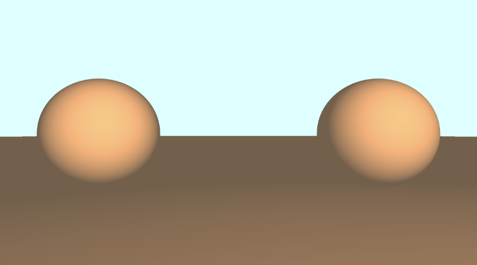

# 7.2 添加地板

我们可以通过以下功能添加一个地板，该地板将位于我们的球体下方一个单位：

```cpp
float sdFloor(vec3 p) {
  return p.y + 1.;
}
```

通过编写 `p.y + 1`，就像说 `p.y - (-1)` ，这意味着我们从地板上减去一个偏移量并将其向下推一个单位。

然后，我们可以再次使用 `min` 函数将地板添加到 `sdScene` 函数中：

```cpp
float sdScene(vec3 p) {
  float sphereLeft = sdSphere(p, 1., vec3(-2.5, 0, -2));
  float sphereRight = sdSphere(p, 1., vec3(2.5, 0, -2));
  float res = min(sphereLeft, sphereRight);
  res = min(res, sdFloor(p));
  return res;
}
```

当我们运行代码时，地板看起来是棕色的，因为它使用与球体相同的橙色，并且没有太多光线照射到地板表面。

<p align="center"></p>