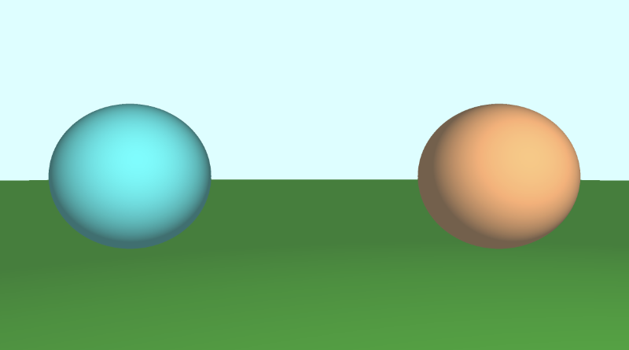
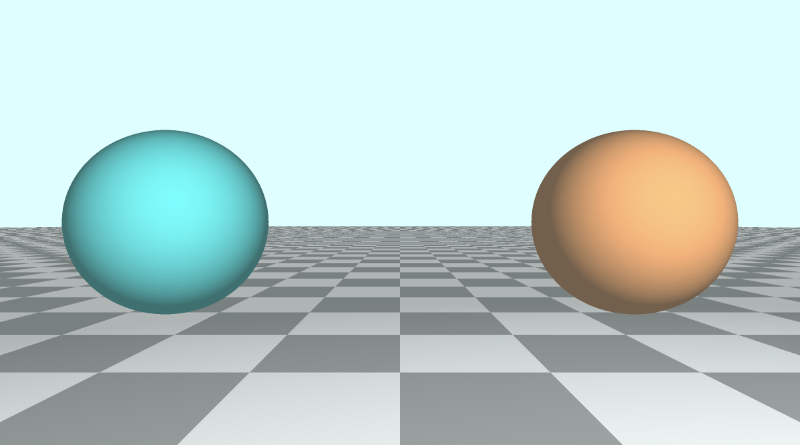

# 7.3 添加单独颜色
## 7.3.1 方法一

`Shadertoy` 中的人们使用多种技术向 3D 形状添加颜色。一种方法是修改 SDF 以返回到形状的距离和颜色。因此，我们必须修改代码中的多个位置以返回 `vec4` 数据类型而不是浮点数。`vec4` 变量的第一个值将保存我们通常从 SDF 返回的“有符号距离”值，而最后三个值将保存我们的颜色值。

完成的代码应如下所示：

```cpp
const int MAX_MARCHING_STEPS = 255;
const float MIN_DIST = 0.0;
const float MAX_DIST = 100.0;
const float PRECISION = 0.001;

vec4 sdSphere(vec3 p, float r, vec3 offset, vec3 col )
{
  float d = length(p - offset) - r;
  return vec4(d, col);
}

vec4 sdFloor(vec3 p, vec3 col) {
  float d = p.y + 1.;
  return vec4(d, col);
}

vec4 minWithColor(vec4 obj1, vec4 obj2) {
  if (obj2.x < obj1.x) return obj2; // The x component of the object holds the "signed distance" value
  return obj1;
}

vec4 sdScene(vec3 p) {
  vec4 sphereLeft = sdSphere(p, 1., vec3(-2.5, 0, -2), vec3(0, .8, .8));
  vec4 sphereRight = sdSphere(p, 1., vec3(2.5, 0, -2), vec3(1, 0.58, 0.29));
  vec4 co = minWithColor(sphereLeft, sphereRight); // co = closest object containing "signed distance" and color
  co = minWithColor(co, sdFloor(p, vec3(0, 1, 0)));
  return co;
}

vec4 rayMarch(vec3 ro, vec3 rd, float start, float end) {
  float depth = start;
  vec4 co; // closest object

  for (int i = 0; i < MAX_MARCHING_STEPS; i++) {
    vec3 p = ro + depth * rd;
    co = sdScene(p);
    depth += co.x;
    if (co.x < PRECISION || depth > end) break;
  }

  vec3 col = vec3(co.yzw);

  return vec4(depth, col);
}

vec3 calcNormal(in vec3 p) {
    vec2 e = vec2(1.0, -1.0) * 0.0005; // epsilon
    return normalize(
      e.xyy * sdScene(p + e.xyy).x +
      e.yyx * sdScene(p + e.yyx).x +
      e.yxy * sdScene(p + e.yxy).x +
      e.xxx * sdScene(p + e.xxx).x);
}

void mainImage( out vec4 fragColor, in vec2 fragCoord )
{
  vec2 uv = (fragCoord-.5*iResolution.xy)/iResolution.y;
  vec3 backgroundColor = vec3(0.835, 1, 1);

  vec3 col = vec3(0);
  vec3 ro = vec3(0, 0, 3); // ray origin that represents camera position
  vec3 rd = normalize(vec3(uv, -1)); // ray direction

  vec4 co = rayMarch(ro, rd, MIN_DIST, MAX_DIST); // closest object

  if (co.x > MAX_DIST) {
    col = backgroundColor; // ray didn't hit anything
  } else {
    vec3 p = ro + rd * co.x; // point on sphere or floor we discovered from ray marching
    vec3 normal = calcNormal(p);
    vec3 lightPosition = vec3(2, 2, 7);
    vec3 lightDirection = normalize(lightPosition - p);

    // Calculate diffuse reflection by taking the dot product of
    // the normal and the light direction.
    float dif = clamp(dot(normal, lightDirection), 0.3, 1.);

    // Multiply the diffuse reflection value by an orange color and add a bit
    // of the background color to the sphere to blend it more with the background.
    col = dif * co.yzw + backgroundColor * .2;
  }

  // Output to screen
  fragColor = vec4(col, 1.0);
}
```
<p align="center"></p>

在我们的代码中，我们必须在多个位置进行调整以满足编译器的要求。我们更改的第一件事是修改 `SDF` 以返回 `vec4` 值而不是浮点数。

```cpp
vec4 sdSphere(vec3 p, float r, vec3 offset, vec3 col )
{
  float d = length(p - offset) - r;
  return vec4(d, col);
}

vec4 sdFloor(vec3 p, vec3 col) {
  float d = p.y + 1.;
  return vec4(d, col);
}
```

这两个函数现在都接受 `color` 的新参数。但是，这破坏了我们在 `sdScene` 函数中使用的 `min` 函数，因此我们也必须对其进行修改并创建自己的 `min` 函数。

```cpp
vec4 minWithColor(vec4 obj1, vec4 obj2) {
  if (obj2.x < obj1.x) return obj2;
  return obj1;
}

vec4 sdScene(vec3 p) {
  vec4 sphereLeft = sdSphere(p, 1., vec3(-2.5, 0, -2), vec3(0, .8, .8));
  vec4 sphereRight = sdSphere(p, 1., vec3(2.5, 0, -2), vec3(1, 0.58, 0.29));
  vec4 co = minWithColor(sphereLeft, sphereRight); // co = closest object containing "signed distance" and color
  co = minWithColor(co, sdFloor(p, vec3(0, 1, 0)));
  return co;
}
```

`minWithColor` 函数执行与 `min` 函数相同的操作，不同之处在于它返回一个 `vec4`，该 `vec4` 同时包含“有符号距离”值和光线行进循环期间最近的对象的颜色。说到光线行进，我们也必须修改 `rayMarch` 函数以满足编译器的要求。

```cpp
vec4 rayMarch(vec3 ro, vec3 rd, float start, float end) {
  float depth = start;
  vec4 co; // closest object

  for (int i = 0; i < MAX_MARCHING_STEPS; i++) {
    vec3 p = ro + depth * rd;
    co = sdScene(p);
    depth += co.x;
    if (co.x < PRECISION || depth > end) break;
  }

  vec3 col = vec3(co.yzw);

  return vec4(depth, col);
}
```

我们还必须修改 `calcNormal` 函数，以提取出我们从 `sdScene` 函数返回的对象的 `x` 分量：

```cpp
vec3 calcNormal(in vec3 p) {
    vec2 e = vec2(1.0, -1.0) * 0.0005; // epsilon
    return normalize(
      e.xyy * sdScene(p + e.xyy).x +
      e.yyx * sdScene(p + e.yyx).x +
      e.yxy * sdScene(p + e.yxy).x +
      e.xxx * sdScene(p + e.xxx).x);
}
```

最后，我们修改了 `mainImage` 函数以也使用这些更改。

```cpp
void mainImage( out vec4 fragColor, in vec2 fragCoord )
{
  vec2 uv = (fragCoord-.5*iResolution.xy)/iResolution.y;
  vec3 backgroundColor = vec3(0.835, 1, 1);

  vec3 col = vec3(0);
  vec3 ro = vec3(0, 0, 3); // ray origin that represents camera position
  vec3 rd = normalize(vec3(uv, -1)); // ray direction

  vec4 co = rayMarch(ro, rd, MIN_DIST, MAX_DIST); // closest object

  if (co.x > MAX_DIST) {
    col = backgroundColor; // ray didn't hit anything
  } else {
    vec3 p = ro + rd * co.x; // point on sphere or floor we discovered from ray marching
    vec3 normal = calcNormal(p);
    vec3 lightPosition = vec3(2, 2, 7);
    vec3 lightDirection = normalize(lightPosition - p);

    // Calculate diffuse reflection by taking the dot product of
    // the normal and the light direction.
    float dif = clamp(dot(normal, lightDirection), 0.3, 1.);

    // Multiply the diffuse reflection value by an orange color and add a bit
    // of the background color to the sphere to blend it more with the background.
    col = dif * co.yzw + backgroundColor * .2;
  }

  // Output to screen
  fragColor = vec4(col, 1.0);
}
```

我们使用 `col.x` 提取出 `signed distance` 值，并使用 `col.yzw` 获取颜色。

使用此方法可以将值存储在 `vec4` 中，就像它们是其他语言中的数组一样。`GLSL` 也允许您使用数组，但它们不如 `JavaScript` 等语言灵活。您必须知道数组中有多少个值，并且只能在数组中存储相同类型的值。

## 7.3.2 方法二

如果使用 `vec4` 来存储距离和颜色感觉像是一个脏的解决方案，那么另一种选择是使用结构体。结构是组织 `GLSL` 代码的好方法。结构体的定义类似于 `C++` 语法。如果您不熟悉 `C++`，而更熟悉 `JavaScript`，则可以将结构体视为对象和类的组合。让我们看看我这是什么意思。

结构可以具有属性。让我们创建一个名为 `Surface` 的结构体。

```cpp
struct Surface {
  float signedDistance;
  vec3 color;
};
```
您可以创建返回 `Surface` 结构体的函数，也可以创建结构体的新实例：
```cpp
// This function's return value is of type "Surface"
Surface sdSphere(vec3 p, float r, vec3 offset, vec3 col)
{
  float d = length(p - offset) - r;
  return Surface(d, col); // We're initializing a new "Surface" struct here and then returning it
}
```
您可以使用点语法访问结构体的属性：

```cpp
Surface minWithColor(Surface obj1, Surface obj2) {
  if (obj2.sd < obj1.sd) return obj2; // The sd component of the struct holds the "signed distance" value
  return obj1;
}
```

凭借我们对结构体的新知识，我们可以修改代码以使用结构体而不是使用 `vec4`。
```cpp
const int MAX_MARCHING_STEPS = 255;
const float MIN_DIST = 0.0;
const float MAX_DIST = 100.0;
const float PRECISION = 0.001;

struct Surface {
    float sd; // signed distance value
    vec3 col; // color
};

Surface sdSphere(vec3 p, float r, vec3 offset, vec3 col)
{
  float d = length(p - offset) - r;
  return Surface(d, col);
}

Surface sdFloor(vec3 p, vec3 col) {
  float d = p.y + 1.;
  return Surface(d, col);
}

Surface minWithColor(Surface obj1, Surface obj2) {
  if (obj2.sd < obj1.sd) return obj2; // The sd component of the struct holds the "signed distance" value
  return obj1;
}

Surface sdScene(vec3 p) {
  Surface sphereLeft = sdSphere(p, 1., vec3(-2.5, 0, -2), vec3(0, .8, .8));
  Surface sphereRight = sdSphere(p, 1., vec3(2.5, 0, -2), vec3(1, 0.58, 0.29));
  Surface co = minWithColor(sphereLeft, sphereRight); // co = closest object containing "signed distance" and color
  co = minWithColor(co, sdFloor(p, vec3(0, 1, 0)));
  return co;
}

Surface rayMarch(vec3 ro, vec3 rd, float start, float end) {
  float depth = start;
  Surface co; // closest object

  for (int i = 0; i < MAX_MARCHING_STEPS; i++) {
    vec3 p = ro + depth * rd;
    co = sdScene(p);
    depth += co.sd;
    if (co.sd < PRECISION || depth > end) break;
  }

  co.sd = depth;

  return co;
}

vec3 calcNormal(in vec3 p) {
    vec2 e = vec2(1.0, -1.0) * 0.0005; // epsilon
    return normalize(
      e.xyy * sdScene(p + e.xyy).sd +
      e.yyx * sdScene(p + e.yyx).sd +
      e.yxy * sdScene(p + e.yxy).sd +
      e.xxx * sdScene(p + e.xxx).sd);
}

void mainImage( out vec4 fragColor, in vec2 fragCoord )
{
  vec2 uv = (fragCoord-.5*iResolution.xy)/iResolution.y;
  vec3 backgroundColor = vec3(0.835, 1, 1);

  vec3 col = vec3(0);
  vec3 ro = vec3(0, 0, 3); // ray origin that represents camera position
  vec3 rd = normalize(vec3(uv, -1)); // ray direction

  Surface co = rayMarch(ro, rd, MIN_DIST, MAX_DIST); // closest object

  if (co.sd > MAX_DIST) {
    col = backgroundColor; // ray didn't hit anything
  } else {
    vec3 p = ro + rd * co.sd; // point on sphere or floor we discovered from ray marching
    vec3 normal = calcNormal(p);
    vec3 lightPosition = vec3(2, 2, 7);
    vec3 lightDirection = normalize(lightPosition - p);

    // Calculate diffuse reflection by taking the dot product of
    // the normal and the light direction.
    float dif = clamp(dot(normal, lightDirection), 0.3, 1.);

    // Multiply the diffuse reflection value by an orange color and add a bit
    // of the background color to the sphere to blend it more with the background.
    col = dif * co.col + backgroundColor * .2;
  }

  // Output to screen
  fragColor = vec4(col, 1.0);
}
```
此代码的行为应与我们之前使用 `vec4` 时的行为相同。在我看来，结构体更容易推理，看起来也更简洁。您也不必像在 `vec4` 向量中那样被限制在 4 个值中。选择您喜欢的任何方法。

#### 如果你想制作一个花哨的瓷砖地板，你可以像这样调整地板的颜色。

```cpp
Surface sdScene(vec3 p) {
  Surface sphereLeft = sdSphere(p, 1., vec3(-2.5, 0, -2), vec3(0, .8, .8));
  Surface sphereRight = sdSphere(p, 1., vec3(2.5, 0, -2), vec3(1, 0.58, 0.29));
  Surface co = minWithColor(sphereLeft, sphereRight);

  vec3 floorColor = vec3(1. + 0.7*mod(floor(p.x) + floor(p.z), 2.0));
  co = minWithColor(co, sdFloor(p, floorColor));
  return co;
}
```

<p align="center"></p>
平铺地板可帮助人们可视化深度，并使您的 3D 场景更加突出。`mod` 函数通常用于创建棋盘格图案或将场景的一部分划分为可重复的块，这些块可以进行不同的着色或样式设置。

## 7.3.3 方法三

在 `Shadertoy` 上查看着色器时，您可能会看到使用标识符或 `ID` 为场景中的每个唯一对象着色的代码。人们经常使用 `map` 函数而不是 `sdScene` 函数。您可能还会看到一个 `render` 函数，该函数通过查看从光线行进算法返回的最近对象的 `ID` 来处理为每个对象分配颜色。让我们看看使用这种更传统的方法的代码是什么样子的。

```cpp
const int MAX_MARCHING_STEPS = 255;
const float MIN_DIST = 0.0;
const float MAX_DIST = 100.0;
const float PRECISION = 0.001;
const vec3 COLOR_BACKGROUND = vec3(0.835, 1, 1);

float sdSphere(vec3 p, float r)
{
  float d = length(p) - r;
  return d;
}

float sdFloor(vec3 p) {
  float d = p.y + 1.;
  return d;
}

vec2 opU( vec2 d1, vec2 d2 )
{
  return (d1.x < d2.x) ? d1 : d2; // the x-component is the signed distance value
}

vec2 map(vec3 p) {
  vec2 res = vec2(1e10, 0.); // ID = 0
  vec2 flooring = vec2(sdFloor(p), 0.5); // ID = 0.5
  vec2 sphereLeft = vec2(sdSphere(p - vec3(-2.5, 0, -2), 1.), 1.5); // ID = 1.5
  vec2 sphereRight = vec2(sdSphere(p - vec3(2.5, 0, -2), 1.), 2.5); // ID = 2.5

  res = opU(res, flooring);
  res = opU(res, sphereLeft);
  res = opU(res, sphereRight);
  return res; // the y-component is the ID of the object hit by the ray
}

vec2 rayMarch(vec3 ro, vec3 rd) {
  float depth = MIN_DIST;
  vec2 res = vec2(0.0); // initialize result to zero for signed distance value and ID
  float id = 0.;

  for (int i = 0; i < MAX_MARCHING_STEPS; i++) {
    vec3 p = ro + depth * rd;
    res = map(p); // find resulting target hit by ray
    depth += res.x;
    id = res.y;
    if (res.x < PRECISION || depth > MAX_DIST) break;
  }

  return vec2(depth, id);
}

vec3 calcNormal(in vec3 p) {
    vec2 e = vec2(1.0, -1.0) * 0.0005; // epsilon
    return normalize(
      e.xyy * map(p + e.xyy).x +
      e.yyx * map(p + e.yyx).x +
      e.yxy * map(p + e.yxy).x +
      e.xxx * map(p + e.xxx).x);
}

vec3 render(vec3 ro, vec3 rd) {
    vec3 col = COLOR_BACKGROUND;

    vec2 res = rayMarch(ro, rd);
    float d = res.x; // signed distance value
    if (d > MAX_DIST) return col; // render background color since ray hit nothing

    float id = res.y; // id of object

    vec3 p = ro + rd * d; // point on sphere or floor we discovered from ray marching
    vec3 normal = calcNormal(p);
    vec3 lightPosition = vec3(2, 2, 7);
    vec3 lightDirection = normalize(lightPosition - p);

    float dif = clamp(dot(normal, lightDirection), 0.3, 1.);

    if (id > 0.) col = dif * vec3(1. + 0.7*mod(floor(p.x) + floor(p.z), 2.0));
    if (id > 1.) col = dif * vec3(0, .8, .8);
    if (id > 2.) col = dif * vec3(1, 0.58, 0.29);

    col += COLOR_BACKGROUND * 0.2; // add a bit of the background color to blend objects more with the scene

    return col;
}

void mainImage( out vec4 fragColor, in vec2 fragCoord )
{
  vec2 uv = (fragCoord-.5*iResolution.xy)/iResolution.y;

  vec3 ro = vec3(0, 0, 3); // ray origin that represents camera position
  vec3 rd = normalize(vec3(uv, -1)); // ray direction

  vec3 col = render(ro, rd);

  // Output to screen
  fragColor = vec4(col, 1.0);
}
```

您会注意到，`minWithColor` 函数现在称为 `opU`，它代表“作、联合”，因为它是向场景添加形状的联合作。我们将在教程系列的第 14 部分中了解有关 `3D SDF`作的更多信息。`opU` 函数正在比较两个对象的有符号距离值，以查看在光线行进算法期间哪个对象更靠近光线。

`map` 函数用于将对象添加或“映射”到我们的场景中。我们使用 `vec2` 在 `x` 分量中存储有符号距离值，在 `y` 分量中存储 `ID`。您通常会看到用于 `ID` 的小数值。这是因为我们可以通过查看这个小数值是否大于整数来检查 `render` 函数中的 `ID`。您可能想知道为什么我们不使用整数作为 `ID`，然后使用 `==` 运算符来检查 `ID` 是否等于从光线行进中找到的最近对象的 `ID`。这可能对你和你的编译器有用，但可能并不适合所有人。使用小数值和大于 `（>）` 检查可确保保证场景正确渲染。当使用浮点数（如 `1.` 或 `2.`）时，你可能会发现 `id == 1.` 或 `id == 2.` 的奇怪问题。行为不如预期。通过检查 `ID` 是 `> 1.` 还是 `id > 2.` 当 `ID` 为 `0.5` 或 `1.5` 时，我们可以确保代码的行为对每个人都是可预测的，总之浮点数比较是这样的，会有精度问题，有点微妙了。

了解这种向场景添加独特颜色的方法非常重要，因为您可能会看到 `Shadertoy` 社区中的许多开发人员都在使用它。

## 结论
在本文中，我们学习了如何将多个 3D 对象绘制到场景中，并为每个对象赋予独特的颜色。我们学习了三种为场景中的每个对象添加颜色的技术，但肯定还有其他方法！使用最适合您的方法。


