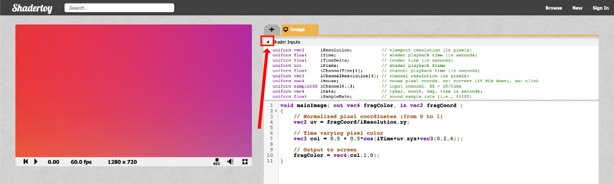
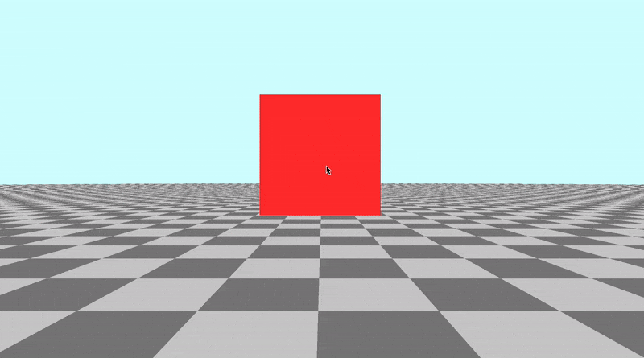

# 9.2 鼠标输入

`Shadertoy` 提供了一组全局变量，您可以在着色器代码中使用这些变量，以使其更具交互性。如果您打开一个新的着色器并单击`Shader inputs`旁边的箭头，那么您将看到一个全局变量列表。

<p align="center"></p>

下面是您可以在 `Shadertoy` 着色器中使用的全局变量列表。

```cpp
// Shader Inputs
uniform vec3      iResolution;           // viewport resolution (in pixels)
uniform float     iTime;                 // shader playback time (in seconds)
uniform float     iTimeDelta;            // render time (in seconds)
uniform int       iFrame;                // shader playback frame
uniform float     iChannelTime[4];       // channel playback time (in seconds)
uniform vec3      iChannelResolution[4]; // channel resolution (in pixels)
uniform vec4      iMouse;                // mouse pixel coords. xy: current (if MLB down), zw: click
uniform samplerXX iChannel0..3;          // input channel. XX = 2D/Cube
uniform vec4      iDate;                 // (year, month, day, time in seconds)
uniform float     iSampleRate;           // sound sample rate (i.e., 44100)
```
其中，您将看到一个名为 `iMouse` 的变量，当您单击画布上的某个位置时，该变量可用于获取鼠标的位置。此变量的类型为 `vec4`，因此包含有关鼠标左键单击的四条信息。

```
vec4 mouse = iMouse;

mouse.xy = mouse position during last button down
abs(mouse.zw) = mouse position during last button click
sign(mouze.z) = button is down (positive if down)
sign(mouze.w) = button is clicked (positive if clicked)
```
鼠标单击是按下鼠标后立即发生的情况。鼠标按下事件是继续按住鼠标后发生的情况。

`Shadertoy` 的共同创建者之一 `Inigo Quilez` 编写的[**教程**](https://www.shadertoy.com/view/Mss3zH)向您展示了如何使用 `iMouse` 中存储的每条数据。单击场景中的任意位置时，单击鼠标时会显示一个白色圆圈。如果您继续按住鼠标并四处移动鼠标，两个圆圈之间会出现一条黄线。松开鼠标后，黄线将消失。

在本教程中，我们真正关心的是鼠标坐标。我做了一个小演示来演示如何使用鼠标在画布中移动圆圈。让我们看看代码：

```cpp
float sdfCircle(vec2 uv, float r, vec2 offset) {
  float x = uv.x - offset.x;
  float y = uv.y - offset.y;

  float d = length(vec2(x, y)) - r;

  return step(0., -d);
}

vec3 drawScene(vec2 uv, vec2 mp) {
  vec3 col = vec3(0);
  float blueCircle = sdfCircle(uv, 0.1, mp);
  col = mix(col, vec3(0, 1, 1), blueCircle);

  return col;
}

void mainImage( out vec4 fragColor, in vec2 fragCoord )
{
  vec2 uv = fragCoord/iResolution.xy - 0.5; // <-0.5,0.5>
  uv.x *= iResolution.x/iResolution.y; // fix aspect ratio

  // mp = mouse position of the last click
  vec2 mp = iMouse.xy/iResolution.xy - 0.5; // <-0.5,0.5>
  mp.x *= iResolution.x/iResolution.y; // fix aspect ratio

  vec3 col = drawScene(uv, mp);

  // Output to screen
  fragColor = vec4(col,1.0);
}
```

请注意，获取鼠标位置与 UV 坐标非常相似。我们可以通过以下语句对坐标进行归一化：

```cpp
vec2 mp = iMouse.xy/iResolution.xy // range is between 0 and 1
```

这会将鼠标坐标标准化为介于 `0` 和 `1` 之间。通过减去 `0.5`，我们可以将鼠标坐标标准化为 `-0.5` 到 `0.5` 之间。
```cpp
vec2 mp = iMouse.xy/iResolution.xy - 0.5 // range is between -0.5 and 0.5
```

## 使用鼠标平移摄像机
现在我们了解了如何使用 `iMouse` 全局变量，让我们将其应用于我们的相机。我们可以使用鼠标通过更改光线原点 `ro` 的值来控制平移。

```cpp
vec2 mouse = iMouse.xy / iResolution.xy - 0.5; // <-0.5,0.5>
vec3 ro = vec3(mouse.x, mouse.y, 3); // ray origin will move as you click on the canvas and drag the mouse
```

如果您单击画布并拖动鼠标，您将能够在 `x` 轴和 `y` 轴上在 `-0.5` 到 `0.5` 之间平移摄像机。画布的中心将是点 `(0, 0)`，它应该将立方体移回画布的中心。

如果要平移更多，您始终可以将鼠标位置值乘以乘数。

```cpp
vec2 mouse = iMouse.xy / iResolution.xy - 0.5; // <-0.5,0.5>
vec3 ro = vec3(2. * mouse.x, 2. * mouse.y, 3);
```
<p align="center"></p>

## 使用鼠标倾斜/旋转摄像机
我们可以通过更改 `theta` 的值来使用鼠标倾斜/旋转相机，`theta` 是我们提供给旋转矩阵的角度，例如 `rotateX`、`rotateY` 和 `rotateZ`。确保您不再使用鼠标来控制光线原点 `ro`。否则，您最终可能会得到一个非常奇怪的相机。

让我们对光线方向应用倾斜，以从左向右倾斜摄像机。

```cpp
vec2 mouse = iMouse.xy / iResolution.xy - 0.5; // <-0.5,0.5>
vec3 rd = normalize(vec3(uv, -1)); // ray direction
rd *= rotateY(mouse.x); // apply yaw
```

由于 `mouse.x` 当前限制在 `-0.5` 和 `0.5 `之间，因此将此范围重新映射到负 `pi （-π）` 到正 `pi （+π）` 可能更有意义。要将范围重新映射到新范围，我们可以使用 `mix` 函数。它已经构建为处理线性插值，因此非常适合将值从一个范围重新映射到另一个范围。

让我们将范围`<-0.5,0.5>`重新映射到`<-π，π>`。

```cpp
vec2 mouse = iMouse.xy / iResolution.xy - 0.5; // <-0.5,0.5>
vec3 rd = normalize(vec3(uv, -1)); // ray direction
rd *= rotateY(mix(-PI, PI, mouse.x)); // apply yaw with a 360 degree range
```

现在，我们可以使用鼠标进行完整的 360 度旋转！

您可能想知道如何使用 `mouse.y` 值。我们可以使用此值将摄像机作为 `pitch` 角度上下倾斜。这意味着我们需要利用 `rotateX` 函数。

```cpp
vec2 mouse = iMouse.xy / iResolution.xy - 0.5; // <-0.5,0.5>
vec3 rd = normalize(vec3(uv, -1)); // ray direction
rd *= rotateX(mouse.y); // apply pitch
```
这将允许我们在 `-0.5` 和 `0.5` 的值之间上下倾斜摄像机。

如果你想用鼠标同时改变 `mouse.x` 的 `yaw` 角度和 `mouse.y` 的 `pitch` 角度，那么我们需要将旋转矩阵相乘。

```cpp
vec2 mouse = iMouse.xy / iResolution.xy - 0.5; // <-0.5,0.5>
vec3 rd = normalize(vec3(uv, -1));
rd *= rotateY(mouse.x) * rotateX(mouse.y); // apply yaw and pitch
```

现在，您可以用鼠标自由倾斜相机来环顾场景！这对于对使用 `Shadertoy` 构建的复杂 `3D` 场景进行故障排除非常方便。在 `Unity` 或 `Blender` 等软件中，您已经拥有了一台功能强大的相机，可以使用它来查看 `3D` 场景。

您可以在下面找到完成的代码：
```cpp
// Rotation matrix around the X axis.
mat3 rotateX(float theta) {
    float c = cos(theta);
    float s = sin(theta);
    return mat3(
        vec3(1, 0, 0),
        vec3(0, c, -s),
        vec3(0, s, c)
    );
}

// Rotation matrix around the Y axis.
mat3 rotateY(float theta) {
    float c = cos(theta);
    float s = sin(theta);
    return mat3(
        vec3(c, 0, s),
        vec3(0, 1, 0),
        vec3(-s, 0, c)
    );
}

// Rotation matrix around the Z axis.
mat3 rotateZ(float theta) {
    float c = cos(theta);
    float s = sin(theta);
    return mat3(
        vec3(c, -s, 0),
        vec3(s, c, 0),
        vec3(0, 0, 1)
    );
}

// Identity matrix.
mat3 identity() {
    return mat3(
        vec3(1, 0, 0),
        vec3(0, 1, 0),
        vec3(0, 0, 1)
    );
}

const int MAX_MARCHING_STEPS = 255;
const float MIN_DIST = 0.0;
const float MAX_DIST = 100.0;
const float PRECISION = 0.001;

struct Surface {
    float sd; // signed distance value
    vec3 col; // color
    int id; // identifier for each surface/object
};

/*
Surface IDs:
1. Floor
2. Box
*/

Surface sdBox( vec3 p, vec3 b, vec3 offset, vec3 col, mat3 transform)
{
  p = (p - offset) * transform;
  vec3 q = abs(p) - b;
  float d = length(max(q,0.0)) + min(max(q.x,max(q.y,q.z)),0.0);
  return Surface(d, col, 2);
}

Surface sdFloor(vec3 p, vec3 col) {
  float d = p.y + 1.;
  return Surface(d, col, 1);
}

Surface minWithColor(Surface obj1, Surface obj2) {
  if (obj2.sd < obj1.sd) return obj2;
  return obj1;
}

Surface sdScene(vec3 p) {
  vec3 floorColor = vec3(.5 + 0.3*mod(floor(p.x) + floor(p.z), 2.0));
  Surface co = sdFloor(p, floorColor);
  co = minWithColor(co, sdBox(p, vec3(1), vec3(0, 0.5, -4), vec3(1, 0, 0), identity()));
  return co;
}

Surface rayMarch(vec3 ro, vec3 rd, float start, float end) {
  float depth = start;
  Surface co; // closest object

  for (int i = 0; i < MAX_MARCHING_STEPS; i++) {
    vec3 p = ro + depth * rd;
    co = sdScene(p);
    depth += co.sd;
    if (co.sd < PRECISION || depth > end) break;
  }

  co.sd = depth;

  return co;
}

vec3 calcNormal(in vec3 p) {
    vec2 e = vec2(1.0, -1.0) * 0.0005; // epsilon
    return normalize(
      e.xyy * sdScene(p + e.xyy).sd +
      e.yyx * sdScene(p + e.yyx).sd +
      e.yxy * sdScene(p + e.yxy).sd +
      e.xxx * sdScene(p + e.xxx).sd);
}

void mainImage( out vec4 fragColor, in vec2 fragCoord )
{
  vec2 uv = (fragCoord-.5*iResolution.xy)/iResolution.y;
  vec3 backgroundColor = vec3(0.835, 1, 1);

  vec3 col = vec3(0);
  vec3 ro = vec3(0, 0, 3); // ray origin that represents camera position

  vec2 mouse = iMouse.xy / iResolution.xy - 0.5; // <-0.5,0.5>
  vec3 rd = normalize(vec3(uv, -1)); // ray direction
  rd *= rotateY(mouse.x) * rotateX(mouse.y); // apply yaw and pitch

  Surface co = rayMarch(ro, rd, MIN_DIST, MAX_DIST); // closest object

  if (co.sd > MAX_DIST) {
    col = backgroundColor; // ray didn't hit anything
  } else {
    vec3 p = ro + rd * co.sd; // point on cube or floor we discovered from ray marching
    vec3 normal = calcNormal(p);

    // check material ID
    if( co.id == 1 ) // floor
    {
        col = co.col;
    } else {
      // lighting
      vec3 lightPosition = vec3(2, 2, 7);
      vec3 lightDirection = normalize(lightPosition - p);

      // color
      float dif = clamp(dot(normal, lightDirection), 0.3, 1.); // diffuse reflection
      col = dif * co.col + backgroundColor * .2; // Add a bit of background color to the diffuse color
    }
  }

  // Output to screen
  fragColor = vec4(col, 1.0);
}
```

## 结论
在本教程中，我们学习了如何在六个自由度上移动摄像机。我们学习了如何沿 `x` 轴、`y` 轴和 `z` 轴平移摄像机。我们还学习了如何使用旋转矩阵来应用偏航、俯仰和滚动，以便控制摄像机的倾斜度。利用您今天学到的知识，您可以在 `Shadertoy` 中调试 `3D` 场景并制作有趣的动画。


